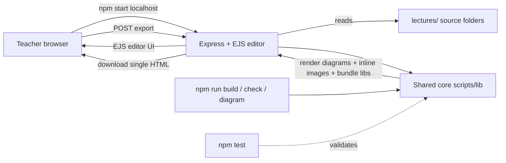

# Lecture Creator

> Converts **Markdown lecture notes** into **self-contained, narrated HTML presentation slides**
> for offline classroom use — one `.html` file per lecture, with images embedded and code
> highlighting bundled in. Built for a public high-school Computer Science classroom where student
> internet is often unreliable or expensive.

[](#quality-gates)
[](#quality-gates)
[](#requirements)

---

## Why this exists

Two problems forced a rebuild:

1. **GitHub Pages hotlinking stopped working.** The old tool turned relative image paths into
   `github.io` absolute URLs — that delivery path is dead.
2. **The repo was disorganized** — scattered assets, duplicated files, and broken image links.

The fix: each lecture becomes a **portable folder**, and a **Node build** embeds images as data URIs
and bundles highlight.js (+ mermaid when used), so the student file has **zero external URLs** and
works fully offline. Diagram sources (`.mmd`/`.puml`/`.d2`/`.dot`/…) are **auto-rendered to PNG**
during the build, so the teacher never hand-exports images. An **Express + EJS editor** (`npm start`)
lets you author, live-preview, and export on `localhost`. Full design + rationale:
[`inceptions/context.md`](inceptions/context.md).

---

## Quick start

```bash
npm install          # one time
npm start            # editor → http://localhost:3000
```

Prefer the command line? Build a lecture straight to a file:

```bash
npm run build -- git-github     # → dist/git-github.html  (one self-contained file)
```

Then share `dist/git-github.html` with students — they just double-click it. No server, no internet.

---

## npm scripts

| Command | What it does |
|---|---|
| [`npm start`](package.json#L11) | Run the **editor** on `localhost` (author / live-preview / export). |
| [`npm run build -- <slug>`](package.json#L12) | **CLI build** one lecture → `dist/<slug>.html`. Auto-renders any diagrams first. |
| [`npm run build:all`](package.json#L13) | Build **every** lecture (per-lecture error isolation). |
| [`npm run check`](package.json#L14) | **Integrity linter** — ERRORs on broken image refs; WARNs on stale renders & diagram collisions. The ship gate. |
| [`npm run diagram -- <file-or-dir>`](package.json#L15) | **Render diagram sources** (`.mmd`/`.puml`/… ) to PNG via Kroki, and print the `` lines to paste. |
| [`npm test`](package.json#L16) | Run the test suite (`node --test`, 134 tests). |

---

## Author a lecture (the short version)

1. Each lecture lives in its own folder: `lectures/<slug>/lecture.md` (kebab-case slug).
2. Write Markdown. **`#` and `##` start new slides**; `###`/`####` stay inside the current slide.
3. Reference images with **relative paths** (`diagrams/foo.png`, `assets/bar.html`) — the build
   inlines them. Never use `https://` / `github.io` URLs.
4. Build it: `npm run check && npm run build -- <slug>` → `dist/<slug>.html`.

```markdown
# Introduction            ← slide 1
Welcome!

## Main Topic             ← slide 2
- A point
- 

```js
console.log('highlighted code');
```
```

For the full pipeline, the editor round-trip, and "adding a new lecture" step-by-step, see
**[`logs/LECTURE-CREATION-PATTERN.md`](logs/LECTURE-CREATION-PATTERN.md)**.

---

## Diagrams

Diagrams are authored as **source files** (`.mmd`, `.puml`, `.d2`, `.dot`, …) in a lecture's
`diagramSrc/` folder. The build **renders them to PNG automatically** before inlining, so you never
have to export images by hand.

### The convention

```
lectures/<slug>/
├── diagramSrc/<rel>.<ext>   ← you write this source
└── diagrams/<rel>.png       ← the build renders the PNG here, you reference it
```

The output path **mirrors** the source path (with `diagramSrc/` swapped for `diagrams/` and the
extension changed to `.png`). So in your `lecture.md` you write:

```markdown

```

…matching a source at `diagramSrc/flow.mmd` (or `.puml`, `.d2`, …). **Keep one source file per
diagram.**

### The two ways to render

1. **Automatically, on build.** `npm run build -- <slug>` (and the editor) render every supported
   source under `diagramSrc/` into `diagrams/` *before* images are inlined. Once a PNG is fresh, the
   render is **skipped** (stat-based) — so rebuilds are fully **offline** after the first run.
2. **Manually, anytime.** [`npm run diagram -- <file-or-dir>`](package.json#L15) renders one file or
   a whole folder, then prints the exact `` lines to paste:

   ```bash
   npm run diagram -- lectures/js-basics/diagramSrc         # render a whole lecture's diagrams
   npm run diagram -- lectures/js-basics/diagramSrc/js-basics/if-else.puml   # one file
   npm run diagram -- lectures/js-basics/diagramSrc/js-basics/if-else.puml --engine plantuml --force
   ```

   | Option | Effect |
   |---|---|
   | `--engine <name>` | Override the engine detected from the extension. |
   | `--force` | Re-render even when the PNG is already up to date. |

### Supported formats

Every format renders through [Kroki](https://kroki.io), so the same pipeline covers all engines
(no Chromium/puppeteer dependency):

| Extension | Engine | | Extension | Engine |
|---|---|---|---|---|
| `.mmd` | Mermaid | | `.erd` | Erd |
| `.puml` | PlantUML | | `.bytefield` | Bytefield |
| `.d2` | D2 | | `.seqdiag` | Seqdiag |
| `.dot` / `.gv` | Graphviz | | `.actdiag` | Actdiag |
| `.svgbob` | Svgbob | | `.nwdiag` | Nwdiag |
| `.ditaa` | Ditaa | | `.rackdiag` | Rackdiag |
| `.nomnoml` | Nomnoml | | `.packetdiag` | Packetdiag |

### Multi-format collisions

If two sources map to the **same PNG** (e.g. `if-else.mmd` + `if-else.dot` + `if-else.puml`), the
build picks **one** by priority **`.mmd > .puml > .d2 > .dot/.gv` > others** and renders only the
winner. The losers are **never deleted** — you get a clear warning advising you to keep a single
format. (Plain `.txt`/`.md` design notes inside `diagramSrc/` are ignored, not flagged.)

### `KROKI_BASE_URL` — offline / self-hosted rendering

Rendering needs a Kroki endpoint. The default is the public `https://kroki.io` (needs internet on
the build machine — note the *student* file is still fully offline). To render without the public
service, point at your own instance:

```bash
KROKI_BASE_URL=http://localhost:8000 npm run build -- <slug>
```

Set-up instructions for a local Kroki (Podman/Docker) are in
[`references/diagram-converter/kroki-local.md`](references/diagram-converter/kroki-local.md).

### Mermaid note

A `` ```mermaid `` fence in your markdown still renders **live in the student's browser** (mermaid.js
is bundled into the export) — that behavior is unchanged. The `diagramSrc/` pipeline above is for
**pre-rendered PNGs** of *any* engine, which is what you want when the student file must be 100%
offline and dependency-free.

> 💡 Rule of thumb: use a `` ```mermaid `` fence when you want a live, in-browser diagram; use a
> `diagramSrc/` source + `` when you want a crisp, pre-rendered image inlined into
> the offline deck.

---

## Architecture

The CLI and the editor share **one build core** ([`scripts/lib/`](scripts/lib)) — there is never a
second copy of the export logic (decision D5). One pipeline turns `lecture.md` into a single HTML:

```
lecture.md ─▶ renderDiagrams ─▶ splitSlides ─▶ inlineImages ─▶ bundleLibs ─▶ renderPresentation ─▶ self-contained .html
              (diagramSrc→PNG)   (slide breaks)   (data-URI imgs) (offline libs)  (themed deck + voice)
```



| Where | What |
|---|---|
| [`lectures/`](lectures) | **Source** — one portable folder per lecture (what you author). |
| [`scripts/lib/`](scripts/lib) | **Shared core** — [`buildLecture()`](scripts/lib/index.mjs), `splitSlides`, `inlineImages`, `bundleLibs`, `renderPresentation`, [`render-diagram`](scripts/lib/render-diagram.mjs). |
| [`scripts/diagram.js`](scripts/diagram.js) | The **diagram CLI** (`npm run diagram`). |
| [`server/`](server) | The **Express + EJS editor** (author / preview / export). |
| [`shared/`](shared) | Cross-lecture assets (`styles.css`, practice challenges). |
| [`dist/`](dist) | **Generated** exports — gitignored. |

Full folder map: **[`logs/FOLDER-STRUCTURE.md`](logs/FOLDER-STRUCTURE.md)**.

---

## The editor (`npm start`)

Run `npm start` and open **http://localhost:3000** to author and preview in the browser:

- **Live preview** with **debounced auto-refresh** (~600 ms) as you edit.
- **On-disk change detection** (~2 s) — if the `lecture.md` changes underneath you (e.g. you render a
  diagram or edit in another tool), the editor reloads **without clobbering** unsaved edits.
- Diagrams render in the preview pane (same shared core as the CLI).
- **Export** a single self-contained `.html` for students.

---

## Viewing exported lectures (for students)

Students don't need Node or this repo — they only need the **one `.html` file**.

1. **Double-click** the `.html` file to open it in any modern browser (Chrome, Firefox, Edge, Safari).
2. **Choose a playback mode** before starting:
   - **Auto-play** — slides advance with text-to-speech narration (best on Windows/Mac).
   - **Manual** — you advance slides yourself (best on **Linux + Chrome**, see below).
3. **Keyboard shortcuts** (both modes): `Space` / `→` next slide · `←` previous · `Esc` stop speech.

> The exported file is fully self-contained: images, code highlighting, and the voice player are all
> embedded — **no internet required**.

### Troubleshooting (student side)

- **Slides advance too fast / no narration (Linux + Chrome):** speech synthesis can be unavailable
  from `file://`. Choose **Manual mode** and use Next/Previous, or open the file in **Firefox**
  (better Linux speech support).
- **"Loading voices…" never finishes:** wait a few seconds, then click **Start Anyway** (uses the
  default voice), or switch to Manual mode.
- **Blank page:** make sure the file opened in a browser (right-click → Open With), and check the
  browser console (`F12`).

---

## Quality gates

Three commands must be green before shipping:

| Gate | Command | Expected |
|---|---|---|
| Regression | `npm test` | **134 pass / 0 fail** (2 skipped; unit + integration + supertest routes) |
| Integrity | `npm run check` | **0 errors** (collisions & stale renders WARN, never fail the gate) |
| Build | `npm run build:all` | **23 ok / 2 failed** — see note below |

> **About the 2 build:all failures (`ajax-fetch`, `dom`):** these are **pre-existing content wiring
> issues, not code regressions.** Both lectures keep their diagram *sources* in a subfolder whose
> mirrored PNG paths were never pre-rendered, so the build has to fetch the public Kroki service to
> produce them — and a couple of those calls fail with transient HTTP 400s. (`dom` also contains
> unsupported `.bob`/`.diag` extensions that are ignored.) The simplest fixes are content-only:
> either pre-render the mirrored PNGs (`npm run diagram -- lectures/<slug>/diagramSrc`) once on a
> connected machine, or align each `diagramSrc/` layout with its referenced `diagrams/` paths.
> `npm run check` still reports **0 errors** because the referenced (flat) PNGs already exist.

The test suite also proves the core guarantee: a built lecture contains **zero external `http(s)://`
URLs** (the offline proof). See [`scripts/test/`](scripts/test).

---

## Requirements

- **Node.js ≥ 20** (ESM, `"type": "module"`).
- Dependencies (installed via `npm install`): `express`, `ejs`, `marked`, `highlight.js`, `mermaid`;
  dev: `supertest`.
- Diagram rendering reaches a [Kroki](https://kroki.io) endpoint (default `https://kroki.io`; override
  with `KROKI_BASE_URL`). Only the **build/preview machine** needs this — exported student files are
  always offline.

---

## Project docs

| Doc | Purpose |
|---|---|
| [`inceptions/context.md`](inceptions/context.md) | The project "second brain" — identity, problem, locked decisions (D1–D15). **Read first.** |
| [`logs/FOLDER-STRUCTURE.md`](logs/FOLDER-STRUCTURE.md) | Where everything lives after the restructure. |
| [`logs/LECTURE-CREATION-PATTERN.md`](logs/LECTURE-CREATION-PATTERN.md) | The `lecture.md` → self-contained `.html` workflow end-to-end. |
| [`references/diagram-converter/kroki-local.md`](references/diagram-converter/kroki-local.md) | Run a local Kroki for offline diagram rendering. |
| [`CHANGELOG.md`](CHANGELOG.md) | Release history. |
| `plans/progress.md` | Phase tracker (where we are). |

---

## License

Free to use for educational purposes.
