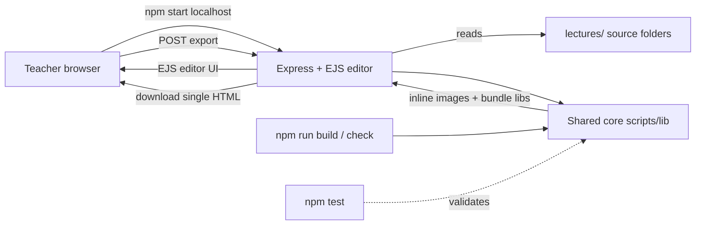

# Lecture Creator

> Converts **Markdown lecture notes** into **self-contained, narrated HTML presentation slides**
> for offline classroom use — one `.html` file per lecture, with images embedded and code
> highlighting bundled in. Built for a public high-school Computer Science classroom where student
> internet is often unreliable or expensive.

[](#quality-gates)
[](#quality-gates)
[](#requirements)

---

## Why this exists

Two problems forced a rebuild:

1. **GitHub Pages hotlinking stopped working.** The old tool turned relative image paths into
   `github.io` absolute URLs — that delivery path is dead.
2. **The repo was disorganized** — scattered assets, duplicated files, and broken image links.

The fix: each lecture becomes a **portable folder**, and a **Node build** embeds images as data URIs
and bundles highlight.js (+ mermaid when used), so the student file has **zero external URLs** and
works fully offline. An **Express + EJS editor** (`npm start`) lets you author, live-preview, and
export on `localhost`. Full design + rationale: [`inceptions/context.md`](inceptions/context.md).

---

## Quick start

```bash
npm install          # one time
npm start            # editor → http://localhost:3000
```

Prefer the command line? Build a lecture straight to a file:

```bash
npm run build -- git-github     # → dist/git-github.html  (one self-contained file)
```

Then share `dist/git-github.html` with students — they just double-click it. No server, no internet.

---

## npm scripts

| Command | What it does |
|---|---|
| [`npm start`](package.json#L11) | Run the **editor** on `localhost` (author / live-preview / export). |
| [`npm run build -- <slug>`](package.json#L12) | **CLI build** one lecture → `dist/<slug>.html`. |
| [`npm run build:all`](package.json#L13) | Build **every** lecture (per-lecture error isolation). |
| [`npm run check`](package.json#L14) | **Integrity linter** — fails if any lecture has a missing image ref. The ship gate. |
| [`npm test`](package.json#L15) | Run the test suite (`node --test`, 68 tests). |

---

## Author a lecture (the short version)

1. Each lecture lives in its own folder: `lectures/<slug>/lecture.md` (kebab-case slug).
2. Write Markdown. **`#` and `##` start new slides**; `###`/`####` stay inside the current slide.
3. Reference images with **relative paths** (`diagrams/foo.png`, `assets/bar.html`) — the build
   inlines them. Never use `https://` / `github.io` URLs.
4. Build it: `npm run check && npm run build -- <slug>` → `dist/<slug>.html`.

```markdown
# Introduction            ← slide 1
Welcome!

## Main Topic             ← slide 2
- A point
- 

```js
console.log('highlighted code');
```
```

For the full pipeline, the editor round-trip, and "adding a new lecture" step-by-step, see
**[`logs/LECTURE-CREATION-PATTERN.md`](logs/LECTURE-CREATION-PATTERN.md)**.

---

## Architecture

The CLI and the editor share **one build core** ([`scripts/lib/`](scripts/lib)) — there is never a
second copy of the export logic (decision D5). One pipeline turns `lecture.md` into a single HTML:

```
lecture.md ─▶ splitSlides ─▶ inlineImages ─▶ bundleLibs ─▶ renderPresentation ─▶ self-contained .html
              (slide breaks)   (data-URI imgs) (offline libs)  (themed deck + voice)
```



| Where | What |
|---|---|
| [`lectures/`](lectures) | **Source** — one portable folder per lecture (what you author). |
| [`scripts/lib/`](scripts/lib) | **Shared core** — [`buildLecture()`](scripts/lib/index.mjs), `splitSlides`, `inlineImages`, `bundleLibs`, `renderPresentation`. |
| [`server/`](server) | The **Express + EJS editor** (author / preview / export). |
| [`shared/`](shared) | Cross-lecture assets (`styles.css`, practice challenges). |
| [`dist/`](dist) | **Generated** exports — gitignored. |

Full folder map: **[`logs/FOLDER-STRUCTURE.md`](logs/FOLDER-STRUCTURE.md)**.

---

## Viewing exported lectures (for students)

Students don't need Node or this repo — they only need the **one `.html` file**.

1. **Double-click** the `.html` file to open it in any modern browser (Chrome, Firefox, Edge, Safari).
2. **Choose a playback mode** before starting:
   - **Auto-play** — slides advance with text-to-speech narration (best on Windows/Mac).
   - **Manual** — you advance slides yourself (best on **Linux + Chrome**, see below).
3. **Keyboard shortcuts** (both modes): `Space` / `→` next slide · `←` previous · `Esc` stop speech.

> The exported file is fully self-contained: images, code highlighting, and the voice player are all
> embedded — **no internet required**.

### Troubleshooting (student side)

- **Slides advance too fast / no narration (Linux + Chrome):** speech synthesis can be unavailable
  from `file://`. Choose **Manual mode** and use Next/Previous, or open the file in **Firefox**
  (better Linux speech support).
- **"Loading voices…" never finishes:** wait a few seconds, then click **Start Anyway** (uses the
  default voice), or switch to Manual mode.
- **Blank page:** make sure the file opened in a browser (right-click → Open With), and check the
  browser console (`F12`).

---

## Quality gates

Three commands must be green before shipping:

| Gate | Command | Expected |
|---|---|---|
| Regression | `npm test` | **68 pass / 0 fail** (unit + integration + supertest routes) |
| Integrity | `npm run check` | **exit 0** (0 missing image refs) |
| Build | `npm run build:all` | **20 ok / 0 failed** |

The test suite also proves the core guarantee: a built lecture contains **zero external `http(s)://`
URLs** (the offline proof). See [`scripts/test/`](scripts/test).

---

## Requirements

- **Node.js ≥ 20** (ESM, `"type": "module"`).
- Dependencies (installed via `npm install`): `express`, `ejs`, `marked`, `highlight.js`, `mermaid`;
  dev: `supertest`.

---

## Project docs

| Doc | Purpose |
|---|---|
| [`inceptions/context.md`](inceptions/context.md) | The project "second brain" — identity, problem, locked decisions (D1–D15). **Read first.** |
| [`logs/FOLDER-STRUCTURE.md`](logs/FOLDER-STRUCTURE.md) | Where everything lives after the restructure. |
| [`logs/LECTURE-CREATION-PATTERN.md`](logs/LECTURE-CREATION-PATTERN.md) | The `lecture.md` → self-contained `.html` workflow end-to-end. |
| [`CHANGELOG.md`](CHANGELOG.md) | Release history. |
| `plans/progress.md` | Phase tracker (where we are). |

---

## License

Free to use for educational purposes.
