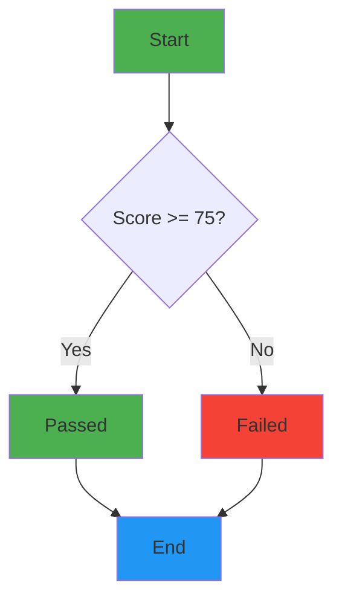
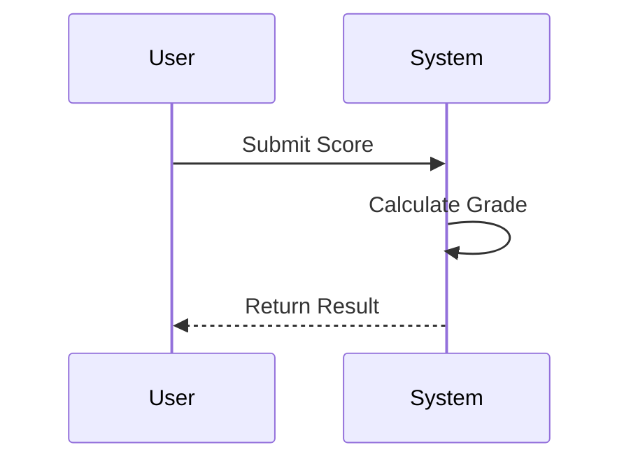
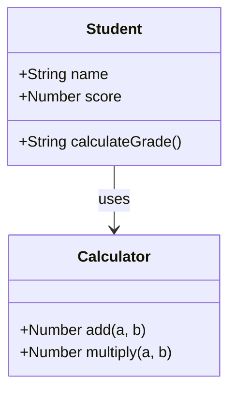
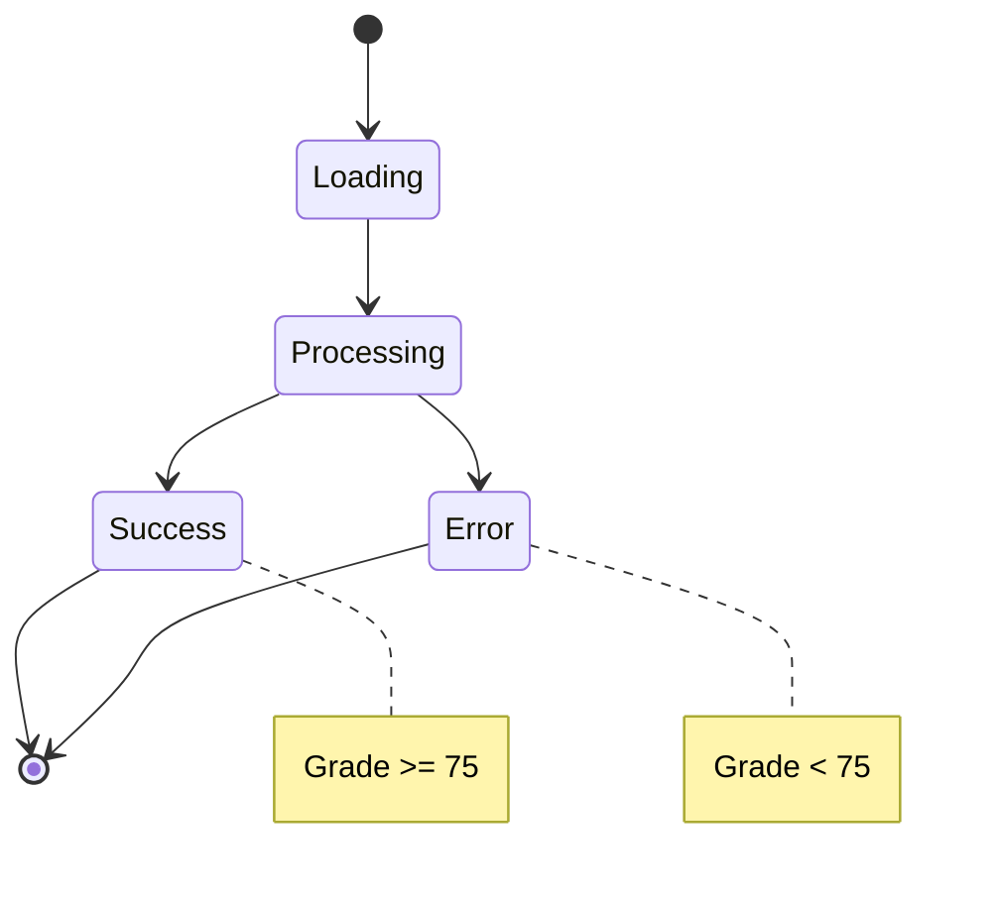
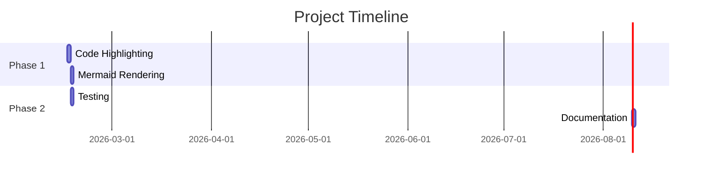

# Test: Code Highlighting & Mermaid Rendering

This test file validates that the exported HTML properly renders:
- Code syntax highlighting
- Mermaid diagrams
- Theme switching

---

## JavaScript Code Block

```javascript
function calculateGrade(score) {
    if (score >= 75) {
        return 'Passed';
    } else {
        return 'Failed';
    }
}

console.log(calculateGrade(85)); // Output: Passed
```

## CSS Code Block

```css
.highlight {
    background-color: yellow;
    padding: 10px;
    border-radius: 5px;
}

.button {
    background: #4CAF50;
    color: white;
    padding: 10px 20px;
    border: none;
    border-radius: 5px;
}
```

## Mermaid Flowchart



## Mermaid Sequence Diagram



## Python Code Block

```python
def calculate_grade(score):
    if score >= 75:
        return "Passed"
    else:
        return "Failed"

print(calculate_grade(85))
```

## Mermaid Class Diagram



## HTML Code Block

```html
<!DOCTYPE html>
<html lang="en">
<head>
    <meta charset="UTF-8">
    <meta name="viewport" content="width=device-width, initial-scale=1.0">
    <title>Test Page</title>
</head>
<body>
    <h1>Hello, World!</h1>
    <p>This is a test HTML page.</p>
</body>
</html>
```

## Mermaid State Diagram



## Bash Code Block

```bash
# Create a new directory
mkdir my-project

# Navigate into it
cd my-project

# Initialize a new project
npm init -y

# Install dependencies
npm install express
```

## Mermaid Gantt Chart



---

## Testing Instructions

1. **Export this file:**
   - Open `index.html` in your browser
   - Load this file or paste the content
   - Click "Export for Students"

2. **Test Code Highlighting:**
   - Verify JavaScript code has syntax highlighting (keywords, strings, comments)
   - Verify CSS code has syntax highlighting (selectors, properties, values)
   - Verify Python code has syntax highlighting
   - Verify HTML code has syntax highlighting
   - Verify Bash code has syntax highlighting

3. **Test Mermaid Diagrams:**
   - Verify flowchart renders correctly
   - Verify sequence diagram renders correctly
   - Verify class diagram renders correctly
   - Verify state diagram renders correctly
   - Verify Gantt chart renders correctly
   - Check that diagram colors match the theme

4. **Test Theme Switching:**
   - Toggle between dark and light themes
   - Verify code highlighting switches to appropriate theme
   - Verify mermaid diagrams remain visible
   - Check that all content is readable in both themes

5. **Test Error Handling:**
   - If mermaid fails to render, check for error message
   - Verify code block is still displayed even if diagram fails
   - Check console for error logs
