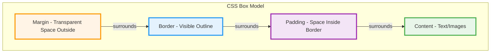
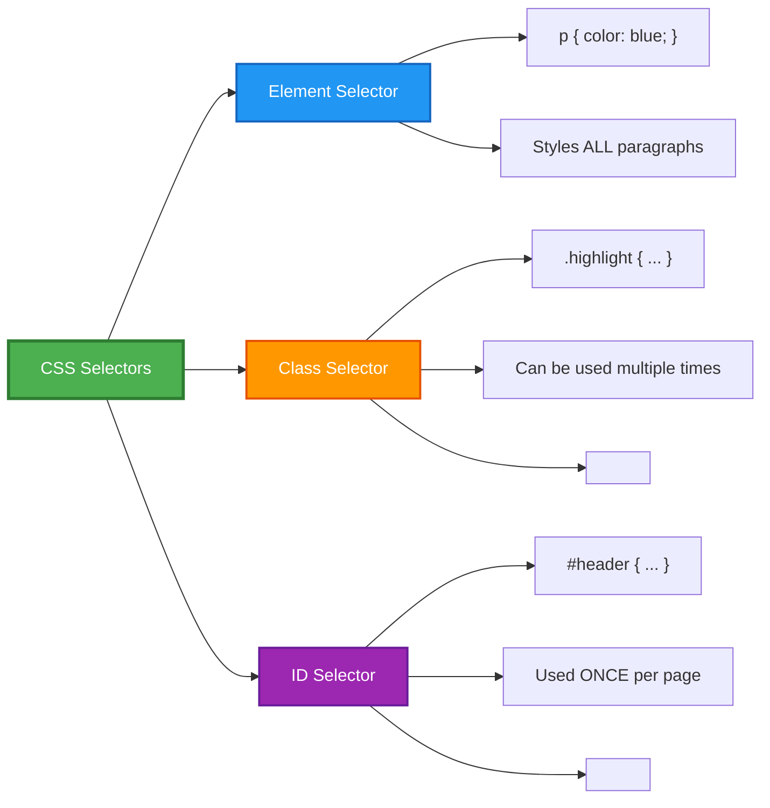
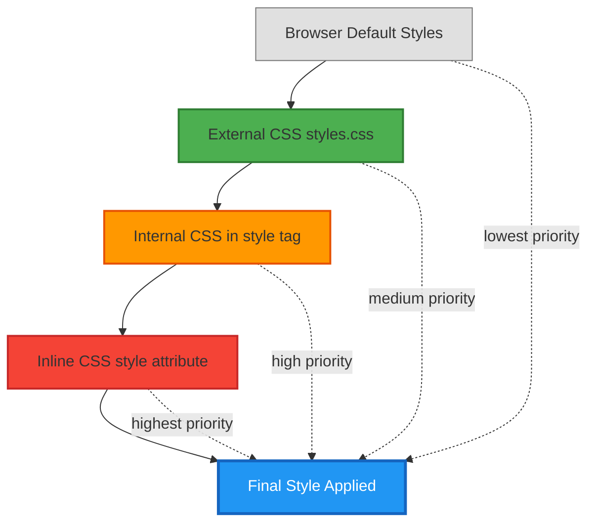
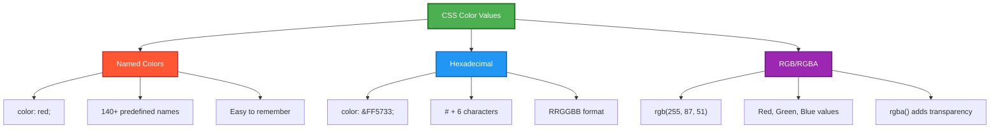
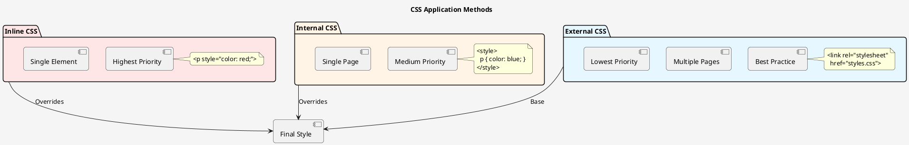
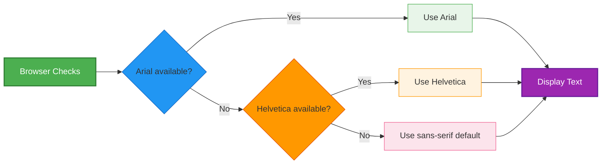
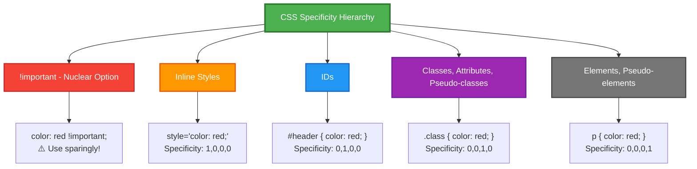
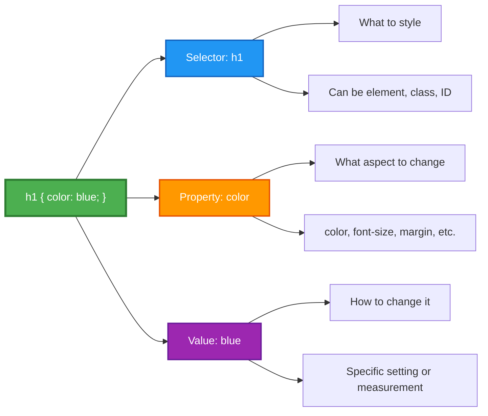

# CSS Box Model Diagram (Mermaid)



---

# Box Model with Measurements (D2)

```d2
direction: down

box_model: CSS Box Model {
  margin: Margin {
    shape: rectangle
    style: {
      fill: "#fff4e6"
      stroke: "#ff9800"
      stroke-width: 3
    }
    
    border: Border {
      shape: rectangle
      style: {
        fill: "#e3f2fd"
        stroke: "#2196f3"
        stroke-width: 3
      }
      
      padding: Padding {
        shape: rectangle
        style: {
          fill: "#f3e5f5"
          stroke: "#9c27b0"
          stroke-width: 3
        }
        
        content: Content {
          shape: rectangle
          style: {
            fill: "#e8f5e9"
            stroke: "#4caf50"
            stroke-width: 3
          }
        }
      }
    }
  }
}

margin_label: "margin: 10px" {
  shape: text
}
border_label: "border: 2px solid black" {
  shape: text
}
padding_label: "padding: 20px" {
  shape: text
}
content_label: "width: 200px\nheight: 100px" {
  shape: text
}

box_model.margin -> margin_label: " "
box_model.margin.border -> border_label: " "
box_model.margin.border.padding -> padding_label: " "
box_model.margin.border.padding.content -> content_label: " "
```

---

# CSS Selector Types (Mermaid)



---

# CSS Cascade Flow (Mermaid)



---

# CSS Color Systems (Mermaid)



---

# CSS Application Methods (PlantUML)



---

# Font Family Fallback Chain (Mermaid)



---

# CSS Box Model Nested Structure (D2)

```d2
direction: down

explanation: "Visual Representation of CSS Box Model" {
  shape: text
  style.font-size: 20
  style.bold: true
}

box: {
  label: "Complete Element"
  
  margin_area: {
    label: "MARGIN (transparent)\nmargin: 20px"
    style.fill: "#fff4e6"
    style.stroke: "#ff9800"
    style.stroke-width: 4
    
    border_area: {
      label: "BORDER (visible)\nborder: 3px solid black"
      style.fill: "#e3f2fd"
      style.stroke: "#2196f3"
      style.stroke-width: 4
      
      padding_area: {
        label: "PADDING (inside space)\npadding: 15px"
        style.fill: "#f3e5f5"
        style.stroke: "#9c27b0"
        style.stroke-width: 4
        
        content_area: {
          label: "CONTENT\nwidth: 200px\nheight: 100px\n\nYour text/images here"
          style.fill: "#e8f5e9"
          style.stroke: "#4caf50"
          style.stroke-width: 4
        }
      }
    }
  }
}

note: "Total Width = margin + border + padding + content + padding + border + margin" {
  shape: text
  style.font-size: 14
}

box -> note
```

---

# CSS Specificity Hierarchy (Mermaid)



---

# Simple Navigation Bar Structure (D2)

```d2
direction: right

nav: Navigation Bar {
  style.fill: "#333333"
  style.stroke: "#000000"
  style.stroke-width: 2
  
  home: Home {
    style.fill: "#ffffff"
    style.stroke: "#333333"
    style.font-color: "#333333"
  }
  
  about: About {
    style.fill: "#ffffff"
    style.stroke: "#333333"
    style.font-color: "#333333"
  }
  
  contact: Contact {
    style.fill: "#ffffff"
    style.stroke: "#333333"
    style.font-color: "#333333"
  }
}

hover_effect: "Hover Effect:\nLinks turn orange" {
  shape: text
  style.font-size: 14
}

css_code: "CSS:\nnav { background: #333; }\nnav a { color: white; }\nnav a:hover { color: orange; }" {
  shape: text
  style.font-size: 12
  style.font: mono
}

nav -> hover_effect
hover_effect -> css_code
```

---

# CSS Syntax Breakdown (Mermaid)



Save this file and I'll provide instructions for which diagram to use where!
