# Middleware Execution Flow (Graphviz/DOT)

**Diagram Type:** Flowchart  
**Tool:** Graphviz (DOT)  
**Purpose:** Show how middleware chain executes for protected routes  
**Used in:** Section 6 - Protecting Routes with Middleware

---

## Graphviz/DOT Code

```dot
digraph middleware_flow {
    rankdir=LR;
    node [shape=box, style=rounded, fontname="Arial"];
    edge [fontname="Arial"];
    
    // Define nodes
    start [label="Request:\n/admin/users", shape=ellipse, style=filled, fillcolor=lightblue];
    requireLogin [label="requireLogin\nMiddleware", style=filled, fillcolor=lightyellow];
    checkLogin [label="Is user\nlogged in?", shape=diamond, style=filled, fillcolor=lightgray];
    redirectLogin [label="Redirect to\n/login", shape=box, style=filled, fillcolor=lightcoral];
    requireAdmin [label="requireAdmin\nMiddleware", style=filled, fillcolor=lightyellow];
    checkAdmin [label="Is user\nadmin?", shape=diamond, style=filled, fillcolor=lightgray];
    forbidden [label="403 Forbidden\nAccess Denied", shape=box, style=filled, fillcolor=lightcoral];
    routeHandler [label="Route Handler\n(Actual Code)", style=filled, fillcolor=lightgreen];
    renderPage [label="Render Page", shape=ellipse, style=filled, fillcolor=lightgreen];
    
    // Define flow
    start -> requireLogin;
    requireLogin -> checkLogin;
    checkLogin -> redirectLogin [label="No", color=red];
    checkLogin -> requireAdmin [label="Yes ✓", color=green];
    requireAdmin -> checkAdmin;
    checkAdmin -> forbidden [label="No", color=red];
    checkAdmin -> routeHandler [label="Yes ✓", color=green];
    routeHandler -> renderPage;
    
    // Endpoints
    redirectLogin [shape=box];
    forbidden [shape=box];
    renderPage [shape=ellipse];
}
```



---

## Rendering Instructions

**Command:**
```bash
dot -Tpng 01-middleware-flow.graphviz.md -o ../../diagrams/authentication/middleware-flow.png
```

**Alternative (if using Kroki):**
```bash
# Extract code block and pipe to Kroki
curl -X POST https://kroki.io/graphviz/png -d @- < diagram.dot > middleware-flow.png
```

---

## Expected Output

A left-to-right flowchart showing:
1. Request enters requireLogin middleware
2. Decision: logged in? → No: redirect to login (red path)
3. Decision: logged in? → Yes: continue to requireAdmin (green path)
4. Decision: is admin? → No: 403 Forbidden (red path)
5. Decision: is admin? → Yes: execute route handler (green path)
6. Render page (success)

**Color coding:**
- Blue: Start
- Yellow: Middleware boxes
- Gray: Decision diamonds
- Red: Failure endpoints
- Green: Success path

---

## Notes

- Uses `rankdir=LR` for left-to-right layout (easier to read than top-to-bottom)
- Diamond shapes for decisions (standard flowchart convention)
- Color-coded paths (green = success, red = failure)
- Clear labels showing what each middleware checks
