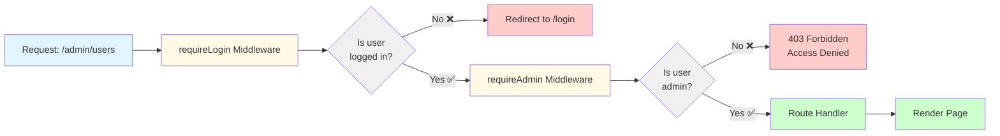

# Middleware Execution Flow (Mermaid - Alternate)

**Diagram Type:** Flowchart  
**Tool:** Mermaid  
**Purpose:** Show how middleware chain executes for protected routes  
**Used in:** Section 6 - Protecting Routes with Middleware

---

## Mermaid Code



---

## Rendering Instructions

**If using Mermaid CLI:**
```bash
mmdc -i 01-middleware-flow.mermaid.md -o ../../diagrams/authentication/middleware-flow.png
```

**If using Kroki:**
```bash
curl -X POST https://kroki.io/mermaid/png -d @diagram.mmd > middleware-flow.png
```

**In Markdown (GitHub/many renderers):**
Just include the code block with `mermaid` language tag - it will auto-render!

---

## Expected Output

A left-to-right flowchart showing:
1. Request enters requireLogin middleware
2. Decision: logged in? → No: redirect (red box)
3. Decision: logged in? → Yes: continue to requireAdmin (yellow box)
4. Decision: is admin? → No: 403 Forbidden (red box)
5. Decision: is admin? → Yes: execute route handler (green box)
6. Render page (green box)

**Color coding:**
- Light blue: Start
- Yellow: Middleware
- Gray: Decisions
- Red: Failures
- Green: Success

---

## Notes

- Simpler syntax than Graphviz
- Widely supported (GitHub, GitLab, VS Code, etc.)
- Uses emoji (❌✅) for visual clarity
- HTML `<br/>` for line breaks in decision nodes
