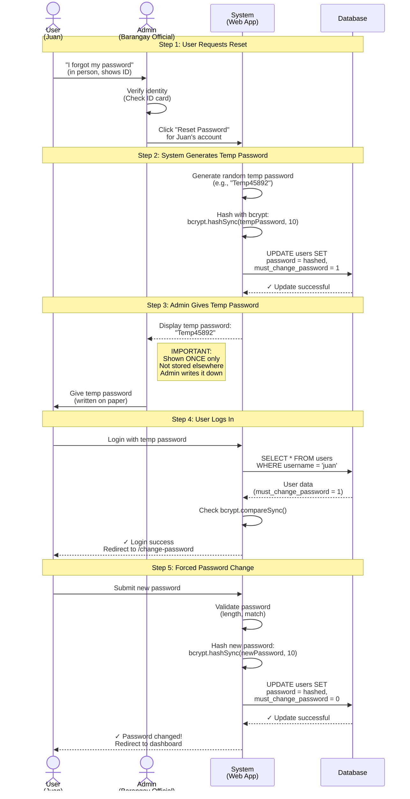

# Admin Password Reset Sequence (Mermaid - Alternate)

**Diagram Type:** Sequence Diagram  
**Tool:** Mermaid  
**Purpose:** Show admin-assisted password reset flow with in-person verification  
**Used in:** Section 8 - Admin-Assisted Password Reset

---

## Mermaid Code



---

## Rendering Instructions

**If using Mermaid CLI:**
```bash
mmdc -i 02-password-reset-sequence.mermaid.md -o ../../diagrams/authentication/password-reset-sequence.png
```

**If using Kroki:**
```bash
curl -X POST https://kroki.io/mermaid/png -d @diagram.mmd > password-reset-sequence.png
```

**In Markdown (GitHub/many renderers):**
Just include the code block with `mermaid` language tag - it will auto-render!

---

## Expected Output

A vertical sequence diagram showing:
1. **5 phases** clearly separated with Note boxes
2. **4 participants:** User (Juan), Admin, System, Database
3. **Solid arrows** for actions (→)
4. **Dashed arrows** for responses (-->>)
5. **HTML line breaks** (`<br/>`) for multi-line labels

**Key visual elements:**
- Actor icons for User and Admin
- Box icons for System and Database
- Notes spanning across participants for phase headers
- Side note highlighting security importance
- Clear flow from top to bottom

---

## Notes

- Simpler syntax than PlantUML
- Widely supported (auto-renders in GitHub, GitLab, VS Code)
- Uses `<br/>` for line breaks in labels
- `actor` keyword creates stick figure icons
- Note boxes for phase separation and important callouts
- Good balance between simplicity and detail
