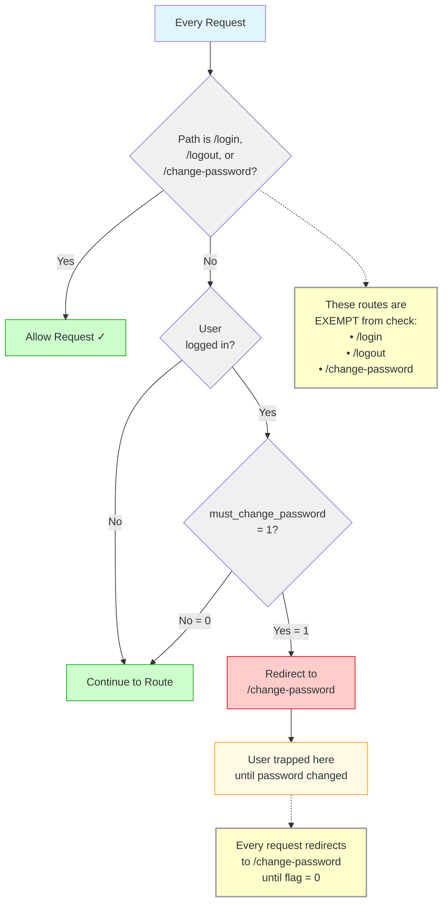

# Force Password Change Flow (Mermaid - Alternate)

**Diagram Type:** Flowchart with Decision Logic  
**Tool:** Mermaid  
**Purpose:** Show how middleware traps users until password is changed  
**Used in:** Section 8 - Force Password Change

---

## Mermaid Code



---

## Rendering Instructions

**If using Mermaid CLI:**
```bash
mmdc -i 03-force-password-change.mermaid.md -o ../../diagrams/authentication/force-password-change.png
```

**If using Kroki:**
```bash
curl -X POST https://kroki.io/mermaid/png -d @diagram.mmd > force-password-change.png
```

**In Markdown (GitHub/many renderers):**
Just include the code block with `mermaid` language tag - it will auto-render!

---

## Expected Output

A top-to-bottom flowchart showing:
1. Request enters middleware
2. Decision: Is path exempt? → Yes: Allow (green)
3. Decision: Is path exempt? → No: Check if logged in
4. Decision: Logged in? → No: Continue (green)
5. Decision: Logged in? → Yes: Check must_change_password flag
6. Decision: Flag = 0? → Continue (green)
7. Decision: Flag = 1? → Redirect to /change-password (red)
8. Hexagon: User trapped until password changed (warning orange)

**Color coding:**
- Light blue: Start
- Gray: Decisions (diamonds)
- Green: Success/allow paths
- Red: Redirect/trap path
- Orange: Trapped state
- Yellow: Note boxes

---

## Notes

- Top-to-bottom layout (easier for decision trees)
- Diamond shapes for decisions
- Color-coded paths (green = pass, red = redirect)
- Note boxes with dashed lines to relevant nodes
- HTML `<br/>` for multi-line labels
- Shows the "trap" mechanism visually with hexagon shape
