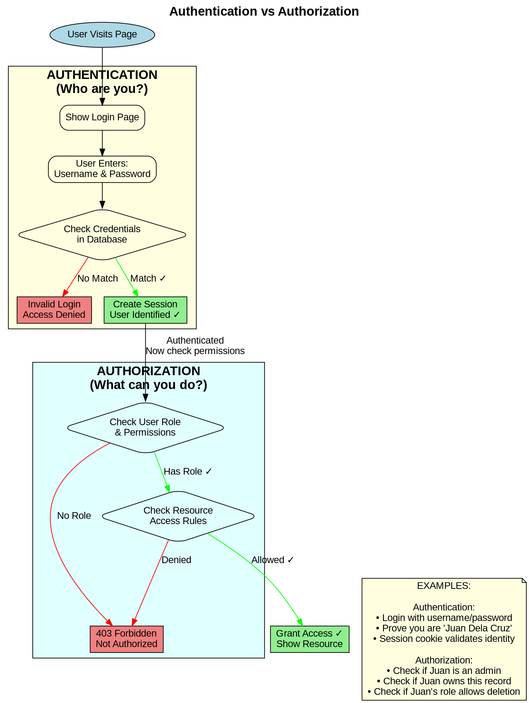

# Authentication vs Authorization (Graphviz)

**Diagram Type:** Decision Tree / Concept Flow  
**Tool:** Graphviz (DOT)  
**Purpose:** Show distinction between authentication (who you are) and authorization (what you can do)  
**Used in:** Section 1 - Understanding Authentication vs Authorization

---

## Graphviz/DOT Code



---

## Rendering Instructions

**Command:**
```bash
dot -Tpng 05-auth-vs-authz.graphviz.md -o ../../diagrams/authentication/auth-vs-authz.png
```

**Alternative (if using Kroki):**
```bash
curl -X POST https://kroki.io/graphviz/png -d @diagram.dot > auth-vs-authz.png
```

---

## Expected Output

A top-to-bottom flowchart showing:
1. **Authentication section (yellow box):**
   - User enters credentials
   - System checks database
   - Success: Create session (green)
   - Failure: Access denied (red)

2. **Authorization section (cyan box):**
   - Check user role
   - Check resource permissions
   - Success: Grant access (green)
   - Failure: 403 Forbidden (red)

3. **Examples note box:**
   - Real-world examples of authentication (login, identity)
   - Real-world examples of authorization (roles, permissions)

**Visual elements:**
- Two distinct subgraphs (clusters) for Authentication vs Authorization
- Diamond shapes for decision points
- Color coding: yellow (auth), cyan (authz), green (success), red (failure)
- Note box with practical examples
- Arrows showing flow between the two concepts

---

## Notes

- Uses subgraphs (clusters) to group related concepts
- Clear visual separation between "who you are" and "what you can do"
- Shows authentication MUST happen before authorization
- Diamond shapes for decision points (standard flowchart convention)
- Examples box provides real-world context (Filipino names for relatability)
