# Authentication vs Authorization (Mermaid - Alternate)

**Diagram Type:** Decision Tree / Concept Flow  
**Tool:** Mermaid  
**Purpose:** Show distinction between authentication (who you are) and authorization (what you can do)  
**Used in:** Section 1 - Understanding Authentication vs Authorization

---

## Mermaid Code

```mermaid
flowchart TB
    Start([User Visits Page])
    
    subgraph Authentication["🔐 AUTHENTICATION (Who are you?)"]
        A1[Show Login Page]
        A2[User Enters:<br/>Username & Password]
        A3{Check Credentials<br/>in Database}
        A4[Invalid Login<br/>Access Denied ❌]
        A5[Create Session<br/>User Identified ✓]
    end
    
    subgraph Authorization["🛡️ AUTHORIZATION (What can you do?)"]
        B1{Check User Role<br/>& Permissions}
        B2{Check Resource<br/>Access Rules}
        B3[403 Forbidden<br/>Not Authorized ❌]
        B4[Grant Access ✓<br/>Show Resource]
    end
    
    Examples["📋 EXAMPLES:<br/><br/>Authentication:<br/>• Login with username/password<br/>• Prove you are 'Juan Dela Cruz'<br/>• Session cookie validates identity<br/><br/>Authorization:<br/>• Check if Juan is an admin<br/>• Check if Juan owns this record<br/>• Check if Juan's role allows deletion"]
    
    Start --> A1
    A1 --> A2
    A2 --> A3
    A3 -->|No Match| A4
    A3 -->|Match ✓| A5
    A5 -->|Authenticated<br/>Now check permissions| B1
    B1 -->|Has Role ✓| B2
    B1 -->|No Role| B3
    B2 -->|Allowed ✓| B4
    B2 -->|Denied| B3
    
    B4 -.->|Examples| Examples
    
    style Start fill:#e1f5ff
    style A4 fill:#ffcccc,stroke:#cc0000
    style A5 fill:#ccffcc,stroke:#00aa00
    style B3 fill:#ffcccc,stroke:#cc0000
    style B4 fill:#ccffcc,stroke:#00aa00
    style Examples fill:#ffffcc,stroke:#999
    
    classDef authStyle fill:#fff9e6,stroke:#ff9900,stroke-width:3px
    classDef authzStyle fill:#e6f7ff,stroke:#0066cc,stroke-width:3px
    
    class Authentication authStyle
    class Authorization authzStyle
```



---

## Rendering Instructions

**If using Mermaid CLI:**
```bash
mmdc -i 05-auth-vs-authz.mermaid.md -o ../../diagrams/authentication/auth-vs-authz.png
```

**If using Kroki:**
```bash
curl -X POST https://kroki.io/mermaid/png -d @diagram.mmd > auth-vs-authz.png
```

**In Markdown (GitHub/many renderers):**
Just include the code block with `mermaid` language tag - it will auto-render!

---

## Expected Output

A top-to-bottom flowchart showing:
1. **Authentication subgraph (yellow/orange border, 🔐 icon):**
   - Login page → credentials → database check
   - Success: Create session (green)
   - Failure: Access denied (red)

2. **Authorization subgraph (cyan border, 🛡️ icon):**
   - Check user role
   - Check resource access
   - Success: Grant access (green)
   - Failure: 403 Forbidden (red)

3. **Examples box (yellow, 📋 icon):**
   - Practical authentication examples
   - Practical authorization examples

**Visual elements:**
- Two distinct subgraphs with colored borders
- Emoji icons in subgraph titles (🔐 🛡️ 📋)
- Stadium shape for start node
- Diamond shapes for decisions
- Color-coded success (green) and failure (red) paths
- Dashed line connecting to examples

---

## Notes

- Subgraphs clearly separate Authentication from Authorization
- Emoji icons make concepts memorable for Grade 9 students
- HTML `<br/>` for line breaks in labels
- Custom styling with classDef for subgraph borders
- Examples box provides Filipino context (Juan Dela Cruz)
- Shows authentication must happen before authorization
