# System Architecture Overview (Mermaid)

**Diagram Type:** Component/System Architecture  
**Tool:** Mermaid  
**Purpose:** Show how all authentication pieces fit together  
**Used in:** Section 10 - Real-World Example - Complete Auth System

---

## Mermaid Code

```mermaid
graph TB
    subgraph Browser["🌐 Client Browser"]
        User[User]
        Cookie[Session Cookie]
    end
    
    subgraph ExpressApp["⚙️ Express Application"]
        direction TB
        
        subgraph Middleware["Middleware Stack"]
            SM[Session Middleware<br/>express-session]
            LU[Load User Middleware<br/>res.locals.user]
            FPC[Force Password Change<br/>Middleware]
        end
        
        subgraph Routes["Routes"]
            PR[Public Routes<br/>/login, /register, /]
            AR[Protected Routes<br/>requireLogin<br/>/dashboard]
            ADR[Admin Routes<br/>requireAdmin<br/>/admin/*]
        end
        
        subgraph Helpers["Helper Functions"]
            RL[requireLogin]
            RA[requireAdmin]
            BC[bcrypt Functions]
        end
    end
    
    subgraph Database["💾 SQLite Database"]
        ST[Sessions Table<br/>managed by<br/>better-sqlite3-session-store]
        UT[Users Table<br/>id, username, password,<br/>name, role,<br/>must_change_password]
    end
    
    %% Flow connections
    User -->|HTTP Request| SM
    SM <-->|Read/Write| Cookie
    SM <-->|Store/Retrieve| ST
    SM --> LU
    LU -->|Query user data| UT
    LU --> FPC
    
    FPC -->|Route to| PR
    FPC -->|Route to| AR
    FPC -->|Route to| ADR
    
    AR -.->|Uses| RL
    ADR -.->|Uses| RL
    ADR -.->|Uses| RA
    
    RL -.->|Checks| LU
    RA -.->|Checks| LU
    RA -->|Query role| UT
    
    PR -->|Register/Login| BC
    BC -->|Hash/Compare| UT
    
    %% Styling
    style Browser fill:#e1f5ff,stroke:#0066cc,stroke-width:3px
    style ExpressApp fill:#fff9e6,stroke:#ff9900,stroke-width:3px
    style Database fill:#e6ffe6,stroke:#00aa00,stroke-width:3px
    
    style SM fill:#ffffcc
    style LU fill:#ffffcc
    style FPC fill:#ffffcc
    
    style PR fill:#ccffcc
    style AR fill:#ffeecc
    style ADR fill:#ffcccc
    
    style ST fill:#ccffcc
    style UT fill:#ccffcc
```



---

## Rendering Instructions

**If using Mermaid CLI:**
```bash
mmdc -i 06-system-architecture.mermaid.md -o ../../diagrams/authentication/system-architecture.png
```

**If using Kroki:**
```bash
curl -X POST https://kroki.io/mermaid/png -d @diagram.mmd > system-architecture.png
```

**In Markdown (GitHub/many renderers):**
Just include the code block with `mermaid` language tag - it will auto-render!

---

## Expected Output

A component architecture diagram showing:

1. **Client Browser (blue box):**
   - User
   - Session Cookie (stores session ID)

2. **Express Application (yellow/orange box):**
   - **Middleware Stack:**
     - Session Middleware (express-session)
     - Load User Middleware (sets res.locals.user)
     - Force Password Change Middleware
   - **Routes:**
     - Public Routes (green) - /login, /register, /
     - Protected Routes (yellow) - /dashboard, requireLogin
     - Admin Routes (red) - /admin/*, requireAdmin
   - **Helper Functions:**
     - requireLogin middleware
     - requireAdmin middleware
     - bcrypt hash/compare functions

3. **SQLite Database (green box):**
   - Sessions Table (managed by better-sqlite3-session-store)
   - Users Table (id, username, password, role, etc.)

**Connection types:**
- Solid arrows: Data flow
- Dashed arrows: "Uses" or "Checks" relationships
- Two-way arrows: Read/Write operations

---

## Notes

- Shows complete system architecture at a glance
- Emoji icons (🌐 ⚙️ 💾) make sections memorable
- Color-coded by security level (green = public, yellow = authenticated, red = admin)
- Subgraphs organize related components
- HTML `<br/>` for multi-line labels
- Demonstrates how middleware stack flows into routes
- Shows database interactions clearly
