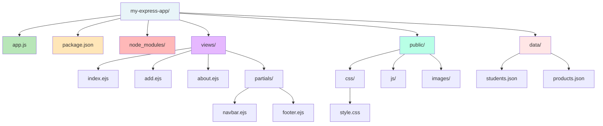

# Express Project Folder Structure

## Mermaid Version



## D2 Version

```d2
direction: down

project: my-express-app {
  shape: folder
  
  app: app.js {
    shape: document
    style.fill: "#B8E6B8"
  }
  
  package: package.json {
    shape: document
    style.fill: "#FFE6B8"
  }
  
  views: views/ {
    shape: folder
    style.fill: "#E6B8FF"
    
    index: index.ejs
    add: add.ejs
    about: about.ejs
    
    partials: partials/ {
      shape: folder
      navbar: navbar.ejs
      footer: footer.ejs
    }
  }
  
  public: public/ {
    shape: folder
    style.fill: "#B8FFE6"
    
    css: css/ {
      shape: folder
      style_file: style.css
    }
    
    js: js/ {
      shape: folder
    }
    
    images: images/ {
      shape: folder
    }
  }
  
  data: data/ {
    shape: folder
    style.fill: "#FFE6E6"
    
    students: students.json {
      shape: cylinder
    }
    
    products: products.json {
      shape: cylinder
    }
  }
  
  node_modules: node_modules/ {
    shape: folder
    style.fill: "#CCCCCC"
  }
}

project.app: Main server file
project.package: Dependencies list
project.views: EJS templates
project.public: Static files (CSS, JS, images)
project.data: JSON data storage
project.node_modules: Installed packages (don't commit!)
```

## ASCII Tree Version

```
my-express-app/
│
├── app.js                 # Main Express server file
├── package.json           # Project dependencies and scripts
│
├── node_modules/          # Installed packages (auto-generated)
│
├── views/                 # EJS template files
│   ├── index.ejs          # Home page
│   ├── add.ejs            # Add form page
│   ├── about.ejs          # About page
│   └── partials/          # Reusable components
│       ├── navbar.ejs     # Navigation bar
│       └── footer.ejs     # Footer
│
├── public/                # Static files (served directly)
│   ├── css/
│   │   └── style.css      # Custom styles
│   ├── js/
│   │   └── script.js      # Client-side JavaScript
│   └── images/
│       └── logo.png       # Images
│
└── data/                  # JSON data files
    ├── students.json      # Student records
    └── products.json      # Product inventory
```

---

## Folder Descriptions

| Folder/File | Purpose | Example Files |
|-------------|---------|---------------|
| **app.js** | Main server file, routes, and configuration | `app.js` |
| **package.json** | Lists dependencies and scripts | Auto-generated |
| **node_modules/** | Installed npm packages (DON'T commit to git!) | express/, ejs/ |
| **views/** | EJS template files for dynamic HTML | index.ejs, add.ejs |
| **views/partials/** | Reusable EJS components | navbar.ejs, footer.ejs |
| **public/** | Static files served directly (CSS, JS, images) | style.css, logo.png |
| **data/** | JSON files for data storage | students.json |

## Setup Commands

```bash
# Create all folders
mkdir views views/partials public public/css public/js public/images data

# Create main files
touch app.js package.json
touch views/index.ejs views/add.ejs views/about.ejs
touch views/partials/navbar.ejs views/partials/footer.ejs
touch public/css/style.css
touch data/students.json
```

---

## Important Notes

⚠️ **NEVER commit `node_modules/` to git!** Add to `.gitignore`

✅ **Always commit:**
- `app.js`
- `package.json`
- `views/`
- `public/`
- `data/` (or .gitignore if sensitive)

❌ **Never commit:**
- `node_modules/`
- `.env` (secrets)
- `*.log` files
