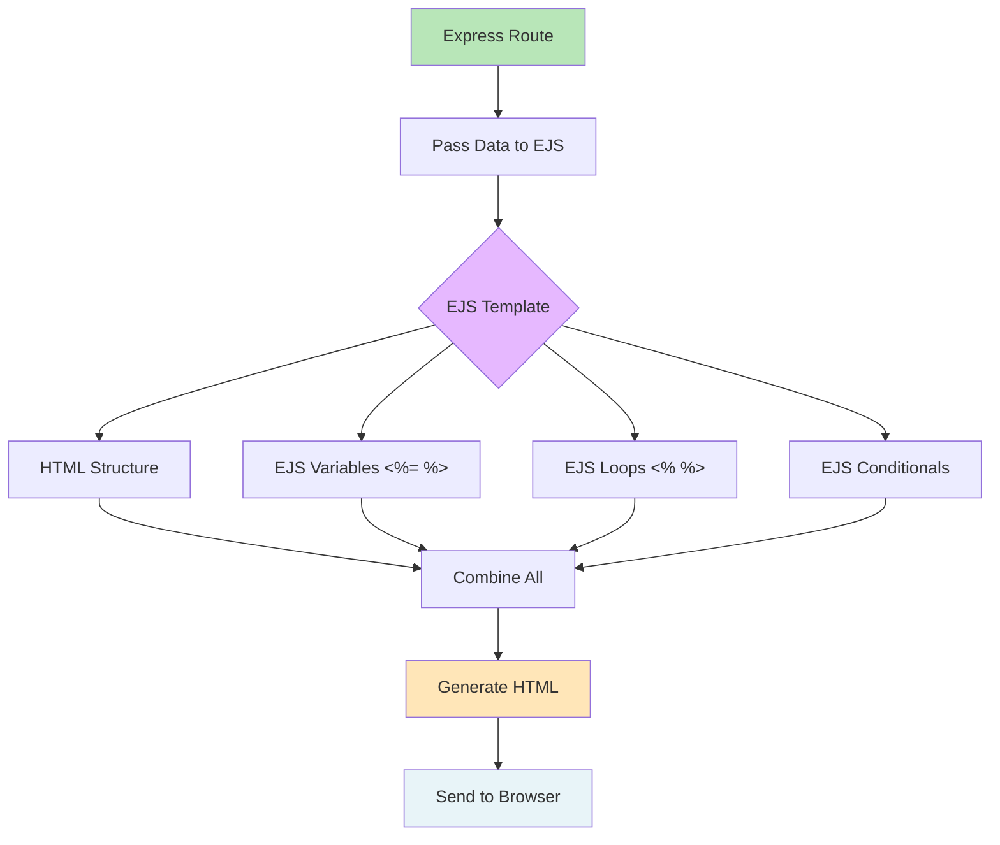

# EJS Template Rendering Process

## Mermaid Version



## D2 Version

```d2
direction: down

route: Express Route {
  style.fill: "#B8E6B8"
}

data: Pass Data {
  students: [
    { name: "Maria", grade: 95 }
    { name: "Juan", grade: 88 }
  ]
}

ejs: EJS Template {
  shape: document
  style.fill: "#E6B8FF"
  
  html: HTML Structure
  variables: <%= name %>, <%= grade %>
  loops: <% students.forEach() %>
  conditionals: <% if (grade >= 75) %>
}

process: Template Engine {
  shape: hexagon
  style.fill: "#FFE6B8"
}

html: Final HTML {
  shape: document
  style.fill: "#B8FFE6"
}

browser: Browser Display {
  style.fill: "#E8F4F8"
}

route -> data: 1. Prepare data
data -> ejs: 2. Send to template
ejs -> process: 3. Process EJS tags
process -> html: 4. Generate HTML
html -> browser: 5. Send to browser
```

## Step-by-Step Example

### Step 1: Express Route (app.js)
```javascript
app.get('/', (req, res) => {
  const students = [
    { name: 'Maria Santos', grade: 95 },
    { name: 'Juan Dela Cruz', grade: 88 },
    { name: 'Carlos Mendoza', grade: 73 }
  ];
  
  res.render('students', { students: students });
  //                         ↑ data passed to template
});
```

### Step 2: EJS Template (students.ejs)
```ejs
<!DOCTYPE html>
<html>
<head>
  <title>Students</title>
</head>
<body>
  <h1>Student List</h1>
  <p>Total: <%= students.length %> students</p>
  
  <table>
    <% students.forEach(student => { %>
      <tr>
        <td><%= student.name %></td>
        <td><%= student.grade %></td>
        <td>
          <% if (student.grade >= 75) { %>
            <span>Passed</span>
          <% } else { %>
            <span>Failed</span>
          <% } %>
        </td>
      </tr>
    <% }); %>
  </table>
</body>
</html>
```

### Step 3: EJS Processing

```
┌─────────────────────────────────────────┐
│  <%= students.length %>                 │  → Replace with value: 3
├─────────────────────────────────────────┤
│  <% students.forEach(student => { %>    │  → Start loop
├─────────────────────────────────────────┤
│    <%= student.name %>                  │  → Maria Santos
│    <%= student.grade %>                 │  → 95
│    <% if (student.grade >= 75) { %>     │  → TRUE
│      Passed                             │  → Show "Passed"
│    <% } %>                              │
├─────────────────────────────────────────┤
│  (Loop repeats for Juan: 88, Passed)    │
│  (Loop repeats for Carlos: 73, Failed)  │
├─────────────────────────────────────────┤
│  <% }); %>                              │  → End loop
└─────────────────────────────────────────┘
```

### Step 4: Final HTML Output
```html
<!DOCTYPE html>
<html>
<head>
  <title>Students</title>
</head>
<body>
  <h1>Student List</h1>
  <p>Total: 3 students</p>
  
  <table>
    <tr>
      <td>Maria Santos</td>
      <td>95</td>
      <td><span>Passed</span></td>
    </tr>
    <tr>
      <td>Juan Dela Cruz</td>
      <td>88</td>
      <td><span>Passed</span></td>
    </tr>
    <tr>
      <td>Carlos Mendoza</td>
      <td>73</td>
      <td><span>Failed</span></td>
    </tr>
  </table>
</body>
</html>
```

---

## EJS Tag Types

### 1. Output Tags `<%= %>`
**Purpose:** Display values (HTML-escaped)
```ejs
<p>Name: <%= student.name %></p>
<!-- Output: <p>Name: Maria Santos</p> -->
```

### 2. Scriptlet Tags `<% %>`
**Purpose:** Run JavaScript code (no output)
```ejs
<% students.forEach(student => { %>
  <!-- loop content -->
<% }); %>
```

### 3. Unescaped Output `<%- %>`
**Purpose:** Display raw HTML (use carefully!)
```ejs
<%- include('partials/navbar') %>
<!-- Includes navbar.ejs content -->
```

### 4. Comments `<%# %>`
**Purpose:** Comments (not in final HTML)
```ejs
<%# This is a comment, won't appear in HTML %>
```

---

## Common EJS Patterns

### Conditionals
```ejs
<% if (grade >= 90) { %>
  <span class="excellent">A</span>
<% } else if (grade >= 80) { %>
  <span class="good">B</span>
<% } else { %>
  <span class="fail">F</span>
<% } %>
```

### Loops
```ejs
<!-- forEach loop -->
<% students.forEach(student => { %>
  <li><%= student.name %></li>
<% }); %>

<!-- for loop with index -->
<% for (let i = 0; i < students.length; i++) { %>
  <li><%= i + 1 %>. <%= students[i].name %></li>
<% } %>
```

### Includes (Partials)
```ejs
<!DOCTYPE html>
<html>
  <%- include('partials/head') %>
  <body>
    <%- include('partials/navbar') %>
    
    <!-- Page content -->
    
    <%- include('partials/footer') %>
  </body>
</html>
```

---

## Visual Data Flow

```
╔══════════════╗
║  Express     ║
║  Route       ║
║              ║
║  students =  ║
║  [...]       ║
╚══════╤═══════╝
       │
       │ Pass data
       ▼
╔══════════════╗
║  EJS Engine  ║
║              ║
║  <%= name %> ║ → Replace with "Maria"
║  <% loop %>  ║ → Execute 3 times
║  <% if %>    ║ → Check condition
╚══════╤═══════╝
       │
       │ Generate
       ▼
╔══════════════╗
║  Final HTML  ║
║              ║
║  <p>Maria</p>║
║  <p>Juan</p> ║
║  <p>Carlos</p║
╚══════╤═══════╝
       │
       │ Send
       ▼
╔══════════════╗
║   Browser    ║
║   Display    ║
╚══════════════╝
```

---

## Key Concepts

1. **Template = HTML + JavaScript**: EJS lets you mix HTML with JS logic
2. **Data Binding**: Variables from Express routes become available in templates
3. **Dynamic Generation**: Same template creates different HTML based on data
4. **Reusability**: Use includes for common components (navbar, footer)
5. **Separation**: Keep logic in routes, presentation in templates

## Benefits

✅ **DRY (Don't Repeat Yourself)**: One template for multiple pages
✅ **Maintainability**: Change template once, affects all generated pages
✅ **Flexibility**: Easily add/remove data without changing HTML structure
✅ **Readability**: Templates look like HTML, easy to understand
