# JSON vs Database Comparison

## Mermaid Version

```mermaid
graph TB
    subgraph JSON["JSON Files"]
        J1[students.json]
        J2[Read entire file]
        J3[Parse to JavaScript]
        J4[Modify array]
        J5[Write entire file]
        
        J1 --> J2 --> J3 --> J4 --> J5
    end
    
    subgraph DB["SQLite Database"]
        D1[students.db]
        D2[SELECT query]
        D3[Get specific rows]
        D4[INSERT/UPDATE query]
        D5[Modify only needed rows]
        
        D1 --> D2 --> D3 --> D4 --> D5
    end
    
    style JSON fill:#FFE6E6
    style DB fill:#E6FFE6
```



## D2 Version

```d2
direction: right

json: JSON Approach {
  shape: rectangle
  style.fill: "#FFE6E6"
  
  file: students.json {
    shape: document
  }
  
  read: Read entire file
  parse: Parse JSON
  modify: Modify array in memory
  write: Write entire file back
  
  file -> read -> parse -> modify -> write -> file
}

database: Database Approach {
  shape: rectangle
  style.fill: "#E6FFE6"
  
  db: students.db {
    shape: cylinder
  }
  
  query: SQL Query
  specific: Get/Update specific rows
  efficient: Only touched data modified
  concurrent: Multiple users safe
  
  db -> query -> specific -> efficient -> concurrent -> db
}

json.file: "⚠️ All data loaded"
database.db: "✓ Only needed data"
```

## Comparison Table

| Feature | JSON Files | SQLite Database |
|---------|-----------|-----------------|
| **Size Limit** | Small (< 1000 records) | Large (millions of records) |
| **Performance** | Slow with large data | Fast with indexing |
| **Concurrent Writes** | ❌ Unsafe | ✅ Safe with locks |
| **Queries** | Manual filtering | SQL queries |
| **Relationships** | ❌ No built-in | ✅ Foreign keys |
| **Backup** | Copy JSON file | Export/backup tools |
| **Learning Curve** | ⭐ Easy | ⭐⭐ Moderate |
| **Use Case** | Learning, prototypes | Production apps |
| **Data Integrity** | ❌ Manually validated | ✅ Constraints, types |
| **Transactions** | ❌ No rollback | ✅ ACID compliant |

---

## JSON Example

### Data Structure
```json
[
  {
    "id": 1,
    "name": "Maria Santos",
    "grade": 95
  },
  {
    "id": 2,
    "name": "Juan Dela Cruz",
    "grade": 88
  }
]
```

### Operations
```javascript
// READ ALL
const students = JSON.parse(fs.readFileSync('students.json'));

// FIND ONE (manual)
const student = students.find(s => s.id === 1);

// ADD
students.push({ id: 3, name: "New", grade: 90 });
fs.writeFileSync('students.json', JSON.stringify(students, null, 2));

// UPDATE (manual)
const index = students.findIndex(s => s.id === 1);
students[index].grade = 99;
fs.writeFileSync('students.json', JSON.stringify(students, null, 2));

// DELETE (manual)
const filtered = students.filter(s => s.id !== 1);
fs.writeFileSync('students.json', JSON.stringify(filtered, null, 2));
```

### Problems:
- ❌ Must read/write entire file
- ❌ No concurrent safety
- ❌ Manual validation
- ❌ No relationships

---

## SQLite Example (Part 2)

### Data Structure
```sql
CREATE TABLE students (
  id INTEGER PRIMARY KEY AUTOINCREMENT,
  name TEXT NOT NULL,
  grade REAL CHECK(grade >= 0 AND grade <= 100)
);
```

### Operations
```javascript
// READ ALL
const students = db.prepare('SELECT * FROM students').all();

// FIND ONE (efficient)
const student = db.prepare('SELECT * FROM students WHERE id = ?').get(1);

// ADD (with validation)
db.prepare('INSERT INTO students (name, grade) VALUES (?, ?)').run('New', 90);

// UPDATE (specific row)
db.prepare('UPDATE students SET grade = ? WHERE id = ?').run(99, 1);

// DELETE (specific row)
db.prepare('DELETE FROM students WHERE id = ?').run(1);
```

### Advantages:
- ✅ Only reads/writes needed data
- ✅ Concurrent-safe with transactions
- ✅ Built-in validation (CHECK, NOT NULL)
- ✅ Supports relationships (JOIN)

---

## When to Use Each

### Use JSON Files When:
- 📚 Learning/prototyping
- 📊 Small dataset (< 100 records)
- 🚫 Single user only
- ⚡ Quick setup needed
- 📁 Configuration files
- 🔄 Rarely changing data

### Use Database When:
- 🏢 Production application
- 📈 Large dataset (1000+ records)
- 👥 Multiple users
- 🔒 Data integrity critical
- 🔗 Relationships between tables
- ⚡ Performance matters
- 💰 Money/important data

---

## Migration Path

### Part 1 (Now): JSON Files
```
Start simple → Learn concepts → Get comfortable
```

### Part 2 (Next): SQLite Database
```
Same concepts → Better storage → Production-ready
```

### Future: PostgreSQL/MySQL
```
More power → Cloud deployment → Enterprise scale
```

---

## Visual Comparison

```
JSON Approach:
┌─────────────────────────────┐
│  students.json (5 MB)       │
│  [                          │
│    { id: 1, name: "..." },  │  ← Must read
│    { id: 2, name: "..." },  │    ALL of this
│    { id: 3, name: "..." },  │    just to find
│    ... (1000 more) ...      │    ONE student!
│  ]                          │
└─────────────────────────────┘
       ↓
  Read into memory (slow!)
       ↓
  Find one student (manual)
       ↓
  Write entire file back (slow!)


Database Approach:
┌─────────────────────────────┐
│  students.db                │
│  ┌─────┬──────────┬───────┐ │
│  │ id  │   name   │ grade │ │
│  ├─────┼──────────┼───────┤ │
│  │  1  │  Maria   │  95   │ │← Find ONE
│  │  2  │  Juan    │  88   │ │  student
│  │  3  │  Carlos  │  76   │ │  instantly!
│  └─────┴──────────┴───────┘ │
│  (indexed for speed)        │
└─────────────────────────────┘
       ↓
  SELECT WHERE id = 1 (fast!)
       ↓
  Get only needed row
       ↓
  UPDATE only that row (fast!)
```

---

## The Bottom Line

**JSON is perfect for learning!** ✅
- Simple to understand
- No setup required
- See your data directly
- Great for small projects

**Database is for production.** 🚀
- Handles growth
- Keeps data safe
- Works with many users
- Industry standard

**Learn JSON now → Upgrade to DB later!**
