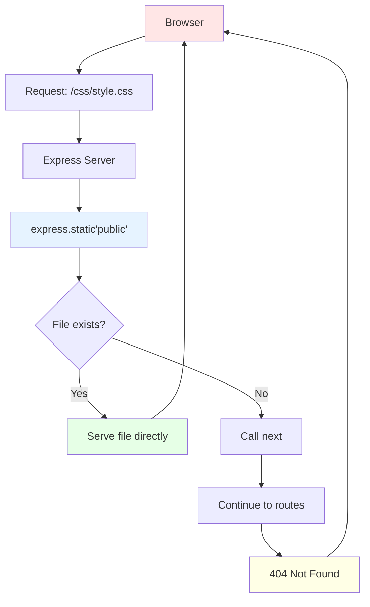

# Static Files Serving

## Mermaid Version



## D2 Version

```d2
direction: down

browser: Browser {
  style.fill: "#FFE6E6"
  request: "GET /css/style.css"
}

express: Express Server {
  style.fill: "#E6F3FF"
}

middleware: express.static("public") {
  shape: hexagon
  style.fill: "#E6FFE6"
  check: "Check public/css/style.css"
}

filesystem: File System {
  shape: cylinder
  style.fill: "#FFFFE6"
  
  public: "public/" {
    css: "css/style.css"
    js: "js/script.js"
    img: "images/logo.png"
  }
}

serve: Serve File {
  style.fill: "#B8FFE6"
  send: "Send file contents"
  type: "Set Content-Type"
}

notfound: 404 Handler {
  style.fill: "#FFB8E6"
  error: "File not found"
}

browser.request -> express
express -> middleware: "1. Check static files"
middleware -> filesystem: "2. Look for file"
filesystem -> middleware: "3. File found/not found"
middleware -> serve: "If exists"
middleware -> notfound: "If not exists"
serve -> browser: "Return file"
notfound -> browser: "Return 404"
```

## What are Static Files?

**Static Files = Files that don't change (aren't generated dynamically)**

Examples:
- ✅ CSS stylesheets
- ✅ JavaScript files
- ✅ Images (PNG, JPG, GIF)
- ✅ Fonts
- ✅ PDF documents
- ✅ Videos

**Not** static:
- ❌ EJS templates (become HTML)
- ❌ Data from JSON files (processed)
- ❌ API responses (generated)

---

## Basic Setup

### Folder Structure
```
my-express-app/
├── app.js
├── public/                    ← Static files folder
│   ├── css/
│   │   └── style.css
│   ├── js/
│   │   └── script.js
│   └── images/
│       └── logo.png
└── views/
    └── index.ejs
```

### Enable Static Files (app.js)
```javascript
const express = require('express');
const app = express();

// Serve files from 'public' folder
app.use(express.static('public'));

// Now these URLs work:
// http://localhost:3000/css/style.css
// http://localhost:3000/js/script.js
// http://localhost:3000/images/logo.png

app.listen(3000);
```

**Key Point:** The `public` folder name is **hidden** from URLs!

```
File: public/css/style.css
URL:  /css/style.css (NOT /public/css/style.css)
```

---

## How It Works

### Request Flow

```
Browser requests: /css/style.css
       ↓
Express server receives request
       ↓
express.static() middleware checks:
  Does "public/css/style.css" exist?
       ↓
  YES → Send file contents
        Set Content-Type: text/css
        Return to browser
       ↓
  NO  → Call next()
        Continue to other routes
        Eventually 404
```

### Visual Flow

```
┌──────────────────────────────┐
│  Browser                     │
│  GET /css/style.css          │
└─────────────┬────────────────┘
              │
              ▼
┌──────────────────────────────┐
│  Express Middleware          │
│  express.static('public')    │
└─────────────┬────────────────┘
              │
              ▼
┌──────────────────────────────┐
│  File System                 │
│  Check: public/css/style.css │
└─────────────┬────────────────┘
              │
         ┌────┴────┐
         │         │
      EXISTS    MISSING
         │         │
         ▼         ▼
    ┌────────┐ ┌────────┐
    │ Serve  │ │ 404    │
    │ File   │ │ Error  │
    └────────┘ └────────┘
```

---

## Using Static Files in Views

### In EJS Templates

```html
<!DOCTYPE html>
<html>
<head>
  <!-- Link to CSS -->
  <link rel="stylesheet" href="/css/style.css">
  
  <!-- Link to Bulma CDN + Custom CSS -->
  <link rel="stylesheet" href="https://cdn.jsdelivr.net/npm/bulma@0.9.4/css/bulma.min.css">
  <link rel="stylesheet" href="/css/custom.css">
</head>
<body>
  <h1>Hello World!</h1>
  
  <!-- Load image -->
  
  
  <!-- Load JavaScript -->
  <script src="/js/script.js"></script>
</body>
</html>
```

### Create CSS File (public/css/style.css)

```css
body {
  font-family: Arial, sans-serif;
  background-color: #f5f5f5;
  padding: 20px;
}

h1 {
  color: #333;
  text-align: center;
}

.card {
  background: white;
  border-radius: 8px;
  padding: 20px;
  margin: 10px 0;
  box-shadow: 0 2px 4px rgba(0,0,0,0.1);
}
```

### Create JavaScript File (public/js/script.js)

```javascript
// Add interactivity
document.addEventListener('DOMContentLoaded', () => {
  console.log('Page loaded!');
  
  // Example: Add click handlers
  const buttons = document.querySelectorAll('.delete-btn');
  buttons.forEach(btn => {
    btn.addEventListener('click', (e) => {
      if (confirm('Are you sure?')) {
        // Handle deletion
      }
    });
  });
});
```

---

## Multiple Static Folders

You can serve from multiple folders:

```javascript
// Serve from 'public' folder
app.use(express.static('public'));

// Also serve from 'uploads' folder
app.use(express.static('uploads'));

// Use virtual path prefix
app.use('/static', express.static('public'));
// Now: /static/css/style.css maps to public/css/style.css
```

---

## Content-Type Headers

Express automatically sets the correct `Content-Type` header:

| File Extension | Content-Type | Browser Action |
|----------------|--------------|----------------|
| `.css` | text/css | Apply styles |
| `.js` | application/javascript | Execute script |
| `.png` | image/png | Display image |
| `.jpg` | image/jpeg | Display image |
| `.pdf` | application/pdf | Show PDF |
| `.html` | text/html | Render HTML |

Example response:
```http
HTTP/1.1 200 OK
Content-Type: text/css
Content-Length: 1024

body { color: blue; }
```

---

## Best Practices

### 1. Organize by Type
```
public/
├── css/
│   ├── style.css
│   └── bulma-custom.css
├── js/
│   ├── main.js
│   └── validation.js
├── images/
│   ├── logo.png
│   └── banner.jpg
└── fonts/
    └── custom-font.woff
```

### 2. Use Cache Control (Production)
```javascript
// Cache static files for 1 year
app.use(express.static('public', {
  maxAge: '1y'
}));
```

### 3. Versioning for Cache Busting
```html
<!-- Change v1 to v2 when you update file -->
<link rel="stylesheet" href="/css/style.css?v=1">
<script src="/js/script.js?v=1"></script>
```

### 4. Compress Files (Production)
```javascript
const compression = require('compression');
app.use(compression());
app.use(express.static('public'));
```

---

## Common Issues

### ❌ 404 File Not Found

**Problem:** Browser shows "Cannot GET /css/style.css"

**Solutions:**
```javascript
// 1. Check folder name
app.use(express.static('public')); // Correct
app.use(express.static('Public')); // Wrong case!

// 2. Check file path
// File: public/css/style.css
<link rel="stylesheet" href="/css/style.css"> // ✅
<link rel="stylesheet" href="/public/css/style.css"> // ❌

// 3. Check middleware order
app.use(express.static('public')); // BEFORE routes!
app.get('/', ...);
```

### ❌ Styles Not Applied

**Problem:** CSS file loads but styles don't work

**Solutions:**
```html
<!-- 1. Check syntax errors in CSS file -->
<!-- 2. Use browser dev tools (F12) → Console -->
<!-- 3. Make sure selector matches -->

<!-- 4. Check CSS specificity -->
<style>
  /* Inline style wins */
  h1 { color: red !important; }
</style>
```

### ❌ MIME Type Error

**Problem:** "MIME type ('text/html') is not a supported stylesheet MIME type"

**Solution:**
```javascript
// Express auto-detects, but if error:
// Make sure file extension is correct (.css not .txt)
// Check express.static() is configured
```

---

## Security Considerations

### 1. Don't Expose Sensitive Files
```
❌ NEVER put in public/:
  - .env files
  - Configuration files
  - Database files
  - API keys
  - Server logs
```

### 2. Use .gitignore for Uploads
```
public/uploads/  # User-uploaded files
node_modules/
.env
```

### 3. Validate File Uploads (Future)
```javascript
// Check file type and size before saving
if (file.mimetype === 'image/jpeg' && file.size < 5000000) {
  // Save file
}
```

---

## Complete Example

### Folder Structure
```
my-express-app/
├── app.js
├── public/
│   ├── css/
│   │   └── style.css
│   ├── js/
│   │   └── script.js
│   └── images/
│       └── logo.png
└── views/
    └── index.ejs
```

### app.js
```javascript
const express = require('express');
const app = express();

// Set view engine
app.set('view engine', 'ejs');

// Serve static files
app.use(express.static('public'));

// Route
app.get('/', (req, res) => {
  res.render('index');
});

app.listen(3000);
```

### views/index.ejs
```html
<!DOCTYPE html>
<html>
<head>
  <link rel="stylesheet" href="/css/style.css">
</head>
<body>
  
  <h1>Welcome!</h1>
  <script src="/js/script.js"></script>
</body>
</html>
```

### public/css/style.css
```css
body {
  background: #f0f0f0;
  text-align: center;
}

h1 {
  color: #333;
}
```

### public/js/script.js
```javascript
console.log('Script loaded!');
```

---

## Static vs Dynamic Comparison

| Aspect | Static Files | Dynamic Content |
|--------|--------------|-----------------|
| **Source** | Disk files | Generated by code |
| **Change** | Only when edited | Changes per request |
| **Example** | style.css | EJS → HTML |
| **Caching** | Can cache long-term | Cache carefully |
| **Processing** | Sent as-is | Processed by Express |
| **Speed** | Very fast | Slower (processing) |

---

## Visual Summary

```
┌─────────────────────────────────┐
│  Browser Request                │
│  GET /css/style.css             │
└────────────┬────────────────────┘
             │
             ▼
┌─────────────────────────────────┐
│  Express Middleware             │
│  app.use(express.static(...))   │
└────────────┬────────────────────┘
             │
             ▼
┌─────────────────────────────────┐
│  File System                    │
│  public/                        │
│  ├── css/style.css    ← Found!  │
│  ├── js/script.js               │
│  └── images/logo.png            │
└────────────┬────────────────────┘
             │
             ▼
┌─────────────────────────────────┐
│  Response                       │
│  Content-Type: text/css         │
│  body { color: blue; }          │
└─────────────────────────────────┘
```

**Key Takeaway:** `express.static()` makes serving files automatic! 🚀
