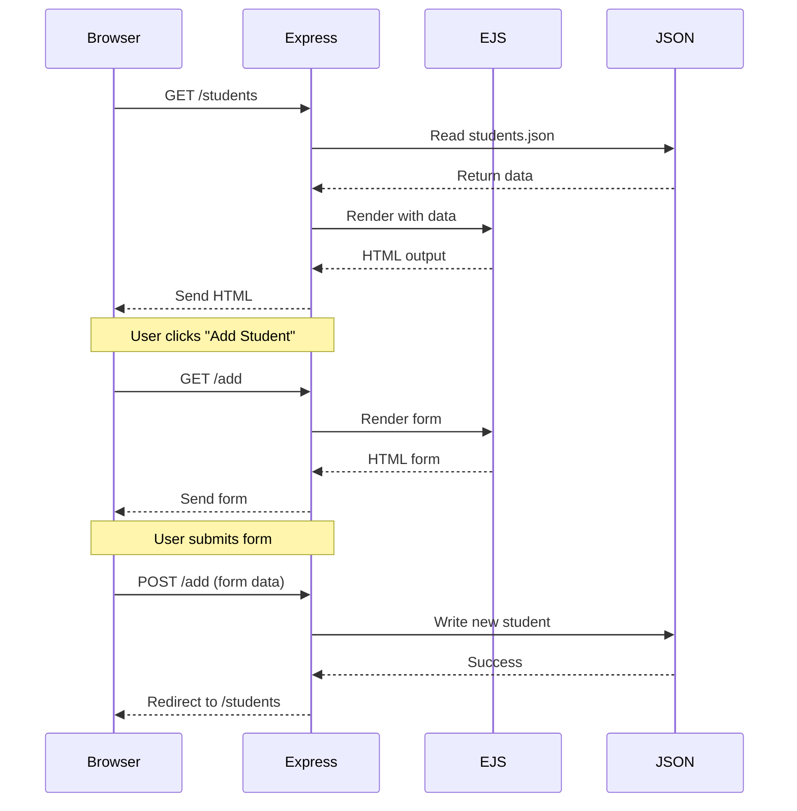

# Request-Response Flow Diagram

## Mermaid Version



## D2 Version

```d2
browser: Browser {
  shape: rectangle
  style.fill: "#E8F4F8"
}

express: Express Server {
  shape: rectangle
  style.fill: "#B8E6B8"
}

ejs: EJS Template {
  shape: rectangle
  style.fill: "#FFE6B8"
}

json: JSON File {
  shape: cylinder
  style.fill: "#FFB8B8"
}

browser -> express: 1. GET /students
express -> json: 2. Read file
json -> express: 3. Return data
express -> ejs: 4. Render template
ejs -> express: 5. HTML
express -> browser: 6. Send response

browser -> express: 7. GET /add (show form)
express -> ejs: 8. Render form
ejs -> express: 9. HTML form
express -> browser: 10. Send form

browser -> express: 11. POST /add (submit)
express -> json: 12. Write data
json -> express: 13. Success
express -> browser: 14. Redirect to list
```

## Plain Text Version (For Screenshots)

```
┌─────────┐                    ┌─────────┐
│ Browser │                    │ Express │
└────┬────┘                    └────┬────┘
     │                              │
     │  1. GET /students            │
     │─────────────────────────────>│
     │                              │
     │                              │  2. Read JSON
     │                              │──────────┐
     │                              │<─────────┘
     │                              │
     │                              │  3. Render EJS
     │                              │──────────┐
     │                              │<─────────┘
     │                              │
     │  4. Send HTML                │
     │<─────────────────────────────│
     │                              │
     │  5. POST /add (form data)    │
     │─────────────────────────────>│
     │                              │
     │                              │  6. Write JSON
     │                              │──────────┐
     │                              │<─────────┘
     │                              │
     │  7. Redirect to /students    │
     │<─────────────────────────────│
     │                              │
```

---

## Description

This diagram shows the complete request-response cycle in an Express application:

1. **GET Request**: Browser requests a page
2. **Read Data**: Express reads from JSON file
3. **Template Rendering**: EJS generates HTML with data
4. **Send Response**: Browser displays the page
5. **Form Submission**: User fills and submits form
6. **Process POST**: Express writes data to JSON
7. **Redirect**: Browser shows updated list

This is the foundation of web applications!
