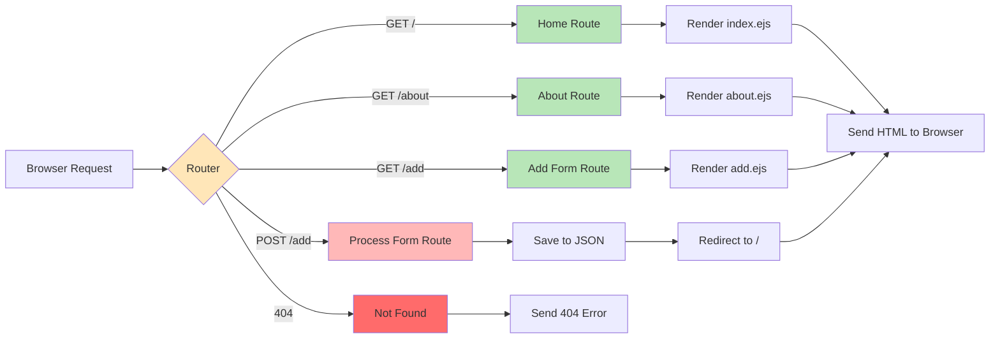

# Express Routing Flow

## Mermaid Version



## D2 Version

```d2
direction: right

browser: Browser
router: Router {
  shape: diamond
  style.fill: "#FFE6B8"
}

route_home: GET / {
  style.fill: "#B8E6B8"
}

route_about: GET /about {
  style.fill: "#B8E6B8"
}

route_add: GET /add {
  style.fill: "#B8E6B8"
}

route_post: POST /add {
  style.fill: "#FFB8B8"
}

route_404: 404 Not Found {
  style.fill: "#FF6B6B"
}

render_index: Render index.ejs
render_about: Render about.ejs
render_add: Render add.ejs
save_json: Save to JSON
redirect: Redirect to /

response: Send to Browser

browser -> router: Request
router -> route_home: Match /
router -> route_about: Match /about
router -> route_add: Match /add
router -> route_post: Match POST /add
router -> route_404: No match

route_home -> render_index
route_about -> render_about
route_add -> render_add
route_post -> save_json -> redirect

render_index -> response
render_about -> response
render_add -> response
redirect -> response
route_404 -> response
```

## Code Example

```javascript
const express = require('express');
const app = express();

// Route 1: Home page
app.get('/', (req, res) => {
  const students = readJSON('students.json');
  res.render('index', { students: students });
});

// Route 2: About page
app.get('/about', (req, res) => {
  res.render('about');
});

// Route 3: Show add form
app.get('/add', (req, res) => {
  res.render('add');
});

// Route 4: Process form submission
app.post('/add', (req, res) => {
  const students = readJSON('students.json');
  students.push(req.body);
  writeJSON('students.json', students);
  res.redirect('/');  // Go back to home
});

// Route 5: 404 Not Found
app.use((req, res) => {
  res.status(404).send('Page not found!');
});
```

## Visual Flow

```
┌─────────────┐
│   Browser   │
└──────┬──────┘
       │
       ▼
┌─────────────────────────────────────────┐
│          Express Router                 │
│                                         │
│  ┌──────────┐  ┌──────────┐            │
│  │  GET /   │  │GET /about│            │
│  └────┬─────┘  └────┬─────┘            │
│       │             │                   │
│       ▼             ▼                   │
│  Render index   Render about           │
│                                         │
│  ┌──────────┐  ┌──────────┐            │
│  │ GET /add │  │POST /add │            │
│  └────┬─────┘  └────┬─────┘            │
│       │             │                   │
│       ▼             ▼                   │
│  Render form   Save → Redirect         │
│                                         │
└─────────────────────────────────────────┘
       │
       ▼
┌─────────────┐
│   Browser   │
│ Shows Result│
└─────────────┘
```

---

## Route Types

### GET Routes (Display pages)
- `GET /` - Show home page
- `GET /about` - Show about page
- `GET /add` - Show form to add data

### POST Routes (Process data)
- `POST /add` - Receive form data and save

### Other Methods
- `PUT /update/:id` - Update existing data (Part 2)
- `DELETE /delete/:id` - Delete data (Part 2)

---

## Key Concepts

**Route Matching:**
- Express checks routes in order (top to bottom)
- First matching route is executed
- Put specific routes before general ones

**Request Methods:**
- `app.get()` - For viewing pages
- `app.post()` - For submitting forms
- `app.use()` - For all methods (middleware, 404)

**Route Parameters:**
```javascript
// Static route
app.get('/students', ...);  // Matches /students only

// Dynamic route
app.get('/students/:id', ...);  // Matches /students/1, /students/2, etc.
```

**Responses:**
- `res.render()` - Send EJS template
- `res.send()` - Send text/HTML
- `res.json()` - Send JSON data
- `res.redirect()` - Redirect to another route
