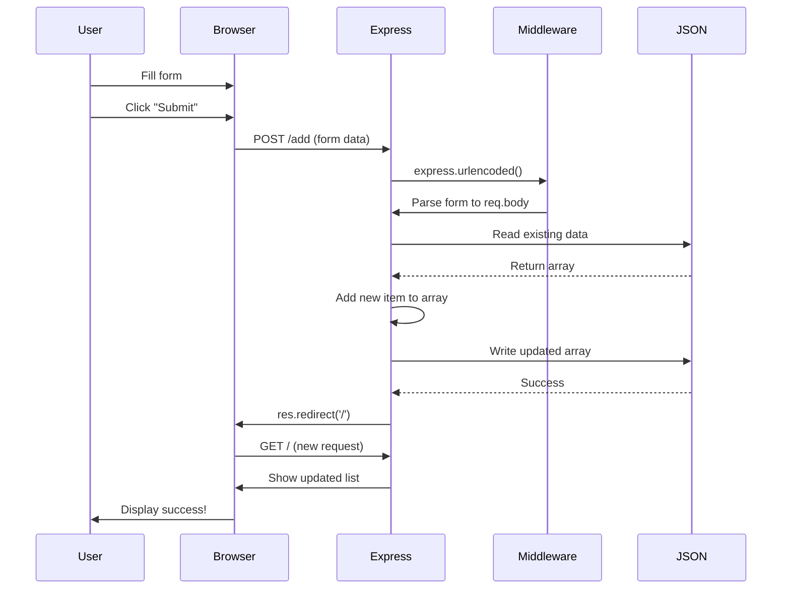

# Form Submission and Data Flow

## Mermaid Version



## D2 Version

```d2
direction: down

user: User {
  shape: person
  style.fill: "#E8F4F8"
}

browser: Browser {
  style.fill: "#B8E6B8"
}

form: HTML Form {
  shape: document
  name: "Name input"
  email: "Email input"
  grade: "Grade input"
  submit: "Submit button"
}

express: Express Server {
  style.fill: "#FFE6B8"
}

middleware: Middleware {
  shape: hexagon
  urlencoded: "express.urlencoded()"
  style.fill: "#E6B8FF"
}

json: JSON File {
  shape: cylinder
  style.fill: "#FFE6E6"
}

result: Updated Page {
  style.fill: "#B8FFE6"
}

user -> form: 1. Fill form
form -> browser: 2. Submit
browser -> express: 3. POST /add
express -> middleware: 4. Parse data
middleware -> express: 5. req.body ready
express -> json: 6. Read file
json -> express: 7. Return data
express -> express: 8. Add new item
express -> json: 9. Write file
json -> express: 10. Success
express -> browser: 11. Redirect
browser -> result: 12. Show updated
result -> user: 13. See changes
```

## Step-by-Step Process

### Step 1: HTML Form (add.ejs)
```html
<form action="/add" method="POST">
  <input type="text" name="name" placeholder="Name" required>
  <input type="email" name="email" placeholder="Email" required>
  <input type="number" name="grade" placeholder="Grade" required>
  <button type="submit">Add Student</button>
</form>
```

### Step 2: User Fills Form
```
┌─────────────────────────────┐
│       Add Student           │
├─────────────────────────────┤
│  Name:  [Maria Santos    ]  │
│  Email: [maria@email.com ]  │
│  Grade: [95              ]  │
│                             │
│  [ Add Student ]            │
└─────────────────────────────┘
       ↓ User clicks Submit
```

### Step 3: Browser Sends POST Request
```http
POST /add HTTP/1.1
Host: localhost:3000
Content-Type: application/x-www-form-urlencoded

name=Maria+Santos&email=maria%40email.com&grade=95
```

### Step 4: Express Middleware Parses Data
```javascript
// Middleware (in app.js - MUST BE BEFORE ROUTES!)
app.use(express.urlencoded({ extended: true }));

// Now req.body contains:
{
  name: 'Maria Santos',
  email: 'maria@email.com',
  grade: '95'  // Note: Still a string!
}
```

### Step 5: Route Handler Processes Data
```javascript
app.post('/add', (req, res) => {
  // 1. Read existing students
  const students = JSON.parse(fs.readFileSync('students.json'));
  
  // 2. Create new student object
  const newStudent = {
    id: students.length + 1,
    name: req.body.name,              // "Maria Santos"
    email: req.body.email,            // "maria@email.com"
    grade: parseFloat(req.body.grade) // 95 (converted to number!)
  };
  
  // 3. Add to array
  students.push(newStudent);
  
  // 4. Write back to file
  fs.writeFileSync('students.json', JSON.stringify(students, null, 2));
  
  // 5. Redirect to home page
  res.redirect('/');
});
```

### Step 6: JSON File Updated
```json
[
  {
    "id": 1,
    "name": "Juan Dela Cruz",
    "email": "juan@email.com",
    "grade": 88
  },
  {
    "id": 2,
    "name": "Maria Santos",
    "email": "maria@email.com",
    "grade": 95
  }
]
```

### Step 7: Redirect to Home Page
```javascript
res.redirect('/');  // Browser makes NEW request to GET /
```

### Step 8: Display Updated List
```
Browser shows updated student list with Maria added!
```

---

## Visual Data Flow

```
╔══════════════════════════════╗
║  1. HTML FORM                ║
╠══════════════════════════════╣
║  name="name"    → input box  ║
║  name="email"   → input box  ║
║  name="grade"   → input box  ║
║  method="POST"  → how to send║
║  action="/add"  → where to go║
╚═══════════════╤══════════════╝
                │
                ▼
╔══════════════════════════════╗
║  2. BROWSER SENDS            ║
╠══════════════════════════════╣
║  POST /add                   ║
║  name=Maria+Santos&          ║
║  email=maria@email.com&      ║
║  grade=95                    ║
╚═══════════════╤══════════════╝
                │
                ▼
╔══════════════════════════════╗
║  3. EXPRESS MIDDLEWARE       ║
╠══════════════════════════════╣
║  express.urlencoded()        ║
║  Parses form data            ║
║                              ║
║  Creates req.body:           ║
║  {                           ║
║    name: "Maria Santos",     ║
║    email: "maria@email.com", ║
║    grade: "95"               ║
║  }                           ║
╚═══════════════╤══════════════╝
                │
                ▼
╔══════════════════════════════╗
║  4. ROUTE HANDLER            ║
╠══════════════════════════════╣
║  app.post('/add', ...)       ║
║                              ║
║  Read JSON → Add → Write     ║
╚═══════════════╤══════════════╝
                │
                ▼
╔══════════════════════════════╗
║  5. REDIRECT                 ║
╠══════════════════════════════╣
║  res.redirect('/')           ║
║  Browser goes to home page   ║
║  Shows updated list          ║
╚══════════════════════════════╝
```

---

## Important Form Concepts

### Form Attributes

| Attribute | Purpose | Example |
|-----------|---------|---------|
| `action` | Where to send data | `/add`, `/update/5` |
| `method` | How to send (GET/POST) | `POST` for forms |
| `name` | Key for req.body | `name="email"` → `req.body.email` |
| `type` | Input validation | `email`, `number`, `date` |
| `required` | Must be filled | Prevents empty submission |

### Input Types

```html
<!-- Text inputs -->
<input type="text" name="name">
<input type="email" name="email">
<input type="tel" name="phone">

<!-- Numbers -->
<input type="number" name="age" min="0" max="100">
<input type="range" name="rating" min="1" max="5">

<!-- Dates -->
<input type="date" name="birthday">
<input type="time" name="appointment">

<!-- Selections -->
<select name="course">
  <option value="BSIT">BSIT</option>
  <option value="BSCS">BSCS</option>
</select>

<!-- Checkboxes & Radio -->
<input type="checkbox" name="agree" value="yes">
<input type="radio" name="gender" value="male">
```

### Data Type Conversion

⚠️ **IMPORTANT:** All form data arrives as **strings**!

```javascript
// ❌ WRONG
grade: req.body.grade  // "95" (string!)

// ✅ CORRECT
grade: parseFloat(req.body.grade)  // 95 (number)
year: parseInt(req.body.year)      // 3 (integer)
```

---

## Common Mistakes

### 1. Forgetting Middleware
```javascript
// ❌ req.body will be undefined!
app.post('/add', (req, res) => {
  console.log(req.body);  // undefined
});

// ✅ Add middleware FIRST
app.use(express.urlencoded({ extended: true }));
```

### 2. Wrong Method
```html
<!-- ❌ GET shows data in URL -->
<form method="GET">

<!-- ✅ POST hides data in body -->
<form method="POST">
```

### 3. Not Converting Types
```javascript
// ❌ Grade saved as string
{ grade: "95" }  // Math operations won't work!

// ✅ Convert to number
{ grade: parseFloat(req.body.grade) }
```

### 4. Not Redirecting
```javascript
// ❌ User sees old data
res.render('index', { students: students });

// ✅ Redirect forces fresh page load
res.redirect('/');
```

---

## Security Considerations (Future)

In Part 2, we'll add:
- **Validation**: Check data before saving
- **Sanitization**: Remove dangerous characters
- **Authentication**: Only logged-in users can add
- **CSRF Protection**: Prevent fake form submissions
- **Rate Limiting**: Prevent spam

For now, focus on understanding the flow! 🎓
