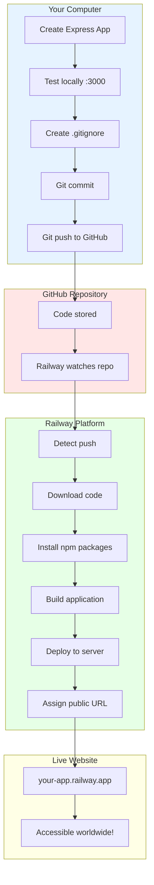

# Railway Deployment Flow

## Mermaid Version



## D2 Version

```d2
direction: right

local: Your Computer {
  shape: rectangle
  style.fill: "#E6F3FF"
  
  code: Write Express app
  test: Test on localhost:3000
  gitignore: Create .gitignore
  commit: git add & commit
  push: git push origin main
  
  code -> test -> gitignore -> commit -> push
}

github: GitHub {
  shape: cloud
  style.fill: "#FFE6E6"
  
  repo: Your repository
  webhook: Railway webhook
  
  repo -> webhook: "Notifies on push"
}

railway: Railway Platform {
  shape: rectangle
  style.fill: "#E6FFE6"
  
  detect: Detect new push
  download: Clone repository
  install: npm install
  build: Build app
  start: npm start
  deploy: Deploy to server
  url: Generate public URL
  
  detect -> download -> install -> build -> start -> deploy -> url
}

production: Live Website {
  shape: cloud
  style.fill: "#FFFFE6"
  
  domain: your-app.railway.app
  users: Accessible worldwide
  
  domain -> users
}

local.push -> github.repo: "Push code"
github.webhook -> railway.detect: "Trigger deployment"
railway.url -> production.domain: "Assign URL"
```

## Step-by-Step Deployment

### Step 1: Prepare Your App

```javascript
// app.js - CRITICAL: Use process.env.PORT!
const PORT = process.env.PORT || 3000;

app.listen(PORT, () => {
  console.log(`Server running on port ${PORT}`);
});
```

**Why?** Railway assigns a random port (not 3000!)

---

### Step 2: Create .gitignore

```
node_modules/
.env
.DS_Store
*.log
```

**Why?** Don't upload 100MB of npm packages to GitHub!

---

### Step 3: Create package.json Scripts

```json
{
  "name": "my-express-app",
  "version": "1.0.0",
  "scripts": {
    "start": "node app.js"
  },
  "dependencies": {
    "express": "^4.18.2",
    "ejs": "^3.1.9"
  },
  "engines": {
    "node": ">=18.0.0"
  }
}
```

**Why?** Railway runs `npm start` to launch your app.

---

### Step 4: Push to GitHub

```bash
git init
git add .
git commit -m "Initial commit"
git branch -M main
git remote add origin https://github.com/yourusername/yourrepo.git
git push -u origin main
```

---

### Step 5: Connect Railway to GitHub

```
1. Go to railway.app
2. Sign in with GitHub
3. Click "New Project"
4. Choose "Deploy from GitHub repo"
5. Select your repository
6. Railway automatically detects Node.js!
```

---

### Step 6: Railway Automatically:

```
✓ Clones your repository
✓ Reads package.json
✓ Runs npm install
✓ Runs npm start
✓ Assigns a public URL
✓ Monitors for crashes
✓ Auto-deploys on new pushes
```

---

### Step 7: Get Your Live URL

```
Railway generates a URL like:
https://your-app-production-abcd.railway.app

Your app is now live! 🎉
```

---

## Visual Deployment Flow

```
╔════════════════════════════════╗
║  LOCAL DEVELOPMENT             ║
╠════════════════════════════════╣
║  my-express-app/               ║
║  ├── app.js                    ║
║  ├── package.json              ║
║  ├── views/                    ║
║  │   └── index.ejs             ║
║  └── public/                   ║
║      └── css/style.css         ║
║                                ║
║  Test: http://localhost:3000   ║
╚════════════╤═══════════════════╝
             │
             │ git push
             ▼
╔════════════════════════════════╗
║  GITHUB REPOSITORY             ║
╠════════════════════════════════╣
║  github.com/user/my-app        ║
║                                ║
║  ✓ Code stored safely          ║
║  ✓ Version controlled          ║
║  ✓ Railway watches this repo   ║
╚════════════╤═══════════════════╝
             │
             │ Railway webhook
             ▼
╔════════════════════════════════╗
║  RAILWAY PLATFORM              ║
╠════════════════════════════════╣
║  1. git clone repo             ║
║  2. npm install                ║
║  3. npm start                  ║
║  4. Assign PORT=12345          ║
║  5. Deploy to server           ║
║  6. Generate public URL        ║
╚════════════╤═══════════════════╝
             │
             ▼
╔════════════════════════════════╗
║  PRODUCTION (LIVE!)            ║
╠════════════════════════════════╣
║  your-app.railway.app          ║
║                                ║
║  Accessible from anywhere:     ║
║  🌏 Philippines                ║
║  🌎 USA                        ║
║  🌍 Europe                     ║
╚════════════════════════════════╝
```

---

## Key Differences: Local vs Production

| Aspect | Local (Your PC) | Production (Railway) |
|--------|----------------|---------------------|
| **URL** | localhost:3000 | your-app.railway.app |
| **Port** | You choose (3000) | Railway assigns (random) |
| **Access** | Only you | Anyone worldwide |
| **Uptime** | When PC is on | Always (24/7) |
| **Updates** | Save & reload | Git push to deploy |
| **Database** | JSON files (simple) | Use DB (recommended) |
| **Environment** | Your computer | Railway's servers |

---

## Environment Variables

### Local (.env file)
```
PORT=3000
DATABASE_URL=students.json
API_KEY=test123
```

### Railway (Settings → Variables)
```
PORT=(Railway auto-sets this)
DATABASE_URL=(set manually in Railway)
API_KEY=(set manually in Railway)
```

**Access in code:**
```javascript
const port = process.env.PORT || 3000;
const dbUrl = process.env.DATABASE_URL || 'students.json';
```

---

## Deployment Checklist

### Before Deploying:

- [ ] Use `process.env.PORT` (not hardcoded 3000)
- [ ] Create `.gitignore` with `node_modules/`
- [ ] Add `"start"` script in package.json
- [ ] Test locally first
- [ ] Commit all changes
- [ ] Push to GitHub

### After Deploying:

- [ ] Check Railway logs for errors
- [ ] Visit your public URL
- [ ] Test all routes
- [ ] Monitor for crashes
- [ ] Share with friends! 🎉

---

## Troubleshooting

### "Application failed to respond"
```
❌ Problem: Used port 3000 instead of process.env.PORT

✅ Fix:
const PORT = process.env.PORT || 3000;
app.listen(PORT, () => console.log(`Port ${PORT}`));
```

### "Module not found"
```
❌ Problem: Forgot to list dependency in package.json

✅ Fix:
npm install <package> --save
git add package.json
git commit -m "Add missing dependency"
git push
```

### "Build failed"
```
❌ Problem: Syntax error or missing files

✅ Fix:
1. Check Railway logs for error message
2. Fix error locally
3. Test with npm start
4. Push fixed code
```

---

## Monitoring Your App

### Railway Dashboard Shows:

- **Deployments**: Each git push creates a new deployment
- **Logs**: See console.log() output and errors
- **Metrics**: CPU, memory, request count
- **Settings**: Environment variables, custom domain
- **Restart**: Manually restart if needed

### Check Logs:
```
Go to Railway → Your Project → Deployments → View Logs

You'll see:
✓ npm install output
✓ npm start output
✓ Your console.log() messages
✓ Error messages if any
```

---

## Continuous Deployment Flow

```
You edit code locally
       ↓
git add . && git commit -m "Update"
       ↓
git push origin main
       ↓
GitHub receives push
       ↓
Railway detects change (webhook)
       ↓
Railway automatically:
  1. Clones latest code
  2. npm install
  3. npm start
  4. Deploys to live URL
       ↓
Your app is updated! (takes ~2 minutes)
```

**This is called "Continuous Deployment"** - every push goes live automatically!

---

## Cost (Free Tier)

Railway Free Tier includes:
- ✅ 500 hours/month runtime
- ✅ 100 GB bandwidth
- ✅ Unlimited projects
- ✅ Custom domains
- ✅ Auto-deployments

**Perfect for learning and small projects!**

---

## Next Steps After Deployment

1. **Custom Domain**: Link your own domain name
2. **Database**: Upgrade from JSON to PostgreSQL
3. **SSL**: Railway provides free HTTPS
4. **Monitoring**: Set up alerts for downtime
5. **Scaling**: Increase resources if needed

---

## Summary

```
Local Development:
  Write code → Test locally → Git commit

GitHub:
  Store code → Version control → Backup

Railway:
  Auto-deploy → Host 24/7 → Public URL

Result:
  Your app is accessible worldwide! 🌏
```

**Remember:** Always use `process.env.PORT` for deployment! 🚀
