# Express Middleware Concept

## Mermaid Version

```mermaid
graph LR
    Request[Incoming Request] --> M1[Middleware 1: Logger]
    M1 --> M2[Middleware 2: urlencoded]
    M2 --> M3[Middleware 3: static files]
    M3 --> Route[Route Handler]
    Route --> Response[Send Response]
    
    M1 -.->|next| M2
    M2 -.->|next| M3
    M3 -.->|next| Route
    
    style Request fill:#FFE6E6
    style M1 fill:#E6F3FF
    style M2 fill:#E6FFE6
    style M3 fill:#FFFFE6
    style Route fill:#E6E6FF
    style Response fill:#FFE6B8
```



## D2 Version

```d2
direction: right

request: Request {
  shape: cloud
  style.fill: "#FFE6E6"
  
  method: "POST /add"
  body: "Form data"
}

mw1: Logger Middleware {
  shape: hexagon
  style.fill: "#E6F3FF"
  
  action: "console.log(req.method)"
  next: "next()"
}

mw2: Body Parser {
  shape: hexagon
  style.fill: "#E6FFE6"
  
  action: "Parse form data"
  result: "req.body = {...}"
  next: "next()"
}

mw3: Static Files {
  shape: hexagon
  style.fill: "#FFFFE6"
  
  action: "Check if file request"
  serve: "Serve CSS/JS/images"
  or: "next() if not file"
}

route: Route Handler {
  shape: rectangle
  style.fill: "#E6E6FF"
  
  handler: "app.post('/add', ...)"
  process: "Handle request"
}

response: Response {
  shape: cloud
  style.fill: "#FFE6B8"
  
  result: "res.redirect('/')"
}

request -> mw1: "1. Incoming"
mw1 -> mw2: "2. next()"
mw2 -> mw3: "3. next()"
mw3 -> route: "4. next()"
route -> response: "5. Send"
```

## What is Middleware?

**Middleware = Functions that run BEFORE your route handler**

Think of it like a security checkpoint at the airport:

```
Passenger arrives (Request)
       ↓
1. ID Check (Logger middleware)
       ↓
2. Baggage Scan (Body parser middleware)
       ↓
3. Metal Detector (Authentication middleware)
       ↓
Gate (Your route handler)
       ↓
Board plane (Response sent)
```

Every middleware can:
- **Inspect** the request
- **Modify** req or res objects
- **Stop** the request (send error)
- **Pass** to next middleware with `next()`

---

## Basic Middleware Example

```javascript
// Simple logging middleware
app.use((req, res, next) => {
  console.log(`${req.method} ${req.url}`);
  next();  // Pass to next middleware!
});

// Route (runs AFTER middleware)
app.get('/', (req, res) => {
  res.send('Home page');
});

// Output when you visit /
// GET /
// (then page loads)
```

---

## Middleware Order Matters!

### ❌ WRONG Order
```javascript
// Routes FIRST (won't work!)
app.get('/', (req, res) => {
  res.render('index');
});

// Middleware AFTER (too late!)
app.use(express.static('public'));
app.use(express.urlencoded({ extended: true }));
```

### ✅ CORRECT Order
```javascript
// Middleware FIRST
app.use(express.static('public'));
app.use(express.urlencoded({ extended: true }));

// Routes AFTER
app.get('/', (req, res) => {
  res.render('index');
});
```

---

## Common Middleware Types

### 1. Logger Middleware
```javascript
app.use((req, res, next) => {
  console.log(`${new Date().toISOString()} - ${req.method} ${req.url}`);
  next();
});

// Output:
// 2025-01-10T10:30:00.000Z - GET /
// 2025-01-10T10:30:05.000Z - POST /add
```

### 2. Body Parser (Built-in)
```javascript
// Parses form data into req.body
app.use(express.urlencoded({ extended: true }));

// Now you can use:
app.post('/add', (req, res) => {
  console.log(req.body.name);  // Form field values
});
```

### 3. Static Files (Built-in)
```javascript
// Serves files from 'public' folder
app.use(express.static('public'));

// Now these work:
// http://localhost:3000/css/style.css
// http://localhost:3000/js/script.js
// http://localhost:3000/images/logo.png
```

### 4. JSON Parser (Built-in)
```javascript
// Parses JSON request bodies
app.use(express.json());

// Now you can use:
app.post('/api/data', (req, res) => {
  console.log(req.body);  // JSON object
});
```

---

## Middleware Flow Visualization

```
Request arrives
       ↓
┌─────────────────────────┐
│  app.use(logger)        │  ← Logs request
│  console.log(req.url)   │
│  next()                 │
└───────────┬─────────────┘
            │
            ↓
┌─────────────────────────┐
│  app.use(express.       │  ← Parses form data
│    urlencoded())        │    into req.body
│  next()                 │
└───────────┬─────────────┘
            │
            ↓
┌─────────────────────────┐
│  app.use(express.       │  ← Serves CSS/JS
│    static('public'))    │    or calls next()
│  next()                 │
└───────────┬─────────────┘
            │
            ↓
┌─────────────────────────┐
│  app.get('/', ...)      │  ← Your route handler
│  res.render('index')    │    finally runs!
└───────────┬─────────────┘
            │
            ↓
       Response sent
```

---

## Request/Response Object Modifications

Middleware can **modify** req and res:

```javascript
// Add timestamp to every request
app.use((req, res, next) => {
  req.timestamp = new Date();
  next();
});

// Add custom response method
app.use((req, res, next) => {
  res.success = (data) => {
    res.json({ success: true, data: data });
  };
  next();
});

// Now in routes:
app.get('/api/users', (req, res) => {
  console.log('Request time:', req.timestamp);  // Custom property!
  res.success([{ name: 'Juan' }]);              // Custom method!
});
```

---

## Authentication Middleware Example

```javascript
// Check if user is logged in
function requireAuth(req, res, next) {
  if (req.session && req.session.userId) {
    next();  // Logged in, proceed
  } else {
    res.redirect('/login');  // Not logged in, redirect
  }
}

// Public route (no middleware)
app.get('/', (req, res) => {
  res.render('home');
});

// Protected route (requires auth)
app.get('/dashboard', requireAuth, (req, res) => {
  res.render('dashboard');
});
```

---

## Error Handling Middleware

Special middleware with **4 parameters**:

```javascript
// Regular middleware (3 params)
app.use((req, res, next) => {
  next();
});

// Error middleware (4 params)
app.use((err, req, res, next) => {
  console.error(err.stack);
  res.status(500).render('error', { error: err.message });
});

// Trigger error in route:
app.get('/test', (req, res, next) => {
  const err = new Error('Something went wrong!');
  next(err);  // Passes to error middleware
});
```

---

## Route-Specific Middleware

Apply middleware to **specific routes only**:

```javascript
// Logger for ONE route
app.get('/admin', 
  (req, res, next) => {
    console.log('Admin page accessed');
    next();
  },
  (req, res) => {
    res.render('admin');
  }
);

// Multiple middleware for ONE route
app.post('/add',
  checkAuth,      // Middleware 1
  validateForm,   // Middleware 2
  saveData,       // Middleware 3
  (req, res) => {
    res.redirect('/');
  }
);
```

---

## Third-Party Middleware

Popular npm packages:

```javascript
// Morgan - Better logging
const morgan = require('morgan');
app.use(morgan('dev'));  // GET / 200 15ms

// Cookie Parser
const cookieParser = require('cookie-parser');
app.use(cookieParser());
// Now use: req.cookies

// Express Session
const session = require('express-session');
app.use(session({
  secret: 'your-secret-key',
  resave: false,
  saveUninitialized: true
}));
// Now use: req.session

// Helmet - Security headers
const helmet = require('helmet');
app.use(helmet());

// Compression - Gzip responses
const compression = require('compression');
app.use(compression());
```

---

## Middleware Categories

```
┌─────────────────────────────────┐
│  Application-Level Middleware   │
│  app.use(...)                   │
│  Runs for ALL routes            │
└─────────────────────────────────┘

┌─────────────────────────────────┐
│  Router-Level Middleware        │
│  router.use(...)                │
│  Runs for specific router       │
└─────────────────────────────────┘

┌─────────────────────────────────┐
│  Built-in Middleware            │
│  express.static()               │
│  express.json()                 │
│  express.urlencoded()           │
└─────────────────────────────────┘

┌─────────────────────────────────┐
│  Error-Handling Middleware      │
│  (err, req, res, next) => {}    │
│  Catches errors                 │
└─────────────────────────────────┘

┌─────────────────────────────────┐
│  Third-Party Middleware         │
│  morgan, helmet, compression    │
│  From npm packages              │
└─────────────────────────────────┘
```

---

## Complete Example

```javascript
const express = require('express');
const app = express();

// 1. Logger (runs first)
app.use((req, res, next) => {
  console.log(`${req.method} ${req.url}`);
  next();
});

// 2. Static files
app.use(express.static('public'));

// 3. Body parsers
app.use(express.urlencoded({ extended: true }));
app.use(express.json());

// 4. Custom middleware
app.use((req, res, next) => {
  req.visitTime = new Date();
  next();
});

// 5. Routes
app.get('/', (req, res) => {
  res.send(`Visited at: ${req.visitTime}`);
});

app.post('/add', (req, res) => {
  console.log(req.body);  // Thanks to urlencoded!
  res.redirect('/');
});

// 6. 404 Handler (last middleware)
app.use((req, res) => {
  res.status(404).send('Page not found');
});

// 7. Error Handler (very last)
app.use((err, req, res, next) => {
  console.error(err);
  res.status(500).send('Server error');
});

app.listen(3000);
```

---

## Key Takeaways

1. **Middleware = Functions that run before routes**
2. **Order matters!** Middleware → Routes → Error handler
3. **Call `next()`** to pass to next middleware
4. **Modify req/res** objects as needed
5. **Use built-in middleware** for common tasks
6. **Error middleware** has 4 parameters

```
Request → Middleware Chain → Route → Response
```

Middleware makes Express powerful and flexible! 🚀
