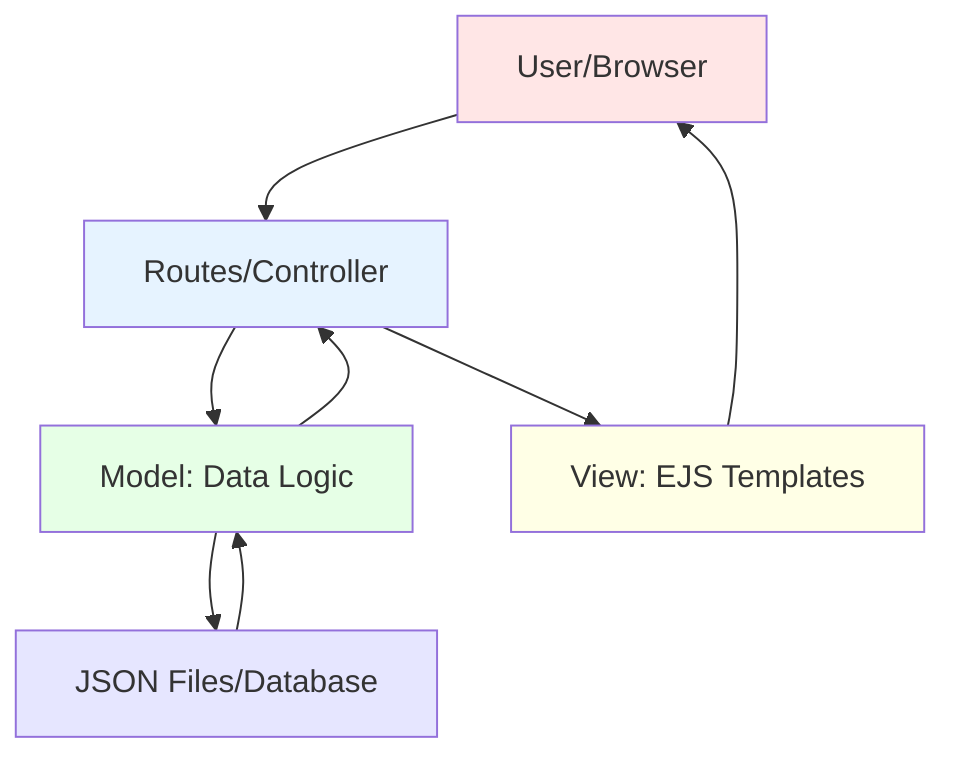

# MVC Pattern in Express

## Mermaid Version



## D2 Version

```d2
direction: down

user: User Browser {
  shape: person
  style.fill: "#FFE6E6"
}

controller: Controller (Routes) {
  style.fill: "#E6F3FF"
  desc: "Handles requests"
  desc2: "Coordinates Model & View"
}

model: Model (Data) {
  style.fill: "#E6FFE6"
  desc: "Business logic"
  desc2: "Database operations"
  desc3: "Data validation"
}

view: View (Templates) {
  style.fill: "#FFFFE6"
  desc: "EJS templates"
  desc2: "HTML generation"
  desc3: "User interface"
}

database: Data Storage {
  shape: cylinder
  style.fill: "#E6E6FF"
  json: "JSON files"
  db: "or Database"
}

user -> controller: "1. Request"
controller -> model: "2. Get data"
model -> database: "3. Read/Write"
database -> model: "4. Return data"
model -> controller: "5. Processed data"
controller -> view: "6. Render with data"
view -> user: "7. HTML response"
```

## What is MVC?

**MVC = Model-View-Controller**

A design pattern that **separates concerns**:

```
Model      → Data & Business Logic
View       → User Interface (HTML)
Controller → Handles Requests (Routes)
```

**Philippine Restaurant Analogy:**

```
Customer (User)
    ↓
Waiter (Controller) - Takes order, coordinates
    ↓
Kitchen (Model) - Prepares food, handles data
    ↓
Storage (Database) - Ingredients, recipes
    ↓
Plating (View) - Makes food look good
    ↓
Customer receives beautifully plated food!
```

---

## Without MVC (Messy!)

```javascript
// ❌ Everything in app.js - HARD TO MAINTAIN!
app.get('/students', (req, res) => {
  // Read data (Model concern)
  const data = fs.readFileSync('students.json');
  const students = JSON.parse(data);
  
  // Calculate average (Model concern)
  const total = students.reduce((sum, s) => sum + s.grade, 0);
  const average = total / students.length;
  
  // Filter passing students (Model concern)
  const passing = students.filter(s => s.grade >= 75);
  
  // Render view (View concern)
  res.render('students', { students, average, passing });
});

app.post('/students/add', (req, res) => {
  // Validation (Model concern)
  if (!req.body.name || req.body.grade < 0) {
    return res.send('Invalid data');
  }
  
  // Read data (Model concern)
  const data = fs.readFileSync('students.json');
  const students = JSON.parse(data);
  
  // Add student (Model concern)
  students.push({
    id: students.length + 1,
    name: req.body.name,
    grade: parseFloat(req.body.grade)
  });
  
  // Save data (Model concern)
  fs.writeFileSync('students.json', JSON.stringify(students, null, 2));
  
  res.redirect('/students');
});
```

**Problems:**
- 😵 All logic mixed together
- 🔄 Code repeated
- 🐛 Hard to debug
- 📝 Hard to test
- 🚫 Can't reuse code

---

## With MVC (Clean!)

### 1. Model (models/Student.js)

```javascript
// All data logic in ONE place
const fs = require('fs');
const DATA_FILE = './data/students.json';

class Student {
  // Get all students
  static getAll() {
    const data = fs.readFileSync(DATA_FILE);
    return JSON.parse(data);
  }
  
  // Get one student
  static getById(id) {
    const students = this.getAll();
    return students.find(s => s.id === parseInt(id));
  }
  
  // Add student
  static add(studentData) {
    const students = this.getAll();
    const newStudent = {
      id: students.length + 1,
      name: studentData.name,
      grade: parseFloat(studentData.grade)
    };
    students.push(newStudent);
    this.save(students);
    return newStudent;
  }
  
  // Calculate statistics
  static getStats() {
    const students = this.getAll();
    const total = students.reduce((sum, s) => sum + s.grade, 0);
    const average = total / students.length;
    const passing = students.filter(s => s.grade >= 75).length;
    return { average, passing };
  }
  
  // Private helper
  static save(students) {
    fs.writeFileSync(DATA_FILE, JSON.stringify(students, null, 2));
  }
}

module.exports = Student;
```

### 2. Controller (routes/studentRoutes.js)

```javascript
// Handles requests, coordinates Model & View
const express = require('express');
const router = express.Router();
const Student = require('../models/Student');

// List all students
router.get('/', (req, res) => {
  const students = Student.getAll();
  const stats = Student.getStats();
  res.render('students/index', { students, stats });
});

// Show add form
router.get('/add', (req, res) => {
  res.render('students/add');
});

// Add student
router.post('/add', (req, res) => {
  Student.add(req.body);
  res.redirect('/students');
});

module.exports = router;
```

### 3. View (views/students/index.ejs)

```html
<!-- Just presentation, no logic! -->
<!DOCTYPE html>
<html>
<head>
  <title>Students</title>
</head>
<body>
  <h1>Students</h1>
  
  <div class="stats">
    <p>Average: <%= stats.average.toFixed(2) %></p>
    <p>Passing: <%= stats.passing %></p>
  </div>
  
  <table>
    <thead>
      <tr>
        <th>Name</th>
        <th>Grade</th>
      </tr>
    </thead>
    <tbody>
      <% students.forEach(student => { %>
        <tr>
          <td><%= student.name %></td>
          <td><%= student.grade %></td>
        </tr>
      <% }) %>
    </tbody>
  </table>
  
  <a href="/students/add">Add Student</a>
</body>
</html>
```

### 4. Main App (app.js)

```javascript
// Clean and simple!
const express = require('express');
const app = express();

// Middleware
app.set('view engine', 'ejs');
app.use(express.urlencoded({ extended: true }));
app.use(express.static('public'));

// Routes (Controllers)
const studentRoutes = require('./routes/studentRoutes');
app.use('/students', studentRoutes);

app.listen(3000);
```

---

## MVC Folder Structure

```
my-express-app/
├── app.js                    ← Main file (minimal)
├── models/                   ← DATA LOGIC
│   ├── Student.js            ← Student model
│   ├── Product.js            ← Product model
│   └── Official.js           ← Official model
├── routes/                   ← CONTROLLERS
│   ├── studentRoutes.js      ← Student controller
│   ├── productRoutes.js      ← Product controller
│   └── officialRoutes.js     ← Official controller
├── views/                    ← PRESENTATION
│   ├── students/
│   │   ├── index.ejs         ← List view
│   │   └── add.ejs           ← Form view
│   ├── products/
│   │   └── index.ejs
│   └── partials/
│       ├── header.ejs
│       └── footer.ejs
├── data/                     ← DATA STORAGE
│   ├── students.json
│   └── products.json
└── public/                   ← STATIC FILES
    ├── css/
    └── js/
```

---

## Responsibilities

### Model (Business Logic)
```javascript
✅ Read/write data
✅ Validate data
✅ Calculate statistics
✅ Business rules
✅ Data transformations

❌ No HTML
❌ No req/res
❌ No routing
```

### View (Presentation)
```javascript
✅ Display data
✅ HTML structure
✅ CSS styling
✅ User interface
✅ Forms

❌ No data reading
❌ No database calls
❌ No business logic
```

### Controller (Coordination)
```javascript
✅ Handle requests
✅ Call model methods
✅ Pass data to views
✅ Send responses
✅ Handle redirects

❌ No direct database access
❌ No HTML generation
❌ Minimal logic (just coordination)
```

---

## Data Flow Example

### GET Request (Display)

```
User requests /students
       ↓
Controller: studentRoutes.js
  router.get('/', (req, res) => {
       ↓
Model: Student.getAll()
  reads students.json
  returns array
       ↓
Controller: receives data
  res.render('students/index', { students })
       ↓
View: students/index.ejs
  generates HTML with data
       ↓
Browser: displays page
```

### POST Request (Add Data)

```
User submits form
       ↓
Controller: studentRoutes.js
  router.post('/add', (req, res) => {
       ↓
Model: Student.add(req.body)
  validates data
  reads students.json
  adds new student
  saves students.json
  returns new student
       ↓
Controller: receives confirmation
  res.redirect('/students')
       ↓
Browser: redirects to list page
```

---

## Benefits of MVC

### 1. **Separation of Concerns**
```
Model deals with data
View deals with presentation
Controller deals with requests
```

### 2. **Reusability**
```javascript
// Use same model in multiple controllers
const students = Student.getAll();      // Web controller
const students = Student.getAll();      // API controller
const students = Student.getAll();      // CLI script
```

### 3. **Testability**
```javascript
// Test model independently
const Student = require('./models/Student');
const students = Student.getAll();
assert(students.length > 0);

// Test controller independently
// Test view independently
```

### 4. **Maintainability**
```
Need to change database? → Update Model only
Need to redesign UI? → Update Views only
Need to add route? → Update Controller only
```

### 5. **Team Collaboration**
```
Designer → Works on Views
Backend Dev → Works on Models
Frontend Dev → Works on Controllers
```

---

## MVC vs Non-MVC Comparison

| Aspect | Without MVC | With MVC |
|--------|-------------|----------|
| **File Size** | 500+ lines in app.js | 50 lines per file |
| **Code Reuse** | Copy-paste everywhere | Import model once |
| **Testing** | Hard to test routes | Test models separately |
| **Bug Finding** | Search entire app.js | Check specific file |
| **Team Work** | Conflicts on same file | Work on different files |
| **Maintenance** | Change affects everything | Change isolated |

---

## Real-World Example

### Model: Product.js
```javascript
class Product {
  static getAll() {
    // Read from database
  }
  
  static getLowStock() {
    return this.getAll().filter(p => p.stock < 10);
  }
  
  static getTotalValue() {
    const products = this.getAll();
    return products.reduce((sum, p) => sum + (p.price * p.stock), 0);
  }
}
```

### Controller: productRoutes.js
```javascript
router.get('/', (req, res) => {
  const products = Product.getAll();
  const lowStock = Product.getLowStock();
  const totalValue = Product.getTotalValue();
  res.render('products/index', { products, lowStock, totalValue });
});
```

### View: products/index.ejs
```html
<h1>Products</h1>
<p>Total Value: ₱<%= totalValue.toFixed(2) %></p>

<% if (lowStock.length > 0) { %>
  <div class="alert">⚠️ <%= lowStock.length %> items low on stock!</div>
<% } %>

<% products.forEach(product => { %>
  <div class="product">
    <%= product.name %> - ₱<%= product.price %>
  </div>
<% }) %>
```

---

## Common Mistakes

### ❌ Putting Logic in Views
```html
<!-- DON'T DO THIS -->
<% const total = students.reduce((sum, s) => sum + s.grade, 0); %>
<% const average = total / students.length; %>
<p>Average: <%= average %></p>
```

### ✅ Logic in Model
```javascript
// DO THIS
class Student {
  static getAverage() {
    const students = this.getAll();
    const total = students.reduce((sum, s) => sum + s.grade, 0);
    return total / students.length;
  }
}
```

### ❌ Database Calls in Controllers
```javascript
// DON'T DO THIS
router.get('/', (req, res) => {
  const data = fs.readFileSync('students.json');
  const students = JSON.parse(data);
  res.render('students', { students });
});
```

### ✅ Models Handle Data
```javascript
// DO THIS
router.get('/', (req, res) => {
  const students = Student.getAll();
  res.render('students', { students });
});
```

---

## Summary

```
┌─────────────────────────────┐
│  MVC Pattern                │
├─────────────────────────────┤
│  Model      → Data & Logic  │
│  View       → HTML & UI     │
│  Controller → Coordination  │
└─────────────────────────────┘

Benefits:
✅ Organized code
✅ Easy to maintain
✅ Reusable components
✅ Testable code
✅ Team-friendly
```

**Think of MVC as a well-organized restaurant:**
- **Model** = Kitchen (prepares food/data)
- **View** = Presentation (plating/HTML)
- **Controller** = Waiter (takes orders/requests)

**Start simple, then refactor to MVC as your app grows!** 🚀
