# DataTables Flow Diagram (Mermaid)

## Purpose
Show the difference between client-side and server-side DataTables processing, helping students understand when to use each approach.

## Rendering
Use Mermaid Live Editor (mermaid.live) or VS Code Mermaid extension.

## Diagram

```mermaid
flowchart TB
    Start([User Opens Page with Table]) --> LoadPage[Browser loads HTML + Data]
    LoadPage --> DataSize{How many rows?}
    
    DataSize -->|"< 1000 rows"| Client[CLIENT-SIDE DataTables]
    DataSize -->|"> 1000 rows"| Server[SERVER-SIDE DataTables]
    
    Client --> ClientInit[Initialize DataTables]
    ClientInit --> AllData[All data loaded in browser memory]
    AllData --> ClientFeatures[Search/Sort/Paginate<br/>happen in JavaScript]
    ClientFeatures --> FastClient[⚡ Very fast<br/>No server requests]
    
    Server --> ServerInit[Initialize with serverSide: true]
    ServerInit --> PartialData[Load only 25 rows initially]
    PartialData --> UserAction{User action?}
    
    UserAction -->|Search| AjaxSearch[AJAX request to /api/search]
    UserAction -->|Sort| AjaxSort[AJAX request to /api/sort]
    UserAction -->|Page| AjaxPage[AJAX request to /api/page/2]
    
    AjaxSearch --> ServerProcess[Server processes request<br/>Queries database]
    AjaxSort --> ServerProcess
    AjaxPage --> ServerProcess
    
    ServerProcess --> ReturnJSON[Return JSON with results]
    ReturnJSON --> UpdateTable[DataTables updates table]
    UpdateTable --> UserAction
    
    FastClient --> Display[Display in browser]
    
    style Client fill:#90EE90
    style Server fill:#FFB6C1
    style FastClient fill:#FFD700
    style ServerProcess fill:#87CEEB
```



## When to Use

**Client-side (< 1000 rows):**
- ✅ Faster (no server requests)
- ✅ Works offline once loaded
- ✅ Simpler code
- Example: Class list (30 students), Store products (200 items)

**Server-side (> 1000 rows):**
- ✅ Lower memory usage
- ✅ Faster initial page load
- ✅ Can handle millions of rows
- Example: All barangay residents (50,000 people), Sales history (100,000 transactions)

## Code Comparison

**Client-side:**
```javascript
$('#table').DataTable({
  pageLength: 25
}); // That's it!
```

**Server-side:**
```javascript
$('#table').DataTable({
  serverSide: true,
  ajax: '/api/data',
  processing: true
});
```

## Related Concepts
- Web App Basics Part 2C: Section 1 (DataTables.js)
- AJAX and asynchronous requests
- Database query optimization
