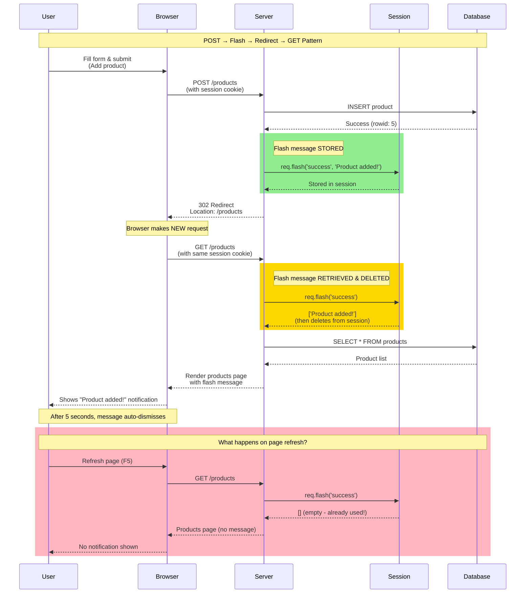

# Flash Message Lifecycle (Mermaid)

## Purpose
Visualizes how flash messages persist across HTTP redirects by using session storage. This diagram solves the #1 confusion point in Part 2C: "Why don't my messages disappear after redirect?"

## Rendering
**VS Code:** Install "Markdown Preview Mermaid Support" extension, then preview this file  
**Online:** Copy code to [mermaid.live](https://mermaid.live)  
**CLI:** `npx @mermaid-js/mermaid-cli -i 01-flash-lifecycle-mermaid.md -o flash-lifecycle.png`

## Diagram



## Key Insights

1. **Session is the bridge:** Flash messages survive redirect because they're stored in server-side session
2. **One-time use:** Messages are automatically deleted after being read (prevents showing on refresh)
3. **Cookie requirement:** Session ID in cookie allows server to retrieve the message on the next request
4. **POST-Redirect-GET pattern:** Common web pattern to prevent duplicate form submissions

## Code Mapping

**Storing the message (POST route):**
```javascript
app.post('/products', (req, res) => {
  db.prepare('INSERT INTO products ...').run(...);
  req.flash('success', 'Product added!');  // ← Stores in session
  res.redirect('/products');               // ← Triggers GET request
});
```

**Retrieving the message (GET route):**
```javascript
app.get('/products', (req, res) => {
  const products = db.prepare('SELECT * FROM products').all();
  res.render('products', {
    products: products,
    success_msg: req.flash('success')  // ← Retrieves & deletes
  });
});
```

**Middleware setup (app.js):**
```javascript
app.use(session({ /* config */ }));  // MUST be first
app.use(flash());                     // MUST be after session
app.use((req, res, next) => {
  res.locals.success_msg = req.flash('success');
  res.locals.error_msg = req.flash('error');
  next();
});
```

## Common Mistakes

1. **Configuring flash before session:** Flash middleware MUST come after session middleware
2. **Forgetting to set message:** Calling `res.redirect()` without `req.flash()` - user sees no feedback
3. **Setting message after redirect:** Must call `req.flash()` BEFORE `res.redirect()`
4. **Expecting message to persist:** Flash is one-time use; doesn't show on page refresh

## Related Concepts
- Web App Basics Part 2C: Section 2 (Flash Messages)
- Express sessions and middleware order
- HTTP redirect status codes (302)
- POST-Redirect-GET pattern
