# Flash Message Lifecycle (PlantUML)

## Purpose
Shows the complete lifecycle of flash messages from creation to display to deletion, emphasizing the session storage mechanism that makes messages survive redirects.

## Rendering
**VS Code:** Install "PlantUML" extension (requires Java)  
**Online:** Copy code to [plantuml.com/plantuml](https://plantuml.com/plantuml)  
**CLI:** `java -jar plantuml.jar 01-flash-lifecycle-plantuml.md`

## Diagram

```plantuml
@startuml
title Flash Message Lifecycle - Session Bridge Pattern

actor User
participant Browser
participant "Express\nServer" as Server
database "Session\nStore" as Session
database "SQLite\nDatabase" as DB

== Form Submission (POST Request) ==

User -> Browser: Fill form &\nsubmit
activate Browser
Browser -> Server: POST /products\n(session_id: abc123)
activate Server

Server -> DB: INSERT INTO products\nVALUES (...)
activate DB
DB --> Server: Success\n(lastInsertRowid: 5)
deactivate DB

note right of Server #90EE90
  Store flash message
  req.flash('success', 'Product added!')
end note

Server -> Session: STORE message\nkey: flash.success\nvalue: ['Product added!']\nsession_id: abc123
activate Session
Session --> Server: Stored
deactivate Session

Server --> Browser: HTTP 302 Redirect\nLocation: /products
deactivate Server

note over Browser #FFD700
  Browser automatically follows
  redirect with same session cookie
end note

== Redirect (GET Request) ==

Browser -> Server: GET /products\n(session_id: abc123)
activate Server

note right of Server #FFD700
  Retrieve AND delete flash message
  req.flash('success')
end note

Server -> Session: RETRIEVE & DELETE\nkey: flash.success\nsession_id: abc123
activate Session
Session --> Server: ['Product added!']\n(then removes from session)
deactivate Session

Server -> DB: SELECT * FROM products
activate DB
DB --> Server: Product list (5 rows)
deactivate DB

Server --> Browser: Render page with:\n- Product list\n- Flash message
deactivate Server

Browser --> User: Display page with\n"✓ Product added!" notification
deactivate Browser

note over User, Browser #90EE90
  After 5 seconds, JavaScript
  auto-dismisses the notification
end note

== Page Refresh (Message Already Used) ==

User -> Browser: Press F5 (refresh)
activate Browser
Browser -> Server: GET /products\n(session_id: abc123)
activate Server

Server -> Session: RETRIEVE\nkey: flash.success\nsession_id: abc123
activate Session
Session --> Server: [] (empty array)\nMessage was already deleted!
deactivate Session

Server -> DB: SELECT * FROM products
activate DB
DB --> Server: Product list
deactivate DB

Server --> Browser: Render page WITHOUT\nflash message
deactivate Server

Browser --> User: No notification shown
deactivate Browser

note over User #FFB6C1
  This is correct behavior!
  Flash messages are ONE-TIME USE
end note

@enduml
```



## Key Insights

1. **Session storage is temporary:** Messages exist only until the next request
2. **Automatic cleanup:** Flash messages self-destruct after being read (memory efficient)
3. **Session ID in cookie:** Browser sends same `session_id` cookie, allowing server to retrieve message
4. **Color coding:**
   - 🟢 Green = Success path (message stored/displayed)
   - 🟡 Yellow = Important action (retrieve & delete)
   - 🔴 Red = Expected behavior (no message on refresh)

## Code Mapping

**Session configuration (required for flash):**
```javascript
const session = require('express-session');
const flash = require('connect-flash');
const SqliteStore = require('better-sqlite3-session-store')(session);

app.use(session({
  store: new SqliteStore({ client: db }),
  secret: process.env.SESSION_SECRET,
  resave: false,
  saveUninitialized: false,
  cookie: { maxAge: 86400000 }  // 24 hours
}));

app.use(flash());  // ← MUST come after session
```

**Setting flash message:**
```javascript
req.flash('success', 'Product added!');
req.flash('error', 'Invalid input');
req.flash('info', 'Please verify your email');
```

**Retrieving flash message:**
```javascript
// In route handler
const successMessages = req.flash('success');  // Returns array, then deletes

// Or make available to all views
app.use((req, res, next) => {
  res.locals.success_msg = req.flash('success');
  res.locals.error_msg = req.flash('error');
  res.locals.info_msg = req.flash('info');
  next();
});
```

## Common Mistakes

1. **Silent failures:** Not setting flash message before redirect → user sees no feedback
2. **Wrong middleware order:** Flash before session → `req.flash is not a function` error
3. **Expecting persistence:** Flash messages don't survive page refresh (by design)
4. **Session not configured:** Flash requires session middleware to work
5. **Forgetting array:** `req.flash()` returns array, not string (use `.forEach()` in template)

## Related Concepts
- Web App Basics Part 2C: Section 2 (Flash Messages)
- Express middleware execution order
- Session stores (SqliteStore, MemoryStore, RedisStore)
- HTTP status code 302 (Found/Redirect)
