# CSV Import with Validation (Graphviz)

## Purpose
Decision tree emphasizing the validation hierarchy and all-or-nothing transaction pattern using Graphviz DOT language.

## Rendering
**VS Code:** Install "Graphviz Preview" extension  
**Online:** Copy code to [dreampuf.github.io/GraphvizOnline](https://dreampuf.github.io/GraphvizOnline)  
**CLI:** `dot -Tpng 02-csv-import-validation-graphviz.md -o csv-import.png`

## Diagram

```dot
digraph CSVImport {
  rankdir=TB;
  node [shape=box, style="rounded,filled", fontname="Arial", fontsize=11];
  edge [fontname="Arial", fontsize=10];
  
  // Start
  start [label="User uploads CSV file", shape=oval, fillcolor="#E0F7FA"];
  
  // Multer check
  multer [label="Multer:\nFile received?", shape=diamond, fillcolor="#FFF9C4"];
  no_file [label="❌ No file uploaded\nHTTP 400", fillcolor="#FFB6C1"];
  save_temp [label="Save to temp/ folder\nSet req.file.path", fillcolor="#87CEEB"];
  
  // Parse
  read_file [label="Read file content", fillcolor="#87CEEB"];
  parse_csv [label="Parse CSV\n(csv-parse)", fillcolor="#87CEEB"];
  
  // Initialize
  init_arrays [label="Initialize:\nerrors = []\nwarnings = []\nvalidRows = []", fillcolor="#E1BEE7"];
  
  // Validation loop
  loop_start [label="Start validation loop", fillcolor="#E1BEE7"];
  for_each [label="For each row\n(index, row)", shape=parallelogram, fillcolor="#E1BEE7"];
  calc_row [label="rowNum = index + 2", fillcolor="#E1BEE7"];
  
  // Validation checks
  check_required [label="Required fields?\nname && price", shape=diamond, fillcolor="#FFF9C4"];
  error_required [label="errors.push:\n'Row X: Missing fields'", fillcolor="#FFB6C1"];
  
  check_type [label="Valid types?\nparseFloat(price)", shape=diamond, fillcolor="#FFF9C4"];
  error_type [label="errors.push:\n'Row X: Invalid price'", fillcolor="#FFB6C1"];
  
  check_range [label="Price in range?\n0 < price < 1M", shape=diamond, fillcolor="#FFF9C4"];
  error_range [label="errors.push:\n'Row X: Out of range'", fillcolor="#FFB6C1"];
  
  check_stock [label="Stock valid?\nparseInt >= 0", shape=diamond, fillcolor="#FFF9C4"];
  error_stock [label="errors.push:\n'Row X: Invalid stock'", fillcolor="#FFB6C1"];
  
  check_duplicate [label="Duplicate?\nSELECT WHERE name=?", shape=diamond, fillcolor="#FFF9C4"];
  warning_duplicate [label="warnings.push:\n'Row X: Already exists'", fillcolor="#FFD700"];
  
  valid_row [label="validRows.push(row)", fillcolor="#90EE90"];
  
  next_row [label="Continue to next row", fillcolor="#E1BEE7"];
  more_rows [label="More rows?", shape=diamond, fillcolor="#FFF9C4"];
  
  // Decision point
  check_errors [label="errors.length > 0?", shape=diamond, fillcolor="#E91E63", fontcolor="white", style="filled,bold", penwidth=3];
  
  // Block path
  block_import [label="❌ BLOCK\nentire import", fillcolor="#FFB6C1", style="filled,bold"];
  delete_temp1 [label="Delete temp file", fillcolor="#FFB6C1"];
  flash_error [label="req.flash('error')\nwith all errors", fillcolor="#FFB6C1"];
  redirect_error [label="Redirect to\n/products/import", fillcolor="#FFB6C1"];
  end_error [label="END\nNothing imported", shape=oval, fillcolor="#FFB6C1"];
  
  // Proceed path
  proceed_import [label="✅ PROCEED\nwith import", fillcolor="#90EE90", style="filled,bold"];
  transaction [label="Begin DB\ntransaction", fillcolor="#87CEEB"];
  prepare_stmt [label="Prepare INSERT\nstatement", fillcolor="#87CEEB"];
  insert_loop [label="For each validRow:\nINSERT + audit log", fillcolor="#87CEEB"];
  commit [label="Commit\ntransaction", fillcolor="#90EE90", style="filled,bold"];
  delete_temp2 [label="Delete temp file", fillcolor="#90EE90"];
  
  check_warnings [label="warnings.length > 0?", shape=diamond, fillcolor="#FFF9C4"];
  flash_success_warn [label="req.flash('success')\n+ warnings", fillcolor="#FFD700"];
  flash_success [label="req.flash('success')\nImported X products", fillcolor="#90EE90"];
  
  redirect_success [label="Redirect to\n/products", fillcolor="#90EE90"];
  end_success [label="END\nImport complete!", shape=oval, fillcolor="#90EE90"];
  
  // Flow
  start -> multer;
  multer -> no_file [label="  No"];
  multer -> save_temp [label="  Yes"];
  
  no_file -> redirect_error;
  
  save_temp -> read_file;
  read_file -> parse_csv;
  parse_csv -> init_arrays;
  init_arrays -> loop_start;
  loop_start -> for_each;
  for_each -> calc_row;
  
  calc_row -> check_required;
  check_required -> error_required [label="  No"];
  check_required -> check_type [label="  Yes"];
  error_required -> next_row;
  
  check_type -> error_type [label="  No"];
  check_type -> check_range [label="  Yes"];
  error_type -> next_row;
  
  check_range -> error_range [label="  No"];
  check_range -> check_stock [label="  Yes"];
  error_range -> next_row;
  
  check_stock -> error_stock [label="  No"];
  check_stock -> check_duplicate [label="  Yes"];
  error_stock -> next_row;
  
  check_duplicate -> warning_duplicate [label="  Yes"];
  check_duplicate -> valid_row [label="  No"];
  warning_duplicate -> next_row;
  valid_row -> next_row;
  
  next_row -> more_rows;
  more_rows -> for_each [label="  Yes"];
  more_rows -> check_errors [label="  No"];
  
  // Critical decision
  check_errors -> block_import [label="  YES\n(ANY errors)", color="#E91E63", penwidth=2];
  check_errors -> proceed_import [label="  NO\n(0 errors)", color="#4CAF50", penwidth=2];
  
  // Block path
  block_import -> delete_temp1;
  delete_temp1 -> flash_error;
  flash_error -> redirect_error;
  redirect_error -> end_error;
  
  // Proceed path
  proceed_import -> transaction;
  transaction -> prepare_stmt;
  prepare_stmt -> insert_loop;
  insert_loop -> commit;
  commit -> delete_temp2;
  delete_temp2 -> check_warnings;
  
  check_warnings -> flash_success_warn [label="  Yes"];
  check_warnings -> flash_success [label="  No"];
  
  flash_success_warn -> redirect_success;
  flash_success -> redirect_success;
  redirect_success -> end_success;
  
  // Grouping
  subgraph cluster_validation {
    label="Validation Loop (Level 1-4 Checks)";
    style=filled;
    color="#F5F5F5";
    {check_required; check_type; check_range; check_stock; check_duplicate;}
  }
  
  subgraph cluster_decision {
    label="Critical Decision Point";
    style=filled;
    color="#FFE0E0";
    {check_errors; block_import; proceed_import;}
  }
  
  subgraph cluster_transaction {
    label="Database Transaction (All-or-Nothing)";
    style=filled;
    color="#E0FFE0";
    {transaction; prepare_stmt; insert_loop; commit;}
  }
}
```



## Key Insights

1. **Visual hierarchy:** The diagram flows top-to-bottom showing temporal order

2. **Critical decision highlighted:** The `errors.length > 0?` diamond is emphasized with:
   - Pink background
   - Bold border
   - Thick edges (red = block, green = proceed)

3. **Four-level validation:**
   - **Level 1:** Required fields (name, price must exist)
   - **Level 2:** Data types (must be valid number)
   - **Level 3:** Data ranges (price 0-1M, stock >= 0)
   - **Level 4:** Business rules (duplicates allowed but warned)

4. **Cluster groups:** Three logical sections:
   - Validation Loop (gray background)
   - Critical Decision (pink background)
   - Database Transaction (green background)

5. **Color semantics:**
   - Red = Errors/blocked path
   - Yellow = Warnings/caution
   - Green = Success/valid path
   - Blue = Processing/normal operations
   - Purple = Control flow

## Code Mapping

**The critical decision point:**
```javascript
// After validation loop completes
if (errors.length > 0) {
  // ❌ BLOCK PATH (red in diagram)
  fs.unlinkSync(req.file.path);
  req.flash('error', `Import failed: ${errors.join('; ')}`);
  return res.redirect('/products/import');
}

// ✅ PROCEED PATH (green in diagram)
const insertStmt = db.prepare('INSERT INTO products (name, price, stock) VALUES (?, ?, ?)');

// Transaction ensures atomicity (all-or-nothing)
const insertMany = db.transaction((rows) => {
  for (const row of rows) {
    const result = insertStmt.run(row.name, row.price, row.stock);
    
    // Log each insert for audit trail
    logAudit(
      db,
      res.locals.user.id,
      'CREATE',
      'products',
      result.lastInsertRowid,
      null,
      row,
      req.ip
    );
  }
});

try {
  insertMany(validRows);  // Executes entire transaction
  fs.unlinkSync(req.file.path);
  
  let msg = `Imported ${validRows.length} products`;
  if (warnings.length > 0) {
    msg += `. Warnings: ${warnings.join('; ')}`;
  }
  req.flash('success', msg);
  res.redirect('/products');
} catch (error) {
  fs.unlinkSync(req.file.path);
  req.flash('error', 'Transaction failed: ' + error.message);
  res.redirect('/products/import');
}
```

**Validation levels in code:**
```javascript
records.forEach((row, index) => {
  const rowNum = index + 2;
  
  // Level 1: Required fields
  if (!row.name || !row.price) {
    errors.push(`Row ${rowNum}: Missing required fields`);
    return;
  }
  
  // Level 2: Data types
  const price = parseFloat(row.price);
  if (isNaN(price)) {
    errors.push(`Row ${rowNum}: Invalid price type`);
    return;
  }
  
  // Level 3: Data ranges
  if (price <= 0 || price > 1000000) {
    errors.push(`Row ${rowNum}: Price out of range (0-1M)`);
    return;
  }
  
  const stock = parseInt(row.stock || 0);
  if (isNaN(stock) || stock < 0) {
    errors.push(`Row ${rowNum}: Invalid stock`);
    return;
  }
  
  // Level 4: Business rules (warning, not error)
  const exists = db.prepare('SELECT id FROM products WHERE name = ?').get(row.name);
  if (exists) {
    warnings.push(`Row ${rowNum}: Duplicate "${row.name}" skipped`);
    return;
  }
  
  // All levels passed!
  validRows.push({ name: row.name, price: price, stock: stock });
});
```

## Common Mistakes

1. **No transaction (partial imports):**
   ```javascript
   // ❌ WRONG: If row 50 fails, rows 1-49 already in database
   validRows.forEach(row => {
     db.prepare('INSERT...').run(row.name, row.price, row.stock);
   });
   
   // ✅ CORRECT: Transaction ensures all-or-nothing
   const insertMany = db.transaction((rows) => {
     rows.forEach(row => insertStmt.run(...));
   });
   insertMany(validRows);
   ```

2. **Treating warnings as errors:**
   ```javascript
   // ❌ WRONG: Blocks import if ANY duplicate exists
   if (duplicateExists) {
     errors.push('Duplicate found');  // Blocks entire import
   }
   
   // ✅ CORRECT: Warnings don't block import
   if (duplicateExists) {
     warnings.push('Duplicate found (skipped)');  // Import continues
     return;  // Skip this row only
   }
   ```

3. **Skipping validation levels:**
   ```javascript
   // ❌ WRONG: Only checks if price exists, not if it's valid
   if (row.price) {
     db.prepare('INSERT...').run(row.name, row.price);  // May insert "abc" as price!
   }
   
   // ✅ CORRECT: Check existence AND type AND range
   if (!row.price) {
     errors.push('Missing price');
   } else {
     const price = parseFloat(row.price);
     if (isNaN(price)) {
       errors.push('Invalid price type');
     } else if (price <= 0) {
       errors.push('Price must be positive');
     }
   }
   ```

4. **Not logging imports for audit:**
   ```javascript
   // ❌ WRONG: No record of who imported what
   insertStmt.run(row.name, row.price, row.stock);
   
   // ✅ CORRECT: Log every import for accountability
   const result = insertStmt.run(row.name, row.price, row.stock);
   logAudit(db, userId, 'CREATE', 'products', result.lastInsertRowid, null, row, ip);
   ```

## Related Concepts
- Web App Basics Part 2C: Section 3 (CSV Import)
- Database ACID properties (Atomicity, Consistency, Isolation, Durability)
- Input validation pyramid (Type → Range → Business Rules)
- Error handling strategies (fail-fast vs continue-on-error)
- Bulk operations and transactions
