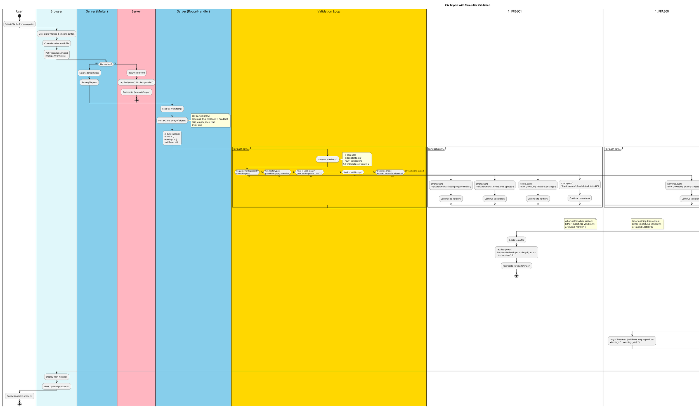

# CSV Import with Validation (PlantUML)

## Purpose
Shows the complete CSV import pipeline with three-tier validation (errors, warnings, valid), emphasizing the all-or-nothing transaction pattern.

## Rendering
**VS Code:** Install "PlantUML" extension (requires Java)  
**Online:** Copy code to [plantuml.com/plantuml](https://plantuml.com/plantuml)  
**CLI:** `java -jar plantuml.jar 02-csv-import-validation-plantuml.md`

## Diagram



## Key Insights

1. **Three-tier validation:**
   - 🔴 **Errors:** Block entire import (missing fields, invalid types, range violations)
   - 🟡 **Warnings:** Allow import but notify (duplicates, data normalization)
   - 🟢 **Valid:** Ready for import

2. **All-or-nothing pattern:** If ANY errors exist, import NOTHING (preserves data integrity)

3. **Row numbering:** `index + 2` accounts for 0-based arrays and CSV header row

4. **Transaction safety:** Database transaction ensures atomic import (all succeed or all fail)

5. **Temporary file cleanup:** Always delete temp file (success or failure)

## Code Mapping

**Route setup:**
```javascript
const multer = require('multer');
const { parse } = require('csv-parse/sync');
const fs = require('fs');

const upload = multer({ dest: 'temp/' });

app.post('/products/import', requireAdmin, upload.single('csvFile'), (req, res) => {
  try {
    // Check file exists
    if (!req.file) {
      req.flash('error', 'No file uploaded');
      return res.redirect('/products/import');
    }
    
    // Read and parse CSV
    const fileContent = fs.readFileSync(req.file.path, 'utf-8');
    const records = parse(fileContent, {
      columns: true,
      skip_empty_lines: true,
      trim: true
    });
    
    // Validation arrays
    const errors = [];
    const warnings = [];
    const validRows = [];
    
    // Validation loop
    records.forEach((row, index) => {
      const rowNum = index + 2;  // +2 for header and 1-based numbering
      
      // Check required fields
      if (!row.name || !row.price) {
        errors.push(`Row ${rowNum}: Missing required fields`);
        return;
      }
      
      // Check data types
      const price = parseFloat(row.price);
      if (isNaN(price)) {
        errors.push(`Row ${rowNum}: Invalid price "${row.price}"`);
        return;
      }
      
      // Check range
      if (price <= 0 || price > 1000000) {
        errors.push(`Row ${rowNum}: Price ${price} out of range`);
        return;
      }
      
      // Check stock
      const stock = parseInt(row.stock || 0);
      if (isNaN(stock) || stock < 0) {
        errors.push(`Row ${rowNum}: Invalid stock "${row.stock}"`);
        return;
      }
      
      // Check duplicates
      const exists = db.prepare('SELECT id FROM products WHERE name = ?').get(row.name);
      if (exists) {
        warnings.push(`Row ${rowNum}: "${row.name}" already exists (skipped)`);
        return;
      }
      
      // Valid row!
      validRows.push({ name: row.name, price: price, stock: stock });
    });
    
    // Decision point
    if (errors.length > 0) {
      fs.unlinkSync(req.file.path);
      req.flash('error', `Import failed: ${errors.join('; ')}`);
      return res.redirect('/products/import');
    }
    
    // Import valid rows (transaction)
    const insertStmt = db.prepare('INSERT INTO products (name, price, stock) VALUES (?, ?, ?)');
    const insertMany = db.transaction((rows) => {
      for (const row of rows) {
        insertStmt.run(row.name, row.price, row.stock);
      }
    });
    insertMany(validRows);
    
    // Cleanup and redirect
    fs.unlinkSync(req.file.path);
    
    let message = `Successfully imported ${validRows.length} products`;
    if (warnings.length > 0) {
      message += `. Warnings: ${warnings.join('; ')}`;
    }
    req.flash('success', message);
    res.redirect('/products');
    
  } catch (error) {
    if (req.file) fs.unlinkSync(req.file.path);
    req.flash('error', 'Import failed: ' + error.message);
    res.redirect('/products/import');
  }
});
```

## Common Mistakes

1. **Importing invalid data:**
   ```javascript
   // ❌ No validation - imports garbage
   records.forEach(row => {
     db.prepare('INSERT...').run(row.name, row.price);  // What if price = "abc"?
   });
   ```

2. **Partial imports on error:**
   ```javascript
   // ❌ Imports 50 rows, then error on row 51 - database left inconsistent
   records.forEach(row => {
     if (valid(row)) {
       db.prepare('INSERT...').run(...);  // No transaction!
     }
   });
   ```

3. **Wrong row numbering:**
   ```javascript
   // ❌ Error says "Row 0" (confusing for users)
   records.forEach((row, index) => {
     errors.push(`Row ${index}: ...`);  // Should be index + 2
   });
   ```

4. **Not cleaning up temp files:**
   ```javascript
   // ❌ Temp files accumulate, fills disk
   app.post('/import', upload.single('csvFile'), (req, res) => {
     // ... process file ...
     res.redirect('/products');  // ❌ Forgot: fs.unlinkSync(req.file.path)
   });
   ```

5. **Silent failures:**
   ```javascript
   // ❌ Import succeeds but user doesn't know what happened
   db.prepare('INSERT...').run(...);
   res.redirect('/products');  // ❌ No flash message!
   ```

## Related Concepts
- Web App Basics Part 2C: Section 3 (CSV Import)
- Multer middleware for file uploads
- csv-parse library
- Database transactions (ACID properties)
- Data validation strategies
- Error vs warning distinction
