# Flash Message Lifecycle Diagram (Mermaid)

## Purpose
Illustrate how flash messages persist across a redirect using sessions, solving the "messages disappearing" problem.

## Rendering
Use Mermaid Live Editor (mermaid.live) or VS Code Mermaid extension.

## Diagram

```mermaid
sequenceDiagram
    participant User
    participant Browser
    participant Server
    participant Session
    participant Database
    
    Note over User,Database: Without Flash Messages (messages lost on redirect)
    
    User->>Browser: Submit form (POST /products)
    Browser->>Server: POST /products
    Server->>Database: INSERT product
    Database-->>Server: Success
    Server-->>Browser: 302 Redirect to /products
    Note right of Server: ❌ Message: "Product added!"<br/>gets lost here!
    Browser->>Server: GET /products
    Server-->>Browser: Product list (no message)
    Browser-->>User: No feedback 😞
    
    Note over User,Database: With Flash Messages (messages persist!)
    
    User->>Browser: Submit form (POST /products)
    Browser->>Server: POST /products (with session cookie)
    Server->>Database: INSERT product
    Database-->>Server: Success
    Server->>Session: req.flash('success', 'Product added!')
    Note right of Session: ✅ Message stored in session
    Server-->>Browser: 302 Redirect to /products
    Browser->>Server: GET /products (with same session cookie)
    Server->>Session: req.flash('success')
    Note right of Session: Message retrieved and removed<br/>(one-time use)
    Session-->>Server: ['Product added!']
    Server-->>Browser: Product list + flash message
    Browser-->>User: Shows success notification 🎉
    
    Note over Browser,User: After page refresh, message is gone
    User->>Browser: Refresh page
    Browser->>Server: GET /products
    Server->>Session: req.flash('success')
    Session-->>Server: [] (empty - already used)
    Server-->>Browser: Product list (no message)
```



## Key Insights

**Why we need flash messages:**
- HTTP is stateless (each request is independent)
- POST → Redirect → GET pattern loses context
- Flash messages bridge this gap using sessions

**How it works:**
1. POST request saves message to session
2. Redirect happens (browser makes GET request)
3. GET request retrieves message from session
4. Message displayed in view
5. Message automatically deleted (one-time use)

**Session storage:**
```
Session {
  user_id: 3,
  flash: {
    success: ['Product added!']
  }
}
```

## Code Flow

```javascript
// POST /products - Save message
app.post('/products', (req, res) => {
  db.prepare('INSERT INTO products ...').run(...);
  req.flash('success', 'Product added!'); // Stored in session
  res.redirect('/products'); // Browser makes new GET request
});

// GET /products - Retrieve and display message
app.get('/products', (req, res) => {
  const products = db.prepare('SELECT * FROM products').all();
  res.render('products', {
    products: products,
    success_msg: req.flash('success') // Retrieved and removed
  });
});
```

## Related Concepts
- Web App Basics Part 2C: Section 2 (Flash Messages)
- Express sessions and middleware
- HTTP redirect status codes (302)
- POST-Redirect-GET pattern
