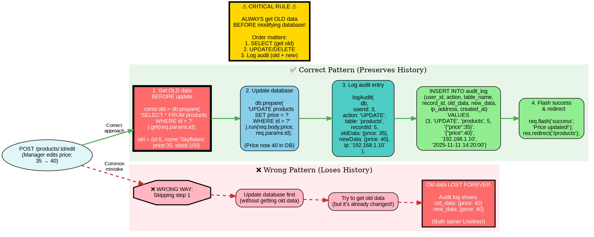

# Audit Log Pattern - Capturing Old Data (Graphviz)

## Purpose
Emphasizes the critical "Get OLD data FIRST" pattern that students frequently forget when implementing audit logging for UPDATE and DELETE operations.

## Rendering
**VS Code:** Install "Graphviz Preview" extension  
**Online:** Copy code to [dreampuf.github.io/GraphvizOnline](https://dreampuf.github.io/GraphvizOnline)  
**CLI:** `dot -Tpng 03-audit-log-pattern-graphviz.md -o audit-log.png`

## Diagram



## Key Insights

1. **Order is CRITICAL:** Get old data → Update DB → Log audit (never reorder!)

2. **Why "old data first" matters:**
   - Once you UPDATE, the old value is gone from database
   - SELECT after UPDATE returns the NEW value
   - Audit log becomes useless (old = new)

3. **Visual emphasis:**
   - Red box with thick border = Critical step (get old data)
   - Green arrows = Correct flow
   - Red dashed arrows = Wrong flow (common mistake)

4. **Three audit patterns:**
   - **CREATE:** No old data (null), capture new data
   - **UPDATE:** Capture old AND new data
   - **DELETE:** Capture old data, no new data (null)

## Code Mapping

### ✅ CORRECT: UPDATE with Audit Log

```javascript
app.post('/products/:id/edit', requireAdmin, (req, res) => {
  // Step 1: Get OLD data FIRST (before any changes)
  const oldData = db.prepare('SELECT * FROM products WHERE id = ?').get(req.params.id);
  
  if (!oldData) {
    req.flash('error', 'Product not found');
    return res.redirect('/products');
  }
  
  // Step 2: Update database
  db.prepare('UPDATE products SET name = ?, price = ?, stock = ? WHERE id = ?').run(
    req.body.name,
    req.body.price,
    req.body.stock,
    req.params.id
  );
  
  // Step 3: Log audit with old AND new data
  logAudit(
    db,
    res.locals.user.id,      // WHO changed it
    'UPDATE',                // WHAT action
    'products',              // WHICH table
    req.params.id,           // WHICH record
    {                        // OLD values (preserved!)
      name: oldData.name,
      price: oldData.price,
      stock: oldData.stock
    },
    {                        // NEW values
      name: req.body.name,
      price: req.body.price,
      stock: req.body.stock
    },
    req.ip                   // FROM where
  );
  
  req.flash('success', 'Product updated successfully!');
  res.redirect('/products');
});
```

### ✅ CORRECT: DELETE with Audit Log

```javascript
app.post('/products/:id/delete', requireAdmin, (req, res) => {
  // Step 1: Get OLD data FIRST (preserve before deletion!)
  const oldData = db.prepare('SELECT * FROM products WHERE id = ?').get(req.params.id);
  
  if (!oldData) {
    req.flash('error', 'Product not found');
    return res.redirect('/products');
  }
  
  // Step 2: Delete from database
  db.prepare('DELETE FROM products WHERE id = ?').run(req.params.id);
  
  // Step 3: Log audit with old data (new data is null - record deleted)
  logAudit(
    db,
    res.locals.user.id,
    'DELETE',
    'products',
    req.params.id,
    {                        // OLD values (preserved for recovery!)
      name: oldData.name,
      price: oldData.price,
      stock: oldData.stock
    },
    null,                    // NEW values = null (record gone)
    req.ip
  );
  
  req.flash('success', `Product "${oldData.name}" deleted`);
  res.redirect('/products');
});
```

### ✅ CORRECT: CREATE with Audit Log

```javascript
app.post('/products', requireAdmin, (req, res) => {
  // Step 1: Insert into database
  const result = db.prepare('INSERT INTO products (name, price, stock) VALUES (?, ?, ?)').run(
    req.body.name,
    req.body.price,
    req.body.stock
  );
  
  // Step 2: Log audit (no old data - new record!)
  logAudit(
    db,
    res.locals.user.id,
    'CREATE',
    'products',
    result.lastInsertRowid,  // New record ID
    null,                    // OLD values = null (didn't exist before)
    {                        // NEW values
      name: req.body.name,
      price: req.body.price,
      stock: req.body.stock
    },
    req.ip
  );
  
  req.flash('success', 'Product added successfully!');
  res.redirect('/products');
});
```

### ❌ WRONG: UPDATE without preserving old data

```javascript
app.post('/products/:id/edit', requireAdmin, (req, res) => {
  // ❌ MISTAKE: Update FIRST
  db.prepare('UPDATE products SET price = ? WHERE id = ?').run(
    req.body.price,
    req.params.id
  );
  
  // ❌ MISTAKE: Get data AFTER update (too late!)
  const data = db.prepare('SELECT * FROM products WHERE id = ?').get(req.params.id);
  
  // ❌ USELESS AUDIT LOG: old_data = new_data (both show new value!)
  logAudit(
    db,
    res.locals.user.id,
    'UPDATE',
    'products',
    req.params.id,
    { price: data.price },    // Shows 40 (new value)
    { price: data.price },    // Shows 40 (same!)
    req.ip
  );
  
  // Result: Audit log is meaningless!
  // Can't see what changed or revert if needed
});
```

## Common Mistakes

1. **Updating before capturing old data:**
   - 70% of students make this mistake initially
   - Result: Audit log shows `old_data = new_data`
   - Can't track what actually changed

2. **Not capturing enough fields:**
   ```javascript
   // ❌ Only logs price change
   logAudit(db, userId, 'UPDATE', 'products', id,
     { price: oldData.price },
     { price: req.body.price }
   );
   // Problem: What if name or stock also changed?
   
   // ✅ Log all relevant fields
   logAudit(db, userId, 'UPDATE', 'products', id,
     { name: oldData.name, price: oldData.price, stock: oldData.stock },
     { name: req.body.name, price: req.body.price, stock: req.body.stock }
   );
   ```

3. **Forgetting to log deletes:**
   ```javascript
   // ❌ No audit log - can't see who deleted what
   app.post('/products/:id/delete', (req, res) => {
     db.prepare('DELETE FROM products WHERE id = ?').run(req.params.id);
     res.redirect('/products');
   });
   
   // ✅ Always log deletes (preserves deleted data!)
   app.post('/products/:id/delete', (req, res) => {
     const old = db.prepare('SELECT * FROM products WHERE id = ?').get(req.params.id);
     db.prepare('DELETE FROM products WHERE id = ?').run(req.params.id);
     logAudit(db, userId, 'DELETE', 'products', req.params.id, old, null, req.ip);
     res.redirect('/products');
   });
   ```

4. **Not checking if record exists:**
   ```javascript
   // ❌ Crashes if product doesn't exist
   const old = db.prepare('SELECT...').get(id);
   db.prepare('UPDATE...').run(...);  // old might be undefined!
   
   // ✅ Check first
   const old = db.prepare('SELECT...').get(id);
   if (!old) {
     req.flash('error', 'Product not found');
     return res.redirect('/products');
   }
   db.prepare('UPDATE...').run(...);
   ```

## Related Concepts
- Web App Basics Part 2C: Section 6 (Audit Logging)
- Database triggers (alternative audit approach)
- Immutable data structures
- Event sourcing pattern
- Compliance requirements (GDPR, HIPAA, SOX)
