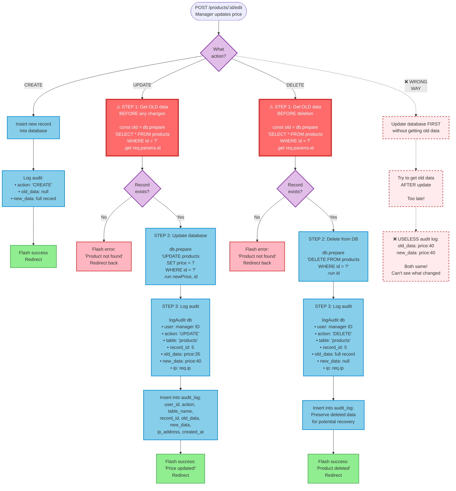

# Audit Log Pattern - Capturing Old Data (Mermaid)

## Purpose
Flowchart showing the decision logic and correct sequence for audit logging in CREATE, UPDATE, and DELETE operations.

## Rendering
**VS Code:** Built-in Mermaid support (preview Markdown files)  
**GitHub:** Renders automatically in `.md` files  
**Online:** [mermaid.live](https://mermaid.live)

## Diagram



## Key Insights

1. **Three distinct audit patterns:**
   - **CREATE:** old_data = null, capture new data
   - **UPDATE:** Capture BOTH old and new data (requires getting old first!)
   - **DELETE:** Capture old data (preserve for recovery), new_data = null

2. **Decision tree structure:**
   - First decision: What action? (CREATE/UPDATE/DELETE)
   - Second decision (UPDATE/DELETE only): Does record exist?
   - This prevents crashes and improves error handling

3. **Visual flow:**
   - Red boxes (thick border) = Critical "get old data" step
   - Purple diamonds = Decision points
   - Green boxes = Success outcomes
   - Pink boxes = Error paths
   - Dashed lines = Wrong approach (anti-pattern)

4. **Error handling included:**
   - Record existence check prevents crashes
   - Flash messages provide user feedback
   - Graceful redirect on errors

## Code Mapping

### Complete Audit Function

```javascript
// utils/audit.js
function logAudit(db, userId, action, tableName, recordId, oldData, newData, ipAddress) {
  db.prepare(`
    INSERT INTO audit_log (
      user_id, action, table_name, record_id,
      old_data, new_data, ip_address, created_at
    ) VALUES (?, ?, ?, ?, ?, ?, ?, datetime('now'))
  `).run(
    userId,
    action,                              // 'CREATE', 'UPDATE', or 'DELETE'
    tableName,                           // 'products', 'users', etc.
    recordId,
    oldData ? JSON.stringify(oldData) : null,   // null for CREATE
    newData ? JSON.stringify(newData) : null,   // null for DELETE
    ipAddress
  );
}

module.exports = { logAudit };
```

### ✅ CORRECT: UPDATE Route

```javascript
const { logAudit } = require('./utils/audit');

app.post('/products/:id/edit', requireAdmin, (req, res) => {
  // STEP 1: Get OLD data BEFORE any changes (critical!)
  const oldData = db.prepare(`
    SELECT name, price, stock 
    FROM products 
    WHERE id = ?
  `).get(req.params.id);
  
  // Check if record exists
  if (!oldData) {
    req.flash('error', 'Product not found');
    return res.redirect('/products');
  }
  
  // STEP 2: Update database
  db.prepare(`
    UPDATE products 
    SET name = ?, price = ?, stock = ? 
    WHERE id = ?
  `).run(
    req.body.name,
    req.body.price,
    req.body.stock,
    req.params.id
  );
  
  // STEP 3: Log audit with old AND new data
  logAudit(
    db,
    res.locals.user.id,      // WHO made the change
    'UPDATE',                // WHAT action
    'products',              // WHICH table
    req.params.id,           // WHICH record
    {                        // OLD values (preserved!)
      name: oldData.name,
      price: oldData.price,
      stock: oldData.stock
    },
    {                        // NEW values
      name: req.body.name,
      price: req.body.price,
      stock: req.body.stock
    },
    req.ip                   // FROM where
  );
  
  req.flash('success', 'Product updated successfully!');
  res.redirect('/products');
});
```

### ✅ CORRECT: DELETE Route

```javascript
app.post('/products/:id/delete', requireAdmin, (req, res) => {
  // STEP 1: Get OLD data BEFORE deletion (preserve forever!)
  const oldData = db.prepare(`
    SELECT name, price, stock 
    FROM products 
    WHERE id = ?
  `).get(req.params.id);
  
  if (!oldData) {
    req.flash('error', 'Product not found');
    return res.redirect('/products');
  }
  
  // STEP 2: Delete from database
  db.prepare('DELETE FROM products WHERE id = ?').run(req.params.id);
  
  // STEP 3: Log audit with old data only (new = null, record gone)
  logAudit(
    db,
    res.locals.user.id,
    'DELETE',
    'products',
    req.params.id,
    {
      name: oldData.name,
      price: oldData.price,
      stock: oldData.stock
    },
    null,                    // No new data (record deleted)
    req.ip
  );
  
  req.flash('success', `Product "${oldData.name}" deleted`);
  res.redirect('/products');
});
```

### ✅ CORRECT: CREATE Route

```javascript
app.post('/products', requireAdmin, (req, res) => {
  // STEP 1: Insert new record
  const result = db.prepare(`
    INSERT INTO products (name, price, stock) 
    VALUES (?, ?, ?)
  `).run(req.body.name, req.body.price, req.body.stock);
  
  // STEP 2: Log audit (no old data - record didn't exist!)
  logAudit(
    db,
    res.locals.user.id,
    'CREATE',
    'products',
    result.lastInsertRowid,  // New record's ID
    null,                    // No old data (just created)
    {
      name: req.body.name,
      price: req.body.price,
      stock: req.body.stock
    },
    req.ip
  );
  
  req.flash('success', 'Product added successfully!');
  res.redirect('/products');
});
```

### Viewing Audit Logs

```javascript
app.get('/admin/audit', requireAdmin, (req, res) => {
  const logs = db.prepare(`
    SELECT 
      al.id,
      al.action,
      al.table_name,
      al.record_id,
      al.old_data,
      al.new_data,
      al.created_at,
      u.username,
      al.ip_address
    FROM audit_log al
    JOIN users u ON al.user_id = u.id
    ORDER BY al.created_at DESC
    LIMIT 100
  `).all();
  
  // Parse JSON strings back to objects
  logs.forEach(log => {
    log.old_data = log.old_data ? JSON.parse(log.old_data) : null;
    log.new_data = log.new_data ? JSON.parse(log.new_data) : null;
  });
  
  res.render('admin/audit', { logs });
});
```

### EJS Template for Audit Logs

```ejs
<!-- views/admin/audit.ejs -->
<h2>Audit Log</h2>
<table>
  <thead>
    <tr>
      <th>Date/Time</th>
      <th>User</th>
      <th>Action</th>
      <th>Table</th>
      <th>Record ID</th>
      <th>Changes</th>
      <th>IP Address</th>
    </tr>
  </thead>
  <tbody>
    <% logs.forEach(log => { %>
      <tr>
        <td><%= log.created_at %></td>
        <td><%= log.username %></td>
        <td><%= log.action %></td>
        <td><%= log.table_name %></td>
        <td><%= log.record_id %></td>
        <td>
          <% if (log.action === 'CREATE') { %>
            <strong>New:</strong> <%= JSON.stringify(log.new_data) %>
          <% } else if (log.action === 'UPDATE') { %>
            <strong>Old:</strong> <%= JSON.stringify(log.old_data) %><br>
            <strong>New:</strong> <%= JSON.stringify(log.new_data) %>
          <% } else if (log.action === 'DELETE') { %>
            <strong>Deleted:</strong> <%= JSON.stringify(log.old_data) %>
          <% } %>
        </td>
        <td><%= log.ip_address %></td>
      </tr>
    <% }); %>
  </tbody>
</table>
```

## Common Mistakes

1. **Getting old data AFTER update:**
   ```javascript
   // ❌ WRONG ORDER
   db.prepare('UPDATE products SET price = ? WHERE id = ?').run(newPrice, id);
   const old = db.prepare('SELECT * FROM products WHERE id = ?').get(id);
   // old.price is now newPrice (too late!)
   
   // ✅ CORRECT ORDER
   const old = db.prepare('SELECT * FROM products WHERE id = ?').get(id);
   db.prepare('UPDATE products SET price = ? WHERE id = ?').run(newPrice, id);
   // old.price still has the original value
   ```

2. **Not handling record not found:**
   ```javascript
   // ❌ Crashes if record doesn't exist
   const old = db.prepare('SELECT...').get(id);
   db.prepare('UPDATE...').run(newPrice, id);  // old might be undefined
   logAudit(..., old, ...);  // Crashes if old is undefined
   
   // ✅ Check before proceeding
   const old = db.prepare('SELECT...').get(id);
   if (!old) {
     req.flash('error', 'Record not found');
     return res.redirect(...);
   }
   db.prepare('UPDATE...').run(newPrice, id);
   logAudit(..., old, ...);
   ```

3. **Forgetting to audit deletes:**
   ```javascript
   // ❌ No audit trail for deletion
   app.post('/products/:id/delete', (req, res) => {
     db.prepare('DELETE FROM products WHERE id = ?').run(req.params.id);
     res.redirect('/products');
     // Can't see who deleted what, or recover data!
   });
   
   // ✅ Always audit deletes (most important!)
   app.post('/products/:id/delete', (req, res) => {
     const old = db.prepare('SELECT * FROM products WHERE id = ?').get(req.params.id);
     if (!old) return res.redirect('/products');
     
     db.prepare('DELETE FROM products WHERE id = ?').run(req.params.id);
     logAudit(db, userId, 'DELETE', 'products', req.params.id, old, null, req.ip);
     res.redirect('/products');
   });
   ```

4. **Not capturing enough context:**
   ```javascript
   // ❌ Only logs the changed field
   logAudit(db, userId, 'UPDATE', 'products', id,
     { price: old.price },
     { price: req.body.price }
   );
   // Problem: Can't see full context of what the record looked like
   
   // ✅ Log complete snapshot
   logAudit(db, userId, 'UPDATE', 'products', id,
     { name: old.name, price: old.price, stock: old.stock },
     { name: req.body.name, price: req.body.price, stock: req.body.stock }
   );
   // Benefit: Can recreate exact state at any point in time
   ```

5. **Not using transactions for complex operations:**
   ```javascript
   // ❌ Update and audit not atomic
   db.prepare('UPDATE...').run(...);
   logAudit(...);  // If this fails, update is done but not logged!
   
   // ✅ Wrap in transaction
   const updateWithAudit = db.transaction((id, newData, oldData, userId, ip) => {
     db.prepare('UPDATE products SET price = ? WHERE id = ?').run(newData.price, id);
     logAudit(db, userId, 'UPDATE', 'products', id, oldData, newData, ip);
   });
   
   updateWithAudit(id, newData, oldData, userId, ip);
   // Both succeed or both fail (atomic!)
   ```

## Related Concepts
- Web App Basics Part 2C: Section 6 (Audit Logging)
- Session management (tracking `res.locals.user.id`)
- Express middleware (accessing `req.ip`)
- Transaction safety (ensuring audit + update are atomic)
- Compliance requirements (GDPR, HIPAA - audit trails required by law)
