# Audit Log Pattern - Capturing Old Data (PlantUML)

## Purpose
Sequence diagram showing the temporal flow of audit logging across CREATE, UPDATE, and DELETE operations, emphasizing the critical timing of capturing old data.

## Rendering
**VS Code:** Install "PlantUML" extension (requires Java)  
**Online:** Copy code to [plantuml.com/plantuml](http://www.plantuml.com/plantuml)  
**CLI:** `plantuml 03-audit-log-pattern-plantuml.md`

## Diagram

```plantuml
@startuml AuditLogPattern

title Audit Log Pattern - Capturing Old Data\n(Three Scenarios: CREATE, UPDATE, DELETE)

actor Manager as manager
participant "Express Route" as route
database "SQLite Database\n(products table)" as db
participant "logAudit Function" as audit
database "SQLite Database\n(audit_log table)" as auditdb

== Scenario 1: CREATE (New Product) ==

manager -> route: POST /products\n{name:"Lucky Me", price:15, stock:200}
activate route #87CEEB

note right of route
  No old data to capture
  (product doesn't exist yet)
end note

route -> db: INSERT INTO products\nVALUES ('Lucky Me', 15, 200)
activate db #90EE90
db --> route: lastInsertRowid: 42
deactivate db

route -> audit: logAudit(\n  userId: 3,\n  action: 'CREATE',\n  table: 'products',\n  recordId: 42,\n  oldData: null,\n  newData: {name:'Lucky Me', price:15, stock:200},\n  ip: '192.168.1.10'\n)
activate audit #4ECDC4

audit -> auditdb: INSERT INTO audit_log\n(user_id, action, table_name, record_id,\n old_data, new_data, ip_address, created_at)\nVALUES (3, 'CREATE', 'products', 42,\n null, '{"name":"Lucky Me","price":15,"stock":200}',\n '192.168.1.10', '2025-11-11 10:00:00')
activate auditdb #90EE90
auditdb --> audit: OK
deactivate auditdb

audit --> route: Audit logged
deactivate audit

route --> manager: Flash: 'Product added!'\nRedirect to /products
deactivate route

== Scenario 2: UPDATE (Edit Product) ==

manager -> route: POST /products/5/edit\n{name:"Skyflakes", price:40, stock:100}
activate route #87CEEB

note right of route #FF6B6B
  ⚠️ CRITICAL STEP 1:
  Get OLD data BEFORE any changes!
  This is the MOST IMPORTANT step
end note

route -> db: SELECT * FROM products\nWHERE id = 5
activate db #FF6B6B
db --> route: {id:5, name:"Skyflakes",\n price:35, stock:100}
deactivate db

note right of route
  OLD data captured safely
  (price was 35)
end note

route -> db: UPDATE products\nSET name='Skyflakes', price=40, stock=100\nWHERE id = 5
activate db #90EE90
db --> route: Changes: 1
deactivate db

note right of route
  Database updated
  (price now 40 in DB)
end note

route -> audit: logAudit(\n  userId: 3,\n  action: 'UPDATE',\n  table: 'products',\n  recordId: 5,\n  oldData: {name:'Skyflakes', price:35, stock:100},\n  newData: {name:'Skyflakes', price:40, stock:100},\n  ip: '192.168.1.10'\n)
activate audit #4ECDC4

note right of audit #90EE90
  Audit log now shows:
  • What changed: price (35 → 40)
  • What stayed same: name, stock
  • WHO changed it: user 3
  • WHEN: timestamp
  • FROM where: IP address
end note

audit -> auditdb: INSERT INTO audit_log\n(user_id, action, table_name, record_id,\n old_data, new_data, ip_address, created_at)\nVALUES (3, 'UPDATE', 'products', 5,\n '{"name":"Skyflakes","price":35,"stock":100}',\n '{"name":"Skyflakes","price":40,"stock":100}',\n '192.168.1.10', '2025-11-11 14:20:00')
activate auditdb #90EE90
auditdb --> audit: OK
deactivate auditdb

audit --> route: Audit logged
deactivate audit

route --> manager: Flash: 'Price updated!'\nRedirect to /products
deactivate route

== Scenario 3: DELETE (Remove Product) ==

manager -> route: POST /products/8/delete
activate route #87CEEB

note right of route #FF6B6B
  ⚠️ CRITICAL STEP 1:
  Get OLD data BEFORE deletion!
  Once deleted, can't recover!
end note

route -> db: SELECT * FROM products\nWHERE id = 8
activate db #FF6B6B
db --> route: {id:8, name:"Obsolete Item",\n price:10, stock:5}
deactivate db

note right of route
  OLD data preserved forever
  (can restore if needed!)
end note

route -> db: DELETE FROM products\nWHERE id = 8
activate db #FFB6C1
db --> route: Changes: 1
deactivate db

note right of route
  Product gone from products table
  But data preserved in audit_log!
end note

route -> audit: logAudit(\n  userId: 3,\n  action: 'DELETE',\n  table: 'products',\n  recordId: 8,\n  oldData: {name:'Obsolete Item', price:10, stock:5},\n  newData: null,\n  ip: '192.168.1.10'\n)
activate audit #4ECDC4

note right of audit #90EE90
  Deleted data preserved:
  • Can see what was deleted
  • Can restore if mistake
  • Compliance requirement
  • Forensic analysis
end note

audit -> auditdb: INSERT INTO audit_log\n(user_id, action, table_name, record_id,\n old_data, new_data, ip_address, created_at)\nVALUES (3, 'DELETE', 'products', 8,\n '{"name":"Obsolete Item","price":10,"stock":5}',\n null,\n '192.168.1.10', '2025-11-11 16:45:00')
activate auditdb #90EE90
auditdb --> audit: OK
deactivate auditdb

audit --> route: Audit logged
deactivate audit

route --> manager: Flash: 'Product "Obsolete Item" deleted'\nRedirect to /products
deactivate route

== ❌ WRONG WAY: Update Without Preserving Old Data ==

manager -> route: POST /products/5/edit\n{price: 40}
activate route #FFB6C1

note right of route #FFB6C1
  ❌ MISTAKE: Update FIRST
  (skipping "get old data" step)
end note

route -> db: UPDATE products\nSET price = 40\nWHERE id = 5
activate db #FFB6C1
db --> route: Changes: 1
deactivate db

note right of route #FFB6C1
  Old value (35) is now LOST
  Database only has new value (40)
end note

route -> db: SELECT * FROM products\nWHERE id = 5
activate db #FFB6C1
db --> route: {id:5, name:"Skyflakes",\n price:40, stock:100}
deactivate db

note right of route #FFB6C1
  ❌ Too late!
  Old price is gone forever
end note

route -> audit: logAudit(\n  userId: 3,\n  action: 'UPDATE',\n  table: 'products',\n  recordId: 5,\n  oldData: {price:40},\n  newData: {price:40},\n  ip: '192.168.1.10'\n)
activate audit #FFB6C1

note right of audit #FF6B6B
  ❌ USELESS AUDIT LOG:
  • old_data = new_data (both 40)
  • Can't see what changed
  • Can't revert if needed
  • Compliance violation
  • Defeats entire purpose!
end note

audit -> auditdb: INSERT INTO audit_log\n(old_data = '{"price":40}',\n new_data = '{"price":40}')\n\n❌ Both values identical!
activate auditdb #FF6B6B
auditdb --> audit: OK (but meaningless)
deactivate auditdb

audit --> route: Audit logged (but useless)
deactivate audit

route --> manager: Flash: 'Updated'\n(but can't track what changed!)
deactivate route

@enduml
```



## Key Insights

1. **Temporal sequence is everything:**
   - Vertical axis = time flows downward
   - Shows WHEN each operation happens
   - Makes the "old data first" rule visually obvious

2. **Three distinct patterns:**
   - **CREATE:** No old data (product didn't exist) → Insert → Log with new data only
   - **UPDATE:** Get old data → Update → Log with old + new data
   - **DELETE:** Get old data → Delete → Log with old data only (preserves for recovery)

3. **Color coding:**
   - Green activations = Successful operations
   - Red activations = Critical "get old data" step (or wrong way)
   - Blue activations = Normal processing
   - Cyan = Audit function calls

4. **Notes emphasize key points:**
   - Red notes = Critical warnings
   - Green notes = Successful outcomes
   - Regular notes = Explanations

## Code Mapping

### Complete Audit Logging Setup

```javascript
// database.js - Schema setup
const db = require('better-sqlite3')('store.db');

db.exec(`
  -- Products table
  CREATE TABLE IF NOT EXISTS products (
    id INTEGER PRIMARY KEY AUTOINCREMENT,
    name TEXT NOT NULL,
    price REAL NOT NULL,
    stock INTEGER NOT NULL,
    created_at DATETIME DEFAULT CURRENT_TIMESTAMP
  );

  -- Audit log table
  CREATE TABLE IF NOT EXISTS audit_log (
    id INTEGER PRIMARY KEY AUTOINCREMENT,
    user_id INTEGER NOT NULL,
    action TEXT NOT NULL,           -- 'CREATE', 'UPDATE', 'DELETE'
    table_name TEXT NOT NULL,       -- 'products', 'users', etc.
    record_id INTEGER NOT NULL,     -- ID of affected record
    old_data TEXT,                  -- JSON (null for CREATE)
    new_data TEXT,                  -- JSON (null for DELETE)
    ip_address TEXT,
    created_at DATETIME DEFAULT CURRENT_TIMESTAMP,
    FOREIGN KEY (user_id) REFERENCES users(id)
  );
`);

module.exports = db;
```

### Audit Utility Function

```javascript
// utils/audit.js
function logAudit(db, userId, action, tableName, recordId, oldData, newData, ipAddress) {
  db.prepare(`
    INSERT INTO audit_log (
      user_id, action, table_name, record_id,
      old_data, new_data, ip_address, created_at
    ) VALUES (?, ?, ?, ?, ?, ?, ?, datetime('now'))
  `).run(
    userId,
    action,                                      // 'CREATE', 'UPDATE', 'DELETE'
    tableName,                                   // Which table was affected
    recordId,                                    // Which record was affected
    oldData ? JSON.stringify(oldData) : null,    // Old values (null for CREATE)
    newData ? JSON.stringify(newData) : null,    // New values (null for DELETE)
    ipAddress                                    // Where request came from
  );
}

module.exports = { logAudit };
```

### ✅ CORRECT: CREATE Route

```javascript
const db = require('./database');
const { logAudit } = require('./utils/audit');

app.post('/products', requireAdmin, (req, res) => {
  // STEP 1: Insert new record
  const result = db.prepare(`
    INSERT INTO products (name, price, stock) 
    VALUES (?, ?, ?)
  `).run(req.body.name, req.body.price, req.body.stock);
  
  // STEP 2: Log audit (no old data - record just created)
  logAudit(
    db,
    res.locals.user.id,          // WHO created it
    'CREATE',                    // WHAT action
    'products',                  // WHICH table
    result.lastInsertRowid,      // WHICH record (new ID)
    null,                        // OLD data (none - just created)
    {                            // NEW data (full record)
      name: req.body.name,
      price: req.body.price,
      stock: req.body.stock
    },
    req.ip                       // FROM where
  );
  
  req.flash('success', 'Product added successfully!');
  res.redirect('/products');
});
```

### ✅ CORRECT: UPDATE Route

```javascript
app.post('/products/:id/edit', requireAdmin, (req, res) => {
  // ⚠️ CRITICAL STEP 1: Get OLD data BEFORE any changes
  const oldData = db.prepare(`
    SELECT name, price, stock 
    FROM products 
    WHERE id = ?
  `).get(req.params.id);
  
  // Check if record exists
  if (!oldData) {
    req.flash('error', 'Product not found');
    return res.redirect('/products');
  }
  
  // STEP 2: Update database
  db.prepare(`
    UPDATE products 
    SET name = ?, price = ?, stock = ? 
    WHERE id = ?
  `).run(
    req.body.name,
    req.body.price,
    req.body.stock,
    req.params.id
  );
  
  // STEP 3: Log audit with old AND new data
  logAudit(
    db,
    res.locals.user.id,
    'UPDATE',
    'products',
    req.params.id,
    {                            // OLD values (captured in step 1!)
      name: oldData.name,
      price: oldData.price,
      stock: oldData.stock
    },
    {                            // NEW values (from form)
      name: req.body.name,
      price: req.body.price,
      stock: req.body.stock
    },
    req.ip
  );
  
  req.flash('success', 'Product updated successfully!');
  res.redirect('/products');
});
```

### ✅ CORRECT: DELETE Route

```javascript
app.post('/products/:id/delete', requireAdmin, (req, res) => {
  // ⚠️ CRITICAL STEP 1: Get OLD data BEFORE deletion
  // (once deleted, can't retrieve it!)
  const oldData = db.prepare(`
    SELECT name, price, stock 
    FROM products 
    WHERE id = ?
  `).get(req.params.id);
  
  if (!oldData) {
    req.flash('error', 'Product not found');
    return res.redirect('/products');
  }
  
  // STEP 2: Delete from database
  db.prepare('DELETE FROM products WHERE id = ?').run(req.params.id);
  
  // STEP 3: Log audit with old data (preserves deleted data!)
  logAudit(
    db,
    res.locals.user.id,
    'DELETE',
    'products',
    req.params.id,
    {                            // OLD data (preserved forever!)
      name: oldData.name,
      price: oldData.price,
      stock: oldData.stock
    },
    null,                        // NEW data (none - record deleted)
    req.ip
  );
  
  req.flash('success', `Product "${oldData.name}" deleted`);
  res.redirect('/products');
});
```

### Using Transaction for Atomicity

```javascript
// Wrap update + audit in transaction (both succeed or both fail)
const updateWithAudit = db.transaction((id, oldData, newData, userId, ip) => {
  // Update record
  db.prepare(`
    UPDATE products 
    SET name = ?, price = ?, stock = ? 
    WHERE id = ?
  `).run(newData.name, newData.price, newData.stock, id);
  
  // Log audit
  logAudit(db, userId, 'UPDATE', 'products', id, oldData, newData, ip);
});

// Use in route
app.post('/products/:id/edit', requireAdmin, (req, res) => {
  const oldData = db.prepare('SELECT name, price, stock FROM products WHERE id = ?').get(req.params.id);
  
  if (!oldData) {
    req.flash('error', 'Product not found');
    return res.redirect('/products');
  }
  
  const newData = {
    name: req.body.name,
    price: req.body.price,
    stock: req.body.stock
  };
  
  // Both update and audit happen atomically
  updateWithAudit(req.params.id, oldData, newData, res.locals.user.id, req.ip);
  
  req.flash('success', 'Product updated successfully!');
  res.redirect('/products');
});
```

### Viewing Audit History

```javascript
app.get('/admin/audit', requireAdmin, (req, res) => {
  const logs = db.prepare(`
    SELECT 
      al.id,
      al.action,
      al.table_name,
      al.record_id,
      al.old_data,
      al.new_data,
      al.created_at,
      u.username,
      al.ip_address
    FROM audit_log al
    JOIN users u ON al.user_id = u.id
    ORDER BY al.created_at DESC
    LIMIT 100
  `).all();
  
  // Parse JSON strings back to objects
  logs.forEach(log => {
    log.old_data = log.old_data ? JSON.parse(log.old_data) : null;
    log.new_data = log.new_data ? JSON.parse(log.new_data) : null;
    
    // Calculate what changed (for UPDATE actions)
    if (log.action === 'UPDATE') {
      log.changes = {};
      Object.keys(log.new_data).forEach(key => {
        if (log.old_data[key] !== log.new_data[key]) {
          log.changes[key] = {
            from: log.old_data[key],
            to: log.new_data[key]
          };
        }
      });
    }
  });
  
  res.render('admin/audit', { logs });
});
```

## Common Mistakes

1. **Wrong order of operations (most common):**
   ```javascript
   // ❌ WRONG: Update first, then try to get old data
   db.prepare('UPDATE products SET price = ? WHERE id = ?').run(newPrice, id);
   const old = db.prepare('SELECT * FROM products WHERE id = ?').get(id);
   // old.price is now newPrice (old value lost forever!)
   
   // ✅ CORRECT: Get old data first, then update
   const old = db.prepare('SELECT * FROM products WHERE id = ?').get(id);
   db.prepare('UPDATE products SET price = ? WHERE id = ?').run(newPrice, id);
   // old.price still has original value
   ```

2. **Not validating record existence:**
   ```javascript
   // ❌ Crashes if record doesn't exist
   const old = db.prepare('SELECT...').get(id);
   db.prepare('UPDATE...').run(...);  // old might be undefined
   logAudit(..., { price: old.price }, ...);  // TypeError!
   
   // ✅ Always check first
   const old = db.prepare('SELECT...').get(id);
   if (!old) {
     req.flash('error', 'Product not found');
     return res.redirect('/products');
   }
   db.prepare('UPDATE...').run(...);
   logAudit(..., old, ...);
   ```

3. **Forgetting to audit DELETE operations:**
   ```javascript
   // ❌ No audit trail - data lost forever
   app.post('/products/:id/delete', (req, res) => {
     db.prepare('DELETE FROM products WHERE id = ?').run(req.params.id);
     res.redirect('/products');
     // Can't see who deleted what, or restore if mistake!
   });
   
   // ✅ ALWAYS audit deletes (most important!)
   app.post('/products/:id/delete', (req, res) => {
     const old = db.prepare('SELECT * FROM products WHERE id = ?').get(req.params.id);
     db.prepare('DELETE FROM products WHERE id = ?').run(req.params.id);
     logAudit(db, userId, 'DELETE', 'products', req.params.id, old, null, req.ip);
     res.redirect('/products');
   });
   ```

4. **Not using transactions:**
   ```javascript
   // ❌ Update and audit not atomic (can fail partially)
   db.prepare('UPDATE...').run(...);
   logAudit(...);  // If this throws, update done but not logged!
   
   // ✅ Wrap in transaction
   const updateWithAudit = db.transaction((id, old, new_, userId, ip) => {
     db.prepare('UPDATE...').run(...);
     logAudit(db, userId, 'UPDATE', 'products', id, old, new_, ip);
   });
   updateWithAudit(id, old, new_, userId, ip);
   // Both succeed or both fail
   ```

5. **Only logging changed fields instead of full context:**
   ```javascript
   // ❌ Incomplete audit (what if other fields changed too?)
   logAudit(db, userId, 'UPDATE', 'products', id,
     { price: old.price },
     { price: req.body.price }
   );
   
   // ✅ Log all relevant fields (complete snapshot)
   logAudit(db, userId, 'UPDATE', 'products', id,
     { name: old.name, price: old.price, stock: old.stock },
     { name: req.body.name, price: req.body.price, stock: req.body.stock }
   );
   // Can recreate exact state at any point in time
   ```

## Related Concepts
- Web App Basics Part 2C: Section 6 (Audit Logging)
- PlantUML sequence diagrams (temporal visualization)
- Database transactions (atomicity)
- Compliance requirements (GDPR Article 30, HIPAA, SOX)
- Forensic analysis and incident response
