# CSV Import Flow Diagram (Mermaid Alternative)

## Purpose
Show the complete process of importing CSV data, including validation and error handling strategies.

## Rendering
Use Mermaid Live Editor (mermaid.live) or VS Code Mermaid extension.

## Diagram

```mermaid
flowchart TD
    Start([User selects CSV file]) --> Upload[User clicks Upload button]
    Upload --> FormSubmit[Browser POSTs to /import]
    
    FormSubmit --> Multer{Multer<br/>file middleware}
    Multer -->|No file| Error1[Error: No file uploaded]
    Multer -->|File received| SaveTemp[Save to temp/ folder]
    
    SaveTemp --> ReadFile[Read file content]
    ReadFile --> ParseCSV[Parse CSV to array of objects]
    
    ParseCSV --> Validate[Validate each row]
    
    Validate --> Loop{For each row...}
    
    Loop --> CheckRequired{Required<br/>fields?}
    CheckRequired -->|Missing| AddError[❌ Add to errors array]
    CheckRequired -->|Present| CheckType{Valid data<br/>types?}
    
    CheckType -->|Invalid| AddError
    CheckType -->|Valid| CheckDup{Duplicate<br/>exists?}
    
    CheckDup -->|Yes| AddWarning[⚠️ Add to warnings array]
    CheckDup -->|No| AddValid[✅ Add to validRows array]
    
    AddError --> NextRow[Next row]
    AddWarning --> NextRow
    AddValid --> NextRow
    
    NextRow --> MoreRows{More rows?}
    MoreRows -->|Yes| Loop
    MoreRows -->|No| CheckErrors{Any errors?}
    
    CheckErrors -->|Yes| BlockImport[Block entire import]
    CheckErrors -->|No| Transaction[Begin DB transaction]
    
    BlockImport --> FlashError[req.flash error]
    FlashError --> DeleteTemp1[Delete temp file]
    DeleteTemp1 --> Redirect1[Redirect to form]
    Redirect1 --> ShowError[Show error messages]
    ShowError --> End1([End - Nothing imported])
    
    Transaction --> InsertLoop[For each validRow...]
    InsertLoop --> Insert[INSERT INTO database]
    Insert --> AuditLog[Log to audit_log]
    AuditLog --> MoreInserts{More rows?}
    
    MoreInserts -->|Yes| InsertLoop
    MoreInserts -->|No| Commit[Commit transaction]
    
    Commit --> FlashSuccess[req.flash success]
    FlashSuccess --> CheckWarnings{Any warnings?}
    CheckWarnings -->|Yes| AppendWarnings[Append warnings to message]
    CheckWarnings -->|No| DeleteTemp2[Delete temp file]
    AppendWarnings --> DeleteTemp2
    
    DeleteTemp2 --> Redirect2[Redirect to product list]
    Redirect2 --> ShowSuccess[Show success + warnings]
    ShowSuccess --> End2([End - Import complete])
    
    style AddError fill:#FFB6C1
    style BlockImport fill:#FFB6C1
    style AddWarning fill:#FFD700
    style AddValid fill:#90EE90
    style Commit fill:#90EE90
    style Transaction fill:#87CEEB
```



## Validation Categories

### ❌ Errors (Block entire import)
- Missing required fields (name, price)
- Invalid data types (text in number field)
- Foreign key violations (category doesn't exist)
- **Result:** Import NOTHING, show all errors

### ⚠️ Warnings (Allow with notice)
- Duplicate products (skipped)
- Data normalized (whitespace trimmed)
- Default values applied
- **Result:** Import valid rows, show warnings

### ✅ Valid Rows
- All validations passed
- Ready for database insert
- **Result:** Insert with transaction

## Example Messages

**Error case (imports nothing):**
```
❌ Import failed with 3 errors:
- Row 5: Missing required field 'name'
- Row 7: Invalid price '3O' (not a number)
- Row 12: Category 'Fod' does not exist
```

**Success case with warnings:**
```
✅ Successfully imported 47 products
⚠️ Warnings:
- Row 3: Product 'Skyflakes' already exists (skipped)
- Row 15: Product 'Lucky Me' already exists (skipped)
```

## Code Pattern

```javascript
const errors = [];
const warnings = [];
const validRows = [];

rows.forEach((row, index) => {
  const rowNum = index + 2; // +2 for header + 1-based

  if (!row.name || !row.price) {
    errors.push(`Row ${rowNum}: Missing name or price`);
    return;
  }

  if (isNaN(parseFloat(row.price))) {
    errors.push(`Row ${rowNum}: Invalid price`);
    return;
  }

  const exists = db.prepare('SELECT id FROM products WHERE name = ?').get(row.name);
  if (exists) {
    warnings.push(`Row ${rowNum}: Duplicate '${row.name}' (skipped)`);
    return;
  }

  validRows.push(row);
});

if (errors.length > 0) {
  req.flash('error', `Import failed: ${errors.join('; ')}`);
  return res.redirect('/import');
}

// Transaction: all-or-nothing
const insert = db.prepare('INSERT INTO products (name, price, stock) VALUES (?, ?, ?)');
validRows.forEach(row => {
  insert.run(row.name, parseFloat(row.price), parseInt(row.stock || 0));
});

let msg = `Imported ${validRows.length} products`;
if (warnings.length > 0) msg += `. Warnings: ${warnings.join('; ')}`;
req.flash('success', msg);
```

## Related Concepts
- Web App Basics Part 2C: Section 3 (CSV Import)
- Multer file upload middleware
- Database transactions
- Data validation best practices
