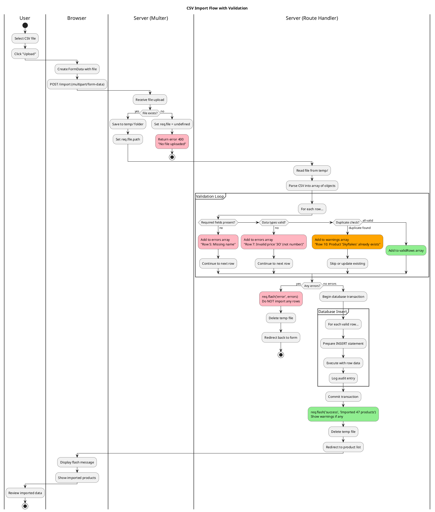

# CSV Import Flow Diagram (PlantUML)

## Purpose
Show the complete process of importing CSV data, including validation and error handling strategies.

## Rendering
Use PlantUML online server (plantuml.com/plantuml) or VS Code PlantUML extension.

## Diagram



## Validation Strategy

**Three categories:**

1. **Errors (⛔ Block import):**
   - Missing required fields
   - Invalid data types (text where number expected)
   - Foreign key violations (category_id doesn't exist)
   - If ANY errors, import NOTHING (all-or-nothing)

2. **Warnings (⚠️ Allow with notice):**
   - Duplicates (skip or update)
   - Data normalized (trimmed whitespace)
   - Default values applied
   - Import continues, but show warnings

3. **Success (✅):**
   - All rows valid
   - Transaction committed
   - Audit log recorded
   - Flash success message

## Code Pattern

```javascript
const errors = [];
const warnings = [];
const validRows = [];

rows.forEach((row, index) => {
  const rowNumber = index + 2; // +2 for header and 1-based

  // Check required fields
  if (!row.name || !row.price) {
    errors.push(`Row ${rowNumber}: Missing required fields`);
    return; // Skip to next row
  }

  // Check data types
  if (isNaN(parseFloat(row.price))) {
    errors.push(`Row ${rowNumber}: Invalid price "${row.price}"`);
    return;
  }

  // Check duplicates
  const exists = db.prepare('SELECT id FROM products WHERE name = ?').get(row.name);
  if (exists) {
    warnings.push(`Row ${rowNumber}: Product "${row.name}" already exists (skipped)`);
    return;
  }

  // Valid row!
  validRows.push(row);
});

// Decision point
if (errors.length > 0) {
  req.flash('error', `Import failed: ${errors.join(', ')}`);
  return res.redirect('/import');
}

// Proceed with import
const insertStmt = db.prepare('INSERT INTO products (name, price, stock) VALUES (?, ?, ?)');
validRows.forEach(row => {
  insertStmt.run(row.name, parseFloat(row.price), parseInt(row.stock || 0));
});

let message = `Successfully imported ${validRows.length} products`;
if (warnings.length > 0) {
  message += `. Warnings: ${warnings.join(', ')}`;
}
req.flash('success', message);
```

## Common CSV Issues

| Issue | Example | Solution |
|-------|---------|----------|
| Missing quotes | `Choc-Nut, PHP 5.50` | Use csv-parse with `relax_quotes: true` |
| Different delimiter | `Skyflakes;35.50;100` | Set `delimiter: ';'` |
| Extra spaces | `"  Lucky Me  "` | Use `trim: true` option |
| Wrong encoding | `ñ` (ñ) | Set `encoding: 'utf8'` |
| Excel dates | `44927` (2023-01-15) | Parse with Excel date formula |

## Related Concepts
- Web App Basics Part 2C: Section 3 (CSV Import)
- Multer middleware for file uploads
- Database transactions (all-or-nothing)
- Data validation strategies
