# DataTables Decision Tree - Client-Side vs Server-Side (Graphviz)

## Purpose
Clean, hierarchical decision tree using Graphviz's DOT language with custom styling to emphasize critical decision points in choosing DataTables processing mode.

## Rendering
**VS Code:** Install "Graphviz Preview" extension  
**Online:** Copy code to [dreampuf.github.io/GraphvizOnline](https://dreampuf.github.io/GraphvizOnline)  
**CLI:** `dot -Tpng 04-datatables-decision-graphviz.md -o datatables-decision.png`

## Diagram

```dot
digraph DataTablesDecision {
  rankdir=TB;
  node [shape=box, style="rounded,filled", fontname="Arial", fontsize=11];
  edge [fontname="Arial", fontsize=10];
  
  // Start
  start [label="Need table features:\nsorting, search, pagination", shape=oval, fillcolor="#E0F7FA", style=filled];
  
  // Main decision
  decision_size [label="How many rows\nin your table?", shape=diamond, fillcolor="#E1BEE7", style=filled, penwidth=3];
  
  // Security decision
  decision_security [label="Sensitive data?\nNeed access control?", shape=diamond, fillcolor="#FFD700", style=filled, penwidth=3];
  
  // === CLIENT-SIDE PATH ===
  client_answer [label="< 1,000 rows\nNo security concerns", fillcolor="#90EE90", style="filled,bold", penwidth=2];
  
  client_choice [label="✅ USE CLIENT-SIDE\nDATATABLES", fillcolor="#4CAF50", fontcolor="white", style="filled,bold", penwidth=4];
  
  client_implementation [label="Implementation Steps:\n\n1. Load all data in EJS:\n   const products = db.prepare(\n     'SELECT * FROM products'\n   ).all();\n   res.render('list', {products});\n\n2. Render full table in HTML:\n   <table id=\"table\">\n     <% products.forEach(p => { %>\n       <tr><td><%= p.name %></td></tr>\n     <% }); %>\n   </table>\n\n3. Initialize DataTables:\n   $('#table').DataTable({\n     pageLength: 25\n   });", fillcolor="#90EE90", style=filled];
  
  client_pros [label="✅ Benefits:\n\n• Instant sorting/filtering\n  (no server delay)\n• Works offline\n• No server load\n• Simple code (3 lines!)\n• Best user experience", fillcolor="#C8E6C9", style=filled];
  
  client_cons [label="⚠️ Drawbacks:\n\n• Large initial HTML payload\n• Slow first page load if many rows\n• All data sent to browser\n  (privacy/security risk)\n• Limited to ~1,000 rows max", fillcolor="#FFE0B2", style=filled];
  
  // === SERVER-SIDE PATH ===
  server_answer [label="> 1,000 rows\nOR security concerns", fillcolor="#87CEEB", style="filled,bold", penwidth=2];
  
  server_choice [label="✅ USE SERVER-SIDE\nDATATABLES", fillcolor="#0288D1", fontcolor="white", style="filled,bold", penwidth=4];
  
  server_implementation [label="Implementation Steps:\n\n1. Create API endpoint:\n   app.get('/api/products', (req, res) => {\n     const start = req.query.start;\n     const length = req.query.length;\n     const search = req.query.search.value;\n     \n     const data = db.prepare(`\n       SELECT * FROM products\n       WHERE name LIKE ?\n       LIMIT ? OFFSET ?\n     `).all(`%${search}%`, length, start);\n     \n     res.json({\n       draw: req.query.draw,\n       recordsTotal: total,\n       recordsFiltered: filtered,\n       data: data\n     });\n   });\n\n2. Initialize with serverSide:\n   $('#table').DataTable({\n     serverSide: true,\n     ajax: '/api/products'\n   });", fillcolor="#87CEEB", style=filled];
  
  server_pros [label="✅ Benefits:\n\n• Fast initial page load\n• Scales to millions of rows\n• Only send visible data\n  (security!)\n• Reduced bandwidth\n• Server-side access control", fillcolor="#B3E5FC", style=filled];
  
  server_cons [label="⚠️ Drawbacks:\n\n• Server load on every action\n• More complex code\n  (API endpoint required)\n• Slight delay on interactions\n• Requires proper indexing", fillcolor="#FFCCBC", style=filled];
  
  // === QUERY OPTIMIZATION PATH ===
  decision_query [label="Query fast enough?\n(< 100ms)", shape=diamond, fillcolor="#E1BEE7", style=filled];
  
  optimize [label="Optimize Query:\n\n1. Add indexes:\n   CREATE INDEX idx_name\n   ON products(name);\n\n2. Use EXPLAIN:\n   EXPLAIN QUERY PLAN\n   SELECT * FROM products\n   WHERE name LIKE '%s%';\n\n3. Covering indexes:\n   CREATE INDEX idx_cover\n   ON products(name, price, stock);", fillcolor="#FFF9C4", style=filled];
  
  decision_cache [label="Still slow?\nCan cache results?", shape=diamond, fillcolor="#E1BEE7", style=filled];
  
  cache_solution [label="Add Caching:\n\nconst cache = new NodeCache();\n\napp.get('/api/products', (req, res) => {\n  const key = JSON.stringify(req.query);\n  \n  let data = cache.get(key);\n  if (!data) {\n    data = db.prepare('...').all();\n    cache.set(key, data);\n  }\n  \n  res.json(data);\n});\n\n⚠️ Invalidate on updates!", fillcolor="#B2DFDB", style=filled];
  
  hybrid_solution [label="Hybrid Approach:\n\n• Pre-load first page (client-side)\n• Lazy-load additional pages\n• Cache frequent queries\n• Virtual scrolling\n\nBest for variable data sizes", fillcolor="#FFECB3", style=filled];
  
  // === SECURITY PATH ===
  security_override [label="⚠️ SECURITY OVERRIDE\n\nEven if < 1,000 rows,\nuse SERVER-SIDE when:\n\n• User-specific data\n  (orders, records)\n• Financial information\n• Medical records\n• Any sensitive data\n\nReason: Don't send all data\nto browser if user shouldn't\nsee everything!", fillcolor="#FF6B6B", fontcolor="white", style="filled,bold", penwidth=4];
  
  // === EXAMPLES ===
  examples_client [label="Client-Side Examples:\n\n✅ Product catalog (< 500)\n✅ User list (< 200)\n✅ Category list (< 50)\n✅ Settings/config tables\n✅ Small lookup tables", fillcolor="#E8F5E9", style=filled];
  
  examples_server [label="Server-Side Examples:\n\n✅ Audit logs (grows indefinitely)\n✅ Transaction history\n✅ Large product catalogs (> 1,000)\n✅ User activity tracking\n✅ Time-series data\n✅ Customer orders (security!)", fillcolor="#E3F2FD", style=filled];
  
  // === FLOW ===
  start -> decision_security;
  
  // Security path
  decision_security -> security_override [label="Yes\nSensitive", color="#D32F2F", penwidth=3];
  decision_security -> decision_size [label="No\nPublic data", color="#4CAF50", penwidth=2];
  
  security_override -> server_choice [color="#D32F2F", penwidth=3];
  
  // Size-based path
  decision_size -> client_answer [label="< 1,000", color="#4CAF50", penwidth=2];
  decision_size -> server_answer [label="> 1,000", color="#0288D1", penwidth=2];
  
  // Client-side flow
  client_answer -> client_choice [color="#4CAF50", penwidth=2];
  client_choice -> client_implementation [color="#4CAF50"];
  client_implementation -> client_pros [color="#4CAF50"];
  client_implementation -> client_cons [color="#FF6F00"];
  client_pros -> examples_client [style=dashed, color="#4CAF50"];
  
  // Server-side flow
  server_answer -> server_choice [color="#0288D1", penwidth=2];
  server_choice -> server_implementation [color="#0288D1"];
  server_implementation -> server_pros [color="#0288D1"];
  server_implementation -> server_cons [color="#FF6F00"];
  server_pros -> examples_server [style=dashed, color="#0288D1"];
  
  // Optimization path
  server_implementation -> decision_query [label="Check\nperformance", color="#7B1FA2"];
  decision_query -> server_pros [label="Fast", color="#4CAF50"];
  decision_query -> optimize [label="Slow", color="#F57C00", penwidth=2];
  optimize -> decision_cache [color="#F57C00"];
  decision_cache -> cache_solution [label="Yes\nStatic data", color="#00897B"];
  decision_cache -> hybrid_solution [label="No\nReal-time", color="#FF6F00"];
  
  // Subgraphs for grouping
  subgraph cluster_client {
    label="CLIENT-SIDE PROCESSING";
    style=filled;
    color="#E8F5E9";
    {client_answer; client_choice; client_implementation; client_pros; client_cons; examples_client;}
  }
  
  subgraph cluster_server {
    label="SERVER-SIDE PROCESSING";
    style=filled;
    color="#E3F2FD";
    {server_answer; server_choice; server_implementation; server_pros; server_cons; examples_server;}
  }
  
  subgraph cluster_optimize {
    label="OPTIMIZATION STRATEGIES";
    style=filled;
    color="#FFF9C4";
    {decision_query; optimize; decision_cache; cache_solution; hybrid_solution;}
  }
}
```



## Key Insights

1. **Hierarchical structure:**
   - Security check comes FIRST (overrides size considerations)
   - Size check comes second (primary decision factor)
   - Performance optimization comes third (if needed)

2. **Visual emphasis:**
   - Red nodes = Security warnings (critical!)
   - Green = Client-side path (simple, fast)
   - Blue = Server-side path (scalable, secure)
   - Yellow = Optimization strategies
   - Thick borders = Major decisions

3. **Three subgraph clusters:**
   - Client-side processing (green background)
   - Server-side processing (blue background)
   - Optimization strategies (yellow background)

4. **Edge styling:**
   - Thick solid = Primary decision paths
   - Normal solid = Implementation details
   - Dashed = References to examples

## Code Mapping

### Decision Helper Function

```javascript
// utils/datatables-config.js
function getDataTablesConfig(options) {
  const {
    tableName,
    rowCount,
    isSensitive,
    hasComplexQuery,
    queryTimeMs
  } = options;
  
  // RULE 1: Security first!
  if (isSensitive) {
    console.log(`[${tableName}] Using SERVER-SIDE: Sensitive data`);
    return {
      mode: 'server-side',
      reason: 'Security: User-specific or sensitive data',
      apiEndpoint: `/api/${tableName}`,
      requiresAuth: true
    };
  }
  
  // RULE 2: Size check
  if (rowCount > 1000) {
    console.log(`[${tableName}] Using SERVER-SIDE: Large dataset (${rowCount} rows)`);
    return {
      mode: 'server-side',
      reason: `Scalability: ${rowCount} rows exceeds 1,000 limit`,
      apiEndpoint: `/api/${tableName}`,
      recommendAddIndexes: true
    };
  }
  
  // RULE 3: Performance check
  if (hasComplexQuery && queryTimeMs > 100) {
    console.log(`[${tableName}] Using SERVER-SIDE: Slow query (${queryTimeMs}ms)`);
    return {
      mode: 'server-side',
      reason: `Performance: Query takes ${queryTimeMs}ms`,
      apiEndpoint: `/api/${tableName}`,
      recommendOptimization: true,
      optimizationTips: [
        'Add indexes on searched/sorted columns',
        'Use EXPLAIN QUERY PLAN to analyze',
        'Consider caching if data is static'
      ]
    };
  }
  
  // DEFAULT: Client-side (best UX)
  console.log(`[${tableName}] Using CLIENT-SIDE: Small, simple dataset (${rowCount} rows)`);
  return {
    mode: 'client-side',
    reason: 'Simple dataset with fast interactions',
    pageLength: 25
  };
}

module.exports = { getDataTablesConfig };
```

### Usage in Routes

```javascript
const { getDataTablesConfig } = require('./utils/datatables-config');

// Products table
app.get('/products', requireAuth, (req, res) => {
  const productCount = db.prepare('SELECT COUNT(*) as count FROM products').get().count;
  
  const config = getDataTablesConfig({
    tableName: 'products',
    rowCount: productCount,
    isSensitive: false,
    hasComplexQuery: false
  });
  
  if (config.mode === 'client-side') {
    // Load all data
    const products = db.prepare('SELECT * FROM products ORDER BY name').all();
    res.render('products/list-client', { products, config });
  } else {
    // Render empty table, load via AJAX
    res.render('products/list-server', { config });
  }
});

// Orders table (security-first!)
app.get('/orders', requireAuth, (req, res) => {
  const config = getDataTablesConfig({
    tableName: 'orders',
    rowCount: 500,  // Even though < 1,000
    isSensitive: true,  // Override: use server-side!
    hasComplexQuery: false
  });
  
  // Always server-side for orders (user-specific)
  res.render('orders/list-server', { config });
});

// Audit log (large dataset)
app.get('/admin/audit', requireAdmin, (req, res) => {
  const auditCount = db.prepare('SELECT COUNT(*) as count FROM audit_log').get().count;
  
  const config = getDataTablesConfig({
    tableName: 'audit',
    rowCount: auditCount,  // Likely > 1,000
    isSensitive: true,
    hasComplexQuery: true,  // JOINs users table
    queryTimeMs: 150  // Measured query time
  });
  
  res.render('admin/audit-log', { config });
});
```

### Client-Side Template

```ejs
<!-- views/products/list-client.ejs -->
<!DOCTYPE html>
<html>
<head>
  <link rel="stylesheet" href="https://cdn.datatables.net/1.13.6/css/jquery.dataTables.min.css">
</head>
<body>
  <h1>Products</h1>
  <p><small>Mode: <%= config.mode %> | Reason: <%= config.reason %></small></p>
  
  <table id="productsTable" class="display">
    <thead>
      <tr>
        <th>ID</th>
        <th>Name</th>
        <th>Price</th>
        <th>Stock</th>
        <th>Category</th>
      </tr>
    </thead>
    <tbody>
      <% products.forEach(product => { %>
        <tr>
          <td><%= product.id %></td>
          <td><%= product.name %></td>
          <td>₱<%= product.price.toFixed(2) %></td>
          <td><%= product.stock %></td>
          <td><%= product.category %></td>
        </tr>
      <% }); %>
    </tbody>
  </table>
  
  <script src="https://code.jquery.com/jquery-3.7.0.min.js"></script>
  <script src="https://cdn.datatables.net/1.13.6/js/jquery.dataTables.min.js"></script>
  
  <script>
    $(document).ready(function() {
      $('#productsTable').DataTable({
        pageLength: <%= config.pageLength || 25 %>,
        order: [[1, 'asc']]
      });
    });
  </script>
</body>
</html>
```

### Server-Side Template

```ejs
<!-- views/products/list-server.ejs -->
<!DOCTYPE html>
<html>
<head>
  <link rel="stylesheet" href="https://cdn.datatables.net/1.13.6/css/jquery.dataTables.min.css">
</head>
<body>
  <h1>Products</h1>
  <p><small>Mode: <%= config.mode %> | Reason: <%= config.reason %></small></p>
  
  <% if (config.recommendOptimization) { %>
    <div class="alert alert-warning">
      <strong>Performance Tips:</strong>
      <ul>
        <% config.optimizationTips.forEach(tip => { %>
          <li><%= tip %></li>
        <% }); %>
      </ul>
    </div>
  <% } %>
  
  <table id="productsTable" class="display">
    <thead>
      <tr>
        <th>ID</th>
        <th>Name</th>
        <th>Price</th>
        <th>Stock</th>
        <th>Category</th>
      </tr>
    </thead>
    <tbody>
      <!-- Loaded via AJAX -->
    </tbody>
  </table>
  
  <script src="https://code.jquery.com/jquery-3.7.0.min.js"></script>
  <script src="https://cdn.datatables.net/1.13.6/js/jquery.dataTables.min.js"></script>
  
  <script>
    $(document).ready(function() {
      $('#productsTable').DataTable({
        serverSide: true,
        processing: true,
        ajax: '<%= config.apiEndpoint %>',
        columns: [
          { data: 'id' },
          { data: 'name' },
          { 
            data: 'price',
            render: function(data) {
              return '₱' + parseFloat(data).toFixed(2);
            }
          },
          { data: 'stock' },
          { data: 'category' }
        ],
        pageLength: 25,
        order: [[1, 'asc']]
      });
    });
  </script>
</body>
</html>
```

### Server-Side API with Optimization

```javascript
// routes/api.js
const NodeCache = require('node-cache');
const cache = new NodeCache({ stdTTL: 600 }); // 10 min

app.get('/api/products', requireAuth, (req, res) => {
  const draw = parseInt(req.query.draw);
  const start = parseInt(req.query.start) || 0;
  const length = parseInt(req.query.length) || 10;
  const search = req.query.search?.value || '';
  const orderColumnIndex = parseInt(req.query.order?.[0]?.column) || 0;
  const orderDirection = req.query.order?.[0]?.dir || 'asc';
  
  // Map column index to name
  const columns = ['id', 'name', 'price', 'stock', 'category'];
  const orderColumn = columns[orderColumnIndex];
  
  // Cache key
  const cacheKey = `products:${start}:${length}:${search}:${orderColumn}:${orderDirection}`;
  
  let result = cache.get(cacheKey);
  
  if (!result) {
    // Build query
    let whereClause = '';
    let params = [];
    
    if (search) {
      whereClause = 'WHERE name LIKE ? OR category LIKE ?';
      params = [`%${search}%`, `%${search}%`];
    }
    
    // Counts
    const totalRecords = db.prepare('SELECT COUNT(*) as count FROM products').get().count;
    const filteredRecords = db.prepare(`
      SELECT COUNT(*) as count FROM products ${whereClause}
    `).get(...params).count;
    
    // Data (uses indexes on name and category)
    const products = db.prepare(`
      SELECT id, name, price, stock, category
      FROM products
      ${whereClause}
      ORDER BY ${orderColumn} ${orderDirection}
      LIMIT ? OFFSET ?
    `).all(...params, length, start);
    
    result = {
      draw: draw,
      recordsTotal: totalRecords,
      recordsFiltered: filteredRecords,
      data: products
    };
    
    cache.set(cacheKey, result);
  } else {
    result.draw = draw;  // Update draw number
  }
  
  res.json(result);
});

// Invalidate cache on updates
app.post('/products/:id/edit', requireAdmin, (req, res) => {
  // Update product...
  cache.flushAll();
  res.redirect('/products');
});
```

## Common Mistakes

1. **Ignoring security implications:**
   ```javascript
   // ❌ Using client-side for user-specific data
   app.get('/orders', (req, res) => {
     const allOrders = db.prepare('SELECT * FROM orders').all();
     res.render('orders', { allOrders });
     // Customer can inspect HTML and see everyone's orders!
   });
   
   // ✅ Use server-side with access control
   app.get('/api/orders', (req, res) => {
     const userOrders = db.prepare(`
       SELECT * FROM orders WHERE user_id = ?
     `).all(res.locals.user.id);
     res.json({ data: userOrders });
   });
   ```

2. **Not testing with realistic data:**
   ```javascript
   // ❌ Testing with 10 sample rows (works great!)
   // Production: 50,000 rows (browser crashes)
   
   // ✅ Generate realistic test data
   const faker = require('faker');
   for (let i = 0; i < 5000; i++) {
     db.prepare('INSERT INTO products...').run(
       faker.commerce.productName(),
       faker.commerce.price(),
       faker.datatype.number({ min: 0, max: 100 })
     );
   }
   // Now test both approaches and measure performance
   ```

3. **Missing indexes on searched columns:**
   ```javascript
   // ❌ No indexes (full table scan every search)
   const products = db.prepare(`
     SELECT * FROM products
     WHERE name LIKE ? OR category LIKE ?
   `).all(`%${search}%`, `%${search}%`);
   // With 10,000 rows: 500ms query time
   
   // ✅ Add indexes
   db.exec(`
     CREATE INDEX IF NOT EXISTS idx_products_name ON products(name);
     CREATE INDEX IF NOT EXISTS idx_products_category ON products(category);
   `);
   // Same query now: 5ms (100x faster!)
   ```

4. **Not parsing DataTables parameters:**
   ```javascript
   // ❌ Ignoring pagination/sort/search from DataTables
   app.get('/api/products', (req, res) => {
     const products = db.prepare('SELECT * FROM products').all();
     res.json({ data: products });
     // Returns all 10,000 rows every time!
   });
   
   // ✅ Parse and use parameters
   app.get('/api/products', (req, res) => {
     const start = parseInt(req.query.start) || 0;
     const length = parseInt(req.query.length) || 10;
     const search = req.query.search?.value || '';
     
     const products = db.prepare(`
       SELECT * FROM products
       WHERE name LIKE ?
       LIMIT ? OFFSET ?
     `).all(`%${search}%`, length, start);
     
     res.json({
       draw: req.query.draw,
       recordsTotal: total,
       recordsFiltered: filtered,
       data: products  // Only 10-25 rows
     });
   });
   ```

5. **Forgetting to invalidate cache:**
   ```javascript
   // ❌ Cache never cleared (shows stale data)
   app.post('/products/:id/edit', (req, res) => {
     db.prepare('UPDATE products...').run(...);
     res.redirect('/products');
     // Cache still has old data!
   });
   
   // ✅ Clear cache on updates
   app.post('/products/:id/edit', (req, res) => {
     db.prepare('UPDATE products...').run(...);
     cache.flushAll();  // Clear all cached queries
     res.redirect('/products');
   });
   ```

## Related Concepts
- Web App Basics Part 2C: Section 8 (DataTables)
- SQL LIMIT and OFFSET (pagination)
- Database indexing (B-tree, covering indexes)
- AJAX and JSON APIs
- Caching strategies (in-memory, Redis)
- Role-based access control (RBAC)
- Query optimization (EXPLAIN, profiling)
