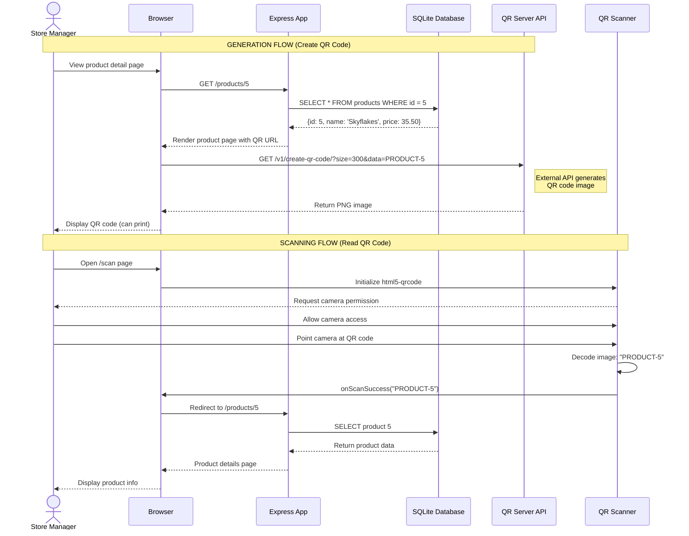

# QR Code Generation & Scanning Flow (Mermaid Alternative)

## Purpose
Show how QR codes work in a web app: generation using an API and scanning with a web-based scanner.

## Rendering
Use Mermaid Live Editor (mermaid.live) or VS Code Mermaid extension.

## Diagram



## Generation vs Scanning

### Generation (Server → QR Image)

**Method:** Use QR Server API (no library needed!)

```html
" 
     alt="Product QR">
```

**Flow:**
1. User views product page
2. Browser requests QR image from API
3. API generates PNG/SVG
4. Browser displays image
5. User can print label

**Benefits:**
- ✅ No server-side code needed
- ✅ No npm packages needed
- ✅ Works in any browser
- ✅ Can customize colors/size
- ✅ Free (no API key)

---

### Scanning (QR Image → Data)

**Method:** Use html5-qrcode library

```html
<div id="reader"></div>
<script src="https://unpkg.com/html5-qrcode"></script>
<script>
  const scanner = new Html5Qrcode("reader");
  scanner.start(
    { facingMode: "environment" }, // Back camera
    { fps: 10, qrbox: 250 },       // Scan settings
    (decodedText) => {
      // Successfully scanned!
      const productId = decodedText.replace('PRODUCT-', '');
      window.location.href = `/products/${productId}`;
    }
  );
</script>
```

**Flow:**
1. User opens scanner page
2. Browser requests camera permission
3. Library continuously scans camera feed
4. When QR detected, extract data
5. Redirect to product page

**Requirements:**
- ✅ HTTPS (camera needs secure connection)
- ✅ Camera permission granted
- ✅ Good lighting

---

## QR Code Data Formats

### Simple ID
```
PRODUCT-5
→ Scan redirects to /products/5
```

### Full URL
```
https://mystore.com/products/5
→ Can open in any app (not just your web app)
```

### JSON Data (Advanced)
```
{"type":"product","id":5,"checksum":"abc123"}
→ More secure, can validate integrity
```

## API Customization

```
https://api.qrserver.com/v1/create-qr-code/
  ?size=400x400                    # Larger size
  &data=https://mystore.com/p/5    # Full URL
  &color=2B5329                    # Dark green foreground
  &bgcolor=E8F5E9                  # Light green background
  &format=svg                      # Vector (scalable)
```

**Result:** Colorful, branded QR code that scales perfectly!

## Practical Use Cases

| Project | Generation | Scanning | Purpose |
|---------|-----------|----------|---------|
| **Store Inventory** | Product detail page | POS system | Quick product lookup |
| **Barangay Directory** | Resident ID card | Gate scanner | Access control |
| **Class List** | Student ID | Attendance kiosk | Mark attendance |

## Error Handling

```javascript
scanner.start(
  { facingMode: "environment" },
  { fps: 10 },
  (decodedText) => {
    // Success!
    handleScan(decodedText);
  },
  (errorMessage) => {
    // Scanning... (ignore these continuous errors)
    // Only show critical errors:
    if (errorMessage.includes('NotAllowedError')) {
      alert('Camera permission denied! Please allow camera access.');
    }
  }
);
```

## Offline Considerations

**Generation:**
- ✅ QR code image can be saved/printed
- ✅ Works offline once loaded
- ✅ No internet needed to scan

**Scanning:**
- ✅ Scanner works offline
- ❌ Redirecting to product page needs internet (fetches from database)

**Solution:** Cache product data in browser for offline viewing.

## Related Concepts
- Web App Basics Part 2C: Section 4 (QR Codes)
- QR Server API (goqr.me/api)
- html5-qrcode library
- Camera API and permissions
- Mobile-responsive design
