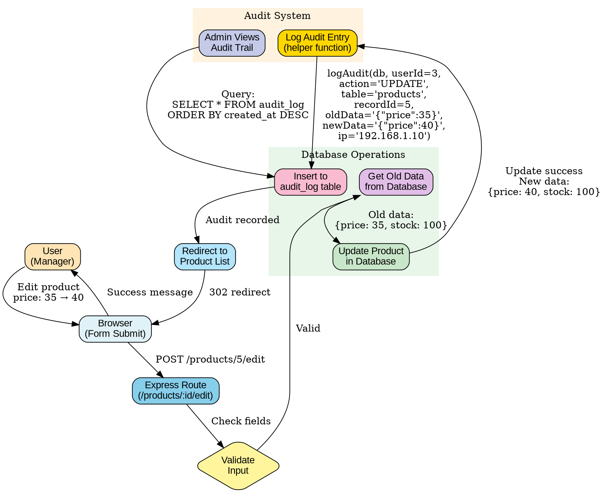

# Audit Log Flow Diagram (Graphviz)

## Purpose
Show how audit logging captures WHO did WHAT, WHEN, tracking all database changes for accountability.

## Rendering
Use Graphviz Online (dreampuf.github.io/GraphvizOnline) or `dot` command.

## Diagram



## What Gets Logged

### Audit Log Table Schema

```sql
CREATE TABLE audit_log (
  id INTEGER PRIMARY KEY AUTOINCREMENT,
  user_id INTEGER NOT NULL,          -- WHO did it
  action TEXT NOT NULL,               -- WHAT they did (CREATE/UPDATE/DELETE)
  table_name TEXT NOT NULL,           -- WHICH table affected
  record_id INTEGER NOT NULL,         -- WHICH record changed
  old_data TEXT,                      -- Data BEFORE change (JSON)
  new_data TEXT,                      -- Data AFTER change (JSON)
  ip_address TEXT,                    -- From where
  created_at DATETIME DEFAULT CURRENT_TIMESTAMP, -- WHEN
  FOREIGN KEY (user_id) REFERENCES users(id)
);
```

### Example Entries

```
| id | user_id | action | table_name | record_id | old_data             | new_data             | ip_address    | created_at          |
|----|---------|--------|------------|-----------|----------------------|----------------------|---------------|---------------------|
| 1  | 3       | CREATE | products   | 5         | null                 | {"name":"Skyflakes", | 192.168.1.10  | 2025-11-11 10:30:00 |
|    |         |        |            |           |                      |  "price":35}         |               |                     |
| 2  | 3       | UPDATE | products   | 5         | {"price":35}         | {"price":40}         | 192.168.1.10  | 2025-11-11 14:20:00 |
| 3  | 3       | DELETE | products   | 5         | {"name":"Skyflakes", | null                 | 192.168.1.10  | 2025-11-11 16:45:00 |
|    |         |        |            |           |  "price":40}         |                      |               |                     |
```

## Helper Function

```javascript
function logAudit(db, userId, action, tableName, recordId, oldData, newData, ipAddress) {
  db.prepare(`
    INSERT INTO audit_log (user_id, action, table_name, record_id, old_data, new_data, ip_address)
    VALUES (?, ?, ?, ?, ?, ?, ?)
  `).run(
    userId,
    action,
    tableName,
    recordId,
    oldData ? JSON.stringify(oldData) : null,
    newData ? JSON.stringify(newData) : null,
    ipAddress
  );
}
```

## Usage in Routes

### CREATE (New Product)
```javascript
app.post('/products', requireAdmin, (req, res) => {
  const result = db.prepare('INSERT INTO products (name, price) VALUES (?, ?)').run(
    req.body.name,
    req.body.price
  );
  
  logAudit(
    db,
    res.locals.user.id,      // WHO
    'CREATE',                // WHAT
    'products',              // WHERE
    result.lastInsertRowid,  // WHICH
    null,                    // No old data
    { name: req.body.name, price: req.body.price }, // New data
    req.ip                   // From where
  );
  
  res.redirect('/products');
});
```

### UPDATE (Edit Product)
```javascript
app.post('/products/:id/edit', requireAdmin, (req, res) => {
  // Get old data BEFORE update
  const oldData = db.prepare('SELECT * FROM products WHERE id = ?').get(req.params.id);
  
  // Perform update
  db.prepare('UPDATE products SET name = ?, price = ? WHERE id = ?').run(
    req.body.name,
    req.body.price,
    req.params.id
  );
  
  // Log with old and new data
  logAudit(
    db,
    res.locals.user.id,
    'UPDATE',
    'products',
    req.params.id,
    { name: oldData.name, price: oldData.price },  // Old values
    { name: req.body.name, price: req.body.price }, // New values
    req.ip
  );
  
  res.redirect('/products');
});
```

### DELETE (Remove Product)
```javascript
app.post('/products/:id/delete', requireAdmin, (req, res) => {
  // Get data BEFORE delete
  const oldData = db.prepare('SELECT * FROM products WHERE id = ?').get(req.params.id);
  
  // Delete record
  db.prepare('DELETE FROM products WHERE id = ?').run(req.params.id);
  
  // Log deletion
  logAudit(
    db,
    res.locals.user.id,
    'DELETE',
    'products',
    req.params.id,
    { name: oldData.name, price: oldData.price }, // Preserve deleted data
    null,                                         // No new data
    req.ip
  );
  
  res.redirect('/products');
});
```

## Viewing Audit Trail

```javascript
app.get('/admin/audit', requireAdmin, (req, res) => {
  const logs = db.prepare(`
    SELECT 
      a.*,
      u.name as user_name
    FROM audit_log a
    JOIN users u ON a.user_id = u.id
    ORDER BY a.created_at DESC
    LIMIT 100
  `).all();
  
  res.render('admin/audit', { logs: logs });
});
```

## Benefits

1. **Accountability:** Know WHO made each change
2. **History:** See WHAT was changed (before/after)
3. **Troubleshooting:** Track down when bugs were introduced
4. **Compliance:** Required for regulated industries (healthcare, finance)
5. **Undo:** Can restore old data if needed

## Security Considerations

- ⚠️ DON'T log passwords or sensitive data
- ⚠️ DON'T allow users to edit audit logs (admin-only view)
- ✅ DO regularly archive old logs (performance)
- ✅ DO create indices on frequently queried columns

## Related Concepts
- Web App Basics Part 2C: Section 6 (Audit Logging)
- Database triggers (alternative approach)
- Compliance and regulatory requirements
- Data retention policies
