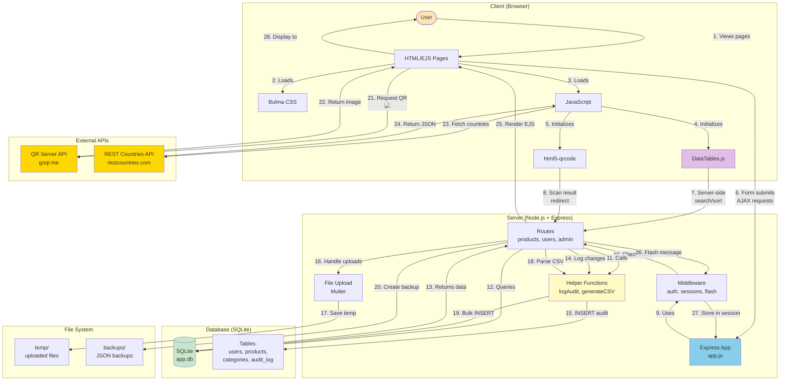
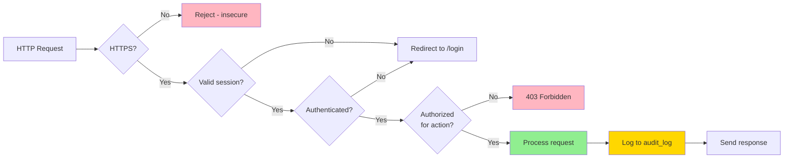

# Part 2C System Architecture (Mermaid)

## Purpose
Show the complete architecture of a Part 2C web application with all advanced features integrated.

## Rendering
Use Mermaid Live Editor (mermaid.live) or VS Code Mermaid extension.

## Diagram



## Component Breakdown

### Client-Side (Browser)

**HTML/EJS Pages:**
- Product lists, forms, detail views
- Admin panels
- Audit trail viewer

**Bulma CSS:**
- Responsive layout
- Forms and tables styling
- Flash message notifications

**JavaScript:**
- DataTables initialization
- QR scanner integration
- REST Countries API calls
- Form validation

**Libraries:**
- **DataTables.js:** Search, sort, paginate, export
- **html5-qrcode:** Scan QR codes with camera
- **jQuery:** Required by DataTables

---

### Server-Side (Node.js + Express)

**Express App (app.js):**
```javascript
const express = require('express');
const session = require('express-session');
const flash = require('connect-flash');
const SqliteStore = require('better-sqlite3-session-store')(session);

const app = express();

// Middleware stack
app.use(express.urlencoded({ extended: true }));
app.use(session({ store: new SqliteStore({ client: db }) }));
app.use(flash());
app.use(requireAuth); // Custom middleware

// Routes
app.use('/products', productsRoutes);
app.use('/admin', adminRoutes);
app.use('/api', apiRoutes);
```

**Middleware:**
- **express-session:** Maintains user sessions
- **connect-flash:** One-time messages across redirects
- **requireLogin:** Authentication check
- **requireAdmin:** Authorization check
- **multer:** File upload handling

**Helper Functions:**
```javascript
// helpers.js
function logAudit(db, userId, action, table, recordId, oldData, newData, ip) { ... }
function generateCSV(data) { ... }
function parseCSV(filePath) { ... }
```

---

### Database (SQLite)

**Tables:**
- **users:** Authentication data (hashed passwords)
- **products:** Main application data
- **categories:** Reference data
- **audit_log:** Change tracking (WHO, WHAT, WHEN)

**Prepared Statements:**
```javascript
const stmt = db.prepare('SELECT * FROM products WHERE id = ?');
const product = stmt.get(5);
```

**Transactions:**
```javascript
const insert = db.prepare('INSERT INTO products ...');
db.transaction(() => {
  validRows.forEach(row => insert.run(row));
})();
```

---

### External APIs

**QR Server API (goqr.me):**
- **Usage:** Generate QR codes as images
- **Cost:** Free, no API key needed
- **Method:** Simple `` tag with URL
- **Example:** `https://api.qrserver.com/v1/create-qr-code/?size=300&data=PRODUCT-5`

**REST Countries API (restcountries.com):**
- **Usage:** Get country data with flags
- **Cost:** Free, no API key needed
- **Method:** JavaScript `fetch()` from client
- **Example:** `fetch('https://restcountries.com/v3.1/all')`

---

### File System

**temp/ folder:**
- Temporary storage for uploaded CSV files
- Files deleted after processing
- Used by Multer middleware

**backups/ folder:**
- JSON database backups
- Created manually or via cron
- Full database export in JSON format

---

## Data Flow Examples

### 1. Product Creation (with Audit Log)
```
User fills form → POST /products
→ Middleware checks auth
→ Route validates data
→ INSERT into products table
→ Call logAudit helper
→ INSERT into audit_log table
→ Flash success message
→ Redirect to /products
→ Display success notification
```

### 2. CSV Import
```
User uploads CSV → POST /import (multipart)
→ Multer saves to temp/
→ Route reads file
→ Parse CSV to array
→ Validate each row
→ Transaction: bulk INSERT
→ Log audit entries
→ Delete temp file
→ Flash success message
→ Redirect to /products
```

### 3. DataTables Server-Side Search
```
User types in search box → AJAX to /api/products/search?q=sky
→ Route queries database: WHERE name LIKE '%sky%'
→ Return JSON: {data: [...], recordsTotal: 200, recordsFiltered: 5}
→ DataTables updates table
→ No page reload!
```

### 4. QR Code Display
```
User views product → GET /products/5
→ Route queries database
→ Render EJS with product data
→ Browser loads page with 
→ External API generates QR image
→ Browser displays QR code
```

---

## Technology Stack Summary

| Layer | Technology | Purpose |
|-------|-----------|---------|
| **Frontend** | HTML/EJS | Dynamic page rendering |
| | Bulma CSS | Responsive styling |
| | DataTables.js | Enhanced tables |
| | html5-qrcode | QR scanning |
| | JavaScript | Client interactivity |
| **Backend** | Node.js | Runtime environment |
| | Express | Web framework |
| | better-sqlite3 | Database driver |
| | bcrypt | Password hashing |
| | express-session | Session management |
| | connect-flash | Flash messages |
| | multer | File uploads |
| | csv-parse | CSV parsing |
| | csv-writer | CSV generation |
| **Database** | SQLite | Relational database |
| **External** | QR Server API | QR code generation |
| | REST Countries | Country data |
| **Deployment** | Railway | Cloud hosting |

---

## Security Layers



---

## Complete Feature Checklist

**Part 2A (Database):**
- ✅ SQLite database with better-sqlite3
- ✅ Prepared statements (SQL injection prevention)
- ✅ Foreign keys and constraints

**Part 2B (Authentication):**
- ✅ User registration with bcrypt
- ✅ Login/logout with sessions
- ✅ Role-based access control (admin/user)
- ✅ Password change functionality

**Part 2C (Advanced Features):**
- ✅ DataTables.js (search, sort, export)
- ✅ Flash messages (user feedback)
- ✅ CSV export/import (data portability)
- ✅ QR code generation (easy sharing)
- ✅ REST Countries API (external data)
- ✅ Audit logging (accountability)
- ✅ JSON backup/restore (disaster recovery)

**Deployment:**
- ✅ Environment variables (secrets)
- ✅ Production database
- ✅ HTTPS (secure connections)

---

## Related Concepts
- Web App Basics Part 2C: All Sections
- MVC architecture pattern
- RESTful API design
- Security best practices
- Scalability considerations
