# JSON Backup & Restore - Database Export/Import (Graphviz)

## Purpose
Clean hierarchical visualization emphasizing the transaction boundary and error handling for database backup and restore operations.

## Rendering
**VS Code:** Install "Graphviz Preview" extension  
**Online:** [dreampuf.github.io/GraphvizOnline](https://dreampuf.github.io/GraphvizOnline)  
**CLI:** `dot -Tpng 07-json-backup-restore-graphviz.md -o backup-restore.png`

## Diagram

```dot
digraph BackupRestore {
  rankdir=TB;
  node [shape=box, style="rounded,filled", fontname="Arial", fontsize=10];
  edge [fontname="Arial", fontsize=9];
  
  // Start
  start [label="Manager:\nBackup or Restore?", shape=oval, fillcolor="#E0F7FA"];
  
  // === BACKUP FLOW ===
  backup_start [label="GET /admin/backup/export", fillcolor="#90EE90"];
  
  query_tables [label="Query all tables:\n• SELECT * FROM users\n• SELECT * FROM products\n• SELECT * FROM orders\n• SELECT * FROM order_items\n• SELECT * FROM audit_log", fillcolor="#90EE90"];
  
  build_json [label="Build backup object:\nbackupData = {\n  metadata: {...},\n  users: [...],\n  products: [...],\n  orders: [...],\n  order_items: [...],\n  audit_log: [...]\n}", fillcolor="#90EE90"];
  
  format_json [label="Format JSON:\nJSON.stringify(\n  backupData,\n  null,\n  2  // Pretty print\n)", fillcolor="#90EE90"];
  
  save_file [label="Save to file system:\nfilename:\n  backup_2024-11-11_14-30-00.json\n\nfs.writeFileSync(\n  filepath, jsonString\n)", fillcolor="#90EE90"];
  
  download_backup [label="Send to browser:\nres.download(\n  filepath,\n  filename\n)\n\nManager saves locally", fillcolor="#90EE90"];
  
  backup_success [label="✅ Backup Complete\n\nFlash: 'X rows exported'", fillcolor="#4CAF50", fontcolor="white", style="filled,bold"];
  
  // === RESTORE FLOW ===
  restore_form [label="GET /admin/backup/restore\n\nShow upload form\nwith warning", fillcolor="#87CEEB"];
  
  upload_file [label="POST /admin/backup/restore\n\nManager uploads\nbackup JSON file", fillcolor="#87CEEB"];
  
  read_file [label="Read uploaded file:\nconst jsonString =\n  fs.readFileSync(\n    req.file.path,\n    'utf-8'\n  )", fillcolor="#87CEEB"];
  
  parse_json [label="Parse JSON:\ntry {\n  backupData =\n    JSON.parse(jsonString);\n} catch (err) {\n  throw 'Invalid JSON';\n}", fillcolor="#87CEEB"];
  
  validate_structure [label="Validate structure:\nif (!backupData.users ||\n    !backupData.products) {\n  throw 'Missing data';\n}", fillcolor="#87CEEB"];
  
  // Transaction boundary
  begin_transaction [label="🔒 BEGIN TRANSACTION", shape=box, fillcolor="#FFD700", style="filled,bold", penwidth=4];
  
  clear_tables [label="Clear existing data:\n(ORDER MATTERS!)\n\nDELETE FROM order_items;\nDELETE FROM orders;\nDELETE FROM audit_log;\nDELETE FROM qr_scans;\nDELETE FROM products;\nDELETE FROM users;", fillcolor="#FFA500", fontcolor="white", style="filled,bold"];
  
  insert_users [label="Insert users:\nINSERT INTO users\nVALUES (...);\n\nbackupData.users.forEach(\n  user => insertStmt.run(...)\n)", fillcolor="#87CEEB"];
  
  insert_products [label="Insert products:\nINSERT INTO products\nVALUES (...);\n\nbackupData.products.forEach(\n  product => insertStmt.run(...)\n)", fillcolor="#87CEEB"];
  
  insert_orders [label="Insert orders:\nINSERT INTO orders\nVALUES (...);\n\nbackupData.orders.forEach(\n  order => insertStmt.run(...)\n)", fillcolor="#87CEEB"];
  
  insert_order_items [label="Insert order_items:\nINSERT INTO order_items\nVALUES (...);\n\nbackupData.order_items.forEach(\n  item => insertStmt.run(...)\n)", fillcolor="#87CEEB"];
  
  insert_audit [label="Insert audit_log:\nINSERT INTO audit_log\nVALUES (...);\n\nbackupData.audit_log.forEach(\n  log => insertStmt.run(...)\n)", fillcolor="#87CEEB"];
  
  commit_transaction [label="✅ COMMIT TRANSACTION", shape=box, fillcolor="#4CAF50", fontcolor="white", style="filled,bold", penwidth=4];
  
  log_restore [label="Log restore action:\nlogAudit(\n  db, userId, 'RESTORE',\n  'database', 0,\n  null,\n  {rowsRestored: total},\n  req.ip\n)", fillcolor="#87CEEB"];
  
  cleanup [label="Clean up:\nfs.unlinkSync(\n  req.file.path\n)\n\nDelete uploaded file", fillcolor="#87CEEB"];
  
  restore_success [label="✅ Restore Complete\n\nFlash: 'Database restored!\nX rows imported'", fillcolor="#4CAF50", fontcolor="white", style="filled,bold"];
  
  // Error paths
  error_invalid_json [label="❌ Invalid JSON\n\nFlash: 'Invalid backup file'", fillcolor="#FF6B6B", fontcolor="white", style="filled,bold"];
  
  error_missing_data [label="❌ Missing Data\n\nFlash: 'Backup missing\nrequired data'", fillcolor="#FF6B6B", fontcolor="white", style="filled,bold"];
  
  rollback_transaction [label="❌ ROLLBACK TRANSACTION\n\nDatabase unchanged!", shape=box, fillcolor="#D32F2F", fontcolor="white", style="filled,bold", penwidth=4];
  
  error_restore [label="❌ Restore Failed\n\nFlash: 'Restore failed.\nDatabase unchanged.'", fillcolor="#FF6B6B", fontcolor="white", style="filled,bold"];
  
  // Connections - Backup flow
  start -> backup_start [label="  Backup", color="#4CAF50", penwidth=2];
  backup_start -> query_tables [color="#4CAF50"];
  query_tables -> build_json [color="#4CAF50"];
  build_json -> format_json [color="#4CAF50"];
  format_json -> save_file [color="#4CAF50"];
  save_file -> download_backup [color="#4CAF50"];
  download_backup -> backup_success [color="#4CAF50"];
  
  // Connections - Restore flow
  start -> restore_form [label="  Restore", color="#0288D1", penwidth=2];
  restore_form -> upload_file [color="#0288D1"];
  upload_file -> read_file [color="#0288D1"];
  read_file -> parse_json [color="#0288D1"];
  parse_json -> validate_structure [color="#0288D1"];
  
  // Validation errors
  parse_json -> error_invalid_json [label="  Parse error", color="#D32F2F", style=dashed];
  validate_structure -> error_missing_data [label="  Invalid\n  structure", color="#D32F2F", style=dashed];
  
  // Transaction flow
  validate_structure -> begin_transaction [label="  Valid", color="#0288D1", penwidth=2];
  begin_transaction -> clear_tables [color="#0288D1", penwidth=2];
  clear_tables -> insert_users [color="#0288D1", penwidth=2];
  insert_users -> insert_products [color="#0288D1", penwidth=2];
  insert_products -> insert_orders [color="#0288D1", penwidth=2];
  insert_orders -> insert_order_items [color="#0288D1", penwidth=2];
  insert_order_items -> insert_audit [color="#0288D1", penwidth=2];
  insert_audit -> commit_transaction [color="#0288D1", penwidth=2];
  commit_transaction -> log_restore [color="#0288D1", penwidth=2];
  log_restore -> cleanup [color="#0288D1"];
  cleanup -> restore_success [color="#0288D1"];
  
  // Error handling within transaction
  clear_tables -> rollback_transaction [label="  Error", color="#D32F2F", style=dashed];
  insert_users -> rollback_transaction [label="  Error", color="#D32F2F", style=dashed];
  insert_products -> rollback_transaction [label="  Error", color="#D32F2F", style=dashed];
  insert_orders -> rollback_transaction [label="  Error", color="#D32F2F", style=dashed];
  insert_order_items -> rollback_transaction [label="  Error", color="#D32F2F", style=dashed];
  insert_audit -> rollback_transaction [label="  Error", color="#D32F2F", style=dashed];
  
  rollback_transaction -> error_restore [color="#D32F2F"];
  
  // Subgraphs for visual grouping
  subgraph cluster_backup {
    label="BACKUP FLOW (Safe - Read Only)";
    style=filled;
    color="#E8F5E9";
    {backup_start; query_tables; build_json; format_json; save_file; download_backup; backup_success;}
  }
  
  subgraph cluster_restore {
    label="RESTORE FLOW (Destructive - Transaction Protected)";
    style=filled;
    color="#E3F2FD";
    {restore_form; upload_file; read_file; parse_json; validate_structure; log_restore; cleanup; restore_success;}
  }
  
  subgraph cluster_transaction {
    label="⚠️ TRANSACTION BOUNDARY (All or Nothing)";
    style=filled;
    color="#FFF3E0";
    {begin_transaction; clear_tables; insert_users; insert_products; insert_orders; insert_order_items; insert_audit; commit_transaction;}
  }
  
  subgraph cluster_errors {
    label="ERROR HANDLING";
    style=filled;
    color="#FFEBEE";
    {error_invalid_json; error_missing_data; rollback_transaction; error_restore;}
  }
}
```

## Key Insights

1. **Visual separation:**
   - Green cluster = Backup (safe, read-only)
   - Blue cluster = Restore (destructive, needs validation)
   - Orange cluster = Transaction (all-or-nothing boundary)
   - Red cluster = Error handling

2. **Transaction boundary emphasized:**
   - Yellow box for BEGIN TRANSACTION
   - Green box for COMMIT TRANSACTION
   - Red box for ROLLBACK TRANSACTION
   - Thick borders show critical points

3. **Deletion order shown:**
   - Orange node emphasizes order matters
   - Delete child tables before parent tables
   - Foreign key constraints prevent wrong order

4. **Multiple error paths:**
   - Dashed red arrows show error conditions
   - All errors within transaction trigger rollback
   - Database guaranteed unchanged on failure

## Code Mapping

See `07-json-backup-restore-mermaid.md` for complete code implementation including:
- Backup export route
- Restore upload route with multer
- Transaction-wrapped restore function
- Validation and error handling
- File cleanup

## Related Concepts
- Web App Basics Part 2C: Section 10 (JSON Backup/Restore)
- Database transactions (ACID properties)
- File uploads with multer
- JSON serialization/deserialization
- Foreign key constraints
- Error handling patterns
