# REST API Integration - External Service Communication (Mermaid)

## Purpose
Sequence diagram showing how the sari-sari store integrates with external REST APIs for email notifications, payment processing, and inventory sync.

## Rendering
**VS Code:** Built-in Mermaid support  
**GitHub:** Renders automatically  
**Online:** [mermaid.live](https://mermaid.live)

## Diagram

```mermaid
sequenceDiagram
    participant Customer
    participant Store as Store Web App
    participant DB as SQLite Database
    participant EmailAPI as Email API<br/>(SendGrid/SMTP)
    participant PaymentAPI as Payment API<br/>(PayMongo/Stripe)
    participant InventoryAPI as Inventory API<br/>(Supplier System)
    
    Note over Customer,InventoryAPI: SCENARIO 1: Customer Places Order with Payment
    
    Customer->>Store: POST /checkout<br/>{items, paymentMethod}
    activate Store
    
    Store->>DB: BEGIN TRANSACTION
    activate DB
    
    Store->>DB: SELECT products<br/>WHERE id IN (...)
    DB-->>Store: Product details + stock
    
    Store->>Store: Validate stock:<br/>if (stock < quantity)<br/>  throw 'Out of stock'
    
    Store->>DB: INSERT INTO orders<br/>(user_id, total, status)
    DB-->>Store: order.id = 42
    
    Store->>DB: INSERT INTO order_items<br/>(order_id, product_id, qty)
    DB-->>Store: OK
    
    Store->>DB: UPDATE products<br/>SET stock = stock - qty<br/>WHERE id = ?
    DB-->>Store: OK
    
    Store->>DB: COMMIT TRANSACTION
    deactivate DB
    
    Note right of Store: Order saved,<br/>now process payment
    
    Store->>PaymentAPI: POST /v1/payment-intents<br/>Authorization: Bearer sk_...<br/>{<br/>  amount: 350.00,<br/>  currency: 'PHP',<br/>  orderId: 42<br/>}
    activate PaymentAPI
    
    PaymentAPI-->>Store: 200 OK<br/>{<br/>  id: 'pi_123',<br/>  status: 'requires_action',<br/>  clientSecret: 'pi_123_secret'<br/>}
    deactivate PaymentAPI
    
    Store-->>Customer: Redirect to payment page<br/>with clientSecret
    deactivate Store
    
    Customer->>PaymentAPI: Complete payment<br/>(enter card details)
    activate PaymentAPI
    
    PaymentAPI->>PaymentAPI: Process payment
    
    PaymentAPI-->>Customer: Payment success
    deactivate PaymentAPI
    
    PaymentAPI->>Store: Webhook: POST /webhooks/payment<br/>{<br/>  event: 'payment.succeeded',<br/>  orderId: 42,<br/>  paymentIntentId: 'pi_123'<br/>}
    activate Store
    
    Store->>DB: UPDATE orders<br/>SET status = 'paid',<br/>    payment_id = 'pi_123'<br/>WHERE id = 42
    activate DB
    DB-->>Store: OK
    deactivate DB
    
    Note right of Store: Payment confirmed,<br/>send confirmation email
    
    Store->>EmailAPI: POST /v3/mail/send<br/>Authorization: Bearer SG.xxx<br/>{<br/>  to: 'customer@example.com',<br/>  subject: 'Order Confirmation',<br/>  html: '<h1>Thank you!</h1>...'<br/>}
    activate EmailAPI
    
    EmailAPI-->>Store: 202 Accepted<br/>{messageId: 'msg_123'}
    deactivate EmailAPI
    
    EmailAPI->>Customer: 📧 Email: Order Confirmation #42
    
    Store-->>PaymentAPI: 200 OK (webhook processed)
    deactivate Store
    
    rect rgb(200, 230, 201)
        Note over Customer,InventoryAPI: ✅ ORDER COMPLETE<br/>Payment processed, email sent
    end
    
    Note over Store,InventoryAPI: SCENARIO 2: Low Stock - Reorder from Supplier
    
    Store->>Store: Cron job runs:<br/>node scripts/check-stock.js
    activate Store
    
    Store->>DB: SELECT * FROM products<br/>WHERE stock < reorder_level
    activate DB
    DB-->>Store: Low stock products:<br/>[{id:5, name:'Skyflakes', stock:3}]
    deactivate DB
    
    Store->>InventoryAPI: POST /api/v1/purchase-orders<br/>Authorization: Bearer inv_key_xxx<br/>{<br/>  items: [<br/>    {sku: 'SKY-001', qty: 100}<br/>  ],<br/>  deliveryAddress: '...'<br/>}
    activate InventoryAPI
    
    InventoryAPI->>InventoryAPI: Create purchase order<br/>in supplier system
    
    InventoryAPI-->>Store: 201 Created<br/>{<br/>  poId: 'PO-2024-001',<br/>  status: 'pending',<br/>  estimatedDelivery: '2024-11-15'<br/>}
    deactivate InventoryAPI
    
    Store->>DB: INSERT INTO purchase_orders<br/>(supplier_po_id, product_id,<br/> quantity, status)
    activate DB
    DB-->>Store: OK
    deactivate DB
    
    Store->>EmailAPI: POST /v3/mail/send<br/>{<br/>  to: 'manager@store.com',<br/>  subject: 'Low Stock Alert',<br/>  html: 'PO created: PO-2024-001'<br/>}
    activate EmailAPI
    EmailAPI-->>Store: 202 Accepted
    deactivate EmailAPI
    
    EmailAPI->>Store: 📧 Email to manager:<br/>"Low stock alert: Skyflakes"
    
    deactivate Store
    
    rect rgb(255, 243, 224)
        Note over Store,InventoryAPI: ⚠️ REORDER TRIGGERED<br/>PO sent to supplier
    end
    
    Note over InventoryAPI,Store: SCENARIO 3: Supplier Updates Delivery Status
    
    InventoryAPI->>Store: Webhook: POST /webhooks/inventory<br/>{<br/>  event: 'delivery.completed',<br/>  poId: 'PO-2024-001',<br/>  items: [{sku:'SKY-001', qty:100}]<br/>}
    activate Store
    
    Store->>DB: UPDATE purchase_orders<br/>SET status = 'delivered'<br/>WHERE supplier_po_id = ?
    activate DB
    DB-->>Store: OK
    deactivate DB
    
    Store->>DB: UPDATE products<br/>SET stock = stock + 100<br/>WHERE id = 5
    activate DB
    DB-->>Store: OK
    deactivate DB
    
    Store->>DB: INSERT INTO audit_log<br/>(action: 'STOCK_RECEIVED',<br/> old_data: {stock:3},<br/> new_data: {stock:103})
    activate DB
    DB-->>Store: OK
    deactivate DB
    
    Store-->>InventoryAPI: 200 OK (webhook processed)
    deactivate Store
    
    rect rgb(200, 230, 201)
        Note over Store,InventoryAPI: ✅ STOCK UPDATED<br/>Inventory synced with supplier
    end
```



## Key Insights

1. **Three integration scenarios:**
   - **Payment:** Customer checkout → Payment API → Webhook confirms → Send email
   - **Reorder:** Low stock detected → Create PO in supplier API → Email manager
   - **Sync:** Supplier webhook → Update local stock → Log audit trail

2. **Webhook pattern:**
   - Asynchronous communication (don't wait for external services)
   - Payment API calls webhook when payment completes
   - Inventory API calls webhook when delivery happens
   - Store responds with 200 OK to acknowledge

3. **Transaction safety:**
   - Database transaction wraps order creation
   - External API calls happen AFTER transaction commits
   - If payment fails, order already saved (marked as 'pending')

4. **Error handling (not shown but critical):**
   - Retry failed API calls with exponential backoff
   - Store API keys securely (environment variables)
   - Log all API requests/responses for debugging

## Code Mapping

### Payment Integration (PayMongo/Stripe)

```javascript
// utils/payment.js
const axios = require('axios');

async function createPaymentIntent(orderId, amount) {
  try {
    const response = await axios.post(
      'https://api.paymongo.com/v1/payment_intents',
      {
        data: {
          attributes: {
            amount: Math.round(amount * 100),  // Convert to centavos
            currency: 'PHP',
            payment_method_allowed: ['card', 'gcash'],
            metadata: {
              order_id: orderId
            }
          }
        }
      },
      {
        headers: {
          'Authorization': `Bearer ${process.env.PAYMONGO_SECRET_KEY}`,
          'Content-Type': 'application/json'
        }
      }
    );
    
    return response.data.data;
  } catch (error) {
    console.error('Payment API error:', error.response?.data || error.message);
    throw new Error('Failed to create payment intent');
  }
}

module.exports = { createPaymentIntent };
```

```javascript
// routes/checkout.js
const { createPaymentIntent } = require('../utils/payment');

app.post('/checkout', requireAuth, async (req, res) => {
  try {
    // Calculate total from cart
    const cart = req.session.cart || [];
    const total = cart.reduce((sum, item) => {
      const product = db.prepare('SELECT price FROM products WHERE id = ?').get(item.productId);
      return sum + (product.price * item.quantity);
    }, 0);
    
    // Create order in database (transaction)
    const createOrder = db.transaction(() => {
      // Insert order
      const orderResult = db.prepare(`
        INSERT INTO orders (user_id, total, status)
        VALUES (?, ?, 'pending')
      `).run(res.locals.user.id, total);
      
      const orderId = orderResult.lastInsertRowid;
      
      // Insert order items
      const insertItem = db.prepare(`
        INSERT INTO order_items (order_id, product_id, quantity, price)
        VALUES (?, ?, ?, ?)
      `);
      
      cart.forEach(item => {
        const product = db.prepare('SELECT price FROM products WHERE id = ?').get(item.productId);
        insertItem.run(orderId, item.productId, item.quantity, product.price);
      });
      
      // Update stock
      const updateStock = db.prepare(`
        UPDATE products SET stock = stock - ? WHERE id = ?
      `);
      
      cart.forEach(item => {
        updateStock.run(item.quantity, item.productId);
      });
      
      return orderId;
    });
    
    const orderId = createOrder();
    
    // Create payment intent (external API call)
    const paymentIntent = await createPaymentIntent(orderId, total);
    
    // Clear cart
    req.session.cart = [];
    
    // Redirect to payment page with client secret
    res.render('checkout/payment', {
      orderId,
      clientSecret: paymentIntent.attributes.client_key,
      amount: total
    });
    
  } catch (error) {
    console.error('Checkout error:', error);
    req.flash('error', 'Checkout failed. Please try again.');
    res.redirect('/cart');
  }
});
```

### Payment Webhook Handler

```javascript
// routes/webhooks.js
app.post('/webhooks/payment', express.raw({ type: 'application/json' }), async (req, res) => {
  try {
    const event = req.body;
    
    // Verify webhook signature (security!)
    const signature = req.headers['paymongo-signature'];
    // ... verify signature with secret ...
    
    if (event.type === 'payment_intent.succeeded') {
      const orderId = event.data.attributes.metadata.order_id;
      const paymentIntentId = event.data.id;
      
      // Update order status
      db.prepare(`
        UPDATE orders
        SET status = 'paid', payment_id = ?
        WHERE id = ?
      `).run(paymentIntentId, orderId);
      
      // Get order details
      const order = db.prepare(`
        SELECT o.*, u.username, u.email
        FROM orders o
        JOIN users u ON o.user_id = u.id
        WHERE o.id = ?
      `).get(orderId);
      
      // Send confirmation email
      await sendOrderConfirmation(order);
      
      console.log(`Payment confirmed for order #${orderId}`);
    }
    
    res.status(200).json({ received: true });
    
  } catch (error) {
    console.error('Webhook error:', error);
    res.status(500).json({ error: 'Webhook processing failed' });
  }
});
```

### Email Integration (SendGrid)

```javascript
// utils/email.js
const sgMail = require('@sendgrid/mail');
sgMail.setApiKey(process.env.SENDGRID_API_KEY);

async function sendOrderConfirmation(order) {
  const msg = {
    to: order.email,
    from: 'noreply@sarisaristore.com',
    subject: `Order Confirmation #${order.id}`,
    html: `
      <h1>Thank you for your order!</h1>
      <p>Order #${order.id}</p>
      <p>Total: ₱${order.total.toFixed(2)}</p>
      <p>Status: ${order.status}</p>
      <p>We'll send you another email when your order ships.</p>
    `
  };
  
  try {
    await sgMail.send(msg);
    console.log(`Email sent to ${order.email}`);
  } catch (error) {
    console.error('Email error:', error);
    // Don't throw - email failure shouldn't break the flow
  }
}

module.exports = { sendOrderConfirmation };
```

### Inventory Integration (Supplier API)

```javascript
// scripts/check-stock.js (Run via cron)
const axios = require('axios');
const db = require('../database');

async function checkLowStock() {
  // Find products below reorder level
  const lowStockProducts = db.prepare(`
    SELECT id, name, sku, stock, reorder_level, reorder_quantity
    FROM products
    WHERE stock < reorder_level
  `).all();
  
  for (const product of lowStockProducts) {
    try {
      // Create purchase order with supplier
      const response = await axios.post(
        'https://supplier-api.example.com/api/v1/purchase-orders',
        {
          items: [{
            sku: product.sku,
            quantity: product.reorder_quantity
          }],
          deliveryAddress: '123 Store St, Manila',
          requestedDeliveryDate: new Date(Date.now() + 7 * 24 * 60 * 60 * 1000).toISOString()
        },
        {
          headers: {
            'Authorization': `Bearer ${process.env.INVENTORY_API_KEY}`,
            'Content-Type': 'application/json'
          }
        }
      );
      
      const po = response.data;
      
      // Save PO in database
      db.prepare(`
        INSERT INTO purchase_orders (
          supplier_po_id, product_id, quantity, status, estimated_delivery
        ) VALUES (?, ?, ?, ?, ?)
      `).run(
        po.id,
        product.id,
        product.reorder_quantity,
        'pending',
        po.estimatedDelivery
      );
      
      console.log(`Created PO ${po.id} for ${product.name}`);
      
      // Email manager
      await sendLowStockAlert(product, po);
      
    } catch (error) {
      console.error(`Failed to create PO for ${product.name}:`, error.message);
    }
  }
}

// Run check
checkLowStock().then(() => {
  console.log('Stock check complete');
  process.exit(0);
});
```

### Inventory Webhook Handler

```javascript
// routes/webhooks.js
app.post('/webhooks/inventory', express.json(), (req, res) => {
  try {
    const event = req.body;
    
    if (event.type === 'delivery.completed') {
      const po = db.prepare(`
        SELECT * FROM purchase_orders
        WHERE supplier_po_id = ?
      `).get(event.data.poId);
      
      if (!po) {
        return res.status(404).json({ error: 'PO not found' });
      }
      
      // Update PO status
      db.prepare(`
        UPDATE purchase_orders
        SET status = 'delivered', delivered_at = datetime('now')
        WHERE id = ?
      `).run(po.id);
      
      // Update product stock
      db.prepare(`
        UPDATE products
        SET stock = stock + ?
        WHERE id = ?
      `).run(po.quantity, po.product_id);
      
      // Log audit
      logAudit(
        db,
        1,  // System user
        'STOCK_RECEIVED',
        'products',
        po.product_id,
        null,
        { quantity: po.quantity, poId: event.data.poId },
        req.ip
      );
      
      console.log(`Stock updated for product #${po.product_id}: +${po.quantity}`);
    }
    
    res.status(200).json({ received: true });
    
  } catch (error) {
    console.error('Inventory webhook error:', error);
    res.status(500).json({ error: 'Webhook processing failed' });
  }
});
```

## Common Mistakes

1. **Not handling API errors:**
   ```javascript
   // ❌ No error handling (crashes on API failure)
   const response = await axios.post(paymentAPI, data);
   
   // ✅ Try-catch with fallback
   try {
     const response = await axios.post(paymentAPI, data);
   } catch (error) {
     console.error('API error:', error.message);
     // Fallback: save for retry, notify admin, etc.
   }
   ```

2. **Exposing API keys:**
   ```javascript
   // ❌ Hardcoded API key (exposed in Git!)
   const apiKey = 'sk_live_123abc';
   
   // ✅ Use environment variables
   const apiKey = process.env.PAYMENT_API_KEY;
   ```

3. **Not verifying webhook signatures:**
   ```javascript
   // ❌ Anyone can POST to /webhooks/payment
   app.post('/webhooks/payment', (req, res) => {
     const event = req.body;
     // Process event (no verification!)
   });
   
   // ✅ Verify signature
   app.post('/webhooks/payment', (req, res) => {
     const signature = req.headers['x-webhook-signature'];
     if (!verifySignature(req.body, signature, SECRET)) {
       return res.status(401).send('Invalid signature');
     }
     // Now safe to process
   });
   ```

4. **Blocking on external API calls:**
   ```javascript
   // ❌ Blocking request (slow response)
   app.post('/checkout', async (req, res) => {
     const order = await createOrder();
     await sendEmail(order);  // Waits for email to send!
     res.redirect('/orders');
   });
   
   // ✅ Fire and forget (or use queue)
   app.post('/checkout', async (req, res) => {
     const order = await createOrder();
     sendEmail(order).catch(console.error);  // Don't wait
     res.redirect('/orders');
   });
   ```

5. **Not implementing retry logic:**
   ```javascript
   // ❌ Single attempt (fails permanently)
   await axios.post(api, data);
   
   // ✅ Retry with exponential backoff
   async function apiCallWithRetry(url, data, maxRetries = 3) {
     for (let i = 0; i < maxRetries; i++) {
       try {
         return await axios.post(url, data);
       } catch (error) {
         if (i === maxRetries - 1) throw error;
         await new Promise(resolve => setTimeout(resolve, 1000 * Math.pow(2, i)));
       }
     }
   }
   ```

## Related Concepts
- Web App Basics Part 2C: External API integration
- REST API design
- Webhook security (signature verification)
- Asynchronous processing
- Retry patterns and circuit breakers
