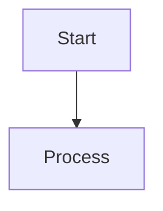

# Advanced Features Diagrams - Part 2C

This folder contains diagram source files for the **Web App Basics Part 2C: Advanced Features** lecture.

## 📁 Diagram Files

| # | Concept | Primary Format | Alternative | Lines | Purpose |
|---|---------|---------------|-------------|-------|---------|
| **01** | DataTables Flow | Mermaid | - | 50 | Client-side vs server-side DataTables decision tree |
| **02** | Flash Message Lifecycle | Mermaid | - | 80 | How flash messages persist across redirects using sessions |
| **03** | CSV Import Flow | PlantUML | Mermaid | 120 / 90 | Complete CSV upload with validation and error handling |
| **04** | QR Code Generation | D2 | Mermaid | 110 / 100 | Generation (API) and scanning (html5-qrcode) flows |
| **05** | Audit Log Flow | Graphviz | Mermaid | 100 / 110 | Tracking WHO did WHAT WHEN with old/new data comparison |
| **06** | System Architecture | Mermaid | - | 150 | Complete Part 2C architecture with all components |

**Total:** 9 diagram source files covering 6 concepts

---

## 🎯 Purpose & Rationale

### Why These Diagrams?

**Part 2C introduces 7 major advanced features:**
1. DataTables.js
2. Flash messages
3. CSV export/import
4. QR codes
5. REST Countries API
6. Audit logging
7. JSON backup/restore

**These 6 diagrams visualize the most complex concepts** where students typically struggle:

#### 1. DataTables Flow (Client vs Server)
**Problem:** Students confused about when to use client-side vs server-side processing.
**Solution:** Decision tree showing data size thresholds and performance trade-offs.

#### 2. Flash Message Lifecycle
**Problem:** "Why do my messages disappear after redirect?"
**Solution:** Sequence diagram showing session storage across POST→Redirect→GET pattern.

#### 3. CSV Import Flow
**Problem:** Validating and handling errors during bulk import.
**Solution:** Complete flowchart with validation loop, error handling, and transaction pattern.

#### 4. QR Code Generation & Scanning
**Problem:** Understanding two-way QR workflow (create and read).
**Solution:** Sequence showing API-based generation and browser-based scanning.

#### 5. Audit Log Flow
**Problem:** Capturing old data before updates and deletions.
**Solution:** Flowchart emphasizing "get old data FIRST" pattern with helper function.

#### 6. System Architecture
**Problem:** Seeing how all Part 2C features fit together.
**Solution:** Complete component diagram showing client, server, database, APIs, and files.

---

## 🛠️ Tool Choices

### Format Distribution

| Tool | Diagrams | Rationale |
|------|----------|-----------|
| **Mermaid** | 6 (including all alternates) | Most versatile, works in VS Code and GitHub |
| **PlantUML** | 1 (CSV import) | Best for complex sequence/activity diagrams |
| **D2** | 1 (QR codes) | Modern styling, good for multi-actor sequences |
| **Graphviz** | 1 (Audit log) | Best for decision trees and state machines |

### Why Multiple Formats?

Per instructor's guidance: *"sometimes the code doesn't work or comes out worse than expected. this way i have options"*

**Every critical diagram has a Mermaid alternative** because:
- ✅ Renders natively in VS Code (preview pane)
- ✅ Displays on GitHub markdown
- ✅ Widely supported across platforms
- ✅ Good balance of simplicity and features

---

## 📖 Rendering Instructions

### Mermaid (6 files)

**VS Code Preview:**
1. Install "Markdown Preview Mermaid Support" extension
2. Open any `.mermaid.md` file
3. Press `Ctrl+Shift+V` (preview)
4. Diagram renders inline!

**Mermaid Live Editor:**
1. Go to [mermaid.live](https://mermaid.live)
2. Copy diagram code (without ` ```mermaid ` markers)
3. Paste in editor
4. Download as PNG/SVG

**CLI:**
```bash
npm install -g @mermaid-js/mermaid-cli
mmdc -i 01-datatables-flow.mermaid.md -o 01-datatables-flow.png
```

---

### PlantUML (1 file: CSV import)

**VS Code Preview:**
1. Install "PlantUML" extension
2. Install Java (required by PlantUML)
3. Open `03-csv-import-flow.plantuml.md`
4. Press `Alt+D` to preview

**Online Server:**
1. Go to [plantuml.com/plantuml](https://plantuml.com/plantuml)
2. Copy diagram code (without ` ```plantuml ` markers)
3. Paste in editor
4. Download PNG

**CLI:**
```bash
# Requires Java installed
npm install -g node-plantuml
puml generate 03-csv-import-flow.plantuml.md -o diagrams/
```

---

### D2 (1 file: QR codes)

**D2 Playground:**
1. Go to [play.d2lang.com](https://play.d2lang.com)
2. Copy diagram code (without ` ```d2 ` markers)
3. Paste in editor
4. Download SVG/PNG

**CLI:**
```bash
# Install D2 (https://d2lang.com/tour/install)
curl -fsSL https://d2lang.com/install.sh | sh -s --
d2 04-qr-code-generation.d2.md 04-qr-code-generation.svg
```

---

### Graphviz (1 file: Audit log)

**VS Code Preview:**
1. Install "Graphviz Preview" extension
2. Open `05-audit-log-flow.graphviz.md`
3. Right-click → "Open Preview to the Side"

**Online Viewer:**
1. Go to [dreampuf.github.io/GraphvizOnline](https://dreampuf.github.io/GraphvizOnline)
2. Copy diagram code (without ` ```dot ` markers)
3. Paste in editor
4. Download PNG

**CLI:**
```bash
# Install Graphviz (https://graphviz.org/download/)
sudo apt install graphviz  # Linux
brew install graphviz      # macOS

dot -Tpng 05-audit-log-flow.graphviz.md -o 05-audit-log-flow.png
```

---

## 🌐 Universal Option: Kroki

**Renders ALL diagram types!**

```bash
# Single unified command for any format
curl -X POST https://kroki.io/mermaid/svg --data-binary @01-datatables-flow.mermaid.md > 01.svg
curl -X POST https://kroki.io/plantuml/png --data-binary @03-csv-import-flow.plantuml.md > 03.png
curl -X POST https://kroki.io/d2/svg --data-binary @04-qr-code-generation.d2.md > 04.svg
curl -X POST https://kroki.io/graphviz/png --data-binary @05-audit-log-flow.graphviz.md > 05.png
```

**Web UI:** [kroki.io](https://kroki.io)

---

## 📸 Exporting for Lecture

### Recommended Workflow

1. **Render to PNG** (300 DPI for printing):
   ```bash
   mmdc -i 01-datatables-flow.mermaid.md -o ../diagrams/part2c-datatables-flow.png -w 2400 -H 1800
   ```

2. **Optimize file size**:
   ```bash
   optipng ../diagrams/part2c-*.png
   ```

3. **Reference in lecture**:
   ```markdown
   
   ```

### Naming Convention

```
part2c-{concept}-{format}.{ext}

Examples:
- part2c-datatables-flow.png
- part2c-flash-lifecycle.svg
- part2c-csv-import-plantuml.png
- part2c-csv-import-mermaid.png  (alternative)
```

---

## 🎓 Integration with Lecture

### Suggested Placements

```markdown
## Section 1: DataTables.js
[concept explanation...]

**📊 Visual Guide:**


[implementation code...]
```

### Diagram Reference Points

| Diagram | Lecture Section | Placement | Context |
|---------|----------------|-----------|---------|
| **DataTables Flow** | Section 1 | After explaining client vs server | Decision tree for choosing approach |
| **Flash Lifecycle** | Section 2 | After showing setup | Why messages work across redirects |
| **CSV Import** | Section 3 | Before import code | Complete validation strategy |
| **QR Generation** | Section 4 | Middle of section | Two-way workflow (create + scan) |
| **Audit Log** | Section 6 | Before helper function | Capturing old data pattern |
| **System Architecture** | Section 10 (Summary) | End of lecture | Complete tech stack overview |

---

## 🔧 Customization Tips

### Changing Colors (Mermaid)



### Adding Notes (PlantUML)

```plantuml
note right: This is important!
note left of Actor: Actor's note
```

### Styling (D2)

```d2
shape: rectangle
style.fill: "#87CEEB"
style.stroke: "#000000"
style.font-size: 14
```

### Graphviz Colors

```dot
node [fillcolor="#FFD700", style=filled];
edge [color="#FF0000"];
```

---

## 🐛 Troubleshooting

### Mermaid: "Parse error"
**Cause:** Missing semicolons or unsupported syntax  
**Fix:** Check [Mermaid docs](https://mermaid.js.org) for syntax version

### PlantUML: "Java not found"
**Cause:** PlantUML requires Java runtime  
**Fix:** Install JDK: `sudo apt install default-jdk`

### D2: "Command not found"
**Cause:** D2 not in PATH  
**Fix:** Reinstall: `curl -fsSL https://d2lang.com/install.sh | sh -s --`

### Graphviz: "dot: command not found"
**Cause:** Graphviz not installed  
**Fix:** `sudo apt install graphviz` or `brew install graphviz`

### All diagrams: "Too complex to render"
**Cause:** Diagram exceeds renderer limits  
**Fix:** Break into smaller sub-diagrams or use Kroki API

---

## 📚 Related Resources

### Part 2C Lecture Materials
- `csv-datatables-qr-lecture.md` - CSV, DataTables, QR codes
- `json-api-audit-lecture.md` - JSON backup, REST API, audit logs
- `advanced-features-migration-guide.md` - Upgrade guide for v3 → v4

### Other Diagram Folders
- `diagram-src/database-basics/` - SQL and database concepts
- `diagram-src/authentication/` - Part 2B auth diagrams

### External Documentation
- **DataTables:** [datatables.net/manual](https://datatables.net/manual)
- **connect-flash:** [github.com/jaredhanson/connect-flash](https://github.com/jaredhanson/connect-flash)
- **QR Server API:** [goqr.me/api](https://goqr.me/api)
- **REST Countries:** [restcountries.com](https://restcountries.com)
- **Audit Logging:** NIST guidelines (search "NIST audit logging best practices")

---

## 🎨 Design Philosophy

**"A picture is worth a thousand words, but a *good* diagram is worth a thousand confused students." —Unknown**

### What Makes These Diagrams Effective?

1. **Grade 9 appropriate:** No jargon without explanation
2. **Color-coded:** Success (green), errors (red), warnings (yellow), neutral (blue)
3. **Sequential:** Follow the natural flow of code execution
4. **Annotated:** Include actual code snippets and data examples
5. **Comparative:** Show "before/after" or "option A vs B"
6. **Complete:** Include all steps (don't skip "obvious" parts)
7. **Contextual:** Philippine examples (sari-sari store, barangay, etc.)

### Diagram Patterns Used

- **Flowcharts:** Decision trees (client vs server, validation branches)
- **Sequence diagrams:** Time-based interactions (flash messages, QR scanning)
- **Component diagrams:** System architecture, module relationships
- **State machines:** Audit log lifecycle (create → update → delete)
- **Data flow diagrams:** CSV import pipeline, API integrations

---

## ✅ Quality Checklist

Before adding diagrams to lecture, verify:

- [ ] Renders correctly in at least 2 tools (primary + fallback)
- [ ] Text is readable at 100% zoom (font size ≥ 12pt)
- [ ] Colors are accessible (colorblind-friendly)
- [ ] Code examples match lecture conventions
- [ ] Philippine context examples used
- [ ] Arrows clearly show direction/flow
- [ ] Labels are concise (≤ 5 words per node)
- [ ] No spelling errors in diagram text
- [ ] Exports cleanly to PNG (no cutoffs)
- [ ] File size reasonable (< 500KB per diagram)

---

**Last updated:** November 11, 2025  
**Diagrams created by:** GitHub Copilot (following plan-part2.md and SESSION-CONTEXT.md)  
**License:** Use freely for educational purposes (DepEd aligned materials)
