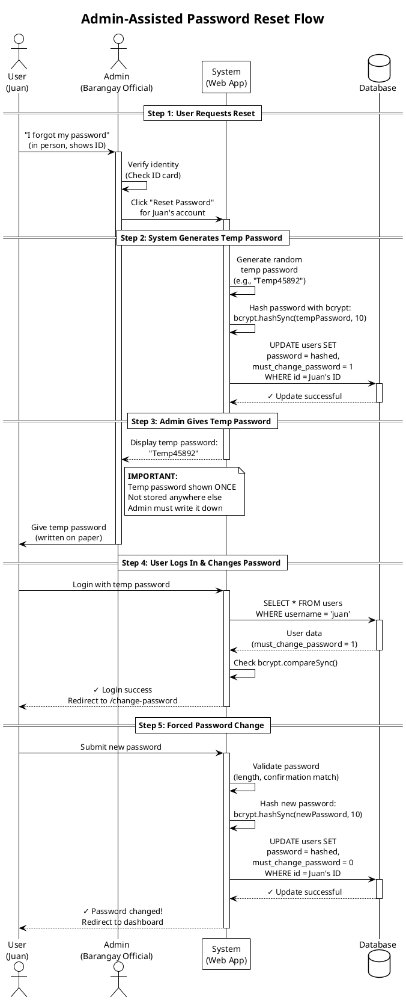

# Admin Password Reset Sequence (PlantUML)

**Diagram Type:** Sequence Diagram  
**Tool:** PlantUML  
**Purpose:** Show admin-assisted password reset flow with in-person verification  
**Used in:** Section 8 - Admin-Assisted Password Reset

---

## PlantUML Code



---

## Rendering Instructions

**Using PlantUML JAR:**
```bash
java -jar plantuml.jar 02-password-reset-sequence.plantuml.md -o ../../diagrams/authentication/
```

**Using Kroki:**
```bash
curl -X POST https://kroki.io/plantuml/png -d @diagram.puml > password-reset-sequence.png
```

**Using Online Editor:**
Visit: http://www.plantuml.com/plantuml/uml/

---

## Expected Output

A vertical sequence diagram showing:
1. **5 phases** clearly separated with `== headers ==`
2. **4 actors/participants:** User, Admin, System, Database
3. **Activation bars** showing when each component is "working"
4. **Notes** highlighting important security points
5. **Color coding** for different types of messages

**Key visual elements:**
- Dashed return arrows for responses
- Solid arrows for actions
- Database cylinder shape
- Actors with stick figures
- Note box explaining temp password is shown once

---

## Notes

- PlantUML is **industry standard** for sequence diagrams
- Supports complex interactions (loops, alternatives, notes)
- Clear visual hierarchy with activation boxes
- Shows both "happy path" and important details (bcrypt calls, database updates)
- Separates 5 distinct phases of the reset process
