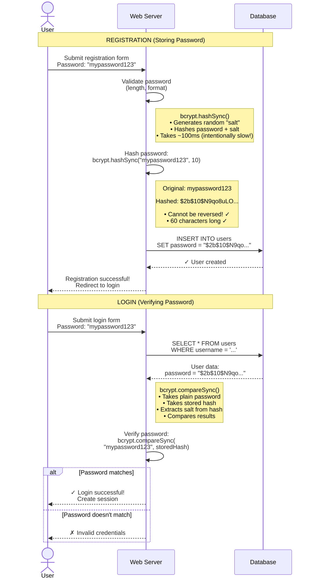

# Password Hashing Flow (Mermaid - Alternate)

**Diagram Type:** Sequence Diagram  
**Tool:** Mermaid  
**Purpose:** Show registration vs login password hashing comparison  
**Used in:** Section 2 - Password Security Basics

---

## Mermaid Code



---

## Rendering Instructions

**If using Mermaid CLI:**
```bash
mmdc -i 04-password-hashing-flow.mermaid.md -o ../../diagrams/authentication/password-hashing-flow.png
```

**If using Kroki:**
```bash
curl -X POST https://kroki.io/mermaid/png -d @diagram.mmd > password-hashing-flow.png
```

**In Markdown (GitHub/many renderers):**
Just include the code block with `mermaid` language tag - it will auto-render!

---

## Expected Output

A sequence diagram showing:
1. **Registration flow (top):**
   - User submits password
   - Server validates
   - Server hashes with bcrypt.hashSync() (note box explains details)
   - Hash stored in database (original password never stored)

2. **Login flow (bottom):**
   - User submits password
   - Server retrieves stored hash
   - Server uses bcrypt.compareSync() (note box explains details)
   - Alt block shows success/failure paths

**Key visual elements:**
- Two major sections separated by Note boxes
- Actor icon for User
- Box icons for Server and Database
- Notes explaining bcrypt functions on the right side
- Alt/else block for login success/failure
- Solid arrows for actions, dashed for responses

---

## Notes

- Simpler syntax than PlantUML
- Clear separation of Registration vs Login
- Notes use `<br/>` for line breaks
- Alt block shows conditional logic
- Emphasizes one-way nature of hashing
- Shows password never stored in plain text
