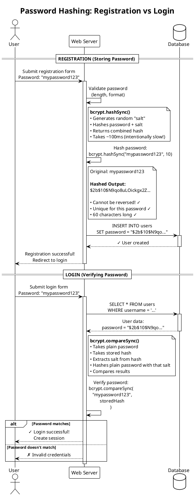

# Password Hashing Flow (PlantUML)

**Diagram Type:** Sequence Diagram  
**Tool:** PlantUML  
**Purpose:** Show registration vs login password hashing comparison  
**Used in:** Section 2 - Password Security Basics

---

## PlantUML Code



---

## Rendering Instructions

**Using PlantUML JAR:**
```bash
java -jar plantuml.jar 04-password-hashing-flow.plantuml.md -o ../../diagrams/authentication/
```

**Using Kroki:**
```bash
curl -X POST https://kroki.io/plantuml/png -d @diagram.puml > password-hashing-flow.png
```

**Using Online Editor:**
Visit: http://www.plantuml.com/plantuml/uml/

---

## Expected Output

A sequence diagram showing:
1. **Registration flow (top half):**
   - User submits password
   - Server hashes with bcrypt.hashSync()
   - Hash stored in database
   - Original password NEVER stored

2. **Login flow (bottom half):**
   - User submits password
   - Server gets stored hash from database
   - bcrypt.compareSync() verifies password
   - Success or failure response

**Key visual elements:**
- Clear separation between Registration and Login with `== headers ==`
- Note boxes explaining bcrypt functions
- Note showing actual hash format ($2b$10$...)
- Alt/else block showing success/failure paths
- Activation bars showing when server is "working"

---

## Notes

- Side-by-side comparison makes it clear hashing is used in BOTH flows
- Notes explain the "magic" of bcrypt (one-way, salt, etc.)
- Shows that original password never touches database
- Alt block demonstrates password comparison has two outcomes
- Emphasizes bcrypt is intentionally slow (security feature)
