# PWA Installation Flow - All Diagram Formats

**Diagram:** PWA installation sequence from initial visit to installed app launch

**Purpose:** Shows the complete user journey from visiting a PWA to installing it on their home screen

---

## 1. Mermaid (Sequence Diagram)

```mermaid
%%{init: {'theme':'base', 'themeVariables': { 'fontSize':'14px'}}}%%
sequenceDiagram
    participant User
    participant Browser
    participant PWA as Web App
    participant SW as Service Worker
    participant Manifest as manifest.json
    
    Note over Browser,Manifest: 1. Initial Visit
    User->>Browser: Opens website URL
    Browser->>PWA: Loads index.html
    PWA->>Manifest: Loads manifest.json
    PWA->>SW: Registers service worker
    SW->>SW: Installs & caches files
    
    Note over Browser,Manifest: 2. Install Criteria Check
    Browser->>Browser: Checks install criteria:<br/>✅ Valid manifest.json<br/>✅ Service worker registered<br/>✅ Served over HTTPS<br/>✅ User visited 2+ times<br/>✅ User engaged with site
    
    Note over Browser,Manifest: 3. beforeinstallprompt Event
    Browser->>PWA: Fires beforeinstallprompt
    PWA->>PWA: Stores event for later<br/>(deferred install)
    PWA->>User: Shows custom button:<br/>"📱 Install App"
    
    Note over Browser,Manifest: 4. User Initiates Install
    User->>PWA: Clicks "Install App" button
    PWA->>Browser: Calls prompt() on<br/>saved event
    Browser->>User: Shows install dialog:<br/>"Add to Home Screen?"
    
    Note over Browser,Manifest: 5. User Accepts/Rejects
    alt User Accepts
        User->>Browser: Clicks "Add"
        Browser->>Browser: Adds app icon to home screen
        Browser->>Browser: Creates standalone window
        Browser->>PWA: Fires appinstalled event
        PWA->>User: Shows success message:<br/>"✅ App installed!"
        PWA->>PWA: Hides install button
    else User Rejects
        User->>Browser: Clicks "Cancel"
        Browser->>PWA: prompt() resolves with 'dismissed'
        PWA->>User: Keeps install button visible
        Note over PWA: User can install later
    end
    
    Note over Browser,Manifest: 6. Launching Installed App
    User->>User: Taps app icon on home screen
    Browser->>PWA: Opens in standalone mode<br/>(no URL bar, looks native)
    PWA->>SW: Service worker handles requests
    SW->>PWA: Serves cached content<br/>(instant load!)
    
    style User fill:#e3f2fd
    style Browser fill:#fff9e6
    style PWA fill:#e8f5e9
    style SW fill:#fce4ec
    style Manifest fill:#f3e5f5
```

**Export:**
```bash
mmdc -i 04-installation-flow.mmd -o ../../diagrams/installation-flow.png -b transparent -w 2400
```

---

## 2. PlantUML (Sequence Diagram)


**Export:**
```bash
plantuml -tpng -Sbackground=transparent 04-installation-flow.puml -o ../../diagrams/installation-flow-plantuml.png
```

---

## 3. D2 (Sequence Diagram)

```d2
direction: right

User: User {
  shape: person
  style.fill: "#e3f2fd"
}

Browser: Browser {
  shape: rectangle
  style.fill: "#fff9e6"
}

PWA: Web App {
  shape: rectangle
  style.fill: "#e8f5e9"
}

SW: Service Worker {
  shape: rectangle
  style.fill: "#fce4ec"
}

Manifest: manifest.json {
  shape: document
  style.fill: "#f3e5f5"
}

# Step 1: Initial Visit
_.1: "1. Initial Visit" {
  shape: text
  style.font-size: 16
  style.bold: true
}

User -> Browser: "Opens website URL" {
  style.stroke: "#2196F3"
}

Browser -> PWA: "Loads index.html" {
  style.stroke: "#4CAF50"
}

PWA -> Manifest: "Loads manifest.json" {
  style.stroke: "#9C27B0"
}

PWA -> SW: "Registers service worker" {
  style.stroke: "#E91E63"
}

SW -> SW: "Installs & caches files" {
  style.stroke: "#FF5722"
}

# Step 2: Install Criteria Check
_.2: "2. Install Criteria Check" {
  shape: text
  style.font-size: 16
  style.bold: true
}

Browser.criteria: |md
  Checks install criteria:
  ✅ Valid manifest.json
  ✅ Service worker registered
  ✅ Served over HTTPS
  ✅ User visited 2+ times
  ✅ User engaged with site
|

# Step 3: beforeinstallprompt Event
_.3: "3. beforeinstallprompt Event" {
  shape: text
  style.font-size: 16
  style.bold: true
}

Browser -> PWA: "Fires beforeinstallprompt" {
  style.stroke: "#FF9800"
}

PWA.defer: "Stores event for later\n(deferred install)" {
  shape: text
  style.font-size: 12
}

PWA -> User: "Shows custom button:\n'📱 Install App'" {
  style.stroke: "#3F51B5"
}

# Step 4: User Initiates Install
_.4: "4. User Initiates Install" {
  shape: text
  style.font-size: 16
  style.bold: true
}

User -> PWA: "Clicks 'Install App' button" {
  style.stroke: "#2196F3"
}

PWA -> Browser: "Calls prompt() on\nsaved event" {
  style.stroke: "#4CAF50"
}

Browser -> User: "Shows install dialog:\n'Add to Home Screen?'" {
  style.stroke: "#9C27B0"
}

# Step 5: User Choice
_.5: "5. User Accepts or Rejects" {
  shape: text
  style.font-size: 16
  style.bold: true
}

Accept: "If User Accepts" {
  shape: rectangle
  style.fill: "#C8E6C9"
  
  steps: |md
    1. Clicks "Add"
    2. Icon added to home screen
    3. Standalone window created
    4. appinstalled event fires
    5. Success message shown
    6. Install button hidden
  |
}

Reject: "If User Rejects" {
  shape: rectangle
  style.fill: "#FFCDD2"
  
  steps: |md
    1. Clicks "Cancel"
    2. prompt() resolves 'dismissed'
    3. Install button stays visible
    4. Can try again later
  |
}

# Step 6: Launching Installed App
_.6: "6. Launching Installed App" {
  shape: text
  style.font-size: 16
  style.bold: true
}

Launch: |md
  User taps app icon on home screen
  ↓
  Opens in standalone mode (no URL bar)
  ↓
  Service worker handles requests
  ↓
  Serves cached content (instant load!)
  ↓
  Works fully offline! 🎉
|
```

**Export:**
```bash
d2 --theme=0 --pad=20 04-installation-flow.d2 ../../diagrams/installation-flow-d2.png
```

---

## 4. DOT/Graphviz (Flow Diagram)

```dot
digraph PWA_Installation_Flow {
    // Graph settings
    rankdir=TB;
    bgcolor=transparent;
    node [shape=box, style=filled, fontname="Arial", fontsize=11];
    edge [fontname="Arial", fontsize=10];
    
    // Color scheme
    subgraph cluster_legend {
        label="Components";
        style=dashed;
        User [fillcolor="#e3f2fd", label="User"];
        Browser [fillcolor="#fff9e6", label="Browser"];
        PWA [fillcolor="#e8f5e9", label="Web App"];
        SW [fillcolor="#fce4ec", label="Service Worker"];
        Manifest [fillcolor="#f3e5f5", label="manifest.json"];
    }
    
    // Step 1: Initial Visit
    Start [shape=ellipse, fillcolor="#4CAF50", fontcolor=white, label="User Visits\nWebsite"];
    
    LoadHTML [fillcolor="#fff9e6", label="Browser Loads\nindex.html"];
    LoadManifest [fillcolor="#f3e5f5", label="Load\nmanifest.json"];
    RegisterSW [fillcolor="#e8f5e9", label="Register\nService Worker"];
    InstallSW [fillcolor="#fce4ec", label="SW Installs &\nCaches Files"];
    
    Start -> LoadHTML [label="1. Navigate"];
    LoadHTML -> LoadManifest [label="Parse"];
    LoadHTML -> RegisterSW [label="Execute JS"];
    RegisterSW -> InstallSW [label="Install event"];
    
    // Step 2: Criteria Check
    CriteriaCheck [fillcolor="#fff9e6", shape=diamond, label="Install\nCriteria\nMet?"];
    CriteriaList [fillcolor="#FFFFCC", shape=note, label="✅ Valid manifest\n✅ SW registered\n✅ HTTPS\n✅ 2+ visits\n✅ User engaged"];
    
    InstallSW -> CriteriaCheck [label="2. Check"];
    CriteriaCheck -> CriteriaList [style=dashed, label="Validates"];
    
    // Step 3: beforeinstallprompt
    FireEvent [fillcolor="#fff9e6", label="Browser Fires\nbeforeinstallprompt"];
    DeferEvent [fillcolor="#e8f5e9", label="PWA Stores Event\n(deferred)"];
    ShowButton [fillcolor="#e8f5e9", label="Show Custom\nInstall Button"];
    
    CriteriaCheck -> FireEvent [label="Yes"];
    FireEvent -> DeferEvent [label="3. Event"];
    DeferEvent -> ShowButton [label="Display"];
    
    // Step 4: User Action
    UserClick [fillcolor="#e3f2fd", label="User Clicks\n'Install App'"];
    CallPrompt [fillcolor="#e8f5e9", label="PWA Calls\nprompt()"];
    ShowDialog [fillcolor="#fff9e6", label="Browser Shows\nInstall Dialog"];
    
    ShowButton -> UserClick [label="4. Click"];
    UserClick -> CallPrompt [label="Trigger"];
    CallPrompt -> ShowDialog [label="Display"];
    
    // Step 5: User Choice
    UserChoice [fillcolor="#e3f2fd", shape=diamond, label="User\nChoice?"];
    
    // Accept path
    AddIcon [fillcolor="#C8E6C9", label="Add Icon to\nHome Screen"];
    CreateWindow [fillcolor="#C8E6C9", label="Create Standalone\nWindow"];
    FireInstalled [fillcolor="#C8E6C9", label="Fire appinstalled\nEvent"];
    ShowSuccess [fillcolor="#C8E6C9", label="Show Success\nMessage"];
    HideButton [fillcolor="#C8E6C9", label="Hide Install\nButton"];
    
    ShowDialog -> UserChoice [label="5. User decides"];
    UserChoice -> AddIcon [label="Accept", color="green"];
    AddIcon -> CreateWindow [color="green"];
    CreateWindow -> FireInstalled [color="green"];
    FireInstalled -> ShowSuccess [color="green"];
    ShowSuccess -> HideButton [color="green"];
    
    // Reject path
    KeepButton [fillcolor="#FFCDD2", label="Keep Install\nButton Visible"];
    TryLater [fillcolor="#FFCDD2", label="User Can\nTry Later"];
    
    UserChoice -> KeepButton [label="Reject", color="red"];
    KeepButton -> TryLater [color="red"];
    
    // Step 6: Launch
    TapIcon [fillcolor="#e3f2fd", label="User Taps\nApp Icon"];
    OpenStandalone [fillcolor="#fff9e6", label="Open in\nStandalone Mode"];
    HandleRequest [fillcolor="#fce4ec", label="SW Handles\nRequests"];
    ServeCache [fillcolor="#fce4ec", label="Serve Cached\nContent"];
    InstantLoad [shape=ellipse, fillcolor="#4CAF50", fontcolor=white, label="Instant Load!\nWorks Offline"];
    
    HideButton -> TapIcon [label="6. Later..."];
    TapIcon -> OpenStandalone [label="Launch"];
    OpenStandalone -> HandleRequest [label="Request"];
    HandleRequest -> ServeCache [label="Fetch"];
    ServeCache -> InstantLoad [label="Fast!"];
    
    // Fallback path
    CriteriaCheck -> TryLater [label="No", style=dashed, color="gray"];
    TryLater -> Start [label="Next visit", style=dashed, color="gray"];
}
```



**Export:**
```bash
dot -Tpng -Gbgcolor=transparent 04-installation-flow.dot -o ../../diagrams/installation-flow-dot.png
```

---

## Comparison of Formats

| Format | Best For | Pros | Cons |
|--------|----------|------|------|
| **Mermaid** | Sequence diagrams, quick iteration | Easy syntax, widely supported, renders in GitHub | Limited styling options |
| **PlantUML** | Complex sequence diagrams | Very detailed control, many diagram types | Requires Java, more verbose |
| **D2** | Modern, readable diagrams | Clean syntax, beautiful output, markdown support | Newer tool, fewer examples |
| **DOT/Graphviz** | Complex flows, state machines | Powerful layout algorithms, fine control | Steep learning curve, verbose |

---

## When to Use Each Format

**Mermaid:**
- ✅ Quick prototyping
- ✅ GitHub README diagrams
- ✅ Simple to moderate complexity
- ✅ Sequence diagrams

**PlantUML:**
- ✅ Very detailed sequence diagrams
- ✅ Complex timing requirements
- ✅ Professional documentation
- ✅ UML diagrams (class, component, etc.)

**D2:**
- ✅ Modern, aesthetic diagrams
- ✅ Markdown in boxes (detailed notes)
- ✅ Readable source code
- ✅ Quick visual iteration

**DOT/Graphviz:**
- ✅ Complex state machines
- ✅ Flow diagrams with many branches
- ✅ Automatic optimal layout
- ✅ Custom shapes and styling

---

## Installation Process Breakdown

### Step 1: Initial Visit
**What Happens:**
- User visits your PWA URL
- Browser loads HTML, CSS, JS
- manifest.json is parsed
- Service worker registers and installs
- App files cached for offline use

**Philippine Context:**
- Initial load uses data (100-500 KB typical)
- After caching, subsequent loads are FREE
- Works during brownouts after first visit

---

### Step 2: Install Criteria Check
**Browser Checks:**
1. ✅ Valid `manifest.json` with required fields
2. ✅ Service worker registered and active
3. ✅ Served over HTTPS (or localhost for testing)
4. ✅ User visited site at least twice (engagement heuristic)
5. ✅ User interacted with site (clicks, scrolls)

**Why These Criteria?**
- Prevents spam installs
- Ensures user actually wants the app
- Guarantees app works offline

**Philippine Adaptation:**
```javascript
// Lower engagement threshold for limited data users
// Show install prompt after just 30 seconds
let engagementTimer = setTimeout(() => {
  // User has been on site for 30s = interested
  showInstallButton();
}, 30000);
```

---

### Step 3: beforeinstallprompt Event

**Browser fires this event when criteria met:**

```javascript
let deferredPrompt; // Save for later

window.addEventListener('beforeinstallprompt', (e) => {
  // Prevent automatic mini-infobar (Chrome mobile)
  e.preventDefault();
  
  // Save event for custom install button
  deferredPrompt = e;
  
  // Show your custom install UI
  document.getElementById('installButton').style.display = 'block';
});
```

**Why Defer?**
- Browser's default prompt is easy to miss
- Custom UI can explain benefits
- Can show at ideal moment (after user sees value)

**Philippine Example:**
```html
<div id="installPrompt" class="notification is-info">
  <p><strong>💾 Save Data & Work Offline!</strong></p>
  <p>Install this app to:</p>
  <ul>
    <li>✅ Use without internet (brownouts ok!)</li>
    <li>✅ Save ₱200+ in data costs per month</li>
    <li>✅ Load instantly (no waiting)</li>
  </ul>
  <button id="installButton" class="button is-primary">
    📱 Install Now
  </button>
</div>
```

---

### Step 4: User Initiates Install

**When user clicks your custom button:**

```javascript
document.getElementById('installButton').addEventListener('click', async () => {
  if (!deferredPrompt) {
    return; // No install event saved
  }
  
  // Show browser's install dialog
  deferredPrompt.prompt();
  
  // Wait for user choice
  const { outcome } = await deferredPrompt.userChoice;
  console.log(`User ${outcome} the install prompt`);
  
  // Clear the deferred prompt (can't reuse)
  deferredPrompt = null;
});
```

**Browser's Install Dialog:**
- Shows app name from manifest
- Shows icon from manifest
- Says "Add to Home Screen" or "Install"
- User can accept or cancel

---

### Step 5: User Accepts or Rejects

**If User Accepts:**

```javascript
window.addEventListener('appinstalled', (e) => {
  console.log('PWA installed successfully!');
  
  // Hide install button
  document.getElementById('installButton').style.display = 'none';
  
  // Show success message
  alert('✅ App installed! Find it on your home screen.');
  
  // Track installation (analytics)
  gtag('event', 'pwa_install', {
    'event_category': 'engagement',
    'event_label': 'PWA Installation'
  });
});
```

**What Happens:**
1. App icon added to home screen
2. App opens in standalone mode (no browser UI)
3. Splash screen shows on launch (from manifest)
4. Looks and feels like native app

**If User Rejects:**
- Install button stays visible
- Can try again later (next visit)
- No negative impact on app functionality

---

### Step 6: Launching Installed App

**User Experience:**
1. Tap icon on home screen
2. Splash screen shows (brand colors)
3. App opens fullscreen (no URL bar!)
4. Loads instantly from cache
5. Works fully offline

**Philippine Benefits:**
- Zero data cost for cached content
- Works during brownouts/no signal
- Fast loading on slow 2G/3G
- Feels like native app (professional)
- Takes up less storage than native app

---

## Code Example: Complete Installation Flow

```javascript
// app.js - Complete install flow

let deferredPrompt;
let installButton = document.getElementById('installButton');

// 1. Listen for beforeinstallprompt
window.addEventListener('beforeinstallprompt', (e) => {
  // Prevent mini-infobar
  e.preventDefault();
  
  // Save for later
  deferredPrompt = e;
  
  // Show custom install UI
  document.getElementById('installPrompt').style.display = 'block';
  
  console.log('Install prompt available');
});

// 2. Handle install button click
installButton.addEventListener('click', async () => {
  if (!deferredPrompt) {
    alert('Install not available yet. Try again later.');
    return;
  }
  
  // Show browser install dialog
  deferredPrompt.prompt();
  
  // Wait for user choice
  const { outcome } = await deferredPrompt.userChoice;
  
  if (outcome === 'accepted') {
    console.log('User accepted install prompt');
  } else {
    console.log('User dismissed install prompt');
  }
  
  // Can only use prompt() once
  deferredPrompt = null;
});

// 3. Listen for successful install
window.addEventListener('appinstalled', (e) => {
  console.log('PWA installed!');
  
  // Hide install UI
  document.getElementById('installPrompt').style.display = 'none';
  
  // Show success message
  showNotification('✅ App installed! Check your home screen.', 'success');
  
  // Optional: Track in analytics
  if (window.gtag) {
    gtag('event', 'pwa_install');
  }
});

// Utility: Show notification
function showNotification(message, type) {
  const notification = document.createElement('div');
  notification.className = `notification is-${type}`;
  notification.textContent = message;
  document.body.prepend(notification);
  
  setTimeout(() => notification.remove(), 5000);
}
```

---

## Philippine Context Example

**Sari-Sari Store Inventory App Install Flow:**

### Initial Visit:
- Store owner searches "inventory app"
- Opens your PWA
- Service worker caches app shell (200 KB = ₱20 data)
- Owner adds 50 products to inventory

### Second Visit (Next Day):
- Owner returns to check stock
- `beforeinstallprompt` fires (criteria met)
- Custom popup shows:

```
╔══════════════════════════════════════╗
║  💾 Install Inventory App?           ║
║                                      ║
║  Benefits:                           ║
║  ✅ Works without internet           ║
║  ✅ Free after install (₱0 data)     ║
║  ✅ Faster than website              ║
║  ✅ Access from home screen          ║
║                                      ║
║  [📱 Install Now]  [Maybe Later]     ║
╚══════════════════════════════════════╝
```

### Install:
- Owner clicks "Install Now"
- Browser shows "Add to Home Screen"
- Owner confirms
- App icon appears next to Facebook, Messenger
- Opens like native app (no browser!)

### Daily Use:
- Tap icon → instant load (0 data used)
- Add/update products offline
- Syncs when WiFi available
- **Savings:** ₱200-300/month vs website

---

## Troubleshooting Installation

### Install Button Never Shows:
**Check:**
- Is manifest.json valid? (use Lighthouse)
- Is service worker registered?
- Is site served over HTTPS?
- Has user visited 2+ times?
- Is user on mobile (desktop has different UI)?

### User Dismissed Prompt:
- Show install button again later
- Don't spam (wait 7+ days)
- Explain benefits better

### App Not on Home Screen:
- Check phone storage (may be full)
- Try reinstalling
- Check browser support (need Chrome 70+ or Safari 13+)

---

**Referenced in Lecture:** Section 3 (manifest.json), Section 7 (Installability), Section 8 (Testing)

**File Format:** All-in-one markdown with multiple diagram formats
**Created:** November 13, 2025
**Related Files:** 01-service-worker-lifecycle.md, 02-caching-strategies.md, 03-pwa-architecture.md
