# Middleware Stack Execution Flow (Graphviz)

## Purpose
Visualize the complete middleware execution chain in Express.js, showing how requests flow through multiple middleware layers before reaching route handlers.

## Rendering
**VS Code:** Install "Graphviz Preview" extension  
**Online:** [dreampuf.github.io/GraphvizOnline](https://dreampuf.github.io/GraphvizOnline/)  
**CLI:** `dot -Tpng 09-middleware-stack-graphviz.md -o output.png`

## Diagram

```dot
digraph MiddlewareStack {
  // Graph settings
  rankdir=TB;
  bgcolor="#F5F5F5";
  node [shape=box, style="rounded,filled", fontname="Arial", fontsize=11];
  edge [fontname="Arial", fontsize=10];
  
  // Define clusters for visual grouping
  subgraph cluster_incoming {
    label="Incoming Request";
    style=filled;
    color="#E3F2FD";
    
    request [label="HTTP Request\nGET /api/products/42\nCookie: session=abc123", fillcolor="#90CAF9", shape=note];
  }
  
  subgraph cluster_global {
    label="Global Middleware\n(Applied to ALL routes)";
    style=filled;
    color="#FFF9C4";
    
    morgan [label="morgan('dev')\n📊 Log request", fillcolor="#FFD700"];
    cors [label="cors()\n🌐 CORS headers", fillcolor="#FFD700"];
    bodyParser [label="express.json()\n📝 Parse body", fillcolor="#FFD700"];
    cookieParser [label="cookie-parser()\n🍪 Parse cookies", fillcolor="#FFD700"];
    expressSession [label="express-session()\n🔐 Load session", fillcolor="#FFD700"];
  }
  
  subgraph cluster_custom {
    label="Custom Middleware\n(Application logic)";
    style=filled;
    color="#E1BEE7";
    
    authCheck [label="checkAuth()\n👤 Verify user", fillcolor="#CE93D8"];
    roleCheck [label="requireRole('manager')\n🔒 Check permissions", fillcolor="#CE93D8"];
    auditLog [label="auditMiddleware()\n📋 Log action", fillcolor="#CE93D8"];
  }
  
  subgraph cluster_route {
    label="Route Handler";
    style=filled;
    color="#C8E6C9";
    
    routeHandler [label="GET /api/products/:id\n✅ Execute business logic\n(Query DB, return JSON)", fillcolor="#90EE90", shape=component];
  }
  
  subgraph cluster_response {
    label="Response Path";
    style=filled;
    color="#FFCCBC";
    
    compression [label="compression()\n📦 Compress response", fillcolor="#FFA726"];
    responseTime [label="Response headers\n⏱️ X-Response-Time", fillcolor="#FFA726"];
  }
  
  subgraph cluster_outgoing {
    label="Outgoing Response";
    style=filled;
    color="#E3F2FD";
    
    response [label="HTTP Response\n200 OK\n{id:42, name:'Skyflakes',...}", fillcolor="#90CAF9", shape=note];
  }
  
  subgraph cluster_error {
    label="Error Path (Any middleware can jump here)";
    style=filled;
    color="#FFEBEE";
    
    errorHandler [label="Error Handler\n❌ Catch all errors\nres.status(500).json({error})", fillcolor="#FFB6C1", shape=doubleoctagon];
  }
  
  // Main flow (downward cascade)
  request -> morgan [label="1"];
  morgan -> cors [label="2\nnext()"];
  cors -> bodyParser [label="3\nnext()"];
  bodyParser -> cookieParser [label="4\nnext()"];
  cookieParser -> expressSession [label="5\nnext()"];
  
  expressSession -> authCheck [label="6\nnext()", color="#7B1FA2", penwidth=2];
  authCheck -> roleCheck [label="7\nif authenticated", color="#7B1FA2", penwidth=2];
  roleCheck -> auditLog [label="8\nif authorized", color="#7B1FA2", penwidth=2];
  
  auditLog -> routeHandler [label="9\nreach target", color="#388E3C", penwidth=3];
  
  routeHandler -> compression [label="10\nres.json()", color="#F57C00", penwidth=2];
  compression -> responseTime [label="11"];
  responseTime -> response [label="12\nsend to client", color="#F57C00", penwidth=2];
  
  // Error jumps (can happen from any middleware)
  morgan -> errorHandler [label="Error", style=dashed, color=red];
  authCheck -> errorHandler [label="Unauthenticated", style=dashed, color=red];
  roleCheck -> errorHandler [label="Unauthorized", style=dashed, color=red];
  routeHandler -> errorHandler [label="Exception", style=dashed, color=red];
  
  errorHandler -> response [label="Error response", color=red, penwidth=2];
  
  // Side notes
  note1 [label="💡 Order matters!\nBodyParser must come before\nroutes that read req.body", shape=note, fillcolor="#FFF59D", fontsize=9];
  note2 [label="💡 next() passes to next middleware\nnext(err) jumps to error handler", shape=note, fillcolor="#FFF59D", fontsize=9];
  note3 [label="💡 Route handler can skip middleware\nby calling res.send() directly", shape=note, fillcolor="#FFF59D", fontsize=9];
}
```



## Key Insights

1. **Cascading execution:**
   - Request flows through middleware in ORDER they are defined
   - Each middleware calls `next()` to continue
   - If any middleware doesn't call `next()`, chain stops

2. **Three middleware types:**
   - **Global:** Applied to ALL routes (morgan, cors, body-parser)
   - **Custom:** Application-specific (auth, audit, role checks)
   - **Route-specific:** Only for certain paths (not shown in stack)

3. **Error handling:**
   - ANY middleware can jump to error handler via `next(err)`
   - Error handler is special: has 4 parameters (err, req, res, next)
   - Always define error handler LAST

4. **Common order:**
   ```
   1. Logging (morgan)
   2. Security (helmet, cors)
   3. Parsing (body-parser, cookie-parser)
   4. Sessions (express-session)
   5. Authentication (checkAuth)
   6. Authorization (requireRole)
   7. Business logic (route handlers)
   8. Error handler (catch-all)
   ```

## Code Mapping

### Complete Middleware Stack (`app.js`)

```javascript
const express = require('express');
const morgan = require('morgan');
const cors = require('cors');
const cookieParser = require('cookie-parser');
const session = require('express-session');
const helmet = require('helmet');

const app = express();

// ==============================
// GLOBAL MIDDLEWARE (Applied to ALL)
// ==============================

// 1. Logging - Must be first to log everything
app.use(morgan('dev'));

// 2. Security headers
app.use(helmet());
app.use(cors({
  origin: 'http://localhost:5173',
  credentials: true
}));

// 3. Body parsing - MUST come before routes that read req.body
app.use(express.json());
app.use(express.urlencoded({ extended: true }));

// 4. Cookie parsing - MUST come before session
app.use(cookieParser());

// 5. Session management - Depends on cookie-parser
app.use(session({
  secret: process.env.SESSION_SECRET || 'your-secret-key',
  resave: false,
  saveUninitialized: false,
  cookie: { 
    httpOnly: true,
    secure: process.env.NODE_ENV === 'production',
    maxAge: 24 * 60 * 60 * 1000 // 24 hours
  }
}));

// 6. Static files (not in diagram, but commonly used)
app.use(express.static('public'));

// ==============================
// CUSTOM MIDDLEWARE
// ==============================

// Authentication middleware
function checkAuth(req, res, next) {
  if (req.session.userId) {
    // Load user from database
    const user = db.prepare('SELECT * FROM users WHERE id = ?')
      .get(req.session.userId);
    
    if (user) {
      req.user = user; // Attach to request object
      return next(); // ✅ Continue to next middleware
    }
  }
  
  // ❌ No user, send error (don't call next())
  return res.status(401).json({ error: 'Unauthorized' });
}

// Role-based authorization middleware
function requireRole(role) {
  return (req, res, next) => {
    if (!req.user) {
      return res.status(401).json({ error: 'Unauthorized' });
    }
    
    if (req.user.role !== role) {
      return res.status(403).json({ error: 'Forbidden: Insufficient permissions' });
    }
    
    next(); // ✅ User has required role
  };
}

// Audit logging middleware
function auditMiddleware(req, res, next) {
  const auditLog = {
    userId: req.user?.id || null,
    action: `${req.method} ${req.path}`,
    ipAddress: req.ip,
    timestamp: new Date().toISOString()
  };
  
  db.prepare(`
    INSERT INTO audit_log (user_id, action, ip_address, timestamp)
    VALUES (?, ?, ?, ?)
  `).run(auditLog.userId, auditLog.action, auditLog.ipAddress, auditLog.timestamp);
  
  next(); // ✅ Continue (logging doesn't block request)
}

// ==============================
// ROUTES WITH MIDDLEWARE
// ==============================

// Public route (no middleware needed)
app.get('/api/products', (req, res) => {
  const products = db.prepare('SELECT * FROM products').all();
  res.json(products);
});

// Protected route (requires authentication)
app.get('/api/orders', checkAuth, (req, res) => {
  const orders = db.prepare('SELECT * FROM orders WHERE user_id = ?')
    .all(req.user.id);
  res.json(orders);
});

// Manager-only route (requires authentication + role + audit)
app.delete('/api/products/:id', 
  checkAuth, 
  requireRole('manager'), 
  auditMiddleware, 
  (req, res) => {
    const result = db.prepare('DELETE FROM products WHERE id = ?')
      .run(req.params.id);
    
    if (result.changes === 0) {
      return res.status(404).json({ error: 'Product not found' });
    }
    
    res.json({ message: 'Product deleted' });
  }
);

// ==============================
// ERROR HANDLER (Must be LAST)
// ==============================

// 404 handler for undefined routes
app.use((req, res) => {
  res.status(404).json({ error: 'Route not found' });
});

// Global error handler (4 parameters!)
app.use((err, req, res, next) => {
  console.error('Error:', err);
  
  // Log error to database
  db.prepare(`
    INSERT INTO error_log (message, stack, user_id, path, timestamp)
    VALUES (?, ?, ?, ?, ?)
  `).run(
    err.message,
    err.stack,
    req.user?.id || null,
    req.path,
    new Date().toISOString()
  );
  
  // Don't expose internal errors to client
  const statusCode = err.statusCode || 500;
  const message = process.env.NODE_ENV === 'production'
    ? 'Internal server error'
    : err.message;
  
  res.status(statusCode).json({ error: message });
});

module.exports = app;
```

### Example: Async Error Handling Wrapper

```javascript
// Utility to catch async errors in route handlers
function asyncHandler(fn) {
  return (req, res, next) => {
    Promise.resolve(fn(req, res, next)).catch(next);
  };
}

// Usage:
app.get('/api/products/:id', asyncHandler(async (req, res) => {
  const product = await db.prepare('SELECT * FROM products WHERE id = ?')
    .get(req.params.id);
  
  if (!product) {
    // This will be caught by asyncHandler and passed to error middleware
    throw new Error('Product not found');
  }
  
  res.json(product);
}));
```

## Common Mistakes

### ❌ Wrong Order
```javascript
// BAD: Routes before body-parser
app.post('/api/products', (req, res) => {
  console.log(req.body); // undefined! ❌
  res.json(req.body);
});

app.use(express.json()); // Too late!
```

**✅ Correct:**
```javascript
// Middleware BEFORE routes
app.use(express.json());

app.post('/api/products', (req, res) => {
  console.log(req.body); // {name: 'Skyflakes', ...} ✅
  res.json(req.body);
});
```

### ❌ Forgetting to Call `next()`
```javascript
// BAD: Middleware doesn't call next()
app.use((req, res, next) => {
  console.log('Request received');
  // Forgot next()! Request hangs forever ❌
});
```

**✅ Correct:**
```javascript
app.use((req, res, next) => {
  console.log('Request received');
  next(); // ✅ Continue to next middleware
});
```

### ❌ Wrong Error Handler Signature
```javascript
// BAD: Error handler with 3 parameters
app.use((req, res, next) => { // ❌ Missing 'err' parameter
  res.status(500).json({ error: 'Error' });
});
```

**✅ Correct:**
```javascript
// Error handlers MUST have 4 parameters
app.use((err, req, res, next) => { // ✅ First param is error
  console.error(err);
  res.status(500).json({ error: err.message });
});
```

### ❌ Not Catching Async Errors
```javascript
// BAD: Async errors not caught
app.get('/api/products', async (req, res) => {
  const products = await db.prepare('SELECT * FROM products').all();
  // If query fails, error is not caught! ❌
  res.json(products);
});
```

**✅ Correct:**
```javascript
// Option 1: Try-catch
app.get('/api/products', async (req, res, next) => {
  try {
    const products = await db.prepare('SELECT * FROM products').all();
    res.json(products);
  } catch (err) {
    next(err); // ✅ Pass to error handler
  }
});

// Option 2: asyncHandler wrapper (better)
app.get('/api/products', asyncHandler(async (req, res) => {
  const products = await db.prepare('SELECT * FROM products').all();
  res.json(products);
}));
```

### ❌ Modifying `res` After Sending
```javascript
// BAD: Multiple responses
app.get('/api/products/:id', (req, res) => {
  const product = db.prepare('SELECT * FROM products WHERE id = ?')
    .get(req.params.id);
  
  res.json(product); // First response sent
  
  if (!product) {
    res.status(404).json({ error: 'Not found' }); // ❌ Error! Response already sent
  }
});
```

**✅ Correct:**
```javascript
app.get('/api/products/:id', (req, res) => {
  const product = db.prepare('SELECT * FROM products WHERE id = ?')
    .get(req.params.id);
  
  if (!product) {
    return res.status(404).json({ error: 'Not found' }); // ✅ Early return
  }
  
  res.json(product); // Only one response
});
```

## Related Concepts
- Web App Basics Part 2C: Express.js middleware
- Authentication and authorization
- Error handling patterns
- Request/response lifecycle
- Session management
- Logging and auditing

## Integration Notes

Place this diagram in lectures when explaining:
1. **Middleware order:** Why `app.use()` order matters
2. **Authentication flow:** How `checkAuth` intercepts requests
3. **Error handling:** How errors propagate to error handler
4. **Request lifecycle:** Complete journey from request to response
