# DataTables Features Comparison - Client vs Server-Side (Mermaid)

## Purpose
Simple decision matrix comparing client-side and server-side DataTables features to help choose the right approach for different dataset sizes.

## Rendering
**VS Code:** Built-in Mermaid preview (Ctrl+Shift+V / Cmd+Shift+V)  
**GitHub:** Native rendering in markdown  
**Online:** [mermaid.live](https://mermaid.live)

## Diagram

```mermaid
graph TB
    subgraph decision["🎯 Decision Matrix"]
        start["How many rows?"]
        
        small["< 1,000 rows<br/>✅ Client-Side"]
        medium["1,000 - 10,000 rows<br/>⚠️ Either approach"]
        large["> 10,000 rows<br/>❌ Server-Side ONLY"]
        
        start --> small
        start --> medium
        start --> large
    end
    
    subgraph client["📦 Client-Side Processing"]
        direction TB
        
        clientFeatures["<b>Features</b><br/>---<br/>✅ Simple setup<br/>✅ Fast filtering<br/>✅ No server queries<br/>✅ Offline capable<br/>---<br/>❌ Slow initial load<br/>❌ Memory intensive<br/>❌ Browser limits"]
        
        clientCode["<b>Implementation</b><br/>---<br/>Load ALL data once:<br/>GET /api/products<br/>→ [5000 rows]<br/>---<br/>DataTables handles:<br/>• Search<br/>• Sort<br/>• Pagination<br/>---<br/>No server queries"]
    end
    
    subgraph server["⚙️ Server-Side Processing"]
        direction TB
        
        serverFeatures["<b>Features</b><br/>---<br/>✅ Fast initial load<br/>✅ Handles millions<br/>✅ Low memory<br/>✅ Real-time data<br/>---<br/>❌ Complex setup<br/>❌ Server queries<br/>❌ Requires backend"]
        
        serverCode["<b>Implementation</b><br/>---<br/>Load only visible rows:<br/>GET /api/products?<br/>  start=0&length=10<br/>→ [10 rows + count]<br/>---<br/>Server handles:<br/>• SQL WHERE<br/>• SQL ORDER BY<br/>• SQL LIMIT/OFFSET<br/>---<br/>Each action = query"]
    end
    
    small --> client
    medium -.-> client
    medium -.-> server
    large --> server
    
    style start fill:#FFD700
    style small fill:#90EE90
    style medium fill:#FFA500
    style large fill:#FFB6C1
    style client fill:#E3F2FD
    style server fill:#F3E5F5
    style clientFeatures fill:#90EE90,color:#000
    style clientCode fill:#87CEEB,color:#000
    style serverFeatures fill:#CE93D8,color:#000
    style serverCode fill:#BA68C8,color:#FFF
```



## Feature Comparison Table

| Feature | Client-Side | Server-Side |
|---------|-------------|-------------|
| **Initial Load** | Slow (loads all data) | Fast (loads 10-25 rows) |
| **Searching** | Instant (in-memory) | 200-500ms (SQL query) |
| **Sorting** | Instant (in-memory) | 200-500ms (SQL query) |
| **Pagination** | Instant (slicing array) | 200-500ms (SQL query) |
| **Memory Usage** | High (all rows in RAM) | Low (only visible rows) |
| **Max Rows** | ~10,000 (browser limit) | Unlimited (database) |
| **Real-time Data** | No (stale after load) | Yes (queries on each action) |
| **Network Traffic** | One large request | Many small requests |
| **Offline Capable** | Yes (after initial load) | No (requires server) |
| **Setup Complexity** | Easy (5 lines JS) | Complex (backend + SQL) |
| **Best For** | Small-medium datasets | Large datasets, real-time |

## Key Insights

1. **Performance crossover:**
   - **< 1,000 rows:** Client-side is faster (no network delay)
   - **1,000 - 10,000 rows:** Depends on search frequency
   - **> 10,000 rows:** Server-side required (browser limits)

2. **Trade-offs:**
   - **Client-side:** Fast interactions, but slow initial load
   - **Server-side:** Fast initial load, but slower interactions
   - **Hybrid:** Load subset client-side, full search server-side

3. **When to use client-side:**
   - Product catalogs (< 1,000 products)
   - User lists (< 5,000 users)
   - Reports (< 10,000 rows)
   - Offline applications

4. **When to use server-side:**
   - Order history (millions of orders)
   - Audit logs (continuous growth)
   - Large product catalogs (> 10,000 items)
   - Real-time inventory tracking

## Code Mapping

### Client-Side Implementation (Simple)

```javascript
// ===========================
// 1. Load ALL data once
// ===========================
app.get('/api/products', (req, res) => {
  // Load ALL products (no pagination)
  const products = db.prepare('SELECT * FROM products').all();
  
  res.json(products); // [5,000 rows]
});

// ===========================
// 2. Initialize DataTables
// ===========================
$(document).ready(function() {
  $('#productsTable').DataTable({
    ajax: {
      url: '/api/products',
      dataSrc: '' // Data is at root level
    },
    columns: [
      { data: 'id' },
      { data: 'name' },
      { data: 'stock' },
      { data: 'price' }
    ],
    // Client-side processing (default)
    serverSide: false, // ✅ Process in browser
    processing: true
  });
});

// That's it! DataTables handles:
// - Search: Filters array in memory
// - Sort: Sorts array in memory
// - Pagination: Slices array for current page
// No additional server queries needed! ✅
```

### Server-Side Implementation (Complex)

```javascript
// ===========================
// 1. Server endpoint (complex)
// ===========================
app.get('/api/products', (req, res) => {
  // DataTables sends these parameters:
  const start = parseInt(req.query.start) || 0; // Offset
  const length = parseInt(req.query.length) || 10; // Rows per page
  const searchValue = req.query.search?.value || ''; // Search query
  const orderColumn = parseInt(req.query.order?.[0]?.column) || 0;
  const orderDir = req.query.order?.[0]?.dir || 'asc';
  
  // Column mapping
  const columns = ['id', 'name', 'stock', 'price'];
  const orderBy = columns[orderColumn];
  
  // Build WHERE clause
  let whereClause = '';
  let params = [];
  
  if (searchValue) {
    whereClause = `
      WHERE name LIKE ? 
      OR description LIKE ?
    `;
    params.push(`%${searchValue}%`, `%${searchValue}%`);
  }
  
  // Get total count (for pagination info)
  const totalQuery = `SELECT COUNT(*) as count FROM products ${whereClause}`;
  const totalResult = db.prepare(totalQuery).get(...params);
  const recordsTotal = totalResult.count;
  
  // Get filtered data
  const dataQuery = `
    SELECT * FROM products
    ${whereClause}
    ORDER BY ${orderBy} ${orderDir}
    LIMIT ? OFFSET ?
  `;
  const data = db.prepare(dataQuery).all(...params, length, start);
  
  // DataTables expects this exact format
  res.json({
    draw: parseInt(req.query.draw), // Anti-caching
    recordsTotal: recordsTotal,
    recordsFiltered: recordsTotal,
    data: data
  });
});

// ===========================
// 2. Initialize DataTables
// ===========================
$(document).ready(function() {
  $('#productsTable').DataTable({
    ajax: {
      url: '/api/products',
      type: 'GET',
      data: function(d) {
        // DataTables automatically sends:
        // start, length, search[value], order[0][column], etc.
        return d;
      }
    },
    columns: [
      { data: 'id' },
      { data: 'name' },
      { data: 'stock' },
      { data: 'price' }
    ],
    // Server-side processing
    serverSide: true, // ⚙️ Send requests to server
    processing: true, // Show "Processing..." message
    
    // Optional: Adjust request parameters
    searchDelay: 500 // Wait 500ms before searching (debounce)
  });
});

// Now each action sends a request:
// - Initial load: GET /api/products?start=0&length=10
// - Page 2: GET /api/products?start=10&length=10
// - Search "sky": GET /api/products?start=0&length=10&search[value]=sky
// - Sort by price: GET /api/products?start=0&length=10&order[0][column]=3&order[0][dir]=asc
```

### Hybrid Approach (Best of Both)

```javascript
// Load a reasonable subset client-side, offer server-side search for full dataset
app.get('/api/products', (req, res) => {
  // If search query is provided, use server-side
  if (req.query.search?.value) {
    // ... (server-side code from above)
  } else {
    // Load top 1,000 products for client-side processing
    const products = db.prepare('SELECT * FROM products LIMIT 1000').all();
    res.json(products);
  }
});

// Client code toggles between modes
$('#productsTable').DataTable({
  ajax: '/api/products',
  serverSide: false, // Start with client-side
  
  // Switch to server-side for searches
  search: {
    callback: function(settings, searchData, index, rowData, counter) {
      // If user types more than 3 chars, switch to server-side
      if (searchData.length > 3) {
        settings.oInit.serverSide = true;
        this.api().ajax.reload();
      }
    }
  }
});
```

## Common Mistakes

### ❌ Using Client-Side for Large Datasets
```javascript
// BAD: Loading 100,000 rows client-side
app.get('/api/orders', (req, res) => {
  const orders = db.prepare('SELECT * FROM orders').all(); // 100,000 rows
  res.json(orders); // ❌ 50MB response, browser crashes
});

$('#ordersTable').DataTable({
  ajax: '/api/orders',
  serverSide: false // ❌ Browser hangs
});
```

**✅ Correct:**
```javascript
// Use server-side for large datasets
app.get('/api/orders', (req, res) => {
  // ... (server-side pagination code)
});

$('#ordersTable').DataTable({
  ajax: '/api/orders',
  serverSide: true // ✅ Loads only visible rows
});
```

### ❌ Wrong Response Format for Server-Side
```javascript
// BAD: Returning array directly
app.get('/api/products', (req, res) => {
  const products = db.prepare('SELECT * FROM products LIMIT 10').all();
  res.json(products); // ❌ DataTables expects specific format
});
```

**✅ Correct:**
```javascript
// Server-side MUST return this format
app.get('/api/products', (req, res) => {
  const products = db.prepare('SELECT * FROM products LIMIT 10').all();
  const total = db.prepare('SELECT COUNT(*) as count FROM products').get().count;
  
  res.json({
    draw: req.query.draw, // ✅ Required
    recordsTotal: total, // ✅ Required
    recordsFiltered: total, // ✅ Required
    data: products // ✅ Required
  });
});
```

### ❌ Not Handling Search in Server-Side
```javascript
// BAD: Ignoring search parameter
app.get('/api/products', (req, res) => {
  const start = req.query.start || 0;
  const length = req.query.length || 10;
  
  // ❌ Not using req.query.search.value
  const products = db.prepare(`
    SELECT * FROM products 
    LIMIT ? OFFSET ?
  `).all(length, start);
  
  res.json({ /* ... */ });
});
// User types "sky" in search box, but all products still shown!
```

**✅ Correct:**
```javascript
app.get('/api/products', (req, res) => {
  const start = req.query.start || 0;
  const length = req.query.length || 10;
  const search = req.query.search?.value || ''; // ✅ Get search value
  
  let query = 'SELECT * FROM products';
  let params = [];
  
  if (search) {
    query += ' WHERE name LIKE ? OR description LIKE ?';
    params.push(`%${search}%`, `%${search}%`); // ✅ Filter by search
  }
  
  query += ' LIMIT ? OFFSET ?';
  params.push(length, start);
  
  const products = db.prepare(query).all(...params);
  
  res.json({ /* ... */ });
});
```

### ❌ Using Server-Side for Small Datasets
```javascript
// BAD: Server-side for 50 products
app.get('/api/categories', (req, res) => {
  // Only 50 categories total
  const start = req.query.start || 0;
  const length = req.query.length || 10;
  
  // Unnecessary complexity! ❌
  const categories = db.prepare(`
    SELECT * FROM categories 
    LIMIT ? OFFSET ?
  `).all(length, start);
  
  res.json({ /* complex response */ });
});

$('#categoriesTable').DataTable({
  ajax: '/api/categories',
  serverSide: true // ❌ Overkill for 50 rows
});
```

**✅ Correct:**
```javascript
// Simple client-side for small datasets
app.get('/api/categories', (req, res) => {
  const categories = db.prepare('SELECT * FROM categories').all(); // Load all 50
  res.json(categories); // ✅ Simple response
});

$('#categoriesTable').DataTable({
  ajax: '/api/categories',
  serverSide: false // ✅ Fast and simple
});
```

### ❌ Not Setting `dataSrc` for Client-Side
```javascript
// BAD: DataTables can't find data
app.get('/api/products', (req, res) => {
  const products = db.prepare('SELECT * FROM products').all();
  res.json({ data: products }); // Nested under 'data'
});

$('#productsTable').DataTable({
  ajax: '/api/products',
  // ❌ DataTables looks for data at root level by default
});
```

**✅ Correct:**
```javascript
// Option 1: Return array at root
res.json(products); // [{ id: 1, ... }, ...]

$('#productsTable').DataTable({
  ajax: '/api/products',
  dataSrc: '' // ✅ Data at root
});

// Option 2: Specify data path
res.json({ data: products });

$('#productsTable').DataTable({
  ajax: '/api/products',
  dataSrc: 'data' // ✅ Data under 'data' key
});
```

## Related Concepts
- Web App Basics Part 2C: DataTables integration
- SQL pagination (LIMIT/OFFSET)
- Database indexing for performance
- Debouncing search inputs
- Progressive enhancement

## Integration Notes

Place this diagram in lectures when explaining:
1. **Performance considerations:** Why dataset size matters
2. **Client vs Server trade-offs:** When to use each approach
3. **DataTables setup:** Difference in initialization code
4. **Scaling concerns:** What happens when data grows
