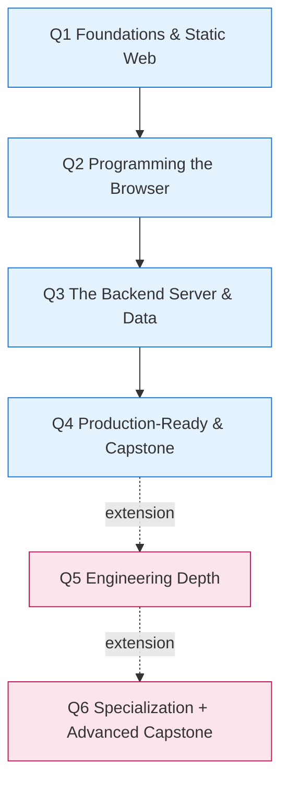

# Full-Stack Web Development — Grade 10 Elective
## 1-Year, 6-Quarter Curriculum Plan

> **Status:** Proposed plan · **Author:** Architect pass · **Source of truth for ordering & gap lectures.**
> Pair with [`inceptions/context.md`](inceptions/context.md) (project/tooling) and the live [`lectures/`](lectures) folders.

---

## 1. Course identity & goals

- **Audience:** Grade 10 students, Philippine public high school. Student internet is often unreliable/expensive → offline, single-file deliverables are a hard requirement (see `context.md` §1).
- **Core goal:** every student finishes able to build **real, usable, maintainable** web apps.
- **Explicitly *not* the goal:** scale, high concurrency, microservices, framework churn.
- **Design constraints:** the stack must be (a) **easy enough to understand what's going on**, and (b) **standard enough that AI can support development** easily.

> The defining thesis — this is literally the argument made in [`full-stack/lecture.md`](lectures/full-stack/lecture.md): *choose the stack the team can build and maintain together, not the one with the best benchmarks.* "Survivable" beats "optimal."

---

## 2. Tech stack & rationale (locked)

| Layer | Choice | Why it fits the goals |
|---|---|---|
| Structure | **HTML5** | Foundation; nothing hidden |
| Styling | **CSS + Bulma** | Class-only framework, no JS, trivial to grasp, AI-native |
| Client logic | **Vanilla JS** (ES6+) | No build step, no abstraction over the real browser model |
| Server | **Express.js + EJS** (SSR MPA) | The real request→response model, no SPA/hydration mystery |
| Database | **better-sqlite3** (file DB, prepared statements, manual `if/else` validation) | Zero-config, one file, safe boring pattern, trivial to back up |
| Data over the wire | **fetch + Promises/async-await** + JSON | Standard, minimal |
| Version control | **Git + GitHub** | Non-negotiable for "maintainable" |

**Deliberately excluded** (would trade clarity for capability Grade 10 doesn't need): React/Vue/Angular, ORMs (Prisma/Sequelize), JWT (use server sessions), Docker, SPA build pipelines, WebSockets/realtime, hand-rolled crypto.

---

## 3. Pedagogical principles

1. **Web-first spiral** — revisit concepts with increasing depth (don't "master" HTML before touching JS).
2. **A shippable artifact every quarter** — motivation comes from shipping, not slides.
3. **Front-load visible success AND independence** — build something on day one; teach debugging early so students self-rescue.
4. **Weave Git from Q1** — never a "week 14" topic.
5. **AI is a taught skill, not a secret** — given goal (b), prompt-craft and *verifying* AI output are first-class lessons.
6. **Philippine context, mobile-first, offline deliverables** — already your house standard; preserve it.
7. **Trim, don't cram** — every lecture is a *menu*; teach the 60–80% that serves the quarter's artifact. Depth is deferred to Q5–Q6.

### 3.1 AI-use policy by phase

> The *when* that complements the *how* in [`lectures/ai-assisted-development`](lectures/ai-assisted-development/lecture.md). Full rationale: [`inceptions/teaching-model-ai-gated-mastery.md`](inceptions/teaching-model-ai-gated-mastery.md). Gate specs: [`inceptions/gate-activities.md`](inceptions/gate-activities.md). How to run a session (Me/Us/You): [`inceptions/delivery-cheatsheet.md`](inceptions/delivery-cheatsheet.md).

Students may use AI to **generate** code **only in technologies they have personally unlocked** by passing the relevant no-AI gate — this guarantees they can always verify the output. Each lecture sits in one of three phases; label activities accordingly:

| Phase | AI explains / quizzes / demos | AI writes deliverable code | Copy-paste | Applies to |
|---|---|---|---|---|
| **1 — Apprentice** (learning) | ✅ Yes | ❌ No | ❌ Forbidden — type it | first encounter of any lecture |
| **Transition tier** (first project cycle after a gate) | ✅ Yes | ⚠️ Hints / review only; student still types | ⚠️ Re-type suggestions | the project cycle right after passing a gate |
| **3 — Pair** (unlocked stack) | ✅ Yes | ✅ Within unlocked stack only | ✅ Fine — reviewing, not learning | all later project work in unlocked tech |

**The seven gates** (pass to unlock AI-gen in that area): `G0` markup · `G1` control flow & data · `G2` DOM & events · `G3` persistence + async · `G4` request→response · `G5` data model + SQLite CRUD · `G6` auth & sessions. Specs in [`inceptions/gate-activities.md`](inceptions/gate-activities.md).

> 🔒 **Unlock is individual; project AI-use is collective.** A group may use AI for tech area X only when **every** member has individually passed gate X.

---

## 4. The six quarters at a glance

- **Q1–Q4 = core lane** (everyone): the guaranteed path to a real, usable, maintainable, deployed app.
- **Q5–Q6 = extension lane** (fast students): *qualitatively harder* work, not just *more* topics — engineering depth, then specialization + a second, bigger capstone.

---

## 5. Quarter-by-quarter detail

> **NEW** = a gap lecture created by this plan. *(light)* / *(full)* = trim level for that lecture in this quarter.

### Q1 — Foundations of the Web & Static Frontend
**Theme:** *Make something you can show on your phone on day one.*

| Wk | Lecture | Gate | Notes |
|---|---|---|---|
| 1 | `full-stack` (overview: how the web works) | — | client/server, request/response, browser |
| 2–3 | [`html`](lectures/html/lecture.md) | — | semantic structure, **forms**, accessibility |
| 4–5 | css | — | styling fundamentals |
| 5–6 | responsive-bulma | 🚪 **G0** (markup) | mobile-first (house standard) |
| woven | git-github (subset: §1–§5) | — | init/add/commit from week 1 |
| 7 | **NEW `requirements-user-stories`** | — | build the *right* thing: ideas→features→user stories→wireframe→MVP scope |

🏁 **Artifact:** static, responsive multi-page site (barangay profile / sari-sari store) committed to GitHub, with a one-page user story.

🚪 **Gate this quarter — `G0` (markup & responsive):** pass to unlock AI generation of HTML/CSS/Bulma markup. See §3.1.

### Q2 — Programming the Browser (client-side)
**Theme:** *Make the page do things and remember things — no server yet.*

| Wk | Lecture | Gate |
|---|---|---|
| 1–2 | js-basics | — |
| 2–3 | js-arrays-objects | 🚪 **G1** (control flow & data) |
| 4–5 | [`dom`](lectures/dom/lecture.md) | 🚪 **G2** (DOM & events) |
| 5–6 | [`localstorage`](lectures/localstorage/lecture.md) | — |
| 7–8 | ajax-fetch (Promises, async/await, public API) | 🚪 **G3** (persistence + async) |
| 9 | **NEW `debugging-devtools`** | — |

🏁 **Artifact:** interactive client-side app that persists locally **and** calls a public API (quiz, tracker, weather). Proves they can *use* the web before they *serve* it.

🚪 **Gates this quarter — `G1` control flow & data · `G2` DOM & events · `G3` persistence + async:** each unlocks AI-gen for that client-side skill area. See §3.1.

### Q3 — The Backend: Server, Data, CRUD
**Theme:** *Become the kitchen, not just the customer.*

| Wk | Lecture | Gate |
|---|---|---|
| 1–3 | [`express-basics`](lectures/express-basics/lecture.md) (+ EJS) + **NEW server-side-validation section** | 🚪 **G4** (request→response) |
| 3–4 | **NEW `data-modeling`** (schema-before-code; PK/FK; 1-to-many) | — |
| 4–6 | database-sqlite (better-sqlite3, prepared statements, CRUD) | 🚪 **G5** (data model + SQLite CRUD) |
| 7 | [`csv-datatables-qr`](lectures/csv-datatables-qr/lecture.md) (real data display) | — |
| 8 | json-api-audit (serve/test JSON) | — |
| 9 | **NEW `code-organization`** (project structure, MVC-lite, naming, README) | — |

🏁 **Artifact:** full-stack CRUD app on SQLite (Class List Manager / barangay records). **This is the "usable" milestone** — real data in, real data out.

🚪 **Gates this quarter — `G4` request→response · `G5` data model + SQLite CRUD:** unlock AI-gen for Express/EJS and SQLite/SQL. See §3.1.

### Q4 — Production-Ready Apps & Capstone
**Theme:** *Ship something a real person actually uses.*

| Wk | Lecture | Gate |
|---|---|---|
| 1–2 | authentication-sessions (login, who-am-I via cookies; library-assisted; **don't hand-roll crypto**) | 🚪 **G6** (auth & sessions) |
| 3 | production-best-practices *(light)*: basic error handling + deploy once | — |
| 4 | testing-quality *(light)*: manual testing + a handful of assertions | — |
| 5 | git-github collaboration (PR/merge for group capstone) | — |
| 6 | **NEW `ai-assisted-development`** (prompting, pasting errors, *verifying* output, reading docs, ethics) | — |
| 7–10 | **Group capstone** → build + deploy + README + demo | — |

🏁 **Artifact:** group capstone — a real, usable, **deployed** app for a real stakeholder (barangay clearance/profile, local business) with a README.

🚪 **Gate this quarter — `G6` (auth & sessions):** unlocks AI-gen for login/session code. From Wk 6 (`ai-assisted-development`) onward, students apply the full AI-use policy on the capstone — see §3.1.

### Q5 — *Extension · Engineering Depth*
**Theme:** *Turn a "working app" into a "robust, professional app."* (Full depth of the material trimmed from core.)

| Wk | Lecture |
|---|---|
| 1–3 | testing-quality *(full)*: structured tests, a little TDD flavor, test design |
| 4–6 | production-best-practices *(full)*: error handling, logging, monitoring, backups, performance, clean deploy |
| 7–8 | git-github collaboration *(full)*: PR reviews, conflict resolution, team workflow |
| 9–10 | [`pwa-basics`](lectures/pwa-basics/lecture.md) — offline (high value given PH internet!) |

🏁 **Artifact:** harden the Q4 capstone — add tests, logging, **offline support**, and a clean deploy pipeline.

### Q6 — *Extension · Specialization + Advanced Capstone*
**Theme:** *Go deeper on one axis and ship something portfolio-grade.*

| Wk | Track (student chooses one) |
|---|---|
| 1–4 | **Data track:** deeper SQLite/CSV/JSON-APIs → a data dashboard **— or —** **Frontend-polish track:** responsive-bulma deep, accessibility, performance |
| 3–5 | **`ai-assisted-development` (deep):** refactoring with AI, AI code review, agents |
| 6–10 | **Second, bigger capstone:** multi-user, deployed, real stakeholder, full Q5 practices |

🏁 **Artifact:** portfolio-grade advanced project + a presentation/demo.

---

## 6. The five NEW gap lectures (house-style spec)

> Match the pattern in [`html/lecture.md`](lectures/html/lecture.md): `# Title` → Grade/Duration/Prereq → 🎯 Objectives → 📖 TOC → numbered `<a name="section-N">` sections → ✅/❌ lists → Visual Guide figures → 🎯 Try It → When to Use → Mini-Projects → Final Challenge → Troubleshooting → What's Next? Use **Grade 10**, Philippine context, mobile-first, and `Try It` references into `assets/<slug>/`.

### 6.1 `requirements-user-stories` (Q1)
Turning ideas into buildable features. **Objectives:** write user stories (*As a X, I want Y, so Z*); sketch a low-fi wireframe; define MVP scope and cut features; distinguish must/should/could. **Sections:** why scope kills projects → user stories → wireframing (paper/Excalidraw) → MVP vs dream → prioritization → *When to Use*. Ties to your missing `user-story-template.html` content gap (`context.md` §9).

### 6.2 `debugging-devtools` (Q2)
The independence skill. **Objectives:** read an error message; use Console / Elements / **Network tab**; run the reproduce→isolate→fix→verify loop; recognize common JS/Express/SQLite errors; rubber-duck debugging. **Sections:** why "it doesn't work" isn't a bug report → reading stack traces → DevTools tour → the debugging cycle → common error families → printing/`debugger`/logging → *When to Use*.

### 6.3 `data-modeling` (Q3)
Relational thinking before code. **Objectives:** identify entities from a feature list; design tables; choose primary/foreign keys; model 1-to-many (e.g., barangay → residents); read/write a schema diagram; avoid "one giant table." **Sections:** data vs code-first → entities & tables → keys & relationships → 1-to-many worked example → schema diagrams → normalization-lite → *When to Use*. Pairs with `database-sqlite`.

### 6.4 `code-organization` (Q3)
What "maintainable" means. **Objectives:** organize a project (routes/views/data); apply **MVC-lite**; name things well; separate concerns; write a README; explain why structure matters as apps grow. **Sections:** the "spaghetti" anti-example → folders that scale → MVC-lite (you already have [`09-mvc-pattern`](lectures/express-basics/diagramSrc/web-browser-basics/09-mvc-pattern.md)) → naming conventions → README & docs → *When to Use*.

### 6.5 `ai-assisted-development` (Q4, deep in Q6)
Building *with* AI — your explicit goal. **Objectives:** write effective prompts; paste errors/context well; **verify** AI output (it lies confidently); know when to read the docs instead; use AI for refactoring/review; ethics, attribution, and not outsourcing understanding. **Sections:** AI as a junior pair → anatomy of a good prompt → pasting errors & repros → reading & verifying code → docs-first moments → refactoring & review → ethics & learning → *When to Use*.

> Plus an **enhancement, not a new lecture:** a *Server-side validation* section added to [`express-basics/lecture.md`](lectures/express-basics/lecture.md) and [`database-sqlite/lecture.md`](lectures/database-sqlite/lecture.md) (manual `if/else` checks — consistent with the locked stack decision).

---

## 7. Trimmed / left out of the core (and why)

| Topic | Decision | Why |
|---|---|---|
| PWA (service workers, caching) | **Core: cut. Q5: include.** | Advanced; payoff low unless offline is required. Your offline constraint is about *slide authoring/export*, not students shipping PWAs — but in Q5 it becomes valuable. |
| Production deep-dive (logging, monitoring, backups, perf) | **Core: light. Q5: full.** | Ops concerns; "no scale" goal. |
| Testing & quality | **Core: light. Q5: full.** | Heavy for Grade 10 at full depth. |
| Deep security internals (hashing internals, JWT, CSRF/XSS theory) | **Always: cut.** Use a library for auth; teach "don't roll your own crypto." | High complexity, easy to get wrong. |
| Git advanced (rebase, formal PR review) | **Core: basics + one branch/merge lesson. Q5: full.** | Enough for solo/small-group capstones. |
| DataTables-heavy UI, WebSockets/realtime, Docker/CI-CD | **Always: cut.** | Beyond scope and the "no scale" constraint. |

---

## 8. Consistency fixes (bundle in)

1. **Grade level metadata:** ✅ **Done** — swept all lecture sources from "Grade 9" to **Grade 10** (54 references across 14 files).
2. **`api-testing` placement:** ✅ **Confirmed** — the source folder [`lectures/api-testing/lecture.md`](lectures/api-testing/lecture.md) exists. It sits in **Q3** immediately after `json-api-audit` (testing APIs naturally follows auditing/consuming them). No reconciliation was needed.
3. **`web-lectures/full-stack-g10/`** are the exported `.html`; the source of truth is [`lectures/`](lectures). New gap lectures get a source folder; the export set is regenerated.

---

## 9. Implementation order

1. ✅ Lock this plan (this doc).
2. ✅ Build gap lectures **one at a time, full house style**, in this priority order (value × low dependency):
   1. ✅ `debugging-devtools` (Q2) — highest independence value
   2. ✅ `ai-assisted-development` (Q4) — explicit goal, novel
   3. ✅ `code-organization` (Q3) — "maintainable" backbone
   4. ✅ `requirements-user-stories` (Q1) — "usable / right thing"
   5. ✅ `data-modeling` (Q3) — pairs with database-sqlite
3. ✅ Add the **server-side-validation** sections to express-basics + database-sqlite.
4. ✅ Apply the **Grade 9 → Grade 10** metadata sweep.
5. ✅ Reconcile **api-testing** source/placement (confirmed: source exists, Q3 slot correct).
6. ✅ Regenerate the G10 export set (23 lectures in `web-lectures/full-stack-g10/`).

---

## 10. Quarter → lecture index (quick reference)

| Lecture | Q | Existing? | Trim |
|---|---|---|---|
| full-stack (overview) | Q1 | ✅ | — |
| html | Q1 | ✅ | — |
| css | Q1 | ✅ | — |
| responsive-bulma | Q1 | ✅ | — |
| git-github | Q1/Q4/Q5 | ✅ | subset→full |
| **requirements-user-stories** | Q1 | 🆕 | — |
| js-basics | Q2 | ✅ | — |
| js-arrays-objects | Q2 | ✅ | — |
| dom | Q2 | ✅ | — |
| localstorage | Q2 | ✅ | — |
| ajax-fetch | Q2 | ✅ | — |
| **debugging-devtools** | Q2 | 🆕 | — |
| express-basics | Q3 | ✅ | +validation |
| **data-modeling** | Q3 | 🆕 | — |
| database-sqlite | Q3 | ✅ | +validation |
| **code-organization** | Q3 | 🆕 | — |
| csv-datatables-qr | Q3 | ✅ | — |
| json-api-audit | Q3 | ✅ | — |
| api-testing | Q3 | ✅ | — |
| authentication-sessions | Q4 | ✅ | light |
| production-best-practices | Q4/Q5 | ✅ | light→full |
| testing-quality | Q4/Q5 | ✅ | light→full |
| **ai-assisted-development** | Q4/Q6 | 🆕 | — |
| pwa-basics | Q5 | ✅ | full |
