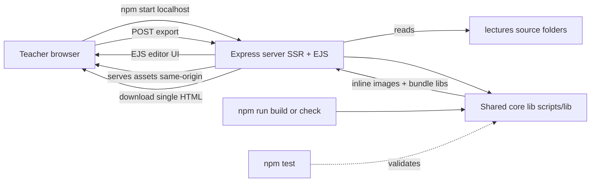

# 🧠 Project Context — "Second Brain"

> **Read this first at the start of every new session.** It is the single source of truth for *what this project is, why, and how*. Pair it with [`plans/progress.md`](../plans/progress.md) (where we are) and [`plans/reorg-inventory.md`](../plans/reorg-inventory.md) (the file-ownership map).

**Last updated:** 2026-06-12 · **Status:** Planning complete — implementation about to begin (Phase 0).

---

## 1. Identity

- **Project:** `lecture_creator` — a tool that converts Markdown lecture notes into self-contained, narrated (text-to-speech) HTML presentation slides for classroom use.
- **Owner:** A public high-school **Computer Science teacher** in the **Philippines**, teaching **Grade 10**.
- **Stack familiarity:** HTML/CSS/JS, **Node.js, Express.js, EJS**, git/GitHub, npm (`npm run`, `npm test`).
- **Real-world constraint:** Student internet is often **unreliable/expensive** → offline, single-file deliverables are a hard requirement.

## 2. The Problem We Are Solving

1. **GitHub Pages hotlinking is no longer allowed.** Lectures referenced images by *relative* paths; the export tool prepended a `https://roycan.github.io/lecture_creator/` base URL to produce absolute hotlinks. That delivery path is now dead.
2. **Disorganization & broken links.** Assets scattered, ~15 temp files littering the root, duplicated files (`tmc-eval360` ×2, summary files ×2), and broken image references (`promise-state` vs `promise-states`, missing PNGs, filename typos).

> ✅ Key finding: the `github.io` hotlink URLs appear **only** in historical docs (`QUICK-TEST-GUIDE.md`, `archive/*`). Active lectures already use relative paths — so the fix is **delivery-only** (embed/host), not a mass path rewrite.

## 3. The Solution (locked direction)

- **Full restructure** → each lecture becomes a portable folder `lectures/<slug>/` with its own `lecture.md`, `assets/`, `diagrams/`, `diagram-src/`.
- **Offline single-file exports** → a **Node build** that embeds images as **data URIs** and **bundles highlight.js + mermaid** (mermaid only when a lecture actually uses it). No external URLs in the student file.
- **Express + EJS SSR multi-page app** runs on `localhost` → same-origin, so the editor can live-preview images AND export in-browser. (`http://localhost` sidesteps the `file://` CORS problem entirely.)
- **One shared core** (`scripts/lib/`) used by both the CLI (`npm run build`) and the server `/export` route — single source of truth.
- **Automated tests + integrity linter** so we *know* it's correct and never ship a broken slide.

## 4. Target Architecture



### Folder layout (target)
```
lecture_creator/
├── package.json                # express, ejs, marked, highlight.js, mermaid; dev: supertest
├── server/                     # Express SSR MPA
│   ├── app.js                  # express app + ejs view engine
│   ├── routes/                 # editor, lecture, assets, export
│   └── views/                  # EJS templates (port of index.html)
├── scripts/
│   ├── lib/                    # SHARED CORE: splitSlides, inlineImages, bundleLibs, assemblePresentation
│   ├── build.js                # CLI: npm run build -- <slug> | --all
│   ├── check.js                # integrity linter: npm run check
│   └── test/                   # npm test (node --test)
├── lectures/                   # SOURCE (one folder per lecture)
│   └── <slug>/
│       ├── lecture.md
│       ├── assets/             # practice HTML/CSS/JSON (+ copied styles.css)
│       ├── diagrams/           # rendered PNGs
│       └── diagram-src/        # .mmd/.d2/.puml/.dot sources
├── shared/                     # cross-lecture: styles.css, shared challenges
├── dist/                       # GENERATED exports (gitignored)
├── archive/                    # superseded files (never delete; git mv here)
├── logs/  plans/  inceptions/  # docs
└── README.md
```

### npm scripts
| Command | Does |
|---|---|
| `npm start` | Run Express editor on localhost (author / live-preview / export) |
| `npm run build -- <slug>` | CLI build one lecture → `dist/<slug>.html` |
| `npm run build:all` | Build every lecture |
| `npm run check` | Integrity linter — fail if any image/asset ref is missing |
| `npm test` | Unit + integration + route tests |

## 5. How We Know It's Correct (test strategy + acceptance)

- **Unit (`npm test`):** `splitSlides`, `inlineImages` (MIME png/svg/jpg + missing-file error), `bundleLibs` (zero cdnjs/jsdelivr URLs left), `assemblePresentation`.
- **Integration:** build a fixture lecture → assert output is one file, image embedded, libs bundled, **zero external `http(s)://` URLs** (the offline proof).
- **Routes (supertest):** `GET /` lists lectures; `GET /lectures/:slug` serves markdown; assets `200`; `POST /export` returns attachment.
- **Linter (`npm run check`):** scans all lectures, fails on any missing ``/Try-It asset — CI gate.
- **Acceptance (Definition of Done):** `npm test` green · `npm run check` clean · built file has **zero external URLs** · offline open shows images/highlight/mermaid/voice · `npm start` round-trip works.

## 6. Locked Decisions (with rationale)

| # | Decision | Why |
|---|---|---|
| D1 | Full restructure into `lectures/<slug>/` | portability + clean relative-path editing |
| D2 | Data-URI image embedding (not alt-host) | offline single files beat internet dependence for this classroom |
| D3 | Express + EJS SSR MPA on localhost | same-origin solves CORS; reuses teacher's stack; one tool for author+export |
| D4 | Bundle highlight.js always; mermaid only when used | offline reliability + smaller files |
| D5 | Shared core for CLI + server | one source of truth, no duplicate export logic |
| D6 | Keep browser editor as the Express-served editor (preview/voice + export); remove dead base-URL field | preserves authoring UX |
| D7 | `shared/styles.css` canonical; copy-on-build into each lecture's `assets/` | practice files keep simple `<link href="styles.css">` |
| D8 | Shared starters/solutions canonical in `shared/challenges/`, copy-on-build | avoid divergence |
| D9 | Move CSS lecture PNGs from `assets/` to `diagrams/` | consistency with all other lectures |
| D10 | `CHANGELOG.md` stays at root | standard convention |
| D11 | Content gaps (missing practice/support files) tracked as TODOs, non-blocking | they're unfinished content, not reorg breakage |
| D12 | tmc-eval360: subfolder copy canonical; verify PNG locations in Phase 6 | resolve the ×2 duplication |
| D13 | Never delete — `git mv` into dated `archive/reorg-2026-06/` | preservation + git history |

## 7. Conventions

- **Names:** kebab-case everywhere (`ajax-fetch`, `promise-states.png`).
- **Slides:** `#`/`##` headings split slides (ported logic). Use `marked.lexer` tokens in Node (not DOM).
- **Images in lectures:** relative to the lecture folder (`diagrams/x.png`, `assets/y.png`).
- **Exports:** fully self-contained; the only acceptable external refs are none (target: zero).
- **Archive, don't delete.**

## 8. Where Things Are

| Thing | Location |
|---|---|
| This context doc | `inceptions/context.md` |
| Progress tracker | `plans/progress.md` |
| File-ownership inventory | `plans/reorg-inventory.md` |
| Original tool (to be ported) | `app.js` (`createSingleHTML` @ line ~270, `processMarkdown` @ ~95, base-URL export @ ~239), `index.html`, `style.css` |
| Existing lectures (pre-restructure) | `web-lectures/*.md` |
| Existing assets/diagrams | `assets/`, `diagrams/`, `diagram-src/` |

## 9. Known Issues / Content Gaps (summary)

- Broken image rewrites (3): `promise-state→promise-states`, `datables→datatables`, `assets/full-stack.png→diagrams/full-stack/full-stack.png`.
- Truly-missing PNGs (~13): `testing-quality` (6), `responsive-bulma` (4), `express-basics` (`add-data-flow`), `production-best-practices` (2).
- Content gaps (referenced, never authored): `weather.html`, `user-story-template.html`, `debugging-practice.html`, `uat-form.html`, `support-materials/auth-*.md`, the `-v2`/`-v3` practice apps.
- Full detail: [`plans/reorg-inventory.md`](../plans/reorg-inventory.md) §2–§3.

## 10. Session Bootstrap Checklist (do this every new session)

1. Read **this file** (`inceptions/context.md`).
2. Read [`plans/progress.md`](../plans/progress.md) → find **"▶ RESUME HERE"**.
3. Skim [`plans/reorg-inventory.md`](../plans/reorg-inventory.md) if the phase touches files/links.
4. Check `git status` / recent commits to confirm the on-disk state matches the progress doc.
5. Resume the indicated phase; update `plans/progress.md` at the end of the session.

## 11. Glossary

- **SSR MPA** — Server-Side Rendered Multi-Page Application (Express+EJS, one view per route).
- **Data URI** — file contents embedded inline as `data:image/png;base64,...` so no network fetch is needed.
- **Slug** — the short kebab-case folder name for a lecture (e.g. `ajax-fetch`).
- **Linter / `check`** — the integrity scan that flags missing image/asset references.

## 12. Diagram rendering pipeline (implemented — Phases 1–4)

> **Added 2026-06-22 (final phase).** This section documents the Kroki-based diagram pipeline that
> now sits inside the build core. It is additive; nothing above is superseded.

- **Render module:** [`scripts/lib/render-diagram.mjs`](../scripts/lib/render-diagram.mjs) renders
  diagram sources (`.mmd`/`.puml`/`.d2`/`.dot`/`.svgbob`/`.ditaa`/`.nomnoml`/`.erd`/`.bytefield`/the
  `*diag` family) to PNG via a [Kroki](https://kroki.io) endpoint — no Chromium/puppeteer.
- **CLI:** `npm run diagram -- <file-or-dir>` (`--engine`, `--force`, `--kroki-base`); idempotent
  (mtime-skip) and prints `` ref lines. Default Kroki base `https://kroki.io`,
  override with `KROKI_BASE_URL`.
- **Auto-render in build:** `buildLecture()` renders `lectures/<slug>/diagramSrc/**` →
  `diagrams/<rel>.png` **before** `inlineImages()`. No `diagramSrc/` ⇒ offline no-op (zero Kroki).
- **Integrity gate:** `npm run check` ERRORs on broken diagram refs (no source + no PNG); WARNs on
  stale renders & multi-format collisions. Stays offline.
- **Convention:** `diagramSrc/<rel>.<ext>` → `diagrams/<rel>.png` → ``.
  Collisions resolve `.mmd > .puml > .d2 > .dot/.gv` > others; losers ignored, never deleted.

**New locked decisions (extend §6):**

| # | Decision | Why |
|---|---|---|
| D14 | All engines route through Kroki (server-side), incl. Mermaid — no browser/puppeteer | one render path; crisp `?scale=2` PNGs; offline student files |
| D15 | Auto-render in the shared build core, not a separate pre-step | one source of truth (D5); a lecture without `diagramSrc/` is byte-identical to before |

**Known content debt (not regressions):** `ajax-fetch` and `dom` keep diagram *sources* whose
mirrored PNG paths were never pre-rendered, so a cold build hits the public Kroki service (transient
HTTP 400s can fail them). `dom` also has unsupported `.bob`/`.diag` extensions (ignored). `npm run
check` stays clean (0 errors) because the referenced flat PNGs exist. Fixes are content-only.
