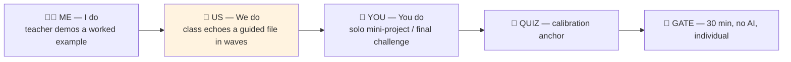
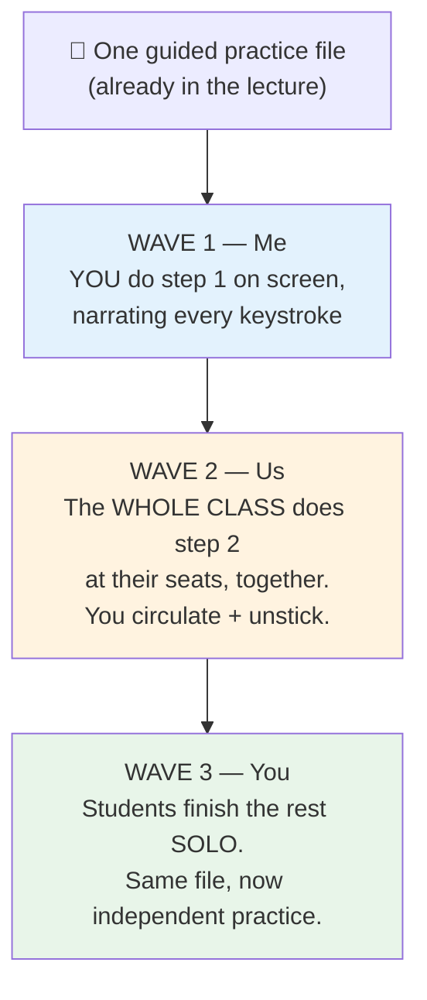

# 🎬 Delivery Cheat-Sheet — Run Any Lecture as Me → Us → You

> **Purpose:** a one-stop, scannable sheet that lets *any* teacher — including a substitute or a colleague at another campus — run a single lecture session inside the Me → Us → You → quiz → gate cycle **without inventing anything**. The lectures already contain every asset you need; this sheet just tells you which existing piece to use at which moment.
> **Companion to:** [`teaching-model-ai-gated-mastery.md`](teaching-model-ai-gated-mastery.md) (the *why*), [`gate-activities.md`](gate-activities.md) (the gate *specs*), and [`../full-stack-g10-curriculum.md`](../full-stack-g10-curriculum.md) §3.1 & §5 (the *what/when*).
> **Status:** Adopted · **Last updated:** 2026-06-15

---

## 0. The 60-second version

Every lecture in this course already ships the same five-part spine: **concept + worked examples → `🎯 Try it yourself` guided files → Mini-Projects / Final Challenge → quiz → (when scheduled) a gate scaffold.** Those five parts *are* the cycle. You do not build new activities — you **slot** existing ones into five moves:

> 🔑 **The only thing you design live is the orange box — "Us."** Me, You, the quiz, and the gate are all pre-written. "Us" is where you decide *how* to release an existing guided file to the class. The rest of this sheet is about doing that one thing well.

---

## 1. The slotting rule

Each lecture asset maps to exactly one cycle slot. Pick the lecture, then run the assets in this order:

| Cycle slot | Phase | What you do at delivery | Which existing lecture asset to use |
|---|---|---|---|
| **🧑‍🏫 Me — I do** | 1 · Apprentice | Select **one** worked example from the concept section; present it live; **narrate your thinking out loud.** | The concept / worked-example section of `lecture.md` (the prose + code blocks). No copy-paste — type it. |
| **👥 Us — We do** | 1 · Apprentice | Release a guided file **in waves** (see §2), or run a short pair protocol (see §3). | The `🎯 Try it yourself` practice files in `assets/` (e.g. `practice1.html`). |
| **🧑 You — You do** | 1 → 2 | Assign as **individual** work. This is where the *self-reported* per-topic mastery check happens. | The **Mini-Projects** and the **Final Challenge** (most have a starter + solution). |
| **📝 Quiz** | — | Use as a **calibration anchor**: it tells you whether "I can do it" matches "I actually can." | `assets/quiz.md`. |
| **🚪 Gate** | 2 · Prove it | When the lecture has a scheduled gate (see curriculum §5 "Gate" column), run it: **30 min, no AI, individual.** A miss defers that tech's AI-unlock — it is never a failing grade. | The matching scaffold in [`../shared/gates/`](../shared/gates/README.md) (starter + solution). |

> 💡 **After the gate passes**, that technology area is *unlocked* — the student may now let AI **generate** code in that area (Phase 3 · Pair programmer), because they've proven they can verify the output. See [`teaching-model-ai-gated-mastery.md`](teaching-model-ai-gated-mastery.md) §2 (keystone rule).

---

## 2. The wave-release technique ("Us" with zero new files)

The single highest-leverage move in this course. Take an existing guided file (the ones the lecture already labels `🎯 Try it yourself`) and **release it in three waves** instead of handing it out whole:

**Why this is the default:** it delivers genuine Gradual Release of Responsibility (Pearson & Gallagher, 1983) using an asset that already exists. You write nothing new, and every student gets one shared, scaffolded experience before going solo.

**When to use it:** most sessions. It is the "Us" you reach for first.

**Common mistake:** skipping Wave 2 when time is short. Wave 2 is the whole point — it is where misconceptions surface *while you can still fix them*. If you're short on time, cut Wave 3 (solo can be homework); never cut Wave 2.

---

## 3. Three reusable pair protocols (the "Us" toolkit)

When a guided file isn't the right fit, or you want to deepen "Us," use one of these three **protocols**. They are *techniques*, not authored assets — they apply to any lecture. All three satisfy the no-copy-paste rule.

### 🥇 Protocol A — Driver / Navigator *(the default; ideal for device-short labs)*
- **How it runs:** two students, **one keyboard**. The **Navigator** says *what* to do next in plain words; the **Driver** types it. Swap roles every 5–7 minutes.
- **Why it's #1:** it needs **no extra hardware** — perfect for public-school labs where machines are shared or scarce. The out-loud reasoning is also the most research-backed form of pair learning.
- **Time:** 10–15 min.
- **Try it on:** [`../lectures/dom/lecture.md`](../lectures/dom/lecture.md) → pairs complete [`../lectures/dom/assets/practice2.html`](../lectures/dom/assets/practice2.html) together.

### 🥈 Protocol B — Explain-It-Back *(peer teach)*
- **How it runs:** Student A explains, line by line, what the worked example does — in their own words — while Student B checks against the original. If B spots a gap, A must re-explain. Then swap.
- **Why:** the fastest way to break the *illusion of competence* (the whole reason the gate exists). A student who can't explain it hasn't mastered it yet.
- **Time:** 5–8 min.
- **Try it on:** any worked example in a concept section; mirrors the "Explain-It-Back test" in [`../lectures/ai-assisted-development/lecture.md`](../lectures/ai-assisted-development/lecture.md).

### 🥉 Protocol C — Bug-Swap *(you break mine, I fix yours)*
- **How it runs:** each student takes a working file they finished, deliberately introduces **one** bug, swaps with a partner, and the partner must diagnose and fix it using the Console.
- **Why:** pairs debugging practice with reading someone else's code — and it's fun.
- **Time:** 10 min.
- **Try it on:** any completed practice file; pairs naturally with [`../lectures/debugging-devtools/lecture.md`](../lectures/debugging-devtools/lecture.md).

---

## 4. A full session, start to finish (worked example)

A concrete run-through so a substitute can copy the shape. We use [`../lectures/dom/lecture.md`](../lectures/dom/lecture.md) (topic: **DOM & events**, which carries **Gate G2**). Assume a ~90-minute block. Files referenced all exist in the lecture's `assets/`.

| Min | Move | Slot | What happens | Asset used |
|---|---|---|---|---|
| 0–10 | Hook + concept | — | Teacher shows the DOM tree, selects one element live, changes its text. Narrate every step. | [`../lectures/dom/lecture.md`](../lectures/dom/lecture.md) §Introduction + `diagrams/dom-tree` |
| 10–25 | **Me → Us** (wave-release) | 🧑‍🏫→👥 | **Wave 1 (Me):** teacher writes `document.getElementById(...)` on screen. **Wave 2 (Us):** whole class types the `querySelector(...)` version together at their seats; teacher circulates. | [`../lectures/dom/assets/practice1.html`](../lectures/dom/assets/practice1.html) |
| 25–40 | **Us** (pair) | 👥 | **Driver/Navigator** pairs complete the reading-and-changing task; swap roles once. | [`../lectures/dom/assets/practice2.html`](../lectures/dom/assets/practice2.html) |
| 40–70 | **You** (solo) | 🧑 | Individual: finish styling practice, then start the To-Do mini-project. This is the *self-reported* mastery check. | [`../lectures/dom/assets/practice3.html`](../lectures/dom/assets/practice3.html) → [`../lectures/dom/assets/todo.html`](../lectures/dom/assets/todo.html) |
| 70–80 | **Quiz** (calibration) | 📝 | Short quiz; compare each student's self-report against the result. | [`../lectures/dom/assets/quiz.md`](../lectures/dom/assets/quiz.md) |
| 80–90 | Wrap + gate notice | — | Preview Gate G2 (next session). Remind: no AI, individual, 30 min, miss = retry not fail. | [`../shared/gates/gate-g2-dom-events-starter.html`](../shared/gates/gate-g2-dom-events-starter.html) |
| *(next session)* | **🚪 Gate G2** | 🚪 | Students build the Complaint Box scaffold unaided. **Pass** → DOM/events AI-gen unlocked. | [`../shared/gates/gate-g2-dom-events-starter.html`](../shared/gates/gate-g2-dom-events-starter.html) + `-solution` |

> 🧩 **Note on the gate:** the gate is a *separate* session from the lecture. It runs at the end of the topic chunk (see curriculum §5 "Gate" column), not at the end of every single class.

---

## 5. Facilitator quick-rules

**Do**
- ✅ Type worked examples live — never paste. (Muscle memory is part of the lesson.)
- ✅ Always run **Wave 2** (the class echo). It's the diagnostic moment.
- ✅ Use the quiz as an *honesty check*, not a grade — it calibrates self-reported mastery.
- ✅ Make the **Driver/Navigator** your default pair form; it works on one shared machine.

**Don't**
- ❌ Don't let AI anywhere near a student during a gate — phones away, tabs closed. AI-as-tutor is *also* off for the gate.
- ❌ Don't turn a gate miss into a failing grade — it **defers** that tech's AI-unlock and triggers a "loop back, retry next class."
- ❌ Don't skip "Us" when you're short on time — cut solo work instead (it can become homework).
- ❌ Don't let a group use AI to generate code in tech area X until **every** member has individually passed gate X (the collective-unlock rule).

---

## 6. Where this fits

This sheet is the **"how to run a session"** layer. It connects upward to the model and downward to the runnable materials:

- **The why** → [`teaching-model-ai-gated-mastery.md`](teaching-model-ai-gated-mastery.md) (3-phase philosophy, keystone rule, pedagogical citations).
- **The gate specs** → [`gate-activities.md`](gate-activities.md) (per-gate scenario / pass-when / not-yet-loop / unlocks).
- **The what & when** → [`../full-stack-g10-curriculum.md`](../full-stack-g10-curriculum.md) §3.1 (AI-use policy) & §5 (the week-by-week tables, each with a **Gate** column).
- **The runnable scaffolds** → [`../shared/gates/README.md`](../shared/gates/README.md) (all 7 gates, starter + solution, run instructions).

> 📎 **For presenting to other teachers:** print §0 (the cycle), §1 (the slotting table), and §4 (the worked session). Those three alone let a colleague run their first session tomorrow.
