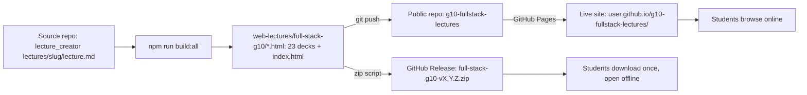
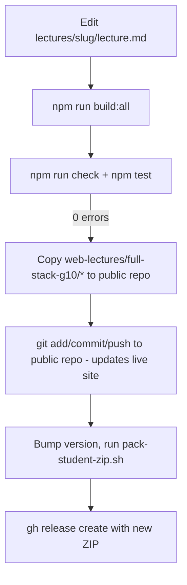

# Deploy Plan — Grade 10 Full-Stack Lectures (GitHub Pages + Offline ZIP)

> **Goal:** Publish the 23 self-contained lecture decks in [`web-lectures/full-stack-g10/`](../web-lectures/full-stack-g10/) so students can (a) browse them live online **and** (b) download a single ZIP for fully offline use — with **one** set of files maintained in **one** place.
>
> **Note:** Originally intended for `/plans/`, but that path is blocked by `.rooignore`. Filed here alongside the other teacher planning docs ([`context.md`](context.md), [`delivery-cheatsheet.md`](delivery-cheatsheet.md)).

---

## 0. Why this works (the strategy in one paragraph)

The export pipeline already produces **fully self-contained HTML** (images as data URIs, highlight.js + mermaid bundled inline, **zero external `http(s)://` URLs** — see [`context.md`](context.md)). That means the **same files** render identically at a `github.io` URL and from a downloaded folder opened via `file://`. We are not maintaining an "online version" and an "offline version" — we publish one bundle to two locations. The [`index.html`](../web-lectures/full-stack-g10/index.html) we build uses **relative links only**, so it is the landing page for the Pages site *and* the table of contents for the ZIP.

This is the recommended **"do both"** path. Neither option is redundant: Pages covers students with internet; the ZIP covers the stated hard requirement (unreliable/expensive PH internet).

---

## 1. Architecture



---

## 2. Repository decision

Create a **new, separate, public repo** dedicated to published student-facing content. Do **not** host from `lecture_creator` itself — that repo contains teacher tooling, source Markdown, build scripts, and the in-repo Express editor. Mixing them exposes internals and bloats the student download.

**Suggested repo name:** `g10-fullstack-lectures` (short, descriptive, search-friendly).

**Why separate, not a `docs/` folder in the existing repo:**
- `lecture_creator`'s default branch contains ~25 lecture source folders, the server, scripts, and tests — none of which students need.
- A clean public repo is a better "front door" (cleaner README, smaller clone/ZIP, clearer URL).
- Keeps the teacher's working repo free of student-delivery churn.

**Repo layout (the public repo):**
```
g10-fullstack-lectures/
├── index.html                         # the index we build (Pages root)
├── README.md                          # student-facing, explains online + offline use
├── full-stack-g10-curriculum.md       # optional: full curriculum reference
├── html.html                          # 23 self-contained decks
├── css.html
├── ... (21 more)
└── .nojekyll                          # IMPORTANT — see step 4
```

---

## 3. Step-by-step: create and publish the repo

Run from inside `lecture_creator` (paths below are relative to repo root).

```bash
# 3.1 Create the staging directory (outside lecture_creator)
mkdir -p ../g10-fullstack-lectures
cd ../g10-fullstack-lectures
git init -b main

# 3.2 Copy ONLY the student-facing files
cp ../lecture_creator/web-lectures/full-stack-g10/*.html .
cp ../lecture_creator/web-lectures/full-stack-g10/full-stack-g10-curriculum.md .

# 3.3 Disable Jekyll so GitHub Pages serves the raw tree verbatim
touch .nojekyll

# 3.4 Commit
git add .
git commit -m "Publish Grade 10 full-stack lectures (23 decks + index)"

# 3.5 Create the empty repo on GitHub first (web UI or gh CLI), then:
gh repo create g10-fullstack-lectures --public --source=. --remote=origin --push
#   — or manually —
#   git remote add origin git@github.com:<YOUR_USER>/g10-fullstack-lectures.git
#   git push -u origin main
```

> **`.nojekyll` is critical.** GitHub Pages runs Jekyll by default, which ignores files/folders starting with `_` or `.`. Our deck filenames are safe, but adding `.nojekyll` guarantees Pages serves the raw tree verbatim — no surprises later.

---

## 4. Enable GitHub Pages

1. On GitHub: **Settings → Pages**.
2. **Source:** `Deploy from a branch`.
3. **Branch:** `main` / **Folder:** `/ (root)`.
4. Save. After ~30–60s the site is live at:
   `https://<YOUR_USER>.github.io/g10-fullstack-lectures/`
5. Open the URL → you should see `index.html` with all 23 cards linking to working decks.

> **The [`context.md`](context.md) caution does not apply here.** That note was about *hotlinking* GitHub-Pages-hosted assets into *other* sites (now blocked). Hosting your own educational HTML for direct browsing is the canonical, fully-supported Pages use case.

---

## 5. Offline ZIP via GitHub Releases (recommended)

GitHub's built-in **"Download ZIP"** on the repo page zips the *whole repo* including `README.md`, `.nojekyll`, etc. That works, but a **curated ZIP attached to a Release** is cleaner for students. Use this script to produce it.

### 5.1 Packaging script — `scripts/pack-student-zip.sh`

> Create this in `lecture_creator` (the teacher repo), not the public repo.

```bash
#!/usr/bin/env bash
# Pack the student-facing lecture bundle into a versioned ZIP.
# Usage: ./scripts/pack-student-zip.sh 1.0.0
set -euo pipefail

VERSION="${1:?usage: pack-student-zip.sh <version e.g. 1.0.0>}"
SRC="web-lectures/full-stack-g10"
STAGE="$(mktemp -d)/full-stack-g10-lectures"
mkdir -p "$STAGE"

# Copy exactly what students need
cp "$SRC"/*.html "$STAGE"/
cp "$SRC/full-stack-g10-curriculum.md" "$STAGE"/

# Produce the zip so the top-level folder is named nicely
OUT="dist/full-stack-g10-v${VERSION}.zip"
mkdir -p dist
( cd "$(dirname "$STAGE")" && zip -r "$OLDPWD/$OUT" "$(basename "$STAGE")" )

echo "✔ Wrote $OUT"
echo "  Attach it to a GitHub Release tagged v${VERSION}."
```

Make it executable: `chmod +x scripts/pack-student-zip.sh`.

### 5.2 Publish a release

```bash
# From lecture_creator, after rebuilding:
npm run build:all                      # regenerates web-lectures/full-stack-g10/*.html
./scripts/pack-student-zip.sh 1.0.0    # produces dist/full-stack-g10-v1.0.0.zip

# Push the rebuilt HTML to the public repo too (keep online + offline in sync)
cp web-lectures/full-stack-g10/*.html ../g10-fullstack-lectures/
( cd ../g10-fullstack-lectures && git add -A && git commit -m "Lectures v1.0.0" && git push )

# Create the release and attach the ZIP
gh release create v1.0.0 dist/full-stack-g10-v1.0.0.zip \
  --repo <YOUR_USER>/g10-fullstack-lectures \
  --title "Grade 10 Full-Stack Lectures v1.0.0" \
  --notes "Download and unzip, then open index.html in any browser. Works fully offline."
```

Students reach it at: `https://github.com/<YOUR_USER>/g10-fullstack-lectures/releases`.

---

## 6. The update workflow (every time lectures change)



**Single source of truth stays in `lecture_creator`.** The public repo is a *publish target*, never hand-edited. If a student reports a typo, fix the Markdown in `lecture_creator`, rebuild, re-publish.

Suggested versioning: `v<YEAR>.<TERM>.<patch>` e.g. `v2026.1.0` — students can tell at a glance whether they have the current copy.

---

## 7. Student-facing README.md (for the public repo)

The public repo's `README.md` is what students see on GitHub. Keep it short:

```markdown
# Grade 10 Full-Stack Web Development — Lectures

Self-contained lecture decks. Each one works **fully offline** — images, code
highlighting, and diagrams are all embedded in a single HTML file.

## Online
Open: https://<YOUR_USER>.github.io/g10-fullstack-lectures/

## Offline (slow or no internet)
1. Go to **Releases**: https://github.com/<YOUR_USER>/g10-fullstack-lectures/releases
2. Download the latest `.zip`.
3. Unzip it.
4. Open `index.html` in any browser. No internet needed after that.

## What's inside
23 lectures across the year — see `index.html` or `full-stack-g10-curriculum.md`.
```

---

## 8. Verification checklist (run after first publish)

- [ ] `https://<YOUR_USER>.github.io/g10-fullstack-lectures/` loads `index.html`.
- [ ] All 23 card links open their deck (no 404s).
- [ ] Open the downloaded ZIP, **disconnect from the internet**, open `index.html` — every deck still renders, including images and diagrams.
- [ ] Search the published `index.html` and the decks for external `http://` / `https://` references — expect **zero** (grep confirms the self-containment standard holds).
- [ ] On mobile, `index.html` is responsive and cards stack vertically.

```bash
# Confirm zero external URLs across the bundle:
grep -REl "https?://(?!github\.com)" web-lectures/full-stack-g10/*.html \
  && echo "⚠ external URL found" || echo "✔ self-contained"
```

---

## 9. Alternatives considered (and why not)

| Option | Verdict |
|---|---|
| **Pages only** | ❌ Violates the offline hard requirement from [`context.md`](context.md). |
| **Offline ZIP only** | ⚠ Works but loses the always-on shareable URL and mobile browsing. |
| **Host from `lecture_creator` `docs/` folder** | ⚠ Couples student delivery to teacher tooling; bigger, noisier downloads. |
| **Netlify/Vercel instead of Pages** | ⚠ Works, but adds an account and build config for no benefit here — Pages is free and zero-config for static HTML. |
| **Per-lecture separate repos** | ❌ 23 repos to maintain; defeats the point of one index. |

**Decision: GitHub Pages + GitHub Releases ZIP, published from one dedicated public repo, sourced from one build.**
