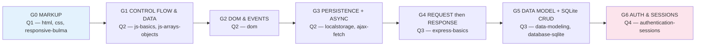

# 🚪 AI-Unlock Gate Activities — Catalog

> **Purpose:** the concrete, runnable specification for each **30-minute, no-AI, individual** integration gate that *unlocks AI code generation* for a technology area.
> **Companion to:** [`teaching-model-ai-gated-mastery.md`](teaching-model-ai-gated-mastery.md) (the *why*) and [`full-stack-g10-curriculum.md`](../full-stack-g10-curriculum.md) (the *what/when*).
> **Status:** Spec complete · **Last updated:** 2026-06-15
>
> ⚠️ **What this document is *not*:** it does not contain the actual starter/solution HTML scaffolds. Those are built later in *code mode* (planned location: [`shared/gates/`](../shared/gates/), mirroring the [`shared/challenges/`](../shared/challenges/) starter/solution convention). This is the **spec** each scaffold must satisfy.

---

## 1. How a gate works (the rules, in one place)

Every gate in this catalog obeys the five design rules from [`teaching-model-ai-gated-mastery.md` §5](teaching-model-ai-gated-mastery.md):

1. **30 minutes, no AI, individual.** Phones away, tabs closed. AI-as-tutor is *also* off for the gate.
2. **Scoped + scaffolded.** The boring boilerplate is pre-given; the student writes the *new wiring*. "Extend this starter," not "build from blank."
3. **Objective functional spec.** Each gate has a checklist of "it does X." Objective = pass/fail without argument.
4. **Clean "not yet" path.** A miss is **never** a failing grade — it defers that tech's AI-unlock and triggers a "loop back, retry next class."
5. **Reuses a prior skill.** Each gate forces reuse of an earlier gate's skill, so the spiral performs spaced retrieval for free.

> 🔒 **The unlock is individual; project AI-use is collective.** A group may use AI to generate code in tech area X **only when every member has individually passed gate X.** See [`teaching-model-ai-gated-mastery.md` §5](teaching-model-ai-gated-mastery.md).

**Per-gate template** (every entry below follows this):

> **Covers** · **Quarter** · **Reuses** → **Scenario** → **You are given** (scaffold) → **Pass when** (objective checklist) → **Not-yet loop** → **Unlocks**

---

## 2. The seven gates at a glance

| Gate | Tech area unlocked for AI-gen | Quarter | Reuses |
|---|---|---|---|
| **G0** | HTML structure, CSS, Bulma layout, responsive markup | Q1 | (entry gate) — render content to a wireframe |
| **G1** | Vanilla JS: variables, conditionals, loops, functions, arrays/objects | Q2 | G0 (render output to the page) |
| **G2** | DOM selection, events, dynamic element creation | Q2 | G1 (functions/loops) |
| **G3** | `fetch` + async/await + Promises, `localStorage`, JSON | Q2 | G1 + G2 |
| **G4** | Express routes, handlers, EJS, server-side validation | Q3 | Q1 forms/EJS |
| **G5** | SQLite schema, prepared statements, CRUD, PK/FK | Q3 | G4 routes + G1 data |
| **G6** | Sessions, login/logout, route guards, middleware | Q4 | G4 + G5 |

> Each gate is the **tail of the weekly cycle** in [`teaching-model-ai-gated-mastery.md` §4](teaching-model-ai-gated-mastery.md) (Me → Us → You → self-quiz → **gate** → project). Pass it, and that tech area joins the student's *unlocked stack* for project work.

---

## Gate G0 — Markup & Responsive Layout

- **Covers:** [`html`](../lectures/html/lecture.md), `css`, `responsive-bulma`
- **Quarter:** Q1 (end of static-web block)
- **Reuses:** the *full-stack* overview — turn a content spec into a real, viewable page.

**Scenario.** Build a one-page **Barangay Profile** (or sari-sari store) landing page from a given wireframe, mobile-first, using semantic HTML + Bulma.

**You are given (scaffold).** `gate-g0-starter.html` — a valid HTML shell with Bulma linked, an empty `<body>`, and a comment block listing the required sections + a plain-text wireframe describing their layout. No body content written.

**Pass when (all of):**
- [ ] Uses semantic elements — `<header>`, `<nav>`, `<main>`, `<section>`, `<footer>`, and `<article>` for each card. **No div-soup** (no structural `
` where a semantic tag fits).
- [ ] A `<nav>` with anchor links that jump to in-page sections (`#about`, `#officials`, `#contact`).
- [ ] A responsive grid of **≥ 3** "barangay official" cards using Bulma `columns` — stacks to one column on a 375 px phone, multiple columns on desktop.
- [ ] A contact `<form>` with labeled fields, at least one `required` field, and a submit button.
- [ ] Every `` has an `alt` attribute.
- [ ] At 375 px width the page is readable with **no horizontal scroll**.

**Not-yet loop.** Layout breaks on mobile / non-semantic markup / form won't submit → re-run the `css` + `responsive-bulma` You-do practice; retry next class.

**Unlocks:** AI generation of HTML structure, CSS, and Bulma/responsive markup.

---

## Gate G1 — Control Flow & Data

- **Covers:** [`js-basics`](../lectures/js-basics/lecture.md), `js-arrays-objects`
- **Quarter:** Q2
- **Reuses:** G0 — display computed results in the page (not just the console).

**Scenario.** A **Sari-sari Cart Calculator**: given a list of items, compute subtotals, apply a bulk discount, and print a receipt.

**You are given (scaffold).** `gate-g1-starter.html` — an HTML page with an output area, a `<script>` containing a provided `items` array `[{name, price, qty}, …]` and **function stubs** (`computeSubtotal`, `applyDiscount`, `printReceipt`) with `// TODO` comments.

**Pass when (all of):**
- [ ] `computeSubtotal(items)` returns the correct sum of `price × qty`.
- [ ] `applyDiscount(total)` returns `total × 0.9` when `total > 500`, else `total`.
- [ ] `printReceipt(items)` logs each item and the final total.
- [ ] Given a provided test array, the console shows the **exact** expected output.
- [ ] *(Reuse)* the final total is also rendered into the page's output area (not console-only).

**Not-yet loop.** Wrong numbers / function doesn't return → re-run `js-basics` functions + loops practice; retry next class.

**Unlocks:** AI generation of vanilla JS logic — variables, conditionals, loops, functions, array/object manipulation.

---

## Gate G2 — DOM & Events

- **Covers:** [`dom`](../lectures/dom/lecture.md)
- **Quarter:** Q2
- **Reuses:** G1 — functions and looping to build/update lists.

**Scenario.** A **Barangay Complaint Box**: a form where a resident types a name and a complaint; on submit, the entry is prepended to a list on the page and the form resets — with no page reload.

**You are given (scaffold).** `gate-g2-starter.html` — a complete form (name + complaint + submit) and an empty `<ul id="list">`, plus a `<script>` with TODOs and the element IDs already decided.

**Pass when (all of):**
- [ ] Selects the form and list by `id`.
- [ ] Wires a `submit` listener with `preventDefault()` (page does **not** reload).
- [ ] Creates the list-item elements, sets their `textContent`, and prepends to the list.
- [ ] The form clears after each submit.
- [ ] Submitting 3 times produces 3 entries, newest first.
- [ ] *(Reuse)* a running "total complaints" counter updates using a function.

**Not-yet loop.** Event never fires / `null` on `getElementById` / page reloads → re-run `dom` selection + events practice; retry next class.

**Unlocks:** AI generation of DOM manipulation and event handling.

---

## Gate G3 — Persistence + Async

- **Covers:** [`localstorage`](../lectures/localstorage/lecture.md), `ajax-fetch`
- **Quarter:** Q2 (this is the Q2 artifact in miniature)
- **Reuses:** G1 + G2 — fetch/render/save all build on functions and DOM.

**Scenario.** **Save-a-Quote**: click "Fetch" to load one item from a public API; click "Save" to keep it; saved items survive a page reload.

**You are given (scaffold).** `gate-g3-starter.html` — Fetch + Save buttons, a "current" area, and a "saved" list area; a `<script>` with TODOs. Plus `data.json` as an **offline fallback** if the classroom has no internet (the student `fetch`es the local file instead).

**Pass when (all of):**
- [ ] `async function loadItem()` uses `fetch` + `await` + `.json()` and renders the result.
- [ ] "Save" pushes the current item into an array and writes it with `localStorage.setItem(JSON.stringify(...))`.
- [ ] On page load, `JSON.parse(localStorage.getItem(...))` re-renders the saved list.
- [ ] After a hard reload, previously saved items **reappear**.
- [ ] *(Reuse)* rendering uses the DOM-creation pattern from G2.

**Not-yet loop.** `await` missing / JSON parse throws / nothing persists → re-run `ajax-fetch` + `localstorage` practice; retry next class.

**Unlocks:** AI generation of `fetch`/async/await/Promises and `localStorage` code — the high-value Q2 unlock.

---

## Gate G4 — Request → Response

- **Covers:** [`express-basics`](../lectures/express-basics/lecture.md) (+ the server-side-validation section)
- **Quarter:** Q3
- **Reuses:** Q1 HTML forms + EJS templating to build the views.

**Scenario.** A **Barangay Greeting Server**: `GET /` shows a form asking for a name; `POST /greet` validates the name server-side and renders a greeting — or re-renders the form with an error if it's empty.

**You are given (scaffold).** `gate-g4-starter/` — an `app.js` with Express imported and `app.listen` ready, EJS configured, `body-parser`/`express.urlencoded` wired, and `views/form.ejs` + `views/greet.ejs` stubs with TODOs.

**Pass when (all of):**
- [ ] The server starts on a port without crashing.
- [ ] `GET /` renders the form.
- [ ] `POST /greet` reads `req.body.name`.
- [ ] **Server-side** validation (manual `if/else`): empty name → re-render the form **with an error message**; non-empty → render the greeting with the name.
- [ ] Validation is **not** client-side-only (disabling JS still blocks an empty submit).
- [ ] *(Reuse)* the form HTML is valid Q1 markup.

**Not-yet loop.** Route 404s / `req.body` is `undefined` / no server-side check → re-run `express-basics` routing + body-parsing practice; retry next class.

**Unlocks:** AI generation of Express routes, handlers, EJS views, and server-side validation.

---

## Gate G5 — Data Modeling + SQLite CRUD

- **Covers:** [`data-modeling`](../lectures/data-modeling/lecture.md), [`database-sqlite`](../lectures/database-sqlite/lecture.md)
- **Quarter:** Q3 (this is the "usable" milestone in miniature)
- **Reuses:** G4 routes/validation + G1 data structures.

**Scenario.** **Resident Records**: a single-resource CRUD — list residents, add one, delete one — on a SQLite file, served through Express, with data that survives a server restart.

**You are given (scaffold).** `gate-g5-starter/` — the Gate-G4 Express skeleton, a DB-open line, a stub `CREATE TABLE IF NOT EXISTS`, and route stubs (`GET /`, `POST /add`, `POST /delete/:id`) with TODOs.

**Pass when (all of):**
- [ ] On startup the table is created with an integer **primary key** + sensible columns.
- [ ] `GET /` lists every row, rendered.
- [ ] `POST /add` inserts a row using a **prepared statement with `?` placeholders** (string concatenation = instant fail — that's SQL injection).
- [ ] `POST /delete/:id` deletes by id, also via prepared statement.
- [ ] Added rows are still there after stopping and restarting the server (it's a file DB).
- [ ] *(Reuse)* Express routes follow the G4 pattern.

**Not-yet loop.** SQL errors / injectable string-concat queries / data vanishes on restart → re-run `database-sqlite` prepared-statement practice; retry next class.

**Unlocks:** AI generation of SQLite/SQL, schema, and data-access code. The critical Q3 unlock.

---

## Gate G6 — Authentication & Sessions

- **Covers:** `authentication-sessions`
- **Quarter:** Q4
- **Reuses:** G4 routes + G5 (a user row, optionally).

**Scenario.** **Lock the Dashboard**: add login to the Gate-G5 app. Only logged-in users see `/dashboard`; everyone else is bounced to `/login`.

**You are given (scaffold).** `gate-g6-starter/` — the Express app with session middleware already imported/configured, a provided `verifyUser(name, pass)` helper (so **no hand-rolled hashing** — consistent with the locked "don't roll your own crypto" decision), `GET /login` form, and a stub `/dashboard`.

**Pass when (all of):**
- [ ] `GET /login` renders the username/password form.
- [ ] `POST /login` checks credentials via the provided helper; on success sets `req.session.user`; on failure re-renders the form with an error.
- [ ] A middleware **guards** `/dashboard`: no `req.session.user` → redirect to `/login`.
- [ ] `/dashboard` greets the logged-in user by name.
- [ ] `GET /logout` destroys the session and redirects to `/login`.
- [ ] After logout, `/dashboard` redirects back to `/login`.

**Not-yet loop.** Dashboard reachable without login / session doesn't persist / logout doesn't work → re-run `authentication-sessions` middleware practice; retry next class.

**Unlocks:** AI generation of session/auth code, middleware, and route guards.

---

## 3. Build order for the scaffolds (the next code-mode task)

This catalog is the spec. The follow-up **code-mode** task is to create the actual files, in this order (value × low dependency), each as a `starter` + `solution` pair under [`shared/gates/`](../shared/gates/):

1. `gate-g1` → `gate-g2` → `gate-g3` (the Q2 spine; reuse the starter across them)
2. `gate-g4` → `gate-g5` (Q3; G5 builds on the G4 skeleton)
3. `gate-g6` (Q4; builds on G5)
4. `gate-g0` (Q1; standalone markup)

Each pair mirrors the existing convention in [`shared/challenges/`](../shared/challenges/) (e.g. `barangay-clearance-starter.html` / `-solution.html`).

---

## 4. Facilitator notes (for the teacher running a gate)

- **Environment check first.** For G3, confirm internet is up — or pre-place the `data.json` fallback. For G4–G6, confirm Node + `better-sqlite3` install.
- **Proctoring is light but real.** Laptops visible, AI tools closed. A quick one-line "explain this part" spot-check catches anyone who faked it.
- **Time it strictly.** 30 minutes. Running over breaks the weekly rhythm ([`teaching-model-ai-gated-mastery.md` §4](teaching-model-ai-gated-mastery.md)). Offer the "not yet → retry next class" path generously; it is not a punishment.
- **Record the unlock.** Keep a simple per-student checklist of which gates they've passed (e.g., a column per gate in the class roster). This is what enforces the *group* rule in project work.
- **Calibration before, not after.** Students run the lecture's `quiz.md` self-quiz *before* attempting the gate — it's the readiness check that prevents wasted attempts.
